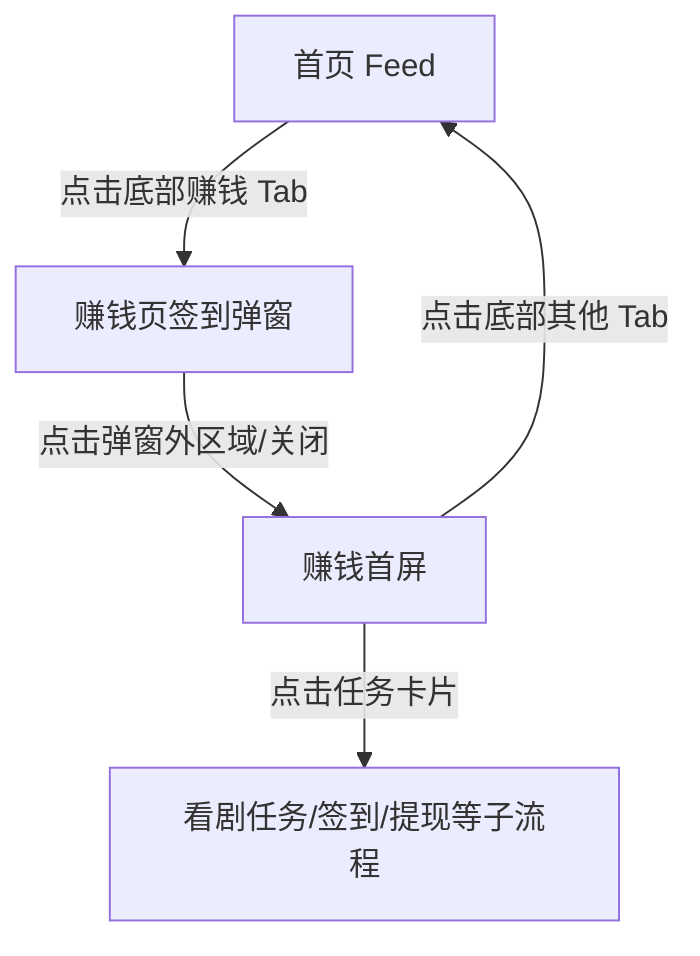

# 分析：红果 — 一级页面-赚钱首屏

## 分析信息

| 项目 | 内容 |
|------|------|
| 分析日期 | 2026-07-23 |
| 对应采集 | [一级页面-赚钱首屏](./capture.md) |
| 分析维度 | 交互流程、UI 布局详解、内容策略、状态管理 |

## 交互流程

### 页面跳转关系

> 本次采集验证了赚钱页存在进入即弹签到弹窗的路径。

### 流程步骤分析

#### 步骤 1：重置到一级页面起点

- **触发**：重新冷启动应用。
- **响应**：应用先回到首页 Feed，说明赚钱页不是默认入口。
- **转场**：冷启动直接落首页，无额外开屏流程可观测。
- **截图引用**：`assets/2026-07-23-step-01-launch-earn.png`

#### 步骤 2：处理首屏遮挡层

- **触发**：在首页执行预估关闭点击。
- **响应**：首页状态无弹层，操作未改变页面。
- **转场**：无转场动画。
- **截图引用**：`assets/2026-07-23-step-02-dismiss-overlay.png`

#### 步骤 3：切换到赚钱一级页面并截图

- **触发**：点击底部“赚钱”Tab。
- **响应**：首次进入先弹出签到弹窗；关闭弹窗后才进入赚钱首屏，展示收益任务、连续看剧福利、提现任务等模块。
- **转场**：Tab 切换后先弹模态层，再回到页面主体；模态层关闭为直接消失，无复杂动画可观测。
- **截图引用**：`assets/2026-07-23-step-03-earn.png`

## UI 布局详解

### 页面：赚钱首屏

| 区域 | 组件 | 位置 | 规格（估算） |
|------|------|------|-------------|
| 顶部头图 | 登录收益文案 + 现金收益气泡 | 顶部大背景 | 高约 180-210dp，橙色渐变背景 |
| 顶部按钮 | 一键登录 | 左上中部 | 按钮约 90×42dp，浅黄底色 |
| 新人任务区 | 新人 7 天必得 6 元 | 头图下方首卡 | 卡片高约 150-170dp，白底圆角 16dp |
| 连续看剧福利 | 签到/连看金币任务卡组 | 中部 | 模块高约 130-150dp，任务卡为橙色胶囊卡片 |
| 收益任务区 | 新人看剧 5 分钟得 / 现金打款等 | 中下部 | 行卡高约 82-92dp，右侧配红包按钮 |
| 底部 | 一级 Tab 导航 | 底部固定 | 高约 72-76dp；“赚钱”高亮黑色并带角标 |

#### 组件细节

##### 顶部收益头图

- **尺寸**：约 360×200dp。
- **间距**：与状态栏下缘间距约 18dp；与首张任务卡无明显分隔，仅通过背景过渡区分。
- **字号**：主标题约 24-26sp；收益数字“1.56 元”约 22-24sp。
- **颜色**：背景为橙色到浅绿色渐变，主色近 `#FF7B2F`；主标题白色 `#FFFFFF`。
- **圆角**：头图背景无明确卡片圆角。
- **图标**：右侧透明气泡用于现金收益展示。

##### 新人签到卡

- **尺寸**：约 328×160dp。
- **间距**：左右边距约 16dp；与头图下缘衔接紧密。
- **字号**：标题约 18-20sp；金币数值约 14-16sp；按钮约 16sp。
- **颜色**：卡片底色 `#FFF9F1` / `#FFFFFF`；按钮主色近 `#FF7A2B`。
- **圆角**：外层卡片约 16dp；内部按钮约 10-12dp。
- **图标**：金币、红包、奖杯等任务图标。

##### 连续看剧福利模块

- **尺寸**：整体高度约 140dp；单任务卡约 52×72dp。
- **间距**：任务卡横向间距约 8-10dp；模块标题与任务卡区间距约 12dp。
- **字号**：标题约 18sp，任务金额约 14-16sp，说明文字约 13-14sp。
- **颜色**：标题黑色 `#222222`；任务卡主色橙红 `#FF6D33`，辅助底色浅橙 `#FFE8D0`。
- **圆角**：任务卡圆角约 10dp。
- **图标**：金币袋、签到进度图标。

##### 收益任务行卡

- **尺寸**：单行约 328×88dp。
- **间距**：行与行之间约 12dp。
- **字号**：主标题约 17-18sp；副标题约 14sp；按钮约 16sp。
- **颜色**：卡片白色 `#FFFFFF`；按钮与数字高亮橙色 `#FF7B2F`。
- **圆角**：约 14-16dp。
- **图标**：右侧红包按钮和金币图标明显强化收益预期。

## 业务逻辑分析

### 加载策略

本次不适用（未覆盖页面初次渲染的骨架屏或下拉刷新，仅观察到进入即弹模态签到层）。

### 内容策略

- **内容组织形式**：先展示可提现收益和一键登录，再用新人签到、新人 7 天任务、连续看剧福利、现金打款等模块构成分层激励漏斗。
- **推荐策略（可观测部分）**：赚钱页把“登录、签到、看剧、提现”串成一条明确路径，目的是把内容消费时长直接映射为收益感知，提升留存和活跃 `[推断]`。

### 状态管理

| 状态场景 | UI 表现 | 用户可操作项 | 截图 |
|---------|--------|-------------|------|
| 首次进入赚钱页 | 先弹出签到弹窗遮挡主页面 | 可点击弹窗外区域关闭，或继续签到领取 | `assets/2026-07-23-step-03-earn.png` |
| 未登录状态 | 页面主头图强调“登录后可领取收益”，并保留“一键登录”按钮 | 可点击一键登录，继续领取收益任务 | `assets/2026-07-23-step-03-earn.png` |

## 关键发现

1. **赚钱页不是普通任务页，而是强激励中心**：从首屏结构看，收益数字、签到、看剧任务、提现入口全部围绕“可得利益”组织。
2. **首次进入即弹签到层**：平台优先让用户感知“立即可领”，比先展示完整页面更强调即时奖励。
3. **登录动作被包装成收益前置条件**：一键登录按钮放在头图核心区，说明账号绑定与增长链路深度耦合。
4. **任务设计与内容消费紧密绑定**：连续看短剧福利、新人看剧 5 分钟得收益等模块，说明平台把看剧时长转成增长货币体系 `[推断]`。
5. **“赚钱”在全局导航中被持续强调**：底部导航角标与页内高密度橙色视觉一起强化收益心智，属于产品核心增长抓手。
