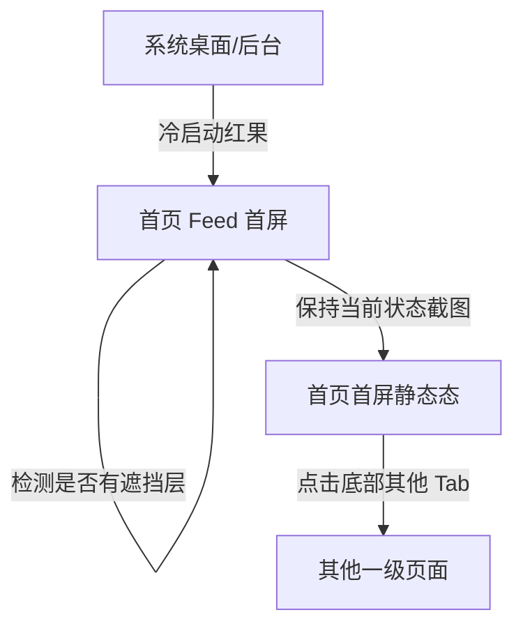

# 分析：红果 — 一级页面-首页首屏

## 分析信息

| 项目 | 内容 |
|------|------|
| 分析日期 | 2026-07-23 |
| 对应采集 | [一级页面-首页首屏](./capture.md) |
| 分析维度 | 交互流程、UI 布局详解、加载策略、内容策略 |

## 交互流程

### 页面跳转关系

> 本次采集聚焦首页首屏静态状态，未继续下钻二级页面。

### 流程步骤分析

#### 步骤 1：冷启动进入红果

- **触发**：执行冷启动命令，等待首屏加载完成。
- **响应**：应用直接落到首页 Feed，未要求先登录，也未强制进入活动页。
- **转场**：启动后直接进入内容流，未观察到独立开屏广告转场；首帧渲染耗时约 3-5s。
- **截图引用**：`assets/2026-07-23-step-01-launch-home.png`

#### 步骤 2：处理首屏遮挡层

- **触发**：按预估坐标执行一次关闭遮挡层点击。
- **响应**：页面未发生变化，说明当前状态下无遮挡弹层，首页保持可操作。
- **转场**：无转场动画。
- **截图引用**：`assets/2026-07-23-step-02-dismiss-overlay.png`

#### 步骤 3：首页首屏截图

- **触发**：在首页稳定状态下截取首屏。
- **响应**：首屏保留视频播放区、右侧互动列、剧集标题信息区和底部 5 Tab 导航。
- **转场**：无转场动画。
- **截图引用**：`assets/2026-07-23-step-03-home.png`

## UI 布局详解

### 页面：首页 Feed 首屏

| 区域 | 组件 | 位置 | 规格（估算） |
|------|------|------|-------------|
| 顶部 | 菜单按钮 + 搜索按钮 | 左上 / 右上 | 顶部安全区约 44dp；图标容器约 24×24dp，颜色接近 `#FFFFFF` |
| 主内容上半区 | 短剧视频画面 | 居中铺满 | 画面容器宽约 360dp，高约 560dp，顶部留黑边约 80-100dp |
| 主内容右侧 | 金币/收藏/评论/点赞/分享操作列 | 右侧垂直排列 | 单个图标约 26-30dp，纵向间距约 20-24dp |
| 主内容下半区 | 剧名、题材标签、热评、作者声明 | 左下到中下 | 标题字号约 18-20sp，标签胶囊高约 22-24dp |
| 底部操作条 | “观看完整漫剧·全114集”入口 | 底部导航上方 | 高约 46-50dp，深色半透明背景 `#1F1F1F`，圆角约 12dp |
| 底部 | 一级 Tab 导航 | 底部固定 | 高约 72-76dp，背景近 `#202020`；“首页”高亮为白色文字，其余灰色 |

#### 组件细节

##### 顶部导航

- **尺寸**：总高度约 56dp（含安全区外可见操作区）。
- **间距**：左右边距约 16dp，图标与顶部边距约 12dp。
- **字号**：无文字。
- **颜色**：图标 `#FFFFFF`，背景透明覆盖在视频上。
- **圆角**：无明显容器圆角。
- **图标**：左侧为汉堡菜单，右侧为搜索放大镜。

##### 视频内容区

- **尺寸**：约 360×560dp。
- **间距**：与顶部导航下缘间距约 12dp；与底部信息区连续衔接。
- **字号**：字幕文字约 16-18sp。
- **颜色**：内容区为视频画面；本帧未出现乱码。黑色留边约 `#000000`。
- **圆角**：不可观测，视觉上为直角铺满。
- **图标**：中心为播放按钮，说明首屏默认处于暂停/待播放截图态。

##### 信息区

- **尺寸**：高度约 140-160dp。
- **间距**：左右边距约 16dp；标题与标签区间距约 8dp。
- **字号**：剧名约 18sp，标签约 13-14sp，说明文字约 12-14sp。
- **颜色**：剧名 `#FFFFFF`，辅助文案 `#D9D9D9`，标签底色接近 `#3A3A3A`。
- **圆角**：标签圆角约 6-8dp。
- **图标**：“爆剧”红底标签、火焰热评图标、作者声明图标可见。

##### 底部导航

- **尺寸**：约 360×74dp。
- **间距**：5 个 Tab 等距分布，底部安全区约 12dp。
- **字号**：Tab 文字约 15-16sp。
- **颜色**：背景 `#202020`；当前 Tab 高亮 `#FFFFFF`，未选中状态约 `#7A7A7A`；“赚钱”带橙色角标。
- **圆角**：导航容器无明显圆角。
- **图标**：采用文字主导方案，选中态通过文字高亮强化。

## 业务逻辑分析

### 加载策略

| 场景 | 加载方式 | 耗时（估算） | 说明 |
|------|---------|-------------|------|
| 首屏加载 | 直接渲染首页 Feed | ~3-5s | 冷启动后直接进入内容流，未观察到独立骨架屏或 loading spinner |
| 视频首卡呈现 | 首帧静态封面/暂停态 | ~1s 内可见 | 首页首屏截到的是带播放按钮的静态首帧，说明视频内容会优先出封面再进入播放 `[推断]` |

### 内容策略

- **内容组织形式**：单列沉浸式竖屏短剧流，上方为视频画面，中下方叠加剧名、标签、热评与转化入口，右侧提供互动操作列。
- **推荐策略（可观测部分）**：首页优先分发单集可快速消费的短剧内容，并在首屏同时提供“看全集”强转化按钮，兼顾短内容沉浸与长链路追剧转化 `[推断]`。

### 状态管理

本次不适用（未覆盖空状态、网络错误、登录过期等边界场景）。

## 关键发现

1. **首页默认直达内容流**：冷启动后直接进入 Feed，而不是活动页或登录页，说明首页承担最强的首屏承接角色。
2. **信息架构偏“内容沉浸 + 追剧转化”**：视频画面占据首屏最大面积，但底部同时保留“观看完整漫剧·全114集”入口，强化从单集到全集的转换。
3. **首页顶部控制极简**：只保留菜单与搜索两个入口，把更多注意力留给内容本身。
4. **互动列沿用短视频范式**：收藏、评论、点赞、分享垂直排列，降低用户理解成本。
5. **“赚钱”能力被全局显性暴露**：底部导航中“赚钱”带角标，说明激励体系不仅是辅助模块，也承担全局增长目标 `[推断]`。
