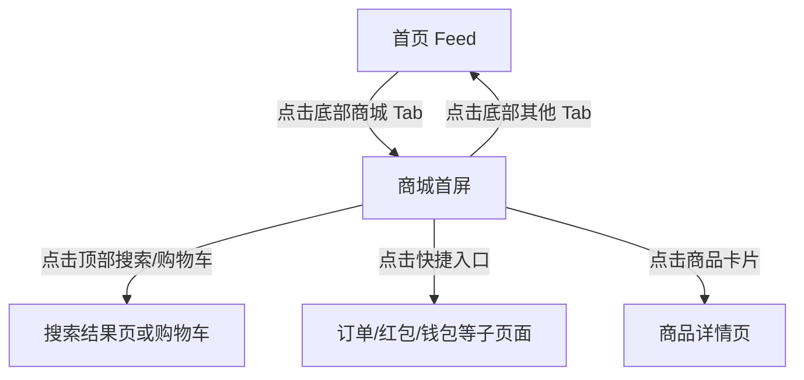

# 分析：红果 — 一级页面-商城首屏

## 分析信息

| 项目 | 内容 |
|------|------|
| 分析日期 | 2026-07-23 |
| 对应采集 | [一级页面-商城首屏](./capture.md) |
| 分析维度 | 交互流程、UI 布局详解、内容策略 |

## 交互流程

### 页面跳转关系

> 本次仅验证了从首页进入商城首屏，未继续点击商品卡片。

### 流程步骤分析

#### 步骤 1：重置到一级页面起点

- **触发**：重新启动应用。
- **响应**：默认仍回到首页 Feed，说明商城不是默认落点。
- **转场**：冷启动后直接进入首页，无额外转场动画。
- **截图引用**：`assets/2026-07-23-step-01-launch-mall.png`

#### 步骤 2：处理首屏遮挡层

- **触发**：执行关闭遮挡层点击。
- **响应**：未出现弹窗，页面维持首页可操作态。
- **转场**：无转场动画。
- **截图引用**：`assets/2026-07-23-step-02-dismiss-overlay.png`

#### 步骤 3：切换到商城一级页面并截图

- **触发**：点击底部“商城”Tab。
- **响应**：页面切换为电商商品流，顶部出现搜索与购物车，中部出现快捷服务入口，底部出现登录提示浮层。
- **转场**：Tab 切换后快速渲染内容，未观察到明显动画。
- **截图引用**：`assets/2026-07-23-step-03-mall.png`

## UI 布局详解

### 页面：商城首屏

| 区域 | 组件 | 位置 | 规格（估算） |
|------|------|------|-------------|
| 顶部 | 搜索框 + 搜索按钮 + 购物车 | 顶部固定区 | 搜索框高约 42dp，按钮高约 40dp，右侧购物车图标约 24dp |
| 快捷入口区 | 我的订单/卡券红包/我的钱包/短剧同款/国家补贴 | 顶部中段 | 容器高约 98-108dp，白底圆角卡片 |
| Banner 区 | 活动 banner 3 宫格 | 快捷入口下方 | 高约 64-72dp，彩色横向卡片 |
| 商品流 | 双列商品卡片 | 中下区域 | 单卡宽约 164dp，高约 250-290dp |
| 底部浮层 | 登录价格提示 + 立即登录 | 导航上方 | 高约 48-52dp，米白底 `#F9EAD4` |
| 底部 | 一级 Tab 导航 | 底部固定 | 高约 72-76dp；“商城”高亮黑色 |

#### 组件细节

##### 顶部搜索区

- **尺寸**：搜索框宽约 250dp，高约 42dp；搜索按钮宽约 62dp，高约 40dp。
- **间距**：左右边距约 12-16dp；搜索框与按钮间距约 8dp。
- **字号**：占位文字约 15-16sp；按钮文字约 16sp。
- **颜色**：搜索框底色 `#F7F7F7`，按钮主色约 `#FF6E33`，文字白色 `#FFFFFF`。
- **圆角**：搜索框和按钮圆角约 12-14dp。
- **图标**：搜索图标、购物车图标。

##### 快捷入口区

- **尺寸**：整体容器约 328×104dp；单个入口约 56×56dp 图标 + 14sp 文案。
- **间距**：横向五等分排列，左右留白约 12dp。
- **字号**：约 14-15sp。
- **颜色**：背景 `#FFFFFF`；图标为黑线描边风格；文字 `#222222`。
- **圆角**：外层容器约 16dp。
- **图标**：订单、卡券、钱包、包袋、补贴袋。

##### 商品卡片

- **尺寸**：单卡约 164×276dp。
- **间距**：双列间距约 10dp；上下间距约 12dp。
- **字号**：商品标题约 16-18sp；价格约 20sp；辅助文案约 12-13sp。
- **颜色**：卡片底白 `#FFFFFF`；价格高亮色接近 `#FF6A3A`；说明文字灰色 `#9A8B7A`。
- **圆角**：约 12dp。
- **图标**：直播中角标、热度/销量图标。

##### 底部登录浮层

- **尺寸**：约 328×50dp。
- **间距**：位于商品流与底部导航之间，上下留白约 8-10dp。
- **字号**：左侧提示约 16sp，右侧按钮约 16sp。
- **颜色**：底色约 `#F8E7D0`，按钮底色近 `#FCE6CC`，强调文字近 `#FF8B2D`。
- **圆角**：整体约 12dp，按钮约 10dp。
- **图标**：右侧关闭“×”。

## 业务逻辑分析

### 加载策略

本次不适用（未覆盖商城首屏从空白到渲染的时序，也未覆盖下拉刷新和加载更多）。

### 内容策略

- **内容组织形式**：先给出搜索和高频服务入口，再通过活动 banner 承接促销场景，主体以双列商品流展示商品内容，兼有直播和达人推荐标签。
- **推荐策略（可观测部分）**：商城并非纯货架，而是“内容电商 + 福利电商”混合形态，既出现短剧同款，也出现低价生活商品，说明其目标是借流量做泛电商转化 `[推断]`。

### 状态管理

本次不适用（未覆盖无商品、无网络、未登录拦截后的详情页状态）。

## 关键发现

1. **商城保留完整电商首页结构**：搜索、购物车、订单、钱包、商品流等模块齐全，不是简单的福利兑换页。
2. **登录限制被放在价格层面显性提醒**：底部浮层提示“登录可查看商品价格”，说明平台希望先拉起登录再推动购买转化。
3. **商品池偏低价和高刺激**：首屏就出现大额减价、达人推荐、直播中等标签，属于典型强促销导向。
4. **快捷入口把“短剧同款”放在核心位置**：说明商城与内容消费之间存在联动关系，用户可能从剧内种草再导向商品购买 `[推断]`。
5. **商城与内容 Tab 的视觉风格显著不同**：从深色内容流切到浅色货架页，强化了“消费内容”与“消费商品”的场景切换。
