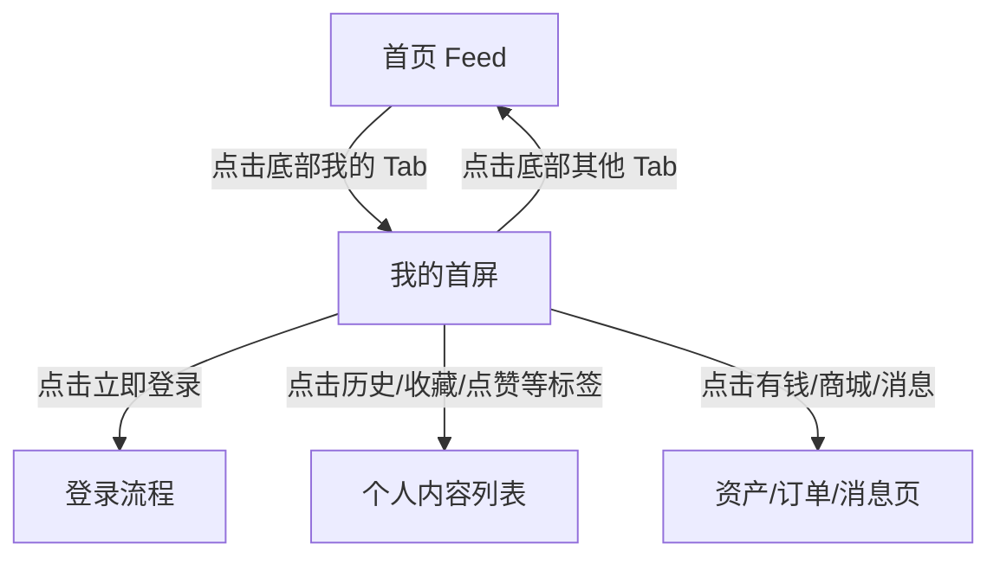

# 分析：红果 — 一级页面-我的首屏

## 分析信息

| 项目 | 内容 |
|------|------|
| 分析日期 | 2026-07-23 |
| 对应采集 | [一级页面-我的首屏](./capture.md) |
| 分析维度 | 交互流程、UI 布局详解、内容策略、状态管理 |

## 交互流程

### 页面跳转关系

> 本次采集只覆盖未登录状态下的“我的”首屏。

### 流程步骤分析

#### 步骤 1：重置到一级页面起点

- **触发**：重新冷启动应用。
- **响应**：默认进入首页 Feed，说明个人中心依赖底部主动切换进入。
- **转场**：冷启动直接进入首页，无单独开屏转场。
- **截图引用**：`assets/2026-07-23-step-01-launch-profile.png`

#### 步骤 2：处理首屏遮挡层

- **触发**：执行一次关闭遮挡层点击。
- **响应**：页面未发生变化，说明首页状态无弹层阻断。
- **转场**：无转场动画。
- **截图引用**：`assets/2026-07-23-step-02-dismiss-overlay.png`

#### 步骤 3：切换到我的一级页面并截图

- **触发**：点击底部“我的”Tab。
- **响应**：页面切为个人中心，展示欢迎语、登录按钮、历史记录和多个个人功能入口；右侧悬浮“登录赚钱”。
- **转场**：Tab 切换直接替换内容，未观察到明显动效。
- **截图引用**：`assets/2026-07-23-step-03-profile.png`

## UI 布局详解

### 页面：我的首屏

| 区域 | 组件 | 位置 | 规格（估算） |
|------|------|------|-------------|
| 顶部头区 | 欢迎语 + 立即登录 + 夜间模式/菜单 | 顶部 | 高约 150-170dp，浅色渐变背景 |
| 功能卡区 | 有钱 / 商城 / 消息 等快捷卡片 | 头区下方 | 单卡高约 64-72dp，浅灰白底 |
| 标签栏 | 历史/收藏/点赞/预约/动态 + 搜索 | 中部 | 高约 44-48dp，文本切换，当前项加粗 |
| 过滤区 | 全部/已看完/未看完 + 筛选/编辑 | 标签栏下方 | 胶囊按钮高约 34-36dp |
| 内容区 | 历史剧集网格 | 中下部 | 三列卡片流，单卡宽约 108-112dp |
| 右侧浮层 | 登录赚钱 | 右中部悬浮 | 红包形浮层约 72×86dp |
| 底部 | 一级 Tab 导航 | 底部固定 | 高约 72-76dp；“我的”高亮黑色 |

#### 组件细节

##### 顶部头区

- **尺寸**：约 360×158dp。
- **间距**：左右边距约 16dp；欢迎语与登录按钮垂直间距约 14dp。
- **字号**：标题“免费短剧 尽在红果”约 22-24sp；副标题约 14-16sp；登录按钮约 17sp。
- **颜色**：背景接近 `#F8F8F8` 并带浅青渐变晕染；标题 `#111111`；副标题灰色 `#A3A3A3`；按钮橙色 `#FF9728`。
- **圆角**：按钮圆角约 10-12dp。
- **图标**：右上为月亮图标和汉堡菜单。

##### 功能卡区

- **尺寸**：左侧横幅卡约 132×48dp；右侧三个小卡各约 72×48dp。
- **间距**：卡片间距约 8-10dp。
- **字号**：主标题约 16sp，副标题约 13-14sp。
- **颜色**：卡片底色 `#F5F5F5`；文字 `#333333`；局部插画色彩偏暖。
- **圆角**：约 12dp。
- **图标**：影视海报、钱袋/订单/消息等功能符号。

##### 标签与过滤区

- **尺寸**：标签栏高约 44dp；过滤胶囊高约 34dp。
- **间距**：标签项间距约 18-20dp；过滤胶囊间距约 10dp。
- **字号**：标签约 16-18sp；选中“历史”约 20sp 加粗；过滤项约 15-16sp。
- **颜色**：选中项 `#111111`；未选中项 `#8F8F8F`；选中胶囊底色约 `#F8E8D0`，文字橙色 `#F49A2E`。
- **圆角**：过滤胶囊约 10dp。
- **图标**：右侧搜索图标、筛选/编辑文字按钮。

##### 历史剧集卡片

- **尺寸**：单卡约 108×168dp。
- **间距**：三列布局，列间距约 8-10dp；行间距约 14dp。
- **字号**：剧名约 16sp；集数说明约 12-13sp；角标约 12sp。
- **颜色**：卡片背景白色 `#FFFFFF`；剧名 `#222222`；辅助文字 `#9B9B9B`。
- **圆角**：海报圆角约 12dp。
- **图标**：海报右上角带“漫剧/短剧”角标，卡片上可见剧集封面。

## 业务逻辑分析

### 加载策略

本次不适用（未覆盖登录后的首屏刷新，也未覆盖历史列表滚动加载细节）。

### 内容策略

- **内容组织形式**：未登录状态下，页面上半区先展示品牌欢迎与登录召回，中部展示资产/商城/消息快捷入口，下半区默认落在“历史”标签，直接回顾已看内容。
- **推荐策略（可观测部分）**：个人中心把“历史记录”作为默认主内容，说明平台优先通过回看续播而不是社交资料维护来提升回访效率 `[推断]`。

### 状态管理

| 状态场景 | UI 表现 | 用户可操作项 | 截图 |
|---------|--------|-------------|------|
| 未登录个人中心 | 顶部展示欢迎语和“立即登录”，右侧存在“登录赚钱”浮层 | 可点击立即登录、登录赚钱、消息/商城等入口 | `assets/2026-07-23-step-03-profile.png` |
| 历史内容存在 | 默认选中“历史”，直接展示已浏览剧集网格 | 可切换全部/已看完/未看完，并继续点进剧集 | `assets/2026-07-23-step-03-profile.png` |

## 关键发现

1. **“我的”页默认不是资料页，而是续播中心**：首屏主内容直接给出历史剧集网格，而不是头像、昵称、编辑资料等个人信息。
2. **登录召回被放在最核心位置**：欢迎语、立即登录、登录赚钱浮层三处同时推动登录，说明个人中心承担账号绑定转化任务。
3. **资产与订单能力被轻量整合**：有钱、商城、消息等入口位于头部中段，说明“我的”页既是个人内容页，也是服务汇总页。
4. **历史/收藏/点赞/预约/动态构成行为资产**：平台把用户在内容上的行为沉淀组织成可回访的标签体系，利于持续消费 `[推断]`。
5. **个人中心与赚钱体系存在联动**：右侧“登录赚钱”浮层说明账号体系和收益体系共享增长目标，而不是彼此独立。
