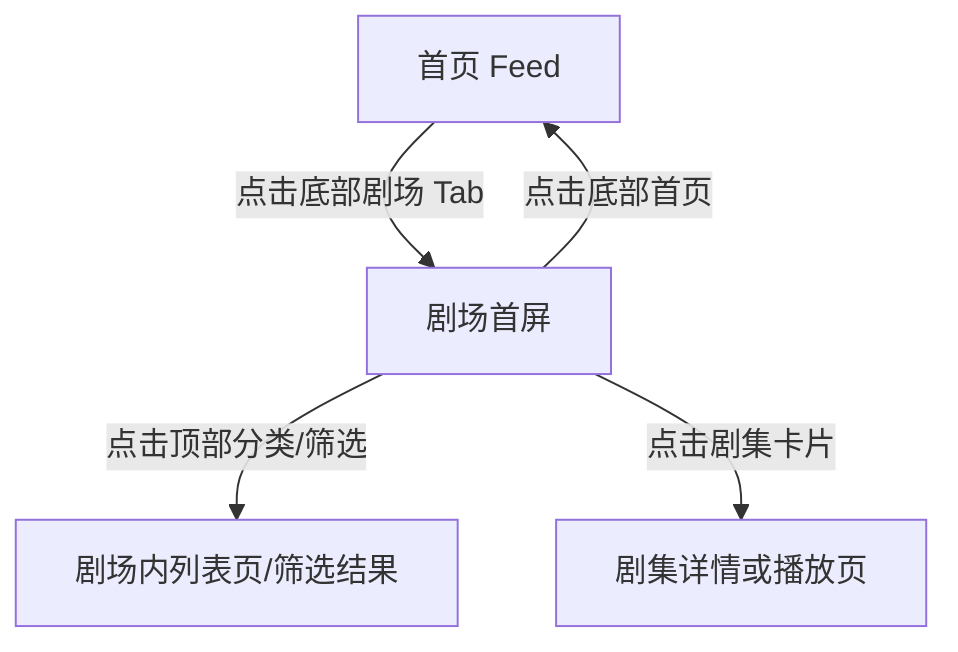

# 分析：红果 — 一级页面-剧场首屏

## 分析信息

| 项目 | 内容 |
|------|------|
| 分析日期 | 2026-07-23 |
| 对应采集 | [一级页面-剧场首屏](./capture.md) |
| 分析维度 | 交互流程、UI 布局详解、加载策略、内容策略 |

## 交互流程

### 页面跳转关系

> 本次采集只验证了从首页切换到剧场一级页面的进入路径，未继续点击剧集卡片。

### 流程步骤分析

#### 步骤 1：重置到一级页面起点

- **触发**：重新冷启动应用。
- **响应**：应用先回到首页 Feed；采集记录中提到视频区域存在花屏/乱码现象，但不影响底部导航切换。
- **转场**：冷启动后直接进入首页，无单独开屏转场。
- **截图引用**：`assets/2026-07-23-step-01-launch-theater.png`

#### 步骤 2：处理首屏遮挡层

- **触发**：执行预估关闭点击。
- **响应**：未出现弹窗，页面保持首页可操作状态。
- **转场**：无转场动画。
- **截图引用**：`assets/2026-07-23-step-02-dismiss-overlay.png`

#### 步骤 3：切换到剧场一级页面并截图

- **触发**：点击底部“剧场”Tab。
- **响应**：页面切换为剧场聚合页，顶部出现搜索和分类导航，主体改为双列海报流。
- **转场**：Tab 切换为直接内容替换，未观测到显著过渡动画。
- **截图引用**：`assets/2026-07-23-step-03-theater.png`

## UI 布局详解

### 页面：剧场首屏

| 区域 | 组件 | 位置 | 规格（估算） |
|------|------|------|-------------|
| 顶部 | 搜索框 + “截图识别短剧”入口 | 顶部横向 | 高约 42-44dp，白底 `#F6F6F6`，圆角约 14dp |
| 一级分类 | 找剧/真人剧/漫剧/电影/听书/小说/漫画 | 搜索框下方横向 | 行高约 28-32dp，当前项加粗黑色 |
| 快捷入口 | 筛选/排行榜/新剧/预约 | 分类下方 | 单卡高约 40-44dp，浅灰底 `#F4F4F4` |
| 主内容区 | 双列剧集海报卡片 | 中下区域 | 单卡宽约 164dp，高约 260-300dp，卡片圆角约 12dp |
| 底部 | 一级 Tab 导航 | 底部固定 | 高约 72-76dp；“剧场”高亮黑色，其余灰色 |

#### 组件细节

##### 顶部搜索区

- **尺寸**：搜索框区域总高约 48dp；整体左右边距约 14-16dp。
- **间距**：搜索框与状态栏下缘间距约 8dp；与分类栏间距约 12dp。
- **字号**：搜索占位文字约 15-16sp；右侧识别入口约 14-15sp。
- **颜色**：背景 `#F6F6F6`，文字 `#A0A0A0`，图标灰色约 `#8A8A8A`。
- **圆角**：约 14dp。
- **图标**：左侧搜索图标，右侧相机图标。

##### 一级分类栏

- **尺寸**：高度约 32dp。
- **间距**：各分类之间水平间距约 16-20dp。
- **字号**：当前项“找剧”约 20sp 加粗，其他项约 16-17sp。
- **颜色**：当前项 `#111111`，未选中项 `#8E8E8E`。
- **圆角**：无容器圆角。
- **图标**：无图标，纯文本切换。

##### 快捷入口卡片

- **尺寸**：单卡约 78×40dp。
- **间距**：卡片间距约 12dp，上下边距约 12dp。
- **字号**：约 15-16sp。
- **颜色**：底色 `#F5F5F5`；图标分别使用紫/橙/青/黄等强调色。
- **圆角**：约 10-12dp。
- **图标**：漏斗、火焰、播放、九宫格点阵。

##### 海报流卡片

- **尺寸**：单卡约 164×286dp。
- **间距**：双列间距约 10dp；上下卡片间距约 12-16dp。
- **字号**：剧名约 16-18sp；热度约 13-14sp；标签约 12-13sp。
- **颜色**：卡片背景白色 `#FFFFFF`；文字 `#222222`；热度字多为白色叠在海报上。
- **圆角**：约 12dp。
- **图标**：卡片左下角火焰热度图标，“新剧”角标叠在海报左上。

## 业务逻辑分析

### 加载策略

| 场景 | 加载方式 | 耗时（估算） | 说明 |
|------|---------|-------------|------|
| Tab 切换到剧场 | 直接替换为列表首屏 | ~1-2s | 未观察到骨架屏，内容较快进入稳定态 |
| 海报流渲染 | 首屏双列卡片直接展示 | ~1s 内可见 | 说明剧场页优先渲染首屏卡片，再由下滑触发更多加载 `[推断]` |

### 内容策略

- **内容组织形式**：顶部先按题材/媒介做一级分类，再通过“筛选/排行榜/新剧/预约”提供更强的发现入口，主体以双列海报瀑布式分发剧集。
- **推荐策略（可观测部分）**：剧场页明显偏“找内容”而非“看当前内容”，通过大封面、热度值、榜单和新剧入口强化用户主动挑选路径 `[推断]`。

### 状态管理

本次不适用（未覆盖筛选空结果、网络错误、登录限制等边界状态）。

## 关键发现

1. **剧场是标准化内容检索入口**：相比首页 Feed 的沉浸式播放，剧场页更像“找剧大厅”，信息架构明显偏检索与挑选。
2. **分类层级非常前置**：顶部连续放置搜索、一级分类和快捷入口，缩短用户从“找剧目标”到“筛选路径”的距离。
3. **双列海报卡片利于批量比较**：用户能在单屏内同时比较多个剧集封面、热度和标签，适合决策型浏览。
4. **“截图识别短剧”是差异化入口**：这说明红果试图承接站外找剧需求，降低用户只记得截图、不记得剧名时的检索门槛 `[推断]`。
5. **首页与剧场形成分工**：首页负责被动消费，剧场负责主动挑选，两者在入口结构和版式上有明确区隔。
