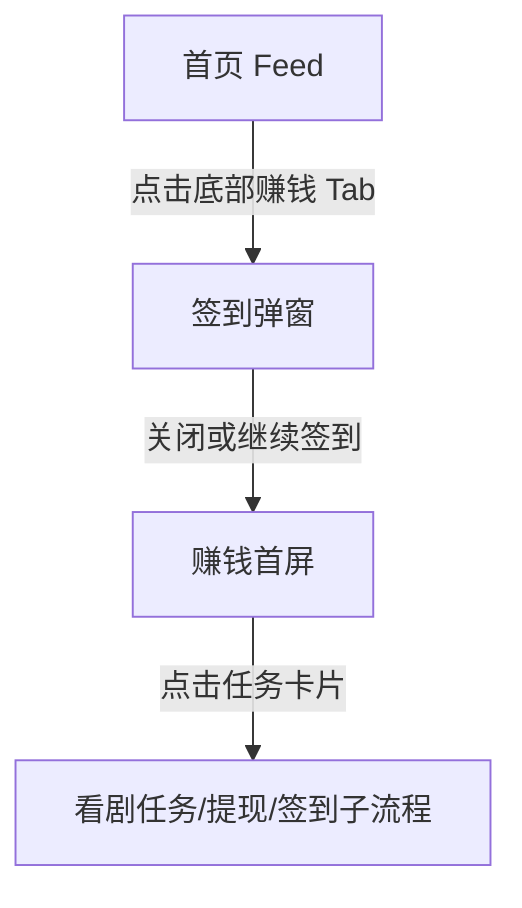

# 红果 — earn-center

## 基本信息

| 项目 | 内容 |
|------|------|
| 目标竞品 | 红果 |
| 竞品版本 | 7.2.4.32 |
| 功能模块 | earn-center |
| 分析平台 | mobile |
| 最后更新 | 2026-07-23 |
| 采集源 | [captures/](../../captures/) — 共 1 次采集 |

## 功能概览

赚钱页是红果的核心增长中心，把登录、签到、看剧任务和提现收益整合在同一页面中。它不是单纯的福利页，而是把内容消费时长映射为收益感知的任务中枢，用于提升留存、活跃和账号绑定率。 `[推断]`

## 交互流程

### 步骤 1：从首页重置起点

*图：重置后的首页起始状态 | 图源：[采集 2026-07-23](../../captures/2026-07-23-hongguo-tab-earn/capture.md)*

**触发**：冷启动红果。

**行为**：应用默认回到首页，赚钱页需要由底部导航主动进入。

### 步骤 2：确认首页无遮挡层

*图：首页在无弹层状态下可切换赚钱页 | 图源：[采集 2026-07-23](../../captures/2026-07-23-hongguo-tab-earn/capture.md)*

**触发**：执行预估关闭点击。

**行为**：首页未出现遮罩，底部导航保持可操作。

### 步骤 3：进入赚钱页并关闭签到弹窗

*图：关闭签到弹窗后的赚钱首屏 | 图源：[采集 2026-07-23](../../captures/2026-07-23-hongguo-tab-earn/capture.md)*

**触发**：点击底部“赚钱”Tab，首次进入后关闭签到弹窗。

**行为**：页面先弹出签到模态层，关闭后可见收益头图、新人 7 天任务、连续看剧福利和提现类任务，“赚钱”Tab 高亮。

## UI 布局详解

### 赚钱首屏

| 区域 | 组件 | 规格（估算值） |
|------|------|--------------|
| 顶部头图 | 登录收益文案、现金收益气泡 | 高约 180-210dp，橙色渐变背景 |
| 顶部操作 | 一键登录按钮 | 按钮约 90×42dp，浅黄底 |
| 新人任务区 | 新人 7 天必得 6 元 | 白底大卡片，高约 150-170dp |
| 连看福利区 | 金币签到/连续看剧卡组 | 模块高约 130-150dp |
| 收益任务区 | 看剧得收益、现金打款等行卡 | 行卡高约 82-92dp |
| 底部导航 | 5 个一级 Tab | 赚钱高亮 |

*图：赚钱页整体布局 | 图源：[采集 2026-07-23](../../captures/2026-07-23-hongguo-tab-earn/capture.md)*

## 业务逻辑分析

### 加载策略

本章节不适用。本轮未覆盖赚钱页从空白到渲染稳定的完整时序，仅确认了进入即弹签到层这一首屏策略。

### 内容策略

赚钱页通过“可见收益数字 + 立即可领签到 + 连续看剧任务 + 提现任务”构成完整激励漏斗。用户在该页可以直观看到看剧行为如何转化为金币、现金和签到奖励，从而强化持续观看动力。 `[推断]`

### 状态管理

- **首次进入状态**：先弹出签到层，优先传达“今天就能领”的即时收益。 `[推断]`
- **未登录状态**：页面仍可浏览任务结构，但顶部明显提示“登录后可领取收益”，并提供“一键登录”按钮。 `[推断]`

### 其他业务维度

本章节不适用。

## 关键发现

- **赚钱页是增长中枢**：页面所有模块都围绕收益感知组织，而非围绕功能分类组织。 `[推断]`
- **首次进入即弹签到层**：平台优先放大“立即可得”的刺激，降低用户忽略奖励的概率。 `[推断]`
- **登录与激励强绑定**：未登录也能看到收益，但真正领取依赖登录，说明账号绑定是收益体系的重要前置。 `[推断]`
- **看剧任务是主要增长抓手**：连续看剧福利、新人看剧 5 分钟得收益等任务，把内容消费直接转为增长货币 `[推断]`。

## 与自身产品对比

> 本章节由产品团队在阅读本竞品文档后自行填写，不在 skill 自动产出范围内。

## 附录

### A. 采集源索引

| 日期 | 采集文档 | 覆盖内容 |
|------|---------|---------|
| 2026-07-23 | [一级页面-赚钱首屏](../../captures/2026-07-23-hongguo-tab-earn/capture.md) | 赚钱页首屏、签到弹窗、收益任务和登录提示 |

### B. 截图索引

| 文件名 | 采集日期 | 内容 |
|--------|---------|------|
| `assets/2026-07-23-step-01-launch-earn.png` | 2026-07-23 | 重置后的首页起始状态 |
| `assets/2026-07-23-step-02-dismiss-overlay.png` | 2026-07-23 | 切换前的可操作状态 |
| `assets/2026-07-23-step-03-earn.png` | 2026-07-23 | 关闭签到弹窗后的赚钱首屏 |

### C. 录屏

本章节不适用。本次采集无录屏。

### D. 修订历史

| 日期 | 修订记录 | 变更摘要 |
|------|---------|---------|
| 2026-07-23 | [revisions/2026-07-23-hongguo-top-level-tabs.md](../../revisions/2026-07-23-hongguo-top-level-tabs.md) | 新建赚钱功能文档，补充一级页面首屏结构与发现 |

## 待深入

| 优先级 | 子功能 | 说明 | 状态 |
|--------|--------|------|------|
| P0 | 签到弹窗交互 | 需要补充签到领取、关闭、二次进入的行为差异 | 待采集 |
| P0 | 提现链路 | 需要确认现金收益、打款按钮与实际提现流程 | 待采集 |
| P1 | 连续看剧任务完成条件 | 需要验证计时方式、中断规则和奖励发放 | 待采集 |
| P2 | 任务页异常状态 | 需要覆盖未登录限制、网络异常、奖励领取失败等场景 | 待采集 |

---

> 本文档基于模拟器操作采集 + 多模态分析生成。`[推断]` 标记的内容为主观判断，请结合实际验证。
> 原始采集实录见 `captures/` 目录。
