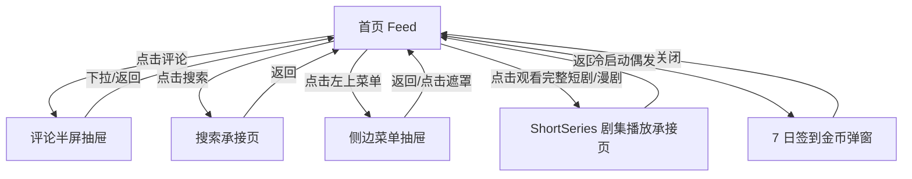

# 分析：红果 — 首页 5 页快照

## 分析信息

| 项目 | 内容 |
|------|------|
| 分析日期 | 2026-07-24 |
| 对应采集 | [plan.md](./plan.md) |
| 采集产物 | [assets/](./assets/) |
| 分析维度 | 首页入口结构、页面承接关系、评论/搜索/菜单/完整观看四类核心入口 |

## 交互流程

### 页面跳转关系

> 本轮以首页为中心，补齐了四个高频承接层和一个冷启动叠加浮层样本。

### 流程步骤分析

#### 步骤 1：冷启动并稳定到首页首屏

- **触发**：冷启动红果。
- **响应**：默认进入首页竖屏推荐流，顶部可见菜单与搜索，右侧为互动列，底部为五个一级 Tab。
- **转场**：无明显转场动画，直接落到内容流。
- **截图引用**：`assets/2026-07-24-step-01-home.png`

#### 步骤 2：点击评论入口

- **触发**：点击首页右侧评论按钮。
- **响应**：页面底部拉起评论半屏抽屉，显示“470条评论”、评论列表与底部输入框。
- **转场**：自下向上抽屉动画。
- **截图引用**：`assets/2026-07-24-step-02-comments.png`

#### 步骤 3：点击搜索入口

- **触发**：点击首页右上搜索图标。
- **响应**：进入独立搜索页，顶部为搜索框，首屏展示快捷入口、搜索历史、猜你想搜与热搜榜。
- **转场**：整页切换到搜索承接页。
- **截图引用**：`assets/2026-07-24-step-03-search.png`

#### 步骤 4：点击左上菜单

- **触发**：点击首页左上角汉堡按钮。
- **响应**：左侧滑出个人中心式抽屉，展示登录 CTA、最近在看、游戏中心和常用功能。
- **转场**：左侧抽屉滑入，右侧首页背景保留并暗化。
- **截图引用**：`assets/2026-07-24-step-04-menu.png`

#### 步骤 5：点击完整观看入口

- **触发**：点击首页底部“观看完整短剧/漫剧”入口区域。
- **响应**：进入 ShortSeries 剧集播放承接页，顶部显示返回、当前集数、倍速、更多操作，底部有“选集·已完结·全133集”固定抽屉栏。
- **转场**：整页切换到剧集播放页，保留竖屏播放器语境。
- **截图引用**：`assets/2026-07-24-step-05-full-watch.png`

## UI 布局详解

### 页面：首页 Feed

| 区域 | 组件 | 位置 | 规格（估算） |
|------|------|------|-------------|
| 顶部 | 菜单按钮、搜索按钮 | 左上 / 右上 | 顶栏高约 44-56dp，白色图标 |
| 中部 | 竖屏视频卡 | 居中主内容区 | 视频区约占屏高 45%-50%，模拟器中有彩条干扰 |
| 右侧 | 金币、收藏、评论、点赞、分享 | 右侧纵列 | 图标约 26-30dp，间距约 18-24dp |
| 底部信息区 | 标题、标签、热评、作者声明 | 视频下方 | 标题约 18-20sp，标签约 12-14sp |
| 底部操作条 | “观看完整短剧/漫剧” | 底部悬浮条 | 高约 46-52dp，深色半透明底 |
| 底部导航 | 首页 / 剧场 / 商城 / 赚钱 / 我的 | 最底部 | 导航高约 72-76dp，首页高亮 |

#### 组件细节

##### 右侧互动列

- **尺寸**：图标约 28×28dp
- **间距**：纵向约 20dp
- **字号**：计数约 14-16sp
- **颜色**：白色图标 + 白色数字
- **圆角**：不适用
- **图标**：金币收益、收藏星标、评论气泡、爱心、分享箭头

### 页面：评论半屏抽屉

| 区域 | 组件 | 位置 | 规格（估算） |
|------|------|------|-------------|
| 顶部 | 下拉柄、评论数标题 | 抽屉顶部 | 标题约 18sp，顶部圆角卡片 |
| 中部 | 评论列表 | 抽屉主体 | 单条评论块高约 88-140dp |
| 右侧 | 点赞按钮与数量 | 每条评论右侧 | 图标约 22-24dp |
| 底部 | 评论输入框、图片/表情入口 | 抽屉底部固定 | 输入栏高约 44-48dp |

#### 组件细节

##### 评论输入区

- **尺寸**：高度约 46dp
- **间距**：左右边距约 16dp
- **字号**：占位文案约 15-16sp
- **颜色**：浅灰背景，深灰占位文字
- **圆角**：约 22-24dp
- **图标**：图片与表情入口位于右侧

### 页面：搜索承接页

| 区域 | 组件 | 位置 | 规格（估算） |
|------|------|------|-------------|
| 顶部 | 返回、搜索框、搜索按钮 | 顶部固定 | 搜索框高约 40-44dp |
| 快捷入口 | 识剧 / 排行 / 上新 / 演员 / 分类 | 顶部下方横排 | 单项约 72-96dp 宽 |
| 中部 | 搜索历史、猜你想搜 | 中部列表 / 卡片 | 文本标签约 16-18sp |
| 底部 | 热搜榜内容流 | 下半屏 | 双列卡片，卡面约 160-180dp 宽 |

#### 组件细节

##### 搜索框

- **尺寸**：约 796×40dp
- **间距**：左右边距约 16dp
- **字号**：输入文本约 16sp
- **颜色**：浅灰背景，深灰文字
- **圆角**：约 20dp
- **图标**：左侧搜索 icon，右侧可清空图标 `[基于 XML 可观测]`

### 页面：侧边菜单抽屉

| 区域 | 组件 | 位置 | 规格（估算） |
|------|------|------|-------------|
| 顶部 | 登录 CTA、立即登录按钮 | 抽屉顶部 | 主按钮高约 40-44dp |
| 中部一 | 最近在看卡片 | 抽屉首屏中部 | 三张续播卡横排 |
| 中部二 | 游戏中心 | 最近在看下方 | 四个轻应用图标横排 |
| 底部 | 常用功能 | 抽屉下部 | 两个列表入口：我的预约 / 我的下载 |

#### 组件细节

##### 登录 CTA

- **尺寸**：主标题区高约 56-64dp
- **间距**：左右边距约 20dp
- **字号**：标题约 18-20sp，按钮约 16sp
- **颜色**：浅底深字，按钮橙色
- **圆角**：按钮约 10-12dp
- **图标**：左上有头像占位或播放器占位图标

### 页面：完整观看承接页

| 区域 | 组件 | 位置 | 规格（估算） |
|------|------|------|-------------|
| 顶部 | 返回、当前集数、倍速、更多 | 顶部固定 | 文本约 18-20sp，按钮白色 |
| 中部 | 竖屏播放器 | 主内容区 | 与首页同样为竖屏播放器语境 |
| 右侧 | 收藏、评论、点赞、分享 | 右侧纵列 | 与首页风格一致 |
| 底部信息区 | 剧名、热评、作者声明 | 播放器下方 | 与首页信息区相似 |
| 底部固定栏 | 选集·已完结·全133集 | 底部浮层 | 高约 54-60dp，深色半透明底 |

#### 组件细节

##### 选集抽屉栏

- **尺寸**：高度约 56dp
- **间距**：左右边距约 16dp
- **字号**：主文案约 16-18sp
- **颜色**：深灰底，白色文案
- **圆角**：约 14-16dp
- **图标**：右侧有上拉箭头，最右下还有一个独立操作按钮

## 业务逻辑分析

### 加载策略

| 场景 | 加载方式 | 耗时（估算） | 说明 |
|------|---------|-------------|------|
| 首屏加载 | 直接进入内容流 | ~4s | 冷启动后直接落到首页推荐流，未见骨架屏 |
| 评论抽屉 | 抽屉拉起 | ~2s | 以覆盖层方式叠加在首页上 |
| 搜索页 | 整页跳转 | ~2s | 搜索页首屏内容一次性可见 |
| 菜单抽屉 | 侧滑抽屉 | ~2s | 从左向右滑入，背景页仍保留 |
| 完整观看承接页 | 整页跳转 | ~3s | 直接进入可追更的剧集播放页 |

### 内容策略

- **内容组织形式**：首页围绕单条竖屏内容卡组织，所有互动入口都围绕当前剧集展开。
- **搜索承接策略**：搜索页不仅用于输入关键词，还承担内容发现入口，集成识剧、排行、上新、演员、分类、历史与热搜榜。
- **追更转化策略**：首页通过底部完整观看入口，将用户从单条推荐流直接导向持续消费的剧集播放页。 `[推断]`

### 状态管理

| 状态场景 | UI 表现 | 用户可操作项 | 截图 |
|---------|--------|-------------|------|
| 冷启动签到浮层 | 偶发出现 7 日签到金币弹窗 | 关闭 / 立即领取 | `assets/2026-07-24-step-01-signin-popup.png` |
| 评论围观态 | 评论可浏览、输入区可见 | 下拉关闭、浏览评论、尝试输入 | `assets/2026-07-24-step-02-comments.png` |
| 搜索历史残留 | 搜索框保留上次关键词 | 修改搜索词、查看历史、浏览推荐 | `assets/2026-07-24-step-03-search.png` |

## 关键发现

1. **首页是内容流中心页**：冷启动直接进入首页 Feed，顶部和右侧入口都围绕当前内容消费展开。
2. **评论采用半屏抽屉承接**：评论并不打断首页上下文，而是通过底部上拉层叠加，方便围观后快速回到播放流。
3. **搜索是完整发现页，不是简化输入框**：从快捷入口、搜索历史到热搜榜，搜索页本身就是二级内容发现系统。
4. **左上菜单偏个人中心式抽屉**：抽屉内优先展示登录、最近在看、游戏中心与常用功能，而不是频道切换。
5. **完整观看入口直接进入 ShortSeries 播放承接页**：点击底部入口后直达可选集的剧集页，缩短了从首页推荐到追更消费的路径。 `[推断]`

## 发现的交互入口

| 发现路径 | 说明 | 页面快照 |
|---------|------|---------|
| `homepage-feed/signin-popup/` | 冷启动偶发出现 7 日签到金币弹窗 | `assets/2026-07-24-step-01-signin-popup.png` |
| `homepage-feed/comments/` | 点击首页评论按钮进入评论半屏抽屉 | `assets/2026-07-24-step-02-comments.png` |
| `homepage-feed/search/` | 点击右上搜索进入独立搜索承接页 | `assets/2026-07-24-step-03-search.png` |
| `homepage-feed/menu-panel/` | 点击左上菜单进入个人中心式抽屉 | `assets/2026-07-24-step-04-menu.png` |
| `homepage-feed/full-watch/` | 点击底部完整观看入口进入剧集播放承接页 | `assets/2026-07-24-step-05-full-watch.png` |
