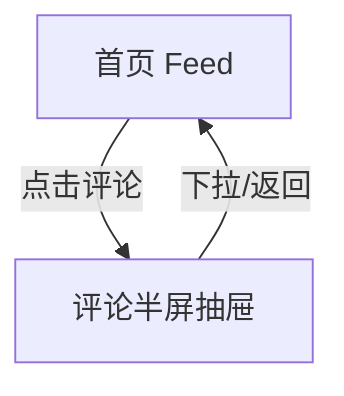

# 分析：红果 — 首页评论抽屉

## 分析信息

| 项目 | 内容 |
|------|------|
| 分析日期 | 2026-07-24 |
| 对应采集 | [plan.md](./plan.md) |
| 采集产物 | [assets/](./assets/) |
| 分析维度 | 评论抽屉承接方式、围观态结构、输入区布局 |

## 交互流程

### 页面跳转关系

### 流程步骤分析

#### 步骤 1：从首页打开评论抽屉

- **触发**：点击首页右侧评论按钮。
- **响应**：评论抽屉自底部拉起，显示“470条评论”、评论列表和底部输入栏。
- **转场**：半屏抽屉动画。
- **截图引用**：`assets/2026-07-24-step-01-comments-panel.png`

## UI 布局详解

### 页面：评论抽屉

| 区域 | 组件 | 位置 | 规格（估算） |
|------|------|------|-------------|
| 顶部 | 下拉柄、评论数 | 抽屉顶部 | 标题约 18sp，圆角卡片顶部 |
| 中部 | 评论列表 | 抽屉主体 | 单条评论约 88-140dp 高 |
| 右侧 | 点赞按钮与数量 | 每条评论右侧 | 图标约 22-24dp |
| 底部 | 输入框、图片、表情入口 | 抽屉底部固定 | 输入框约 44-48dp 高 |

## 业务逻辑分析

### 内容策略

- 评论围观对匿名用户开放，能直接浏览评论正文与互动数据。
- 输入框显式可见，意在引导匿名用户尝试互动。 `[推断]`

### 状态管理

| 状态场景 | UI 表现 | 用户可操作项 | 截图 |
|---------|--------|-------------|------|
| 评论围观态 | 评论列表 + 输入提示 | 浏览、点赞、尝试输入 | `assets/2026-07-24-step-01-comments-panel.png` |

## 关键发现

1. **评论以半屏抽屉承接**：不离开首页内容流。
2. **围观体验完整**：评论正文、回复入口、点赞数都在匿名态可见。
3. **输入区常驻底部**：持续刺激用户发表互动。 `[推断]`

## 发现的交互入口

| 发现路径 | 说明 | 页面快照 |
|---------|------|---------|
| `homepage-feed/` | 关闭评论抽屉可回到首页 | `assets/2026-07-24-step-01-comments-panel.png` |
