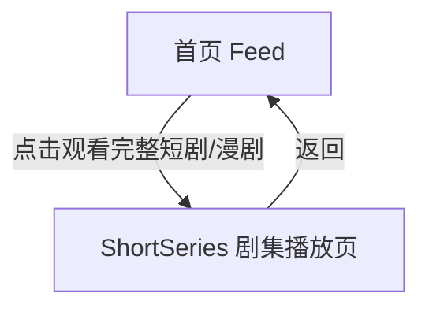

# 分析：红果 — 首页完整观看承接页

## 分析信息

| 项目 | 内容 |
|------|------|
| 分析日期 | 2026-07-24 |
| 对应采集 | [plan.md](./plan.md) |
| 采集产物 | [assets/](./assets/) |
| 分析维度 | 完整观看入口承接方式、播放器顶部/底部结构、追更链路 |

## 交互流程

### 页面跳转关系

### 流程步骤分析

#### 步骤 1：进入完整观看承接页

- **触发**：点击首页底部完整观看入口。
- **响应**：直接进入 ShortSeries 剧集播放页，顶部显示集数、倍速与更多操作，底部固定选集栏。
- **转场**：整页跳转到剧集播放上下文。
- **截图引用**：`assets/2026-07-24-step-01-player-entry.png`

## UI 布局详解

### 页面：ShortSeries 播放承接页

| 区域 | 组件 | 位置 | 规格（估算） |
|------|------|------|-------------|
| 顶部 | 返回、当前集数、倍速、更多 | 顶部固定 | 文案约 18-20sp |
| 中部 | 竖屏播放器 | 主内容区 | 与首页一致的竖屏观看语境 |
| 右侧 | 收藏、评论、点赞、分享 | 右侧纵列 | 图标约 26-30dp |
| 底部 | 选集·已完结·全133集 | 底部固定栏 | 高约 54-60dp |

## 业务逻辑分析

### 内容策略

- 首页完整观看入口承担从推荐流向持续追更流的转化职责。 `[推断]`
- 承接页直接暴露“选集·已完结·全133集”，显著缩短用户进入选集体系的路径。 `[推断]`

### 状态管理

| 状态场景 | UI 表现 | 用户可操作项 | 截图 |
|---------|--------|-------------|------|
| 剧集播放态 | 当前集数、倍速、更多、选集栏同时可见 | 继续看、切集、调倍速、打开更多 | `assets/2026-07-24-step-01-player-entry.png` |

## 关键发现

1. **完整观看入口直达播放页**：中间没有独立详情页拦截。
2. **选集栏常驻底部**：强调多集追更能力。
3. **首页与播放页互动列风格一致**：降低用户从首页切到追更页的认知成本。 `[推断]`

## 发现的交互入口

| 发现路径 | 说明 | 页面快照 |
|---------|------|---------|
| `homepage-feed/full-watch/episode-selector` | 底部选集抽屉入口 | `assets/2026-07-24-step-01-player-entry.png` |
| `homepage-feed/full-watch/playback-options` | 顶部倍速与更多操作 | `assets/2026-07-24-step-01-player-entry.png` |
