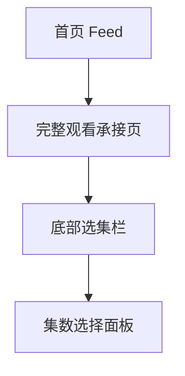

# 分析记录：红果 — 剧集播放页底部选集栏

## 分析信息

| 项目 | 内容 |
|------|------|
| 分析日期 | 2026-07-24 |
| 目标竞品 | 红果 |
| 功能路径 | homepage-feed/full-watch/episode-selector |
| 分析平台 | mobile |
| 采集来源 | `homepage-feed/full-watch/episode-selector/.captures/2026-07-24-episode-selector` |
| 相关文档 | `homepage-feed/full-watch/full-watch.md` |

## 交互流程

1. 用户从首页进入完整观看承接页。
2. 剧集播放页底部持续显示固定选集栏。
3. 用户可通过该栏获知剧集是否完结、总集数规模，并进一步点击发起切集。
4. 当前样本未展开选集面板，但入口态已经明确其作为切集触发器的职责。

## 页面跳转关系

## UI 布局详解

### 1. 模块位置

| 项目 | 观察 |
|------|------|
| 所在层级 | 位于播放器底部控制区上方，接近页面底边 |
| 展示形态 | 深色圆角长条，悬浮于播放器内容之上 |
| 右侧控件 | 上拉箭头，暗示可展开更多集数选择 |

### 2. 文案结构

| 字段 | 表现 |
|------|------|
| 主入口文案 | 选集 |
| 状态信息 | 已完结 |
| 规模信息 | 全133集 |
| 组合方式 | 以“选集·已完结·全133集”连续展示 |

### 3. 上下文关系

| 邻接元素 | 说明 |
|----------|------|
| 播放进度条 | 位于选集栏上方，说明切集与播放进度是相邻的连续操作 |
| 顶部集数文案 | 页面顶部显示“第3集”，与底部“全133集”形成当前集/全集规模的上下文互补 |
| 顶部倍速与更多 | 与底部选集栏共同构成播放页的核心操作层 |

## 业务逻辑分析

### 模块定位

episode-selector 是完整观看承接页中的固定切集入口，用于在播放过程中持续暴露“切换到其他集”的能力，而不是要求用户返回详情页或额外打开目录页。

### 信息组织策略

该模块将三个判断信息压缩到一行内：入口动作、完结状态、总集规模。这样用户在不点开的情况下，也能快速知道这部剧是已完结长剧，且当前具备完整集数可选。 `[推断]`

### 入口优先级

选集栏被固定在播放器最底部的高可见区域，且拥有独立背景块，说明切集是完整观看场景中的高频行为。相较顶部倍速/更多，选集更贴近追更主任务。 `[推断]`

### 待验证点

当前样本尚未展开集数面板，因此暂不能确认展开后是抽屉、半屏面板还是整页列表，也不能确认是否支持倒序、最近播放定位等能力。

## 关键发现

- **episode-selector 是播放页中的固定切集入口。**
- **入口态同时展示完结状态与全集规模**：帮助用户在点开前预估追剧成本。 `[推断]`
- **选集能力被前置为高频操作**：不需要离开播放器即可发起切集。 `[推断]`
- **当前路径只覆盖选集栏入口态**：展开后的集数选择面板仍需后续单独验证。

## 发现的交互入口

| 路径 | 入口位置 | 说明 |
|------|---------|------|
| homepage-feed/full-watch/episode-selector/panel-entry/ | 底部选集栏 | 点击后可能打开集数选择面板 |
