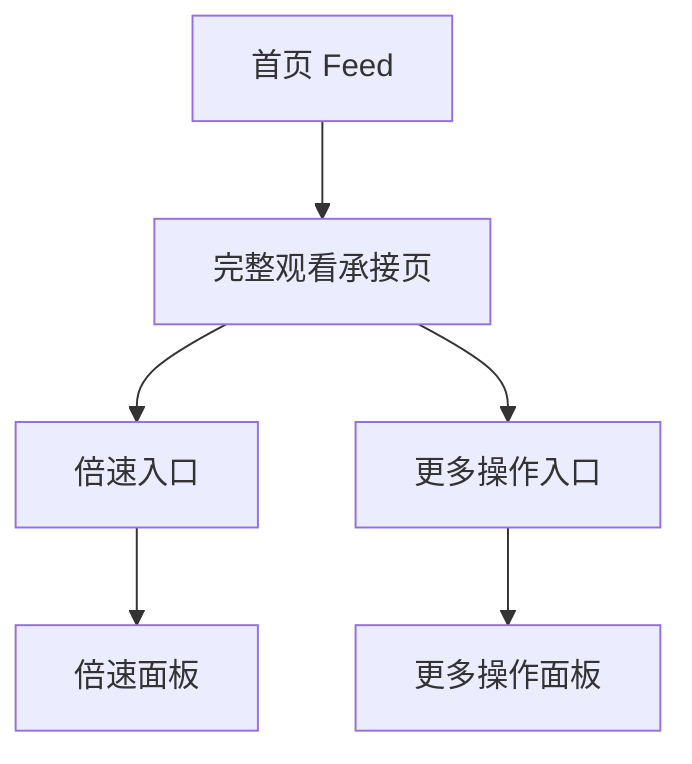

# 分析记录：红果 — 剧集播放页顶部倍速与更多操作

## 分析信息

| 项目 | 内容 |
|------|------|
| 分析日期 | 2026-07-24 |
| 目标竞品 | 红果 |
| 功能路径 | homepage-feed/full-watch/playback-options |
| 分析平台 | mobile |
| 采集来源 | `homepage-feed/full-watch/playback-options/.captures/2026-07-24-playback-options` |
| 相关文档 | `homepage-feed/full-watch/full-watch.md` |

## 交互流程

1. 用户从首页进入完整观看承接页。
2. 剧集播放页顶部持续显示返回、当前集数、倍速与更多操作。
3. 用户可直接点击“倍速”调整播放速度，或点击三点入口查看更多播放相关操作。
4. 当前样本未展开任何面板，但入口态已明确其为播放页核心工具层。

## 页面跳转关系

## UI 布局详解

### 1. 模块位置

| 项目 | 观察 |
|------|------|
| 所在层级 | 位于播放器顶栏右侧，与当前集数同一水平线 |
| 展示形态 | 白色图标 + 文案按钮，适配深色视频背景 |
| 组成 | “倍速”文本按钮 + 三点更多入口 |

### 2. 操作项结构

| 字段 | 表现 |
|------|------|
| 当前集数 | 页面左侧显示“第3集” |
| 倍速入口 | 带时钟样式图标和“倍速”文本 |
| 更多入口 | 三点垂直排列按钮 |
| 相对位置 | 倍速与更多靠右聚合，形成播放器工具区 |

### 3. 上下文关系

| 邻接元素 | 说明 |
|----------|------|
| 返回按钮 | 与顶部工具区共同组成播放页顶栏 |
| 底部选集栏 | 顶部负责播放调节，底部负责切集，形成上下分工 |
| 右侧互动列 | 顶部工具偏“观看控制”，右侧互动偏“社交反馈” |

## 业务逻辑分析

### 模块定位

playback-options 是完整观看承接页的顶部控制层，用于承接观看调节类操作。其职责与底部选集栏不同：底部负责内容切换，顶部负责播放行为调节与更多扩展能力。

### 信息组织策略

顶栏没有堆叠过多工具，而是只保留倍速和更多两个入口，说明平台将高频调节操作前置，把低频操作收纳到“更多”之下，以保证视频观看界面尽量干净。 `[推断]`

### 能力分层

倍速作为有明确文案的一级入口，优先级高于更多操作，说明在短剧播放场景中，播放速度调整是高频且重要的用户行为。 `[推断]`

### 待验证点

当前样本未展开倍速面板或更多菜单，因此尚不能确认支持的具体倍速档位、更多菜单中是否包含清屏、举报、投屏等能力；后续需单独验证。

## 关键发现

- **playback-options 是播放器顶部的一级控制层。**
- **倍速被单独前置显示**：说明该能力使用频率高。 `[推断]`
- **更多操作被收纳为三点入口**：有助于维持播放页简洁。 `[推断]`
- **当前路径只覆盖入口态**：倍速档位面板与更多菜单仍需继续下钻。

## 发现的交互入口

| 路径 | 入口位置 | 说明 |
|------|---------|------|
| homepage-feed/full-watch/playback-options/speed-panel/ | 顶部“倍速” | 播放速度调节面板入口 |
| homepage-feed/full-watch/playback-options/more-panel/ | 顶部三点“更多” | 更多播放操作入口 |
