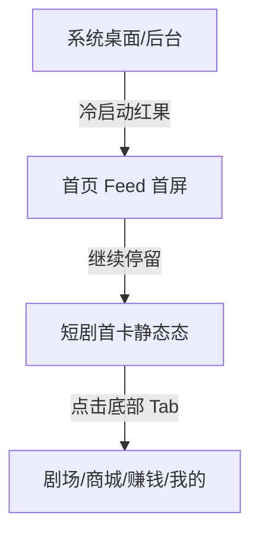

# 红果 — homepage-feed

## 基本信息

| 项目 | 内容 |
|------|------|
| 目标竞品 | 红果 |
| 竞品版本 | 7.2.4.32 |
| 功能模块 | homepage-feed |
| 分析平台 | mobile |
| 最后更新 | 2026-07-23 |
| 采集源 | [captures/](../../captures/) — 共 1 次采集 |

## 功能概览

首页是红果的默认冷启动承接页，采用沉浸式竖屏短剧 Feed 结构，优先把用户带入内容消费。页面同时保留“看全集”入口、互动操作列与全局导航，在首屏内同时完成内容观看、互动和后续转化承接。 `[推断]`

## 交互流程

### 步骤 1：冷启动进入首页

*图：冷启动后的首页 Feed 首屏 | 图源：[采集 2026-07-23](../../captures/2026-07-23-hongguo-tab-home/capture.md)*

**触发**：停止应用后重新启动红果。

**行为**：应用直接进入首页 Feed，未要求先登录，也未强制跳转活动页；顶部仅保留菜单和搜索入口。

### 步骤 2：确认无遮挡层

*图：首页在无弹窗状态下可直接操作 | 图源：[采集 2026-07-23](../../captures/2026-07-23-hongguo-tab-home/capture.md)*

**触发**：执行一次预估关闭弹层点击。

**行为**：页面未发生变化，说明本轮首页首屏没有签到或活动遮挡层。

### 步骤 3：首页首屏稳定态

*图：首页首屏稳定态 | 图源：[采集 2026-07-23](../../captures/2026-07-23-hongguo-tab-home/capture.md)*

**触发**：在首屏稳定状态下截图。

**行为**：首卡为短剧视频内容，下方提供剧名、题材标签、热评文案和“观看完整漫剧·全114集”入口，右侧为互动列，底部为 5 个一级 Tab。

## UI 布局详解

### 首页 Feed 首屏

| 区域 | 组件 | 规格（估算值） |
|------|------|--------------|
| 顶部 | 菜单按钮、搜索按钮 | 顶部操作区约 44-56dp，图标约 24dp，白色 |
| 中部 | 竖屏视频内容区 | 宽约 360dp，高约 560dp，上方保留黑边 |
| 右侧 | 金币、收藏、评论、点赞、分享操作列 | 图标约 26-30dp，纵向间距约 20-24dp |
| 下信息区 | 剧名、题材标签、热评、作者声明 | 标题约 18-20sp，标签高约 22-24dp |
| 底部操作条 | “观看完整漫剧·全114集” | 高约 46-50dp，深色半透明背景 |
| 底部导航 | 首页 / 剧场 / 商城 / 赚钱 / 我的 | 导航高约 72-76dp，首页高亮 |

*图：首页整体布局 | 图源：[采集 2026-07-23](../../captures/2026-07-23-hongguo-tab-home/capture.md)*

## 业务逻辑分析

### 加载策略

冷启动后直接进入首页 Feed，未观察到独立骨架屏或显式 loading。首屏更像先给出视频首帧/封面，再进入播放链路 `[推断]`。

### 内容策略

首页采用单列沉浸式短剧流，优先强化“马上看内容”的体验。同时通过“看全集”入口，把单集浏览转成追剧行为；右侧互动列则复用短视频交互习惯，降低用户学习成本。 `[推断]`

### 状态管理

本章节不适用。本轮仅覆盖默认首屏，未覆盖登录过期、网络异常、空状态等边界场景。

### 其他业务维度

本章节不适用。

## 关键发现

- **首页默认直达内容流**：红果把首页作为冷启动第一承接页，说明内容消费优先级高于活动或账号登录。 `[推断]`
- **首屏强调沉浸与转化并存**：视频占据最大面积，但同时显性放出“看全集”入口，兼顾即时消费与深度追更。 `[推断]`
- **顶部控制极简**：只保留菜单和搜索，尽量减少非内容元素对首屏注意力的打断。
- **赚钱能力被全局强调**：底部导航中的“赚钱”带角标，表明增长激励并非边缘能力 `[推断]`。

## 与自身产品对比

> 本章节由产品团队在阅读本竞品文档后自行填写，不在 skill 自动产出范围内。

## 附录

### A. 采集源索引

| 日期 | 采集文档 | 覆盖内容 |
|------|---------|---------|
| 2026-07-23 | [一级页面-首页首屏](../../captures/2026-07-23-hongguo-tab-home/capture.md) | 首页默认冷启动落点、无遮罩首屏、底部导航结构 |

### B. 截图索引

| 文件名 | 采集日期 | 内容 |
|--------|---------|------|
| `assets/2026-07-23-step-01-launch-home.png` | 2026-07-23 | 首页冷启动首屏 |
| `assets/2026-07-23-step-02-dismiss-overlay.png` | 2026-07-23 | 首页无遮罩可操作状态 |
| `assets/2026-07-23-step-03-home.png` | 2026-07-23 | 首页稳定首屏布局 |

### C. 录屏

本章节不适用。本次采集无录屏。

### D. 修订历史

| 日期 | 修订记录 | 变更摘要 |
|------|---------|---------|
| 2026-07-23 | [revisions/2026-07-23-hongguo-top-level-tabs.md](../../revisions/2026-07-23-hongguo-top-level-tabs.md) | 新建首页功能文档，补充一级页面首屏结构与发现 |

## 待深入

| 优先级 | 子功能 | 说明 | 状态 |
|--------|--------|------|------|
| P0 | 首页视频自动播放与切卡 | 需要确认进入首屏后的播放时机、滑动切卡和预加载策略 | 待采集 |
| P1 | 首页菜单面板 | 需要分析左上菜单入口的展开内容和跳转结构 | 待采集 |
| P1 | 首页搜索结果页 | 需要确认搜索承接页的信息架构和筛选逻辑 | 待采集 |
| P2 | 首页异常/登录状态 | 需要覆盖网络异常、未登录限制等状态 | 待采集 |

---

> 本文档基于模拟器操作采集 + 多模态分析生成。`[推断]` 标记的内容为主观判断，请结合实际验证。
> 原始采集实录见 `captures/` 目录。
