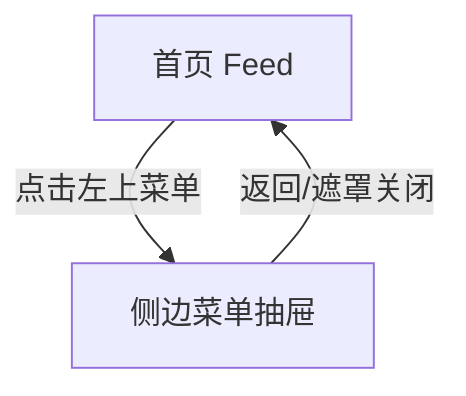

# 分析：红果 — 首页菜单抽屉

## 分析信息

| 项目 | 内容 |
|------|------|
| 分析日期 | 2026-07-24 |
| 对应采集 | [plan.md](./plan.md) |
| 采集产物 | [assets/](./assets/) |
| 分析维度 | 抽屉结构、账号入口、续播与工具能力分组 |

## 交互流程

### 页面跳转关系

### 流程步骤分析

#### 步骤 1：打开菜单抽屉

- **触发**：点击首页左上汉堡菜单。
- **响应**：左侧滑出个人中心式抽屉，包含登录 CTA、最近在看、游戏中心和常用功能。
- **转场**：左侧抽屉滑入。
- **截图引用**：`assets/2026-07-24-step-01-menu-panel.png`

## UI 布局详解

### 页面：菜单抽屉

| 区域 | 组件 | 位置 | 规格（估算） |
|------|------|------|-------------|
| 顶部 | 登录看完整信息、立即登录 | 顶部 CTA 区 | 按钮高约 40-44dp |
| 中部一 | 最近在看 | 抽屉中上部 | 三张续播卡横排 |
| 中部二 | 游戏中心 | 中部 | 四个图标横排 |
| 底部 | 常用功能 | 下部列表 | 两个入口：我的预约 / 我的下载 |

## 业务逻辑分析

### 内容策略

- 抽屉将账号、续播、轻娱乐和工具能力集中到单一入口。
- 最近在看模块强调“回到未完成内容”的续播价值。 `[推断]`

### 状态管理

| 状态场景 | UI 表现 | 用户可操作项 | 截图 |
|---------|--------|-------------|------|
| 匿名态菜单 | 登录 CTA + 最近在看 + 工具入口 | 登录、继续看、进入预约/下载 | `assets/2026-07-24-step-01-menu-panel.png` |

## 关键发现

1. **左上菜单不是频道导航**：而是个人中心式抽屉。
2. **最近在看占据高优先级**：说明续播是首页外围的重要能力。 `[推断]`
3. **常用功能较克制**：当前首屏只暴露预约和下载，减少抽屉复杂度。 `[推断]`

## 发现的交互入口

| 发现路径 | 说明 | 页面快照 |
|---------|------|---------|
| `homepage-feed/menu-panel/recently-viewed` | 最近在看续播列表 | `assets/2026-07-24-step-01-menu-panel.png` |
| `homepage-feed/menu-panel/common-functions` | 我的预约 / 我的下载 | `assets/2026-07-24-step-01-menu-panel.png` |
