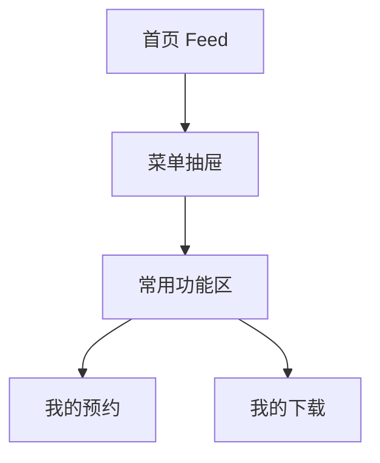

# 分析记录：红果 — 菜单抽屉常用功能区

## 分析信息

| 项目 | 内容 |
|------|------|
| 分析日期 | 2026-07-24 |
| 目标竞品 | 红果 |
| 功能路径 | homepage-feed/menu-panel/common-functions |
| 分析平台 | mobile |
| 采集来源 | `homepage-feed/menu-panel/common-functions/.captures/2026-07-24-common-functions` |
| 相关文档 | `homepage-feed/menu-panel/menu-panel.md` |

## 交互流程

1. 用户在首页点击左上菜单按钮，打开菜单抽屉。
2. 抽屉下部展示“常用功能”模块。
3. 用户可从“我的预约”或“我的下载”中选择一个入口继续下钻。
4. 当前样本未执行点击，但模块结构已明确其作为工具型入口集合的定位。

## 页面跳转关系

## UI 布局详解

### 1. 模块位置

| 项目 | 观察 |
|------|------|
| 所在层级 | 位于菜单抽屉底部，在“游戏中心”下方 |
| 模块标题 | “常用功能” |
| 展示形态 | 白底容器内纵向列表 |

### 2. 功能项结构

| 字段 | 表现 |
|------|------|
| 功能项数量 | 2 项 |
| 功能项名称 | 我的预约 / 我的下载 |
| 图标 | 左侧使用简洁线性图标，与功能语义对应 |
| 导航提示 | 右侧统一使用箭头，暗示继续进入下一层 |

### 3. 上下文关系

| 邻接模块 | 说明 |
|----------|------|
| 最近在看 | 内容消费与续播入口，位于上方 |
| 游戏中心 | 轻娱乐能力，位于中部 |
| 常用功能 | 更偏工具与个人资产管理，位于抽屉较下部 |

## 业务逻辑分析

### 模块定位

common-functions 是菜单抽屉中的工具型入口集合，用于承接“我的预约”“我的下载”等与用户资产管理、离线使用相关的常用能力。

### 信息组织策略

该模块采用极简列表结构，没有附加副标题、数字角标或运营信息，说明它追求的是明确、低学习成本的工具导航，而不是刺激点击的内容运营位。 `[推断]`

### 能力分层

在当前抽屉结构中，顶部是登录与续播，中部是游戏中心，底部才是常用功能，这种排序表明常用功能的业务优先级更偏“辅助工具”，服务于已有内容消费后的管理动作。 `[推断]`

### 待验证点

当前样本未点击“我的预约”或“我的下载”，因此尚未确认二者分别进入何种页面层级，后续需单独验证其承接页。

## 关键发现

- **common-functions 是菜单抽屉中的工具型入口区。**
- **当前首屏仅暴露两个高频工具入口**：我的预约、我的下载。
- **模块设计偏极简导航**：图标 + 标题 + 右箭头，弱化运营装饰。 `[推断]`
- **该区更偏消费后管理能力**：与续播入口形成“继续看”与“管理内容”的分工。 `[推断]`

## 发现的交互入口

| 路径 | 入口位置 | 说明 |
|------|---------|------|
| homepage-feed/menu-panel/common-functions/my-bookings/ | 常用功能 → 我的预约 | 用户预约内容管理入口 |
| homepage-feed/menu-panel/common-functions/my-downloads/ | 常用功能 → 我的下载 | 用户下载内容管理入口 |
