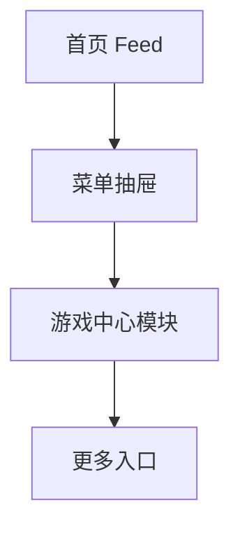

# 分析记录：红果 — 菜单抽屉游戏中心

## 分析信息

| 项目 | 内容 |
|------|------|
| 分析日期 | 2026-07-24 |
| 目标竞品 | 红果 |
| 功能路径 | homepage-feed/menu-panel/game-center |
| 分析平台 | mobile |
| 采集来源 | `homepage-feed/menu-panel/game-center/.captures/2026-07-24-game-center` |
| 相关文档 | `homepage-feed/menu-panel/menu-panel.md` |

## 交互流程

1. 用户从首页点击左上角按钮打开菜单抽屉。
2. 抽屉中段展示“游戏中心”模块。
3. 用户可直接点击小游戏快捷入口，或点击右上角“更多”进入更完整的游戏分发页。 `[推断]`
4. 当前样本仅覆盖模块展示态，未展开“更多”后的目标页面。

## 页面跳转关系

## UI 布局详解

### 1. 模块位置

| 项目 | 观察 |
|------|------|
| 上方区块 | 最近在看 |
| 当前区块 | 游戏中心 |
| 下方区块 | 常用功能 |
| 模块定位 | 位于抽屉中部，是内容消费之外的轻应用分发区 |

### 2. 游戏中心结构

| 项目 | 观察 |
|------|------|
| 标题 | 游戏中心 |
| 右上操作 | 更多 |
| 快捷入口数量 | 当前可见 4 个 |
| 快捷入口形态 | 图标 + 截断标题的轻应用入口 |

### 3. 可见入口

| 序号 | 可见标题 |
|------|----------|
| 1 | 赵云与阿... |
| 2 | 抓大鹅 |
| 3 | 梦幻消除... |
| 4 | 羊了个羊... |

## 业务逻辑分析

### 入口定位

`menu-panel/game-center` 不是剧集内容导航，而是菜单抽屉中的轻游戏分发模块。它与最近在看、常用功能并列，说明产品希望把小游戏能力作为用户中心旁路能力植入首页外围。 `[推断]`

### 分发策略

从模块形态看，平台采用“少量快捷入口 + 更多承接页”的组合方式：首屏只放四个轻应用，避免抽屉过长；真正完整的游戏供给则可能由“更多”承接。 `[推断]`

### 去重决策

当前四个游戏快捷入口在 UI 结构和交互模式上完全一致，仅图标与标题不同，因此不逐个追加为独立路径；后续若“更多”进入新的页面层级，再单独建路径。

## 关键发现

- **game-center 是菜单抽屉中的独立模块**，不属于内容消费主链路。
- **模块采用“快捷入口 + 更多”结构**：首屏控制入口数量，完整供给可能在后续承接页。 `[推断]`
- **四个游戏入口同构**：仅标题和图标不同，不单独拆分。 
- **当前未覆盖“更多”后的页面**：这是后续值得继续采集的新入口。

## 发现的交互入口

| 路径 | 入口位置 | 说明 |
|------|---------|------|
| homepage-feed/menu-panel/game-center/more-entry/ | 游戏中心右上角“更多” | 游戏中心完整列表或承接页入口 |
| homepage-feed/menu-panel/login-cta/ | 菜单抽屉顶部“立即登录” | 抽屉顶部登录承接入口 |
