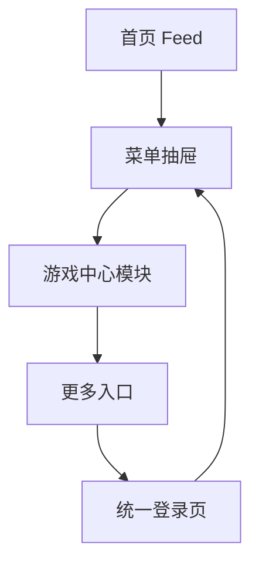

# 分析记录：红果 — 游戏中心更多入口

## 分析信息

| 项目 | 内容 |
|------|------|
| 分析日期 | 2026-07-24 |
| 目标竞品 | 红果 |
| 功能路径 | homepage-feed/menu-panel/game-center/more-entry |
| 分析平台 | mobile |
| 采集来源 | `homepage-feed/menu-panel/game-center/more-entry/.captures/2026-07-24-more-entry` |
| 相关文档 | `homepage-feed/menu-panel/game-center/game-center.md` |

## 交互流程

1. 用户从首页点击左上角按钮打开菜单抽屉。
2. 在游戏中心模块右上角点击“更多”入口。
3. 系统未展示游戏完整列表，而是直接跳转到全屏手机号登录页。
4. 用户返回后回到菜单抽屉中的游戏中心模块上下文。

## 页面跳转关系

## UI 布局详解

### 1. more-entry 在模块中的位置

| 项目 | 观察 |
|------|------|
| 所在模块 | 游戏中心 |
| 入口形式 | “更多”文字 + 右箭头 |
| 层级 | 模块标题栏右侧，独立于四个游戏快捷入口 |
| 预期语义 | 查看更多游戏供给或完整列表 |

### 2. 拦截结果

| 项目 | 观察 |
|------|------|
| 点击后页面 | 统一手机号登录页 |
| 标题 | 登录 |
| 副标题 | 发现更多精彩短剧 |
| 表单 | `+86`、手机号输入框、获取验证码 |
| 其它入口 | 协议勾选区、抖音第三方登录 |

### 3. 返回链路

| 项目 | 观察 |
|------|------|
| 返回前页面 | 登录拦截页 |
| 返回后页面 | 菜单抽屉中的游戏中心模块 |
| 抽屉状态 | 保持打开 |
| 背景 | 右侧仍可见首页 Feed |

## 业务逻辑分析

### 门槛策略

`game-center/more-entry` 在匿名态下不是直接开放的内容扩展页，而是一个受登录保护的入口。相比游戏中心首屏四个快捷入口可直接展示，这个“更多”更像“完整供给”或“更高价值供给”的承接门，平台要求用户先完成身份绑定再继续访问。 `[推断]`

### 与 login-cta 的关系

点击“更多”后落到的页面与 `menu-panel/login-cta` 完全一致：同一套手机号验证码登录表单、同样的协议区与抖音登录入口、同样的返回链路。因此这里不新增独立登录页路径，而是将其视为 `login-cta` 的一次业务复用；`more-entry` 本身记录的是“触发登录拦截”这一入口结果。

### 返回与容器关系

从拦截页返回后继续停留在菜单抽屉，说明该登录门槛是挂在抽屉容器里的覆盖式流程，而不是跳出到完全独立的游戏中心频道。这降低了匿名用户试探点击的损耗，但也意味着未登录状态下无法进一步验证真实的更多游戏列表。 `[推断]`

### 去重决策

本路径保留的原因不是登录页本身新，而是**游戏中心模块级“更多”入口在匿名态下存在明确的登录门槛拦截**，这与单纯查看游戏中心模块不同，属于新的交互结果。登录页内容则复用 `homepage-feed/menu-panel/login-cta/`，不重复拆文档。

## 关键发现

- **游戏中心“更多”在匿名态下不可直接访问**：会被统一登录页拦截。
- **拦截页复用顶部 login-cta 的登录方案**：说明菜单抽屉内多个需要身份的入口共用同一身份承接页。
- **返回后仍保留抽屉上下文**：流程是抽屉内覆盖，不是跳出式跳转。
- **真实的更多游戏列表当前仍不可见**：后续若具备登录态，应继续补采登录后页面。

## 发现的交互入口

| 路径 | 入口位置 | 说明 |
|------|---------|------|
| homepage-feed/menu-panel/game-center/more-entry/logged-in-list/ | 游戏中心“更多”在登录后 | 登录后可能出现的完整游戏列表或承接页 |
| homepage-feed/menu-panel/login-cta/ | 登录拦截页 | 点击“更多”后复用的统一登录承接页 |
