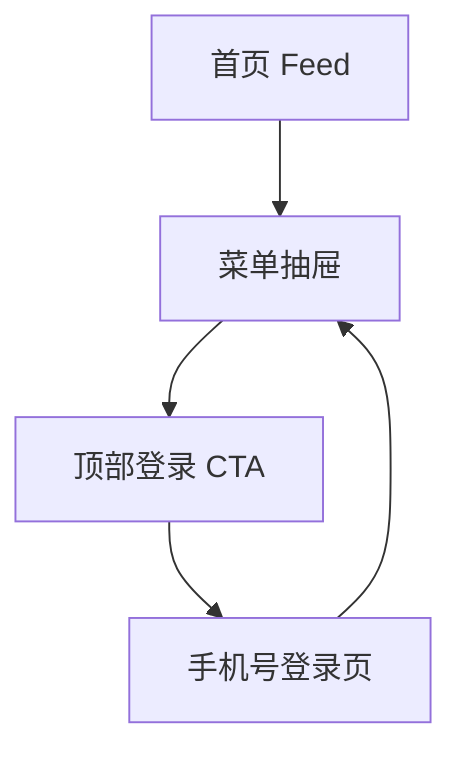

# 分析记录：红果 — 菜单抽屉登录入口

## 分析信息

| 项目 | 内容 |
|------|------|
| 分析日期 | 2026-07-24 |
| 目标竞品 | 红果 |
| 功能路径 | homepage-feed/menu-panel/login-cta |
| 分析平台 | mobile |
| 采集来源 | `homepage-feed/menu-panel/login-cta/.captures/2026-07-24-login-cta` |
| 相关文档 | `homepage-feed/menu-panel/menu-panel.md` |

## 交互流程

1. 用户从首页点击左上角按钮打开菜单抽屉。
2. 抽屉顶部展示匿名态登录头部，中间文案为“登录看完整信息”，右侧提供“立即登录”主按钮。
3. 用户点击“立即登录”后，进入全屏登录承接页。
4. 登录页默认聚焦手机号输入框，提供区号选择、验证码登录、协议勾选和第三方登录入口。
5. 用户返回后重新回到菜单抽屉，而不是直接回到首页首屏。

## 页面跳转关系

## UI 布局详解

### 1. 抽屉顶部匿名态入口

| 项目 | 观察 |
|------|------|
| 左侧 | 灰色头像占位 |
| 主文案 | 登录看完整信息 |
| 右侧按钮 | 立即登录 |
| 所在层级 | 位于“我的消息”之上，是菜单抽屉最顶部入口 |

### 2. 登录承接页结构

| 区域 | 观察 |
|------|------|
| 顶部 | 左上角关闭按钮 |
| 标题区 | “登录” + “发现更多精彩短剧” |
| 主表单 | 区号 `+86` + 手机号输入框 |
| 主按钮 | 获取验证码，未输入前置灰 |
| 协议区 | 勾选框 + 用户协议 / 隐私政策 / 运营商服务协议 |
| 其它方式 | 抖音图标第三方登录入口 |

### 3. 返回链路

| 项目 | 观察 |
|------|------|
| 返回前页面 | 全屏登录页 |
| 返回后页面 | 菜单抽屉上下文 |
| 抽屉状态 | 保持打开 |
| 背景 | 右侧仍可见首页 Feed 背景 |

## 业务逻辑分析

### 入口定位

`menu-panel/login-cta` 是菜单抽屉中的身份承接入口，用于把匿名用户导入统一登录页。它被放在抽屉最顶部，并使用主按钮强化转化，说明身份绑定在该抽屉的业务优先级高于消息、续播和工具功能。 `[推断]`

### 登录策略

当前登录页采用“手机号验证码 + 协议勾选 + 第三方登录”三段式结构：手机号验证码是默认主链路，第三方登录作为补充方案放在页面底部。主按钮在未输入手机号时不可用，表明产品优先通过表单校验约束无效提交。

### 返回与容器关系

登录页虽然是全屏承接页，但返回后会回到菜单抽屉，而非首页首屏，说明它是从抽屉上下文发起的覆盖式流程。对于用户而言，这降低了尝试登录的路径损耗：退出登录仍能回到原先想看的个人功能入口。 `[推断]`

### 去重决策

当前仅发现一个顶部登录 CTA 和一个手机号登录承接页；页内的协议勾选、区号选择、第三方登录虽然是不同控件，但都属于同一登录页内元素，不作为独立路径追加。只有当后续点击抖音登录或进入验证码发送页出现新的页面层级时，才继续新增路径。

## 关键发现

- **login-cta 是菜单抽屉中的最高优先级入口**：位于顶部，并用橙色主按钮强调登录转化。
- **登录页是统一的全屏身份承接页**：支持手机号验证码登录，并提供协议确认与第三方登录。
- **返回会回到菜单抽屉**：说明该流程与抽屉上下文强绑定，而不是跳出到独立账号中心。
- **当前尚未覆盖验证码发送和第三方授权链路**：这是登录页内后续可能继续下钻的真实新路径。

## 发现的交互入口

| 路径 | 入口位置 | 说明 |
|------|---------|------|
| homepage-feed/menu-panel/login-cta/sms-submit/ | 登录页“获取验证码” | 输入合法手机号后发起验证码登录的下一步承接态 |
| homepage-feed/menu-panel/login-cta/douyin-login/ | 登录页底部抖音图标 | 第三方授权登录入口 |
