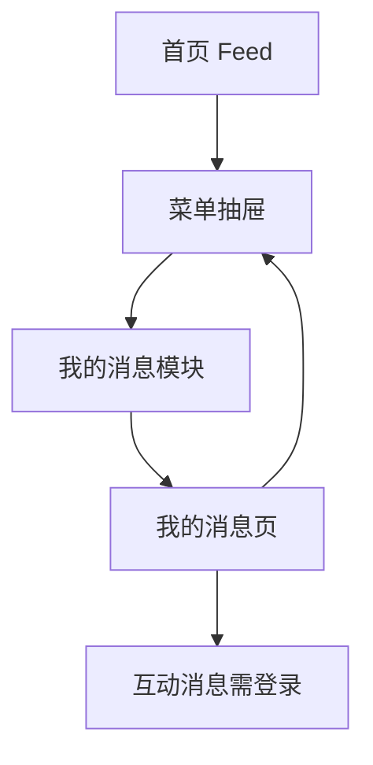

# 分析记录：红果 — 我的消息

## 分析信息

| 项目 | 内容 |
|------|------|
| 分析日期 | 2026-07-24 |
| 目标竞品 | 红果 |
| 功能路径 | homepage-feed/menu-panel/my-messages |
| 分析平台 | mobile |
| 采集来源 | `homepage-feed/menu-panel/my-messages/.captures/2026-07-24-my-messages` |
| 相关文档 | `homepage-feed/menu-panel/menu-panel.md` |

## 交互流程

1. 用户从首页点击左上角按钮打开菜单抽屉。
2. 在顶部登录 CTA 下方看到“我的消息”模块，模块内预览最近一条系统通知，并在右上角提供“更多”入口。
3. 用户点击“更多”后，进入独立的“我的消息”页。
4. 页面顶部展示系统通知列表，下半区提示“登录查看互动消息”，并提供登录按钮。
5. 用户返回后重新回到菜单抽屉，而不是直接回到首页首屏。

## 页面跳转关系

## UI 布局详解

### 1. 抽屉中的消息预览模块

| 项目 | 观察 |
|------|------|
| 模块标题 | 我的消息 |
| 右上入口 | 更多 + 右箭头 |
| 预览内容 | 1 条系统通知摘要 |
| 时间信息 | 547天前 |
| 所在层级 | 位于顶部登录 CTA 下方、“最近在看”上方 |

### 2. 独立“我的消息”页结构

| 区域 | 观察 |
|------|------|
| 顶部导航 | 左上返回箭头 + 居中标题“我的消息” |
| 消息列表区 | 当前可见 1 条“系统通知” |
| 单条消息结构 | 左侧铃铛图标 + 标题“系统通知” + 日期 `2025-01-22` + 摘要文案 + 右侧未读橙点 |
| 下半区空态 | 胶片插画 + “登录查看互动消息”提示 |
| 主操作 | 橙色“登录”按钮 |

### 3. 返回链路

| 项目 | 观察 |
|------|------|
| 返回前页面 | 独立“我的消息”页 |
| 返回后页面 | 菜单抽屉上下文 |
| 抽屉状态 | 保持打开 |
| 背景 | 右侧仍可见首页 Feed |

## 业务逻辑分析

### 模块定位

`menu-panel/my-messages` 是菜单抽屉中的个人通知入口，承担两层职责：一是在抽屉首屏给出系统通知摘要，二是在独立消息页中承接更完整的消息管理。它被放在登录 CTA 下方、最近在看上方，说明消息触达优先级高于续播与工具管理。 `[推断]`

### 消息分层策略

当前消息页把“系统通知”和“互动消息”做了明显分层：系统通知即使在匿名态下也可以直接浏览到基础摘要，而互动消息则被放在下半区，并要求登录后查看。这表明平台希望在不增加登录阻力的情况下先完成运营通知触达，但把更强个性化、社交化的消息能力留给登录用户。 `[推断]`

### 容器与返回关系

点击“更多”进入的是一个独立全屏页，而不是抽屉内展开态；但返回后会重新回到菜单抽屉，说明该消息页仍属于抽屉上下文发起的承接页。这样的设计既允许消息页承载更完整列表，又不会打断用户在抽屉中的原始浏览任务。

### 去重决策

当前样本只显示 1 条系统通知预览和 1 条系统通知列表项；它们代表的是同一类“系统通知消息”结构，不再按不同消息条目逐条拆分。真正值得新增的路径是：
- 互动消息登录门槛（页面内明确出现新的身份限制）
- 单条系统通知详情（若点击进入独立详情页）

## 关键发现

- **“我的消息”是菜单抽屉上部的重要个人通知入口**：优先级高于“最近在看”和“常用功能”。
- **点击“更多”会进入独立消息页，而不是直接触发统一登录拦截**：这与 `game-center/more-entry` 明显不同。
- **系统通知对匿名用户部分开放**：当前可以直接看到通知标题、日期和摘要。
- **互动消息需要登录后查看**：页面下半区明确给出“登录查看互动消息”与登录按钮。
- **返回会回到菜单抽屉**：说明消息页与抽屉容器保持强上下文绑定。

## 发现的交互入口

| 路径 | 入口位置 | 说明 |
|------|---------|------|
| homepage-feed/menu-panel/my-messages/interaction-login/ | “我的消息”页底部登录按钮 | 登录后查看互动消息的身份承接入口 |
| homepage-feed/menu-panel/my-messages/system-notice-detail/ | 系统通知列表项 | 点击单条系统通知后可能进入的详情页 |
