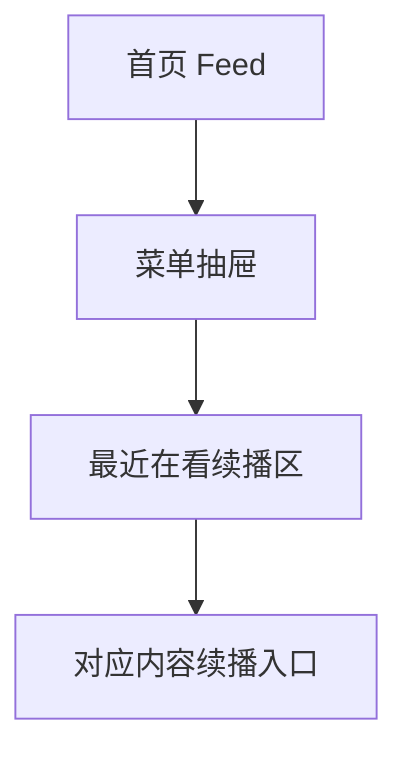

# 分析记录：红果 — 菜单抽屉最近在看续播区

## 分析信息

| 项目 | 内容 |
|------|------|
| 分析日期 | 2026-07-24 |
| 目标竞品 | 红果 |
| 功能路径 | homepage-feed/menu-panel/recently-viewed |
| 分析平台 | mobile |
| 采集来源 | `homepage-feed/menu-panel/recently-viewed/.captures/2026-07-24-recently-viewed` |
| 相关文档 | `homepage-feed/menu-panel/menu-panel.md` |

## 交互流程

1. 用户在首页点击左上菜单按钮，拉起菜单抽屉。
2. 抽屉展开后，顶部 CTA 下方直接展示“最近在看”模块。
3. 用户可从三张续播卡中选择一项继续观看。
4. 当前样本未执行卡片点击，但模块文案与进度信息已明确其作为续播入口的职责。

## 页面跳转关系

## UI 布局详解

### 1. 模块位置

| 项目 | 观察 |
|------|------|
| 所在层级 | 位于菜单抽屉顶部登录 CTA 下方、游戏中心上方 |
| 模块标题 | “最近在看” |
| 展示形态 | 白底卡片容器内横向三卡并列 |

### 2. 卡片结构

| 字段 | 表现 |
|------|------|
| 封面 | 竖版海报，适合短剧内容展示 |
| 标题 | 显示剧名，如“村里的吃人鬼”“一剑挽仙洲…”“兼职帝君” |
| 进度 | 以集数/总集数或集数/更新状态呈现，如“1集/5集”“119集/219集”“1集/更新至…” |
| 排列 | 三张卡并列，优先展示最近续播的少量高相关内容 |

### 3. 上下文关系

| 邻接模块 | 说明 |
|----------|------|
| 顶部 CTA | 强化未登录用户也能看到续播入口，但登录仍是更高优先级动作 |
| 游戏中心 | recently-viewed 位于内容消费能力之前，权重高于轻娱乐入口 |
| 常用功能 | 与“我的预约”“我的下载”一起构成抽屉内的个人使用入口集合 |

## 业务逻辑分析

### 模块定位

recently-viewed 是菜单抽屉中的续播快捷区，用于在首页侧边抽屉内直接暴露最近消费过的内容，降低用户回到未看完剧集的路径成本。

### 信息组织策略

该模块没有展示复杂的元数据，而是只保留最影响续播决策的三类信息：封面、剧名、观看进度。说明它的目标不是帮助用户比较内容，而是帮助用户快速识别“上次看到哪里”。 `[推断]`

### 入口优先级

在当前样本中，recently-viewed 排在游戏中心和常用功能之前，且位于顶部 CTA 后第一块内容区，说明续播能力在抽屉中的业务优先级较高。 `[推断]`

### 待验证点

当前样本未点击任一卡片，因此尚不能确认点击后是直达播放器、详情页，还是先进入完整观看承接页；需后续针对具体续播卡做下钻验证。

## 关键发现

- **recently-viewed 是菜单抽屉中的高优先级续播区。**
- **卡片以“封面 + 剧名 + 进度”最小信息集组织**：明显服务于快速回看，而非内容发现。 `[推断]`
- **展示数量被控制在三张左右**：更像摘要式续播入口，而非完整历史列表。 `[推断]`
- **当前样本已暴露潜在下钻入口**：每张续播卡都可能继续进入对应内容的播放承接页。

## 发现的交互入口

| 路径 | 入口位置 | 说明 |
|------|---------|------|
| homepage-feed/menu-panel/recently-viewed/first-card/ | 最近在看第 1 张卡 | 续播卡片入口之一，当前样本为《村里的吃人鬼》 |
| homepage-feed/menu-panel/recently-viewed/second-card/ | 最近在看第 2 张卡 | 续播卡片入口之一，当前样本为《一剑挽仙洲》 |
| homepage-feed/menu-panel/recently-viewed/third-card/ | 最近在看第 3 张卡 | 续播卡片入口之一，当前样本为《兼职帝君》 |
