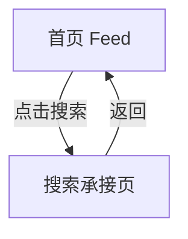

# 分析：红果 — 首页搜索承接页

## 分析信息

| 项目 | 内容 |
|------|------|
| 分析日期 | 2026-07-24 |
| 对应采集 | [plan.md](./plan.md) |
| 采集产物 | [assets/](./assets/) |
| 分析维度 | 搜索页结构、发现入口、历史与热搜内容 |

## 交互流程

### 页面跳转关系

### 流程步骤分析

#### 步骤 1：进入搜索承接页

- **触发**：点击首页右上角搜索图标。
- **响应**：进入独立搜索页，显示搜索框、快捷入口、搜索历史、猜你想搜和热搜榜。
- **转场**：整页切换。
- **截图引用**：`assets/2026-07-24-step-01-search-entry.png`

#### 步骤 2：读取 XML 层级

- **触发**：导出 UI XML。
- **响应**：可观测到快捷入口、历史词和热搜列表结构。
- **转场**：无。
- **截图引用**：`assets/2026-07-24-step-01-search-entry.xml`

## UI 布局详解

### 页面：搜索承接页

| 区域 | 组件 | 位置 | 规格（估算） |
|------|------|------|-------------|
| 顶部 | 返回、搜索框、搜索按钮 | 顶部固定 | 搜索框高约 40-44dp |
| 快捷入口 | 识剧 / 排行 / 上新 / 演员 / 分类 | 顶部下方横排 | 单项约 72-96dp 宽 |
| 中部 | 搜索历史、猜你想搜 | 列表/卡片区 | 文字约 16-18sp |
| 下部 | 热搜榜与推荐卡片 | 双列内容流 | 卡面约 160-180dp 宽 |

## 业务逻辑分析

### 内容策略

- 搜索页承担“找剧 + 发现”的双重职责。
- 历史词与猜你想搜共同降低用户搜索输入成本。 `[推断]`
- XML 里可见多个历史词与榜单模块，说明搜索承接页具有持续运营属性。 `[推断]`

### 状态管理

| 状态场景 | UI 表现 | 用户可操作项 | 截图 |
|---------|--------|-------------|------|
| 历史残留态 | 搜索框保留旧关键词 | 修改搜索词、清空、继续搜索 | `assets/2026-07-24-step-01-search-entry.png` |

## 关键发现

1. **搜索页是完整发现页**：不仅能搜索，还内置识剧、排行、上新等探索入口。
2. **搜索历史直接暴露**：降低回访用户的检索成本。
3. **热搜榜占首屏较大面积**：榜单运营在搜索页中权重较高。 `[推断]`

## 发现的交互入口

| 发现路径 | 说明 | 页面快照 |
|---------|------|---------|
| `homepage-feed/search/ranking` | 搜索页内可进入排行模块 | `assets/2026-07-24-step-01-search-entry.png` |
| `homepage-feed/search/classification` | 搜索页内可进入分类模块 | `assets/2026-07-24-step-01-search-entry.png` |
