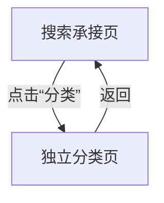

# 分析：红果 — 搜索页分类入口

## 分析信息

| 项目 | 内容 |
|------|------|
| 分析日期 | 2026-07-24 |
| 对应采集 | [plan.md](./plan.md) |
| 采集产物 | [assets/](./assets/) |
| 分析维度 | 分类入口承接方式、分类页信息架构、返回链路 |

## 交互流程

### 页面跳转关系

### 流程步骤分析

#### 步骤 1：从首页进入搜索承接页

- **触发**：首页点击右上搜索图标。
- **响应**：进入搜索承接页，首屏可见“分类”快捷入口。
- **转场**：整页切换到搜索承接页。
- **截图引用**：`assets/2026-07-24-step-01-search-entry.png`

#### 步骤 2：点击“分类”快捷入口

- **触发**：点击搜索页快捷入口中的“分类”。
- **响应**：进入独立分类页。顶部有“全部 / 男生 / 女生”三大类 Tab；左侧是纵向导航，右侧是标签矩阵，当前样本下左栏选中“时代背景”，右侧展示“乡村 / 职场 / 民国 / 校园 / 历史古代 / 古装”等标签，同时下方还有“主题情节”“角色设定”等分区。
- **转场**：整页跳转到分类页。
- **截图引用**：`assets/2026-07-24-step-02-classification-entry.png`

#### 步骤 3：返回搜索页

- **触发**：在分类页点击返回。
- **响应**：回到搜索承接页，搜索历史、猜你想搜和热搜榜模块继续保留。
- **转场**：整页返回搜索页。
- **截图引用**：`assets/2026-07-24-step-03-back-search.png`

## UI 布局详解

### 页面：搜索承接页（分类入口前置状态）

| 区域 | 组件 | 位置 | 规格（估算） |
|------|------|------|-------------|
| 顶部 | 返回、搜索框、搜索按钮 | 顶部固定 | 搜索框高约 40-44dp |
| 快捷入口 | 识剧 / 排行 / 上新 / 演员 / 分类 | 顶部下方横排 | 单项约 72-96dp 宽 |
| 中部 | 搜索历史、猜你想搜 | 中部 | 标题约 18-20sp |
| 下部 | 热搜榜模块 | 下部 | 多榜单卡片并列 |

### 页面：独立分类页

| 区域 | 组件 | 位置 | 规格（估算） |
|------|------|------|-------------|
| 顶部 | 返回、全部/男生/女生 Tab | 顶部固定 | 主 Tab 文案约 20-24sp |
| 左侧 | 分类导航列 | 左侧竖列 | 导航项高约 44-52dp |
| 右侧 | 标签矩阵卡片 | 主内容区 | 单标签胶囊约 44-56dp 高 |
| 分区标题 | 时代背景 / 主题情节 / 角色设定 | 内容区分段标题 | 标题约 18sp |

#### 组件细节

##### 标签矩阵

- **尺寸**：单个标签块约 148-172dp 宽、44-52dp 高
- **间距**：横向间距约 12dp，纵向间距约 16dp
- **字号**：标签文案约 18-20sp
- **颜色**：浅灰底，深灰字；选中态为橙色文字/强调态
- **圆角**：约 10-12dp
- **图标**：无图标，纯文字标签

## 业务逻辑分析

### 加载策略

| 场景 | 加载方式 | 耗时（估算） | 说明 |
|------|---------|-------------|------|
| 搜索页进入分类 | 整页跳转 | ~2s | 从搜索快捷入口直达分类页 |
| 分类页返回搜索 | 整页返回 | ~2s | 搜索页状态保留 |

### 内容策略

- 分类页不是简单标签弹层，而是独立分类中心，说明搜索体系中的“分类”承担较重的内容组织职责。 `[推断]`
- 顶部先按人群/内容池切为“全部 / 男生 / 女生”，左侧再按分类维度切分，右侧最后以具体标签承接，形成“三层筛选”结构。 `[推断]`
- 标签覆盖时代背景、主题情节、角色设定等多个维度，说明平台希望通过题材标签帮助用户更高效地进行内容发现。 `[推断]`

### 状态管理

| 状态场景 | UI 表现 | 用户可操作项 | 截图 |
|---------|--------|-------------|------|
| 分类浏览态 | 独立分类页，左栏 + 右侧标签矩阵 | 切换大类、切换左栏维度、选择标签 | `assets/2026-07-24-step-02-classification-entry.png` |
| 返回恢复态 | 搜索页上下文保留 | 继续搜索、继续点击其他快捷入口 | `assets/2026-07-24-step-03-back-search.png` |

## 关键发现

1. **“分类”是独立分类中心**：不是搜索页内小弹层，而是整页承接。
2. **分类页采用三层筛选结构**：顶部人群维度、左侧分类维度、右侧具体标签矩阵。
3. **分类覆盖多个题材维度**：时代背景、主题情节、角色设定等共同组成标签系统。 `[推断]`
4. **返回后搜索页状态保留**：分类页是搜索体系中的下钻页，不会打断搜索上下文。

## 发现的交互入口

| 发现路径 | 说明 | 页面快照 |
|---------|------|---------|
| `homepage-feed/search/classification/boy-tab/` | 分类页顶部“男生”内容池切换 | `assets/2026-07-24-step-02-classification-entry.png` |
| `homepage-feed/search/classification/girl-tab/` | 分类页顶部“女生”内容池切换 | `assets/2026-07-24-step-02-classification-entry.png` |
| `homepage-feed/search/classification/theme-plot/` | 左侧“主题情节”分类维度 | `assets/2026-07-24-step-02-classification-entry.png` |
| `homepage-feed/search/classification/character-setting/` | 左侧“角色设定”分类维度 | `assets/2026-07-24-step-02-classification-entry.png` |
