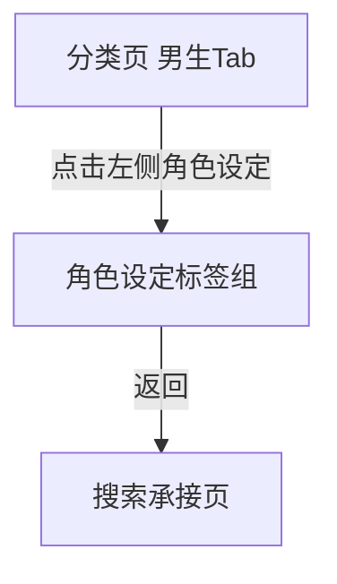

# 分析：红果 — 男生 Tab 角色设定标签组

## 分析信息

| 项目 | 内容 |
|------|------|
| 分析日期 | 2026-07-24 |
| 对应采集 | [plan.md](./plan.md) |
| 采集产物 | [assets/](./assets/) |
| 分析维度 | 角色设定标签分布、同页结构、返回链路 |

## 交互流程

### 页面跳转关系

### 流程步骤分析

#### 步骤 1：进入男生 Tab 的角色设定标签组

- **触发**：从搜索页进入分类中心后点击顶部“男生”Tab，再点击左侧“角色设定”。
- **响应**：左侧“角色设定”高亮，右侧继续保留完整纵向内容区，角色设定分组位于下部并集中展示男频身份与强者人设标签。
- **转场**：同页内锚点切换，无新页面跳转。
- **截图引用**：`assets/2026-07-24-step-01-character-setting.png`

#### 步骤 2：返回搜索页

- **触发**：从角色设定浏览态点击返回。
- **响应**：系统直接回到搜索承接页，而不是回到分类中心默认态。
- **转场**：整页返回搜索页。
- **截图引用**：`assets/2026-07-24-step-02-back-context.png`

## UI 布局详解

### 页面：男生 Tab 角色设定标签组

| 区域 | 组件 | 位置 | 规格（估算） |
|------|------|------|-------------|
| 顶部 | 全部 / 男生 / 女生 Tab | 顶部固定 | “男生”高亮，字号约 20-24sp |
| 左侧 | 时代背景 / 主题情节 / 角色设定 | 左侧竖列 | “角色设定”高亮为橙色文案 |
| 右侧上部 | 时代背景、主题情节分组 | 主内容区上半部 | 继续保留为长页上下文 |
| 右侧下部 | 角色设定标签矩阵 | 主内容区底部 | 三列胶囊标签，首屏可见 6 个标签 |

#### 组件细节

##### 角色设定标签组

- **标签数量**：首屏可见 6 个
- **标签内容**：小人物、神豪、强者回归、天下无敌、女帝、龙王
- **排列方式**：三列网格，每行约 3 个标签
- **视觉样式**：浅灰底圆角胶囊，深灰文案，无图标
- **层级位置**：位于男生 Tab 右侧内容区底部，左侧导航负责高亮对应维度而非切出独立页面

## 业务逻辑分析

### 加载策略

| 场景 | 加载方式 | 耗时（估算） | 说明 |
|------|---------|-------------|------|
| 切换到角色设定 | 同页锚点切换 | ~2s | 不离开分类页框架，也不替换整块内容页 |
| 浏览角色设定后返回 | 整页返回 | ~2s | 直接退出分类承接层 |

### 内容策略

- 角色设定分组集中在男频常见的人设模板与身份爽点，如“神豪 / 强者回归 / 天下无敌 / 龙王”。 `[推断]`
- “小人物”与“女帝”说明平台也保留了逆袭起点型与高位权力型角色框架，用于覆盖不同男性向幻想入口。 `[推断]`
- 相较于主题情节分组强调剧情套路，角色设定更偏主角 archetype 归类，帮助用户按主角身份与权力感快速筛内容。 `[推断]`

### 状态管理

| 状态场景 | UI 表现 | 用户可操作项 | 截图 |
|---------|--------|-------------|------|
| 角色设定浏览态 | 左侧“角色设定”高亮，右侧长页展示角色设定标签矩阵 | 点击标签、切换时代背景/主题情节、切换全部/女生 | `assets/2026-07-24-step-01-character-setting.png` |
| 返回恢复态 | 搜索页上下文保留 | 继续搜索、继续点分类/排行入口 | `assets/2026-07-24-step-02-back-context.png` |

## 关键发现

1. **角色设定是男生内容池中的同页锚点分组**：点击左侧导航后并不会进入新页面。  
2. **右侧内容区为连续长页结构**：时代背景、主题情节、角色设定三个分组连续排布，左侧导航更像目录索引。  
3. **人设组织更强调权力感与身份爽点**：神豪、强者回归、天下无敌、龙王等标签高度统一。 `[推断]`  
4. **返回直接退出到搜索页**：说明角色设定只属于分类承接层内部状态，而非独立详情页。  

## 发现的交互入口

| 发现路径 | 说明 | 页面快照 |
|---------|------|---------|
| `homepage-feed/search/classification/boy-tab/character-setting/wealthy-tag/` | 男生角色设定中的“神豪”标签 | `assets/2026-07-24-step-01-character-setting.png` |
| `homepage-feed/search/classification/boy-tab/character-setting/strong-return-tag/` | 男生角色设定中的“强者回归”标签 | `assets/2026-07-24-step-01-character-setting.png` |
| `homepage-feed/search/classification/boy-tab/character-setting/dragon-king-tag/` | 男生角色设定中的“龙王”标签 | `assets/2026-07-24-step-01-character-setting.png` |
