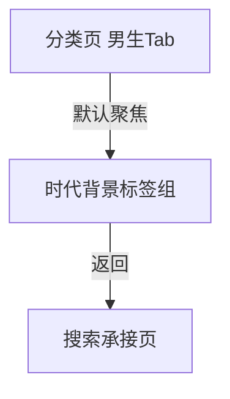

# 分析：红果 — 男生 Tab 时代背景标签组

## 分析信息

| 项目 | 内容 |
|------|------|
| 分析日期 | 2026-07-24 |
| 对应采集 | [plan.md](./plan.md) |
| 采集产物 | [assets/](./assets/) |
| 分析维度 | 男生时代背景标签分布、分组位置、返回链路 |

## 交互流程

### 页面跳转关系

### 流程步骤分析

#### 步骤 1：进入男生 Tab 的时代背景标签组

- **触发**：从搜索页进入分类中心后点击顶部“男生”Tab。
- **响应**：页面保持左侧“时代背景”默认高亮，右侧展示男生内容池的时代背景标签组。
- **转场**：同页内内容池切换后停留在默认分组。
- **截图引用**：`assets/2026-07-24-step-01-boy-tab.png`

#### 步骤 2：返回搜索页

- **触发**：从男生 Tab 状态点击返回。
- **响应**：直接回到搜索承接页，而不是回到分类页默认态。
- **转场**：整页返回搜索页。
- **截图引用**：`assets/2026-07-24-step-02-back-context.png`

## UI 布局详解

### 页面：男生 Tab 默认时代背景分组

| 区域 | 组件 | 位置 | 规格（估算） |
|------|------|------|-------------|
| 顶部 | 全部 / 男生 / 女生 Tab | 顶部固定 | “男生”高亮，字号约 20-24sp |
| 左侧 | 时代背景 / 主题情节 / 角色设定 | 左侧竖列 | 默认高亮“时代背景” |
| 右侧上部 | 时代背景标签组 | 主内容区顶部 | 2 行 6 个标签块，单项约 44-56dp 高 |
| 右侧下部 | 主题情节 / 角色设定预览区 | 主内容区下方 | 同页向下连续展示 |

#### 组件细节

##### 时代背景标签组

- **标签数量**：首屏可见 6 个
- **标签内容**：乡村、职场、民国、校园、历史古代、古装
- **排列方式**：三列网格，每行约 3 个标签
- **视觉样式**：浅灰底圆角胶囊，深灰文案，无图标
- **层级位置**：位于男生 Tab 右侧内容区最顶部，是默认优先展示的分组

## 业务逻辑分析

### 加载策略

| 场景 | 加载方式 | 耗时（估算） | 说明 |
|------|---------|-------------|------|
| 切换到男生 Tab | 同页切换 | ~2s | 不离开分类页框架 |
| 浏览时代背景后返回 | 整页返回 | ~2s | 直接退出分类承接层 |

### 内容策略

- 男生 Tab 默认把“时代背景”放在首个分组，说明平台优先按故事发生空间/时代外壳组织男性向内容入口。 `[推断]`
- 标签组合兼顾现实空间与历史语境，例如“乡村 / 职场 / 校园”对应现实成长场景，“民国 / 历史古代 / 古装”对应历史与架空叙事背景。 `[推断]`
- 与女生 Tab 相比，男生时代背景增加了“乡村 / 历史古代”等更偏男性升级、逆袭或家族叙事的背景入口。 `[推断]`

### 状态管理

| 状态场景 | UI 表现 | 用户可操作项 | 截图 |
|---------|--------|-------------|------|
| 时代背景浏览态 | 左侧“时代背景”高亮，右侧显示 6 个背景标签 | 点击标签、切换到主题情节/角色设定、切换全部/女生 | `assets/2026-07-24-step-01-boy-tab.png` |
| 返回恢复态 | 搜索页上下文保留 | 继续搜索、继续点分类/排行入口 | `assets/2026-07-24-step-02-back-context.png` |

## 关键发现

1. **时代背景是男生 Tab 的默认首屏分组**：无需额外交互即可直接暴露给用户。
2. **标签先按叙事空间分类**：乡村、职场、校园等现实场景与民国、古装、历史古代等历史背景并列。 `[推断]`
3. **男生向背景更强调成长与时代框架**：相较女生 Tab，背景标签更偏升级、家族、历史叙事空间。 `[推断]`
4. **返回直接退出到搜索页**：说明该分组不是独立页面，只是男生分类内容池中的默认分区。

## 发现的交互入口

| 发现路径 | 说明 | 页面快照 |
|---------|------|---------|
| `homepage-feed/search/classification/boy-tab/era-background/rural-life-tag/` | 男生时代背景中的“乡村”标签 | `assets/2026-07-24-step-01-boy-tab.png` |
| `homepage-feed/search/classification/boy-tab/era-background/workplace-tag/` | 男生时代背景中的“职场”标签 | `assets/2026-07-24-step-01-boy-tab.png` |
| `homepage-feed/search/classification/boy-tab/era-background/ancient-tag/` | 男生时代背景中的“历史古代 / 古装”标签入口 | `assets/2026-07-24-step-01-boy-tab.png` |
