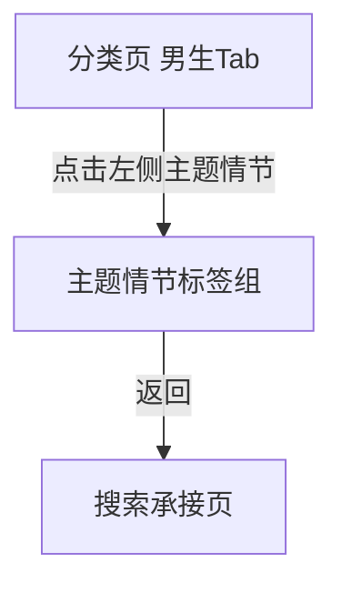

# 分析：红果 — 男生 Tab 主题情节标签组

## 分析信息

| 项目 | 内容 |
|------|------|
| 分析日期 | 2026-07-24 |
| 对应采集 | [plan.md](./plan.md) |
| 采集产物 | [assets/](./assets/) |
| 分析维度 | 主题情节标签分布、同页结构、返回链路 |

## 交互流程

### 页面跳转关系

### 流程步骤分析

#### 步骤 1：进入男生 Tab 的主题情节标签组

- **触发**：从搜索页进入分类中心后点击顶部“男生”Tab，再点击左侧“主题情节”。
- **响应**：左侧“主题情节”高亮，右侧继续保留完整纵向内容区，主题情节分组位于中部并集中展示男频剧情题材标签。
- **转场**：同页内锚点切换，无新页面跳转。
- **截图引用**：`assets/2026-07-24-step-01-theme-plot.png`

#### 步骤 2：返回搜索页

- **触发**：从主题情节浏览态点击返回。
- **响应**：系统直接回到搜索承接页，而不是回到分类中心默认态。
- **转场**：整页返回搜索页。
- **截图引用**：`assets/2026-07-24-step-02-back-context.png`

## UI 布局详解

### 页面：男生 Tab 主题情节标签组

| 区域 | 组件 | 位置 | 规格（估算） |
|------|------|------|-------------|
| 顶部 | 全部 / 男生 / 女生 Tab | 顶部固定 | “男生”高亮，字号约 20-24sp |
| 左侧 | 时代背景 / 主题情节 / 角色设定 | 左侧竖列 | “主题情节”高亮为橙色文案 |
| 右侧上部 | 时代背景分组 | 主内容区顶部 | 2 行 6 个标签块，作为前序分组继续保留 |
| 右侧中部 | 主题情节标签矩阵 | 主内容区中段 | 三列胶囊标签，首屏可见约 19 个标签 |
| 右侧下部 | 角色设定分组 | 主内容区底部 | 同页继续衔接下一分组 |

#### 组件细节

##### 主题情节标签组

- **标签数量**：首屏可见约 19 个，另有角色设定分组在下方衔接
- **标签内容**：逆袭、马甲、都市日常、重生、穿越、系统、亲情、奇幻脑洞、穿书、战神归来、异能、传承觉醒、玄幻仙侠、赘婿逆袭、娱乐圈、剧情、无敌神医、悬疑推理、喜剧
- **排列方式**：三列网格，每行约 3 个标签
- **视觉样式**：浅灰底圆角胶囊，深灰文案，无图标
- **层级位置**：位于男生 Tab 右侧内容区的中部，左侧导航负责高亮对应维度而非切出独立页面

## 业务逻辑分析

### 加载策略

| 场景 | 加载方式 | 耗时（估算） | 说明 |
|------|---------|-------------|------|
| 切换到主题情节 | 同页锚点切换 | ~2s | 不离开分类页框架，也不替换整块内容页 |
| 浏览主题情节后返回 | 整页返回 | ~2s | 直接退出分类承接层 |

### 内容策略

- 主题情节分组明显集中在男频常见的“成长升级 + 身份反转 + 超自然能力”母题，如“逆袭 / 系统 / 战神归来 / 异能 / 传承觉醒 / 无敌神医”。 `[推断]`
- 同时保留“都市日常 / 亲情 / 娱乐圈 / 悬疑推理 / 喜剧”等相对生活化或类型化入口，说明平台希望在爽感题材外，也保留现实、悬疑与轻喜方向的补充分流。 `[推断]`
- “赘婿逆袭 / 马甲 / 穿越 / 穿书 / 重生”等标签进一步体现出该分组承担的是剧情结构与叙事套路的组织作用，而不是单纯时代背景分类。 `[推断]`

### 状态管理

| 状态场景 | UI 表现 | 用户可操作项 | 截图 |
|---------|--------|-------------|------|
| 主题情节浏览态 | 左侧“主题情节”高亮，右侧在长页中展示主题情节标签矩阵 | 点击标签、切换时代背景/角色设定、切换全部/女生 | `assets/2026-07-24-step-01-theme-plot.png` |
| 返回恢复态 | 搜索页上下文保留 | 继续搜索、继续点分类/排行入口 | `assets/2026-07-24-step-02-back-context.png` |

## 关键发现

1. **主题情节是男生内容池中的同页锚点分组**：点击左侧导航后并不会进入新页面。  
2. **右侧内容区为纵向长页结构**：时代背景、主题情节、角色设定三个分组连续排布，左侧导航更像目录索引。  
3. **男频题材集中于成长与爽感叙事**：逆袭、系统、战神归来、赘婿逆袭、无敌神医等标签高度统一。 `[推断]`  
4. **返回直接退出到搜索页**：说明主题情节只属于分类承接层内部状态，而非独立详情页。  

## 发现的交互入口

| 发现路径 | 说明 | 页面快照 |
|---------|------|---------|
| `homepage-feed/search/classification/boy-tab/theme-plot/comeback-tag/` | 男生主题情节中的“逆袭”标签 | `assets/2026-07-24-step-01-theme-plot.png` |
| `homepage-feed/search/classification/boy-tab/theme-plot/system-tag/` | 男生主题情节中的“系统”标签 | `assets/2026-07-24-step-01-theme-plot.png` |
| `homepage-feed/search/classification/boy-tab/theme-plot/fantasy-brainhole-tag/` | 男生主题情节中的“奇幻脑洞”标签 | `assets/2026-07-24-step-01-theme-plot.png` |
