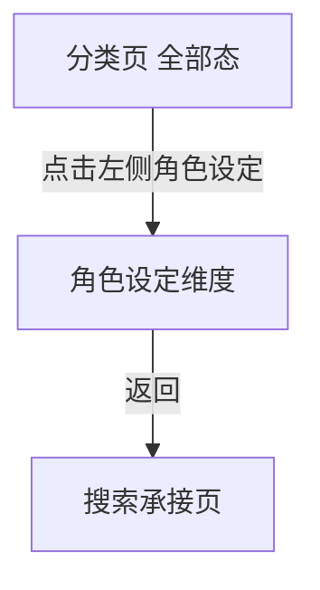

# 分析：红果 — 分类页角色设定维度

## 分析信息

| 项目 | 内容 |
|------|------|
| 分析日期 | 2026-07-24 |
| 对应采集 | [plan.md](./plan.md) |
| 采集产物 | [assets/](./assets/) |
| 分析维度 | 角色设定标签分布、全部态内容策略、返回链路 |

## 交互流程

### 页面跳转关系

### 流程步骤分析

#### 步骤 1：进入分类页“角色设定”维度

- **触发**：从搜索页进入分类中心后，保持顶部“全部”并点击左侧“角色设定”。
- **响应**：左侧“角色设定”高亮，右侧继续保留完整纵向内容区，角色设定分组位于下部，聚合展示女性向人设、男性向身份爽点以及关系型角色模板。
- **转场**：同页内锚点切换，无新页面跳转。
- **截图引用**：`assets/2026-07-24-step-01-character-setting.png`

#### 步骤 2：返回搜索页

- **触发**：从角色设定浏览态点击返回。
- **响应**：系统直接回到搜索承接页，而不是回到分类中心默认态。
- **转场**：整页返回搜索页。
- **截图引用**：`assets/2026-07-24-step-02-back-context.png`

## UI 布局详解

### 页面：分类页角色设定维度

| 区域 | 组件 | 位置 | 规格（估算） |
|------|------|------|-------------|
| 顶部 | 全部 / 男生 / 女生 Tab | 顶部固定 | “全部”高亮，字号约 20-24sp |
| 左侧 | 时代背景 / 主题情节 / 角色设定 | 左侧竖列 | “角色设定”高亮为橙色文案 |
| 右侧上部 | 时代背景、主题情节分组 | 主内容区上半部 | 继续保留为长页上下文，主题情节标题右侧带“展开” |
| 右侧下部 | 角色设定标签矩阵 | 主内容区底部 | 三列胶囊标签，首屏可见约 17 个标签 |

#### 组件细节

##### 角色设定标签组

- **标签数量**：当前截图中角色设定分组首屏可见约 17 个标签
- **标签内容**：大女主、萌宝、小人物、神豪、强者回归、真假千金、欢喜冤家、强强联合、天下无敌、青梅竹马、王妃、女帝、龙王、皇后、替身、大叔、团宠
- **排列方式**：三列网格，多数行约 3 个标签，末行不足 3 个
- **视觉样式**：浅灰底圆角胶囊，深灰文案，无图标
- **层级位置**：位于分类页右侧内容区下部，左侧导航负责锚定对应维度

## 业务逻辑分析

### 加载策略

| 场景 | 加载方式 | 耗时（估算） | 说明 |
|------|---------|-------------|------|
| 切换到角色设定 | 同页锚点切换 | ~2s | 不离开分类页框架，也不切出独立页面 |
| 浏览角色设定后返回 | 整页返回 | ~2s | 直接退出分类承接层 |

### 内容策略

- “全部”态下的角色设定维度明显承担跨人群的人设汇总作用，把“大女主 / 萌宝 / 真假千金 / 王妃 / 女帝 / 皇后 / 替身 / 团宠”等偏女性向角色模板，与“神豪 / 强者回归 / 天下无敌 / 龙王 / 大叔 / 小人物”等偏男性向身份爽点同时陈列。 `[推断]`
- “欢喜冤家 / 强强联合 / 青梅竹马”等关系型标签与身份标签并列，说明平台在角色设定维度中也会混入关系 archetype，以降低用户理解成本并增强筛选覆盖面。 `[推断]`
- 相较于主题情节维度侧重剧情套路，角色设定维度更强调“主角是谁、拥有什么关系或身份模板”，适合按人物幻想入口找内容。 `[推断]`

### 状态管理

| 状态场景 | UI 表现 | 用户可操作项 | 截图 |
|---------|--------|-------------|------|
| 角色设定浏览态 | 顶部“全部”与左侧“角色设定”高亮，右侧长页展示混合人设标签矩阵 | 点击标签、切换时代背景/主题情节、切换男生/女生 | `assets/2026-07-24-step-01-character-setting.png` |
| 返回恢复态 | 搜索页上下文保留 | 继续搜索、继续点分类/排行入口 | `assets/2026-07-24-step-02-back-context.png` |

## 关键发现

1. **角色设定是分类页内部的同页锚点分组**：点击左侧导航后并不会进入新页面。  
2. **“全部”态角色池是混合人设池**：女性向身份模板、男性向爽感身份与关系型设定并列展示。  
3. **右侧内容区为连续长页结构**：时代背景、主题情节、角色设定三个分组连续排布，左侧导航更像目录索引。  
4. **返回直接退出到搜索页**：说明该维度只属于分类承接层内部状态，而非独立详情页。  

## 发现的交互入口

| 发现路径 | 说明 | 页面快照 |
|---------|------|---------|
| `homepage-feed/search/classification/character-setting/female-lead-tag/` | 分类页角色设定中的“大女主”标签 | `assets/2026-07-24-step-01-character-setting.png` |
| `homepage-feed/search/classification/character-setting/wealthy-tag/` | 分类页角色设定中的“神豪”标签 | `assets/2026-07-24-step-01-character-setting.png` |
| `homepage-feed/search/classification/character-setting/happy-enemies-tag/` | 分类页角色设定中的“欢喜冤家”标签 | `assets/2026-07-24-step-01-character-setting.png` |
