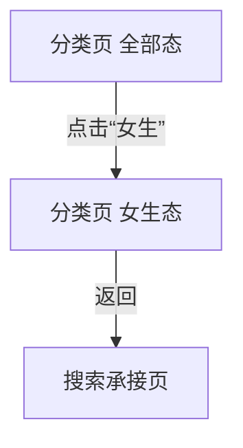

# 分析：红果 — 分类页女生 Tab

## 分析信息

| 项目 | 内容 |
|------|------|
| 分析日期 | 2026-07-24 |
| 对应采集 | [plan.md](./plan.md) |
| 采集产物 | [assets/](./assets/) |
| 分析维度 | 女生 Tab 切换方式、女生内容池标签结构、返回链路 |

## 交互流程

### 页面跳转关系

### 流程步骤分析

#### 步骤 1：进入分类页

- **触发**：从首页进入搜索页后点击“分类”。
- **响应**：进入分类中心，默认停留在“全部”内容池。
- **转场**：整页跳转到分类页。
- **截图引用**：`assets/2026-07-24-step-01-classification-page.png`

#### 步骤 2：切换到“女生”Tab

- **触发**：点击顶部“女生”Tab。
- **响应**：内容池切换为女生向标签体系，顶部高亮变为“女生”，右侧标签矩阵替换为更偏女性向的题材与角色标签；时代背景中可见“职场 / 民国 / 校园 / 古装”，主题情节中集中出现“女性成长 / 闪婚 / 暗恋成真 / 古风言情 / 现代言情 / 豪门恩怨 / 真假千金 / 欢喜冤家”等，角色设定中则出现“大女主 / 萌宝 / 王妃 / 女帝 / 皇后 / 替身 / 团宠”等。
- **转场**：同页内大类 Tab 切换。
- **截图引用**：`assets/2026-07-24-step-02-girl-tab.png`

#### 步骤 3：返回搜索页

- **触发**：在女生 Tab 状态点击返回。
- **响应**：直接回到搜索承接页，而不是回到分类页“全部”态。
- **转场**：整页返回搜索页。
- **截图引用**：`assets/2026-07-24-step-03-back-context.png`

## UI 布局详解

### 页面：分类页默认态

| 区域 | 组件 | 位置 | 规格（估算） |
|------|------|------|-------------|
| 顶部 | 全部 / 男生 / 女生 Tab | 顶部固定 | 文案约 20-24sp |
| 左侧 | 分类维度导航 | 左侧竖列 | 单项高约 44-52dp |
| 右侧 | 标签矩阵 | 主内容区 | 单标签约 44-56dp 高 |

### 页面：女生 Tab

| 区域 | 组件 | 位置 | 规格（估算） |
|------|------|------|-------------|
| 顶部 | 全部 / 男生 / 女生 Tab | 顶部固定 | “女生”高亮，字号约 20-24sp |
| 左侧 | 时代背景 / 主题情节 / 角色设定 | 左侧竖列 | 维度项高约 44-52dp |
| 右侧 | 女生向标签矩阵 | 主内容区 | 三列标签块，单项约 44-56dp 高 |

#### 组件细节

##### 女生向标签矩阵

- **尺寸**：单个标签块约 148-172dp 宽、44-52dp 高
- **间距**：横向约 12dp，纵向约 16dp
- **字号**：标签文案约 18-20sp
- **颜色**：浅灰底，深灰文字
- **圆角**：约 10-12dp
- **图标**：无图标，纯文本胶囊

## 业务逻辑分析

### 加载策略

| 场景 | 加载方式 | 耗时（估算） | 说明 |
|------|---------|-------------|------|
| 分类页切换女生 Tab | 同页切换 | ~2s | 不离开分类页框架，只替换内容池 |
| 女生 Tab 返回搜索页 | 整页返回 | ~2s | 直接退出整个分类承接层 |

### 内容策略

- 女生 Tab 相比“全部”态，更集中在女性成长、亲密关系、豪门情感、古风言情与女性角色人设等方向，例如“女性成长 / 闪婚 / 暗恋成真 / 追妻 / 豪门恩怨 / 真假千金 / 欢喜冤家 / 王妃 / 女帝 / 皇后 / 团宠”。 `[推断]`
- 顶部男生/女生 Tab 不是单纯视觉筛选，而是整套内容池切换机制，会整体重组右侧标签矩阵。 `[推断]`
- 返回直接回搜索页，说明内容池切换虽发生在分类页内部，但用户操作上仍被视为搜索体系下的一层独立分类承接页。 `[推断]`

### 状态管理

| 状态场景 | UI 表现 | 用户可操作项 | 截图 |
|---------|--------|-------------|------|
| 女生内容池浏览态 | 顶部“女生”高亮 + 女性向标签矩阵 | 切换维度、点击标签、切换男生/全部 | `assets/2026-07-24-step-02-girl-tab.png` |
| 返回恢复态 | 搜索页状态保留 | 继续搜索、继续点分类/排行等入口 | `assets/2026-07-24-step-03-back-context.png` |

## 关键发现

1. **女生 Tab 是独立内容池切换**：并非只微调个别标签，而是整块右侧标签体系重组。
2. **女生向题材偏“关系与成长”**：女性成长、闪婚、暗恋成真、追妻、豪门恩怨、真假千金、欢喜冤家等标签明显更密集。 `[推断]`
3. **左侧维度结构不变**：变化主要发生在右侧标签内容与内容语义。
4. **返回直接回搜索页**：女生 Tab 不会单独保留回到“全部”态的中间返回层。

## 发现的交互入口

| 发现路径 | 说明 | 页面快照 |
|---------|------|---------|
| `homepage-feed/search/classification/girl-tab/era-background/` | 女生 Tab 下的“时代背景”标签组 | `assets/2026-07-24-step-02-girl-tab.png` |
| `homepage-feed/search/classification/girl-tab/theme-plot/` | 女生 Tab 下的“主题情节”标签组 | `assets/2026-07-24-step-02-girl-tab.png` |
| `homepage-feed/search/classification/girl-tab/character-setting/` | 女生 Tab 下的“角色设定”标签组 | `assets/2026-07-24-step-02-girl-tab.png` |
