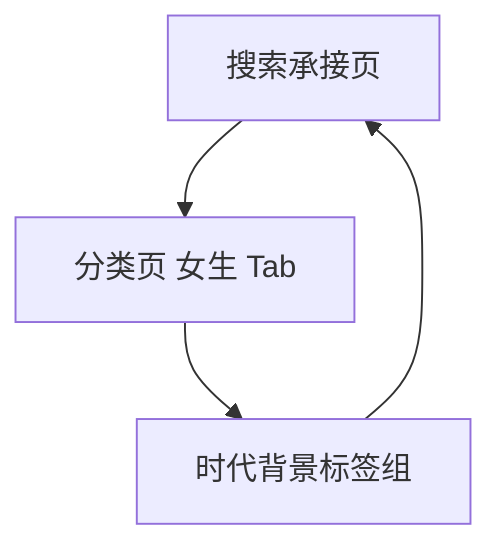

# 分析记录：红果 — 女生 Tab 时代背景标签组

## 分析信息

| 项目 | 内容 |
|------|------|
| 分析日期 | 2026-07-24 |
| 目标竞品 | 红果 |
| 功能路径 | homepage-feed/search/classification/girl-tab/era-background |
| 分析平台 | mobile |
| 采集来源 | `homepage-feed/search/classification/girl-tab/era-background/.captures/2026-07-24-era-background` |
| 相关文档 | `homepage-feed/search/classification/girl-tab/girl-tab.md` |

## 交互流程

1. 用户从搜索页进入分类中心并切换到“女生”Tab。
2. 女生 Tab 默认停留在左侧“时代背景”分组，无需额外点击即可看到对应标签组。
3. 右侧首屏先展示时代背景标签，再顺延展示主题情节与角色设定分组。
4. 用户执行返回后，页面直接退出整个分类承接层并回到搜索页。

## 页面跳转关系

## UI 布局详解

### 1. 分组形态

| 项目 | 观察 |
|------|------|
| 左侧导航 | 时代背景 / 主题情节 / 角色设定 |
| 默认高亮 | 时代背景 |
| 页面结构 | 右侧为连续长页，不是切换到新页面 |
| 内容顺序 | 时代背景在最上方，之后依次是主题情节、角色设定 |

### 2. 时代背景标签组

| 可见标签 |
|----------|
| 职场 / 民国 / 校园 / 古装 |

该标签组数量少于默认“全部”态和男生 Tab，对应更偏女性向内容池中的背景切分。

### 3. 层级关系

| 组件 | 说明 |
|------|------|
| 顶部 Tab | 全部 / 男生 / 女生，当前“女生”高亮 |
| 左侧维度 | 时代背景仅是女生 Tab 下的一个内容分组 |
| 右侧长页 | 同页继续承载主题情节与角色设定，说明不是独立页面 |

## 业务逻辑分析

### 入口定位

`girl-tab/era-background` 不是独立页面，而是女生内容池的默认可见标签分组。平台通过左侧维度导航把同一内容池中的多个标签分组组织在一个长页内，其中时代背景是首个曝光分组。

### 内容策略

女生 Tab 的时代背景标签比“全部”态更收敛，当前仅保留“职场 / 民国 / 校园 / 古装”四类。可以看出平台在女生内容池中更强调现代关系、校园情感和古装情境等高频女性向背景，而弱化了乡村、历史古代等其他背景。 `[推断]`

### 返回关系

从该分组所在状态返回后，页面直接回到搜索承接页，而不是回到分类页内部其他分组，说明 era-background 只是分类承接层内部状态，不具备单独回退层级。

## 关键发现

- **girl-tab/era-background 是女生 Tab 默认可见的同页分组，不是独立页面。**
- **时代背景标签明显收敛为四类**：职场、民国、校园、古装。 `[推断]`
- **女生向背景选择偏关系与情境导向**：与后续主题情节、角色设定形成连续组合。 `[推断]`
- **返回会退出整个分类承接层**：该分组没有单独页面层级。

## 发现的交互入口

| 路径 | 入口位置 | 说明 |
|------|---------|------|
| homepage-feed/search/classification/girl-tab/era-background/workplace-tag/ | 时代背景“职场” | 女生内容池中的职场背景标签 |
| homepage-feed/search/classification/girl-tab/era-background/republican-tag/ | 时代背景“民国” | 女生内容池中的民国背景标签 |
| homepage-feed/search/classification/girl-tab/era-background/campus-tag/ | 时代背景“校园” | 女生内容池中的校园背景标签 |
| homepage-feed/search/classification/girl-tab/era-background/costume-tag/ | 时代背景“古装” | 女生内容池中的古装背景标签 |
