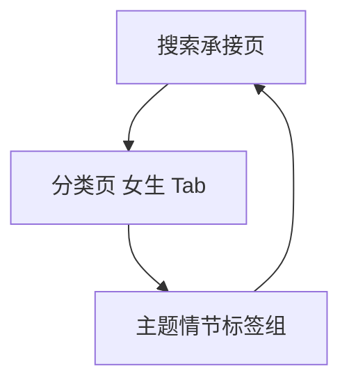

# 分析记录：红果 — 女生 Tab 主题情节标签组

## 分析信息

| 项目 | 内容 |
|------|------|
| 分析日期 | 2026-07-24 |
| 目标竞品 | 红果 |
| 功能路径 | homepage-feed/search/classification/girl-tab/theme-plot |
| 分析平台 | mobile |
| 采集来源 | `homepage-feed/search/classification/girl-tab/theme-plot/.captures/2026-07-24-theme-plot` |
| 相关文档 | `homepage-feed/search/classification/girl-tab/girl-tab.md` |

## 交互流程

1. 用户从搜索页进入分类中心并切换到“女生”Tab。
2. 女生 Tab 右侧长页中部展示“主题情节”标签组。
3. 用户可在该分组中选择关系、成长、家庭、甜宠、古风等不同情节方向。
4. 用户执行返回后，页面直接退出整个分类承接层并回到搜索页。

## 页面跳转关系

## UI 布局详解

### 1. 分组形态

| 项目 | 观察 |
|------|------|
| 左侧导航 | 时代背景 / 主题情节 / 角色设定 |
| 同页结构 | 右侧为连续长页，不是单独页面 |
| 分组位置 | 主题情节位于时代背景之后、角色设定之前 |

### 2. 主题情节标签组

| 可见标签 |
|----------|
| 打脸虐渣 / 逆袭 / 马甲 / 女性成长 / 重生 / 穿越 / 系统 / 亲情 / 家庭伦理 / 奇幻爱情 / 闪婚 / 暗恋成真 / 古风言情 / 穿书 / 破镜重圆 / 追妻 / 现代言情 / 豪门恩怨 / 虐恋 / 古风权谋 / 年代爱情 / 娱乐圈 / 剧情 / 悬疑推理 / 喜剧 / 现言甜宠 |

该分组覆盖关系情感、成长逆袭、家庭伦理、古风言情、甜宠喜剧等多类女性向叙事主题。

### 3. 层级关系

| 组件 | 说明 |
|------|------|
| 顶部 Tab | 全部 / 男生 / 女生，当前“女生”高亮 |
| 左侧维度 | 主题情节仅是女生 Tab 下的一个内容分组 |
| 右侧长页 | 同页继续承载时代背景与角色设定，说明不是独立页面 |

## 业务逻辑分析

### 入口定位

`girl-tab/theme-plot` 不是独立页面，而是女生内容池中的核心题材标签分组。平台通过长页把主题情节放在时代背景与角色设定之间，形成“背景 → 情节 → 人设”的连续筛选链路。

### 内容策略

该分组兼顾高频女性向情感题材与少量通用爽感题材。一方面有“闪婚 / 暗恋成真 / 现代言情 / 豪门恩怨 / 虐恋 / 现言甜宠”等强关系导向标签，另一方面也保留“打脸虐渣 / 逆袭 / 重生 / 系统”等跨性别高频题材，说明平台在女性向内容池中采取“情感核心 + 通用爽点补充”的组合策略。 `[推断]`

### 返回关系

从该分组所在状态返回后，页面直接回到搜索承接页，而不是回到分类页内部其他分组，说明 theme-plot 只是分类承接层内部状态，不具备单独回退层级。

## 关键发现

- **girl-tab/theme-plot 是女生 Tab 的同页题材分组，不是独立页面。**
- **标签覆盖范围很广**：从女性成长、甜宠关系到悬疑推理、喜剧均有覆盖。 `[推断]`
- **内容策略以女性关系情节为核心，同时保留通用爽文题材。** `[推断]`
- **返回会退出整个分类承接层**：该分组没有单独页面层级。

## 发现的交互入口

| 路径 | 入口位置 | 说明 |
|------|---------|------|
| homepage-feed/search/classification/girl-tab/theme-plot/female-growth-tag/ | 主题情节“女性成长” | 女生内容池中的女性成长标签 |
| homepage-feed/search/classification/girl-tab/theme-plot/flash-marriage-tag/ | 主题情节“闪婚” | 女生内容池中的闪婚标签 |
| homepage-feed/search/classification/girl-tab/theme-plot/sweet-romance-tag/ | 主题情节“现言甜宠” | 女生内容池中的现言甜宠标签 |
