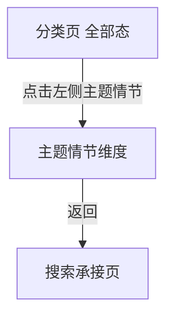

# 分析：红果 — 分类页主题情节维度

## 分析信息

| 项目 | 内容 |
|------|------|
| 分析日期 | 2026-07-24 |
| 对应采集 | [plan.md](./plan.md) |
| 采集产物 | [assets/](./assets/) |
| 分析维度 | 主题情节标签分布、全部态内容策略、返回链路 |

## 交互流程

### 页面跳转关系

### 流程步骤分析

#### 步骤 1：进入分类页“主题情节”维度

- **触发**：从搜索页进入分类中心后，保持顶部“全部”并点击左侧“主题情节”。
- **响应**：左侧“主题情节”高亮，右侧继续保留完整纵向内容区，主题情节分组位于中部，并提供“展开”入口；可见标签同时覆盖女性关系情感题材、男性爽感题材与通用类型标签。
- **转场**：同页内锚点切换，无新页面跳转。
- **截图引用**：`assets/2026-07-24-step-01-theme-plot.png`

#### 步骤 2：返回搜索页

- **触发**：从主题情节浏览态点击返回。
- **响应**：系统直接回到搜索承接页，而不是回到分类中心默认态。
- **转场**：整页返回搜索页。
- **截图引用**：`assets/2026-07-24-step-02-back-context.png`

## UI 布局详解

### 页面：分类页主题情节维度

| 区域 | 组件 | 位置 | 规格（估算） |
|------|------|------|-------------|
| 顶部 | 全部 / 男生 / 女生 Tab | 顶部固定 | “全部”高亮，字号约 20-24sp |
| 左侧 | 时代背景 / 主题情节 / 角色设定 | 左侧竖列 | “主题情节”高亮为橙色文案 |
| 右侧上部 | 时代背景分组 | 主内容区顶部 | 作为前序分组继续保留 |
| 右侧中部 | 主题情节标签矩阵 + 展开入口 | 主内容区中段 | 三列胶囊标签，当前可见约 30 个标签 |
| 右侧下部 | 角色设定分组 | 主内容区底部 | 同页继续衔接下一分组 |

#### 组件细节

##### 主题情节标签组

- **标签数量**：当前截图中主题情节首屏可见约 30 个标签，标题右侧带“展开”入口
- **标签内容**：打脸虐渣、逆袭、马甲、女性成长、都市日常、重生、穿越、系统、亲情、家庭伦理、奇幻脑洞、奇幻爱情、闪婚、暗恋成真、古风言情、穿书、破镜重圆、战神归来、追妻、现代言情、豪门恩怨、异能、虐恋、传承觉醒、玄幻仙侠、古风权谋、年代爱情、赘婿逆袭、娱乐圈、剧情
- **排列方式**：三列网格，每行约 3 个标签
- **视觉样式**：浅灰底圆角胶囊，深灰文案，无图标
- **层级位置**：位于分类页右侧内容区中部，左侧导航负责锚定对应维度

## 业务逻辑分析

### 加载策略

| 场景 | 加载方式 | 耗时（估算） | 说明 |
|------|---------|-------------|------|
| 切换到主题情节 | 同页锚点切换 | ~2s | 不离开分类页框架，也不切出独立页面 |
| 浏览主题情节后返回 | 整页返回 | ~2s | 直接退出分类承接层 |

### 内容策略

- “全部”态下的主题情节维度明显承担全量题材汇总作用，把男频爽感母题与女频关系情感母题混合陈列，例如“逆袭 / 系统 / 战神归来 / 赘婿逆袭”与“女性成长 / 闪婚 / 暗恋成真 / 豪门恩怨 / 破镜重圆”并列出现。 `[推断]`
- 同时保留“家庭伦理 / 娱乐圈 / 剧情 / 奇幻脑洞 / 古风权谋 / 年代爱情”等更中性或跨人群的类型词，说明平台试图在“全部”池中以最大覆盖率组织搜索入口。 `[推断]`
- 标题右侧的“展开”入口说明该维度的主题标签数量可能超过当前默认折叠视图，需要进一步展开才能完全浏览。 `[推断]`

### 状态管理

| 状态场景 | UI 表现 | 用户可操作项 | 截图 |
|---------|--------|-------------|------|
| 主题情节浏览态 | 顶部“全部”与左侧“主题情节”高亮，右侧展示混合题材标签矩阵 | 点击标签、切换时代背景/角色设定、切换男生/女生、点击“展开” | `assets/2026-07-24-step-01-theme-plot.png` |
| 返回恢复态 | 搜索页上下文保留 | 继续搜索、继续点分类/排行入口 | `assets/2026-07-24-step-02-back-context.png` |

## 关键发现

1. **主题情节是分类页内部的同页锚点分组**：点击左侧导航后并不会进入新页面。  
2. **“全部”态主题池是混合内容池**：同一分组内同时出现男频爽文、女频情感与通用类型标签。  
3. **标题右侧存在“展开”入口**：说明该维度可能采用默认折叠 + 展开查看更多的组织方式。  
4. **返回直接退出到搜索页**：说明该维度只属于分类承接层内部状态，而非独立详情页。  

## 发现的交互入口

| 发现路径 | 说明 | 页面快照 |
|---------|------|---------|
| `homepage-feed/search/classification/theme-plot/slap-face-tag/` | 分类页主题情节中的“打脸虐渣”标签 | `assets/2026-07-24-step-01-theme-plot.png` |
| `homepage-feed/search/classification/theme-plot/female-growth-tag/` | 分类页主题情节中的“女性成长”标签 | `assets/2026-07-24-step-01-theme-plot.png` |
| `homepage-feed/search/classification/theme-plot/system-tag/` | 分类页主题情节中的“系统”标签 | `assets/2026-07-24-step-01-theme-plot.png` |
