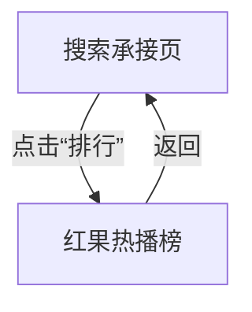

# 分析：红果 — 搜索页排行入口

## 分析信息

| 项目 | 内容 |
|------|------|
| 分析日期 | 2026-07-24 |
| 对应采集 | [plan.md](./plan.md) |
| 采集产物 | [assets/](./assets/) |
| 分析维度 | 排行入口承接方式、榜单页信息架构、返回链路 |

## 交互流程

### 页面跳转关系

### 流程步骤分析

#### 步骤 1：从首页进入搜索承接页

- **触发**：首页点击右上搜索图标。
- **响应**：进入搜索承接页，顶部为搜索框与快捷入口，“排行”入口可直接点击。
- **转场**：整页切换到搜索承接页。
- **截图引用**：`assets/2026-07-24-step-01-search-entry.png`

#### 步骤 2：点击“排行”快捷入口

- **触发**：点击搜索页快捷入口中的“排行”。
- **响应**：进入独立榜单页《红果热播榜》，顶部展示榜单标题与更新时间；中部是一级分类标签（全部 / 真人剧 / 漫剧 / AI剧 / 演员）和二级榜单标签（推荐榜 / 热播榜 / 臻果榜 / 预约榜 / 分类），下方为排名列表。
- **转场**：整页跳转到榜单页。
- **截图引用**：`assets/2026-07-24-step-02-ranking-entry.png`

#### 步骤 3：返回搜索页

- **触发**：在榜单页点击返回。
- **响应**：重新回到搜索承接页，搜索历史、猜你想搜与热搜榜模块仍然保留，说明返回后会恢复原搜索上下文。
- **转场**：整页返回到搜索页。
- **截图引用**：`assets/2026-07-24-step-03-back-search.png`

## UI 布局详解

### 页面：搜索承接页（排行入口前置状态）

| 区域 | 组件 | 位置 | 规格（估算） |
|------|------|------|-------------|
| 顶部 | 返回、搜索框、搜索按钮 | 顶部固定 | 搜索框高约 40-44dp |
| 快捷入口 | 识剧 / 排行 / 上新 / 演员 / 分类 | 顶部下方横排 | 单项约 72-96dp 宽 |
| 中部 | 搜索历史、猜你想搜 | 列表 / 卡片区 | 标题约 18-20sp |
| 下部 | 热搜榜分栏 | 卡片区 | 多榜单并列模块 |

### 页面：红果热播榜

| 区域 | 组件 | 位置 | 规格（估算） |
|------|------|------|-------------|
| 顶部 | 返回、标题、更新时间、分享入口 | 顶部固定 | 标题约 28-32sp，更新时间约 14-16sp |
| 一级标签 | 全部 / 真人剧 / 漫剧 / AI剧 / 演员 | 标题下方横排 | 标签字约 16-18sp |
| 二级标签 | 推荐榜 / 热播榜 / 臻果榜 / 预约榜 / 分类 | 一级标签下方横排 | 胶囊标签高约 32-36dp |
| 榜单列表 | 排名号、海报、剧名、标签、互动指标、热度值 | 主内容区 | 单条目高约 116-148dp |

#### 组件细节

##### 榜单条目

- **尺寸**：单条高度约 128dp
- **间距**：条目间距约 12-16dp
- **字号**：剧名约 18-20sp，辅助信息约 14-16sp
- **颜色**：热度值使用橙色强调
- **圆角**：海报圆角约 8-10dp
- **图标**：左侧排名角标，右侧火焰图标对应热度值

### 页面：返回后的搜索页

| 区域 | 组件 | 位置 | 规格（估算） |
|------|------|------|-------------|
| 顶部 | 搜索框与快捷入口 | 顶部固定 | 状态保留 |
| 中部 | 搜索历史与猜你想搜 | 中部 | 原内容保留 |
| 下部 | 短剧热搜榜 / 漫剧热搜榜 / 预约榜 / 热点话题榜 | 下部卡片区 | 横向并列榜单模块 |

## 业务逻辑分析

### 加载策略

| 场景 | 加载方式 | 耗时（估算） | 说明 |
|------|---------|-------------|------|
| 搜索页进入榜单 | 整页跳转 | ~2s | 从快捷入口直接进入独立榜单页 |
| 榜单返回搜索页 | 整页返回 | ~2s | 返回后保留搜索页上下文 |

### 内容策略

- 榜单页把搜索能力延伸为“热度分发系统”，不仅服务检索，还承担强运营导购角色。 `[推断]`
- 一级标签按内容类型切分，二级标签按榜单逻辑切分，形成“双层筛选”的榜单信息架构。 `[推断]`
- 条目同时展示收藏、点赞、评分/新剧标签与热度值，强调“热门 + 口碑 + 互动”的综合分发标准。 `[推断]`

### 状态管理

| 状态场景 | UI 表现 | 用户可操作项 | 截图 |
|---------|--------|-------------|------|
| 榜单浏览态 | 独立榜单页，分类与榜单标签可切换 | 切换分类、浏览榜单、返回搜索 | `assets/2026-07-24-step-02-ranking-entry.png` |
| 返回恢复态 | 搜索历史与热搜榜继续保留 | 继续搜索、继续点其他快捷入口 | `assets/2026-07-24-step-03-back-search.png` |

## 关键发现

1. **“排行”是独立榜单页入口**：不是在搜索页内局部展开，而是跳转到独立的《红果热播榜》页面。
2. **榜单采用双层标签结构**：先按内容类型分组，再按榜单逻辑分榜，层级非常清晰。
3. **榜单条目强调综合热度**：热度值、收藏、点赞、新剧标签与评分等信息同时暴露。 `[推断]`
4. **返回后搜索页状态保留**：说明排行页是从搜索承接页临时展开的下钻层，而非重置式导航。

## 发现的交互入口

| 发现路径 | 说明 | 页面快照 |
|---------|------|---------|
| `homepage-feed/search/ranking/recommend-list/` | 榜单页中的“推荐榜”子榜单标签 | `assets/2026-07-24-step-02-ranking-entry.png` |
| `homepage-feed/search/ranking/booking-list/` | 榜单页中的“预约榜”子榜单标签 | `assets/2026-07-24-step-02-ranking-entry.png` |
| `homepage-feed/search/ranking/category-filter/` | 榜单页中的“分类”筛选入口 | `assets/2026-07-24-step-02-ranking-entry.png` |
