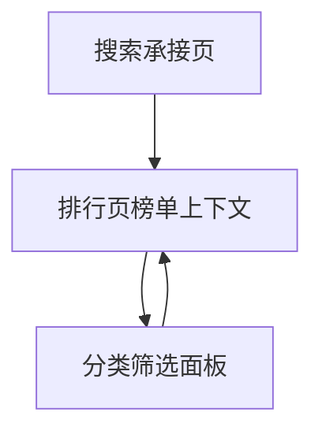

# 分析记录：红果 — 排行分类筛选入口

## 分析信息

| 项目 | 内容 |
|------|------|
| 分析日期 | 2026-07-24 |
| 目标竞品 | 红果 |
| 功能路径 | homepage-feed/search/ranking/category-filter |
| 分析平台 | mobile |
| 采集来源 | `homepage-feed/search/ranking/category-filter/.captures/2026-07-24-category-filter` |
| 相关文档 | `homepage-feed/search/ranking/ranking.md` |

## 交互流程

1. 用户从搜索页进入排行承接页，停留在默认的《红果热播榜》状态。
2. 用户点击二级标签右侧的“分类”入口。
3. 页面弹出标题为“筛选”的覆盖式筛选面板，而不是切换成另一张榜单列表。
4. 用户可在“综合”“时代背景”“主题情节”等分组中浏览并选择筛选项。
5. 用户执行返回后，筛选面板关闭，页面恢复到排行页原有榜单上下文。

## 页面跳转关系

## UI 布局详解

### 1. 顶层容器

| 区域 | 观察 |
|------|------|
| 顶栏 | 左上为关闭图标，中间标题为“筛选”，无额外说明文案 |
| 面板形态 | 视觉上为覆盖排行页的全屏白色筛选面板，顶部仍能看到榜单背景渐变 |
| 返回方式 | 关闭按钮与系统返回都可结束当前筛选态 |

### 2. 综合分组

| 组件 | 内容 | 判断 |
|------|------|------|
| 分组标题 | 综合 | 说明先做榜单范围级过滤 |
| 默认高亮 | 总榜 | 当前样本默认停留在总榜筛选范围 |
| 可选项 | 总榜 / 女频 / 男频 | 筛选能力覆盖整体榜单与频道化榜单池 |

### 3. 时代背景分组

| 可见标签 |
|----------|
| 乡村 / 职场 / 民国 / 校园 / 历史古代 / 古装 |

该分组用于按题材时空背景继续细分排行结果。

### 4. 主题情节分组

| 可见标签 |
|----------|
| 打脸虐渣 / 逆袭 / 马甲 / 女性成长 / 都市日常 / 重生 / 穿越 / 系统 / 亲情 / 家庭伦理 / 奇幻脑洞 / 奇幻爱情 / 闪婚 / 暗恋成真 / 古风爱情 / 穿书 / 破镜重圆 / 战神归来 / 追妻 / 现代言情 / 豪门恩怨 / 异能 / 虐恋 / 传承觉醒 / 玄幻仙侠 / 古风权谋 / 年代爱情 |

该分组承接更细的叙事主题过滤，标签数量明显多于榜单页默认可见内容类型标签。

## 业务逻辑分析

### 入口定位

“分类”不是排行页中的另一张榜单，而是榜单内部的筛选工具入口。其职责是把原本较粗的榜单浏览，进一步缩窄为特定频道、时代背景与主题情节下的排行结果。

### 筛选维度设计

当前样本表明该筛选入口至少分三层语义：

1. **综合维度**：先在总榜、女频、男频之间切换结果池。
2. **时代背景维度**：再按乡村、职场、民国、古装等背景切分。
3. **主题情节维度**：最后按打脸虐渣、系统、重生、闪婚等叙事主题继续细分。 

这说明排行页的“分类”筛选并不是单一标签过滤，而是把排行榜内容映射到与分类中心相近的题材标签体系中。`[推断]`

### 返回与层级关系

关闭筛选面板后，页面回到《红果热播榜》列表页，而不是搜索承接页。这表明“分类”与“推荐榜 / 热播榜 / 臻果榜 / 预约榜”属于同一排行承接层，只是其中“分类”以筛选面板形式存在。

### 待验证点

当前首屏样本未显示显式“确定”“重置”按钮，因此无法仅凭该样本确认筛选项是点击即生效，还是面板底部另有操作区；后续需针对具体筛选项点击后的结果页继续验证。

## 关键发现

- **category-filter 是排行页内部筛选面板，不是独立榜单页面。**
- **筛选面板复用了分类中心式标签体系**：同时包含时代背景与主题情节两类标签。
- **综合维度新增“总榜 / 女频 / 男频”频道切片**：说明排行页筛选不仅按题材，也按频道池切分。 `[推断]`
- **返回仅关闭面板并恢复排行页上下文**：不会直接退出到搜索页。

## 发现的交互入口

| 路径 | 入口位置 | 说明 |
|------|---------|------|
| homepage-feed/search/ranking/category-filter/female-channel/ | 综合 → 女频 | 排行分类筛选中的女频结果池切换 |
| homepage-feed/search/ranking/category-filter/workplace-tag/ | 时代背景 → 职场 | 排行分类筛选中的职场背景标签 |
| homepage-feed/search/ranking/category-filter/slap-face-tag/ | 主题情节 → 打脸虐渣 | 排行分类筛选中的打脸虐渣主题标签 |
