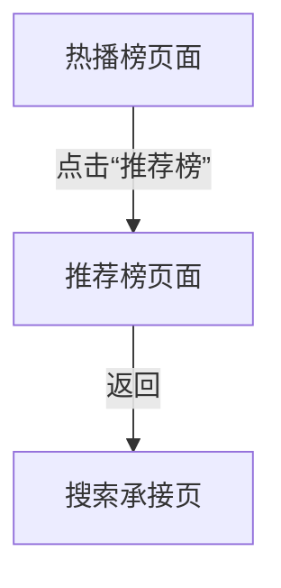

# 分析：红果 — 排行页推荐榜子榜单

## 分析信息

| 项目 | 内容 |
|------|------|
| 分析日期 | 2026-07-24 |
| 对应采集 | [plan.md](./plan.md) |
| 采集产物 | [assets/](./assets/) |
| 分析维度 | 推荐榜切换方式、推荐榜条目结构、返回链路 |

## 交互流程

### 页面跳转关系

### 流程步骤分析

#### 步骤 1：进入排行页

- **触发**：从首页进入搜索页后点击“排行”。
- **响应**：进入《红果热播榜》，默认选中“热播榜”子榜单。
- **转场**：整页跳转到榜单页。
- **截图引用**：`assets/2026-07-24-step-01-ranking-page.png`

#### 步骤 2：切换到“推荐榜”子榜单

- **触发**：点击榜单页中的“推荐榜”。
- **响应**：页面切换为《红果推荐榜》，顶部说明文案变为“基于红果观看/互动以及个人兴趣排序”，列表右侧主指标由“热度”改为“推荐”，条目辅助指标由“收藏+点赞”转为“热度+点赞”。
- **转场**：同页内子榜单切换。
- **截图引用**：`assets/2026-07-24-step-02-recommend-list.png`

#### 步骤 3：返回上文

- **触发**：从推荐榜页面点击返回。
- **响应**：直接回到搜索承接页，而不是停留在热播榜页面。
- **转场**：整页返回到搜索页。
- **截图引用**：`assets/2026-07-24-step-03-back-ranking-context.png`

## UI 布局详解

### 页面：热播榜入口态

| 区域 | 组件 | 位置 | 规格（估算） |
|------|------|------|-------------|
| 顶部 | 返回、榜单标题、更新时间 | 顶部固定 | 标题约 28-32sp |
| 二级榜单标签 | 推荐榜 / 热播榜 / 臻果榜 / 预约榜 / 分类 | 顶部下方 | 胶囊标签高约 32-36dp |
| 列表区 | 热播榜条目 | 主内容区 | 单条高约 116-148dp |

### 页面：推荐榜页面

| 区域 | 组件 | 位置 | 规格（估算） |
|------|------|------|-------------|
| 顶部 | 《红果推荐榜》标题与更新时间说明 | 顶部固定 | 标题约 28-32sp，说明文案约 14-16sp |
| 一级标签 | 全部 / 真人剧 / 漫剧 / AI剧 / 演员 | 标题下方 | 字号约 16-18sp |
| 二级标签 | 推荐榜 / 热播榜 / 臻果榜 / 预约榜 / 分类 | 一级标签下方 | 胶囊标签高约 32-36dp |
| 列表区 | 排名号、海报、剧名、题材、推荐值、热度、点赞 | 主内容区 | 单条高约 116-148dp |

#### 组件细节

##### 推荐榜条目指标区

- **尺寸**：单条条目指标区高度约 40-56dp
- **间距**：主标题与指标区上下间距约 8-12dp
- **字号**：推荐值约 18sp，热度/点赞约 14-16sp
- **颜色**：右侧“推荐”值为橙色，热度与点赞为浅橙色胶囊底
- **圆角**：指标胶囊圆角约 8-10dp
- **图标**：右侧火焰 icon 对应推荐值

### 页面：返回后的搜索页

| 区域 | 组件 | 位置 | 规格（估算） |
|------|------|------|-------------|
| 顶部 | 搜索框与快捷入口 | 顶部固定 | 状态保留 |
| 中部 | 搜索历史与猜你想搜 | 中部 | 状态保留 |
| 下部 | 热搜榜模块 | 下部 | 模块仍在 |

## 业务逻辑分析

### 加载策略

| 场景 | 加载方式 | 耗时（估算） | 说明 |
|------|---------|-------------|------|
| 热播榜切换推荐榜 | 同页切换 | ~2s | 不离开榜单框架，仅切换子榜单内容 |
| 推荐榜返回搜索 | 整页返回 | ~2s | 直接退出整个排行页上下文 |

### 内容策略

- 推荐榜相较热播榜更强调“个人兴趣推荐”而不是全站综合热度排序。 `[推断]`
- 推荐榜条目右侧主指标从“热度”变为“推荐”，同时保留热度和点赞作为辅助指标，说明其排序逻辑同时结合个性化与公共反馈信号。 `[推断]`
- 返回直接回搜索页，表明平台将各个子榜单视为同一个排行承接层的内部状态，而不是可逐层回退的独立页面。 `[推断]`

### 状态管理

| 状态场景 | UI 表现 | 用户可操作项 | 截图 |
|---------|--------|-------------|------|
| 推荐榜浏览态 | 《红果推荐榜》+ 推荐值指标 | 浏览榜单、切换其他子榜单、返回 | `assets/2026-07-24-step-02-recommend-list.png` |
| 返回恢复态 | 搜索页上下文保留 | 继续搜索、重新进入排行体系 | `assets/2026-07-24-step-03-back-ranking-context.png` |

## 关键发现

1. **推荐榜与热播榜共享同一榜单框架**：切换时不离开排行榜单页，只替换标题、说明与列表内容。
2. **推荐榜主指标是“推荐”而非“热度”**：明显更偏个性化排序语义。 `[推断]`
3. **推荐榜仍保留热度与点赞作为辅助信号**：说明个性化推荐和公共反馈会被同时展示。 `[推断]`
4. **返回直接退出到搜索页**：推荐榜不单独保留回到热播榜的中间层。

## 发现的交互入口

| 发现路径 | 说明 | 页面快照 |
|---------|------|---------|
| `homepage-feed/search/ranking/recommend-list/all-tab/` | 推荐榜顶部“全部”内容类型标签 | `assets/2026-07-24-step-02-recommend-list.png` |
| `homepage-feed/search/ranking/recommend-list/live-action-tab/` | 推荐榜顶部“真人剧”内容类型标签 | `assets/2026-07-24-step-02-recommend-list.png` |
| `homepage-feed/search/ranking/recommend-list/ai-tab/` | 推荐榜顶部“AI剧”内容类型标签 | `assets/2026-07-24-step-02-recommend-list.png` |
