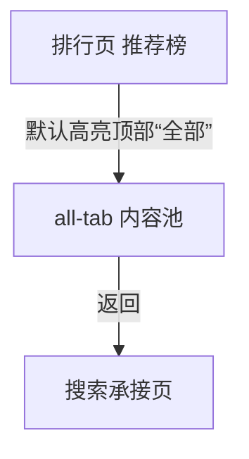

# 分析：红果 — 推荐榜全部内容类型标签

## 分析信息

| 项目 | 内容 |
|------|------|
| 分析日期 | 2026-07-24 |
| 对应采集 | [plan.md](./plan.md) |
| 采集产物 | [assets/](./assets/) |
| 分析维度 | 默认内容池结构、混合内容策略、返回链路 |

## 交互流程

### 页面跳转关系

### 流程步骤分析

#### 步骤 1：进入推荐榜默认“全部”内容类型标签

- **触发**：从搜索页进入排行页后点击“推荐榜”，保持顶部默认“全部”内容类型。
- **响应**：顶部“全部”与二级“推荐榜”同时高亮，标题保持《红果推荐榜》，列表按统一推荐值排序，但条目内容混合了高概念题材与真人剧信息。
- **转场**：同页内子榜单切换后停留在默认内容类型态，无新页面跳转。
- **截图引用**：`assets/2026-07-24-step-01-all-tab.png`

#### 步骤 2：返回搜索页

- **触发**：从推荐榜默认“全部”态点击返回。
- **响应**：系统直接回到搜索承接页，而不是回到排行页或推荐榜其他状态。
- **转场**：整页返回搜索页。
- **截图引用**：`assets/2026-07-24-step-02-back-context.png`

## UI 布局详解

### 页面：推荐榜默认全部态

| 区域 | 组件 | 位置 | 规格（估算） |
|------|------|------|-------------|
| 顶部标题区 | 《红果推荐榜》与更新时间说明 | 顶部固定 | 标题约 28-32sp，说明文案约 14-16sp |
| 一级类型标签 | 全部 / 真人剧 / 漫剧 / AI剧 / 演员 | 标题下方 | “全部”高亮，字号约 16-18sp |
| 二级榜单标签 | 推荐榜 / 热播榜 / 臻果榜 / 预约榜 / 分类 | 一级标签下方 | “推荐榜”高亮，胶囊高约 32-36dp |
| 列表区 | 排名号、海报、剧名、题材/演员、推荐值、热度、点赞 | 主内容区 | 单条高约 116-148dp |

#### 组件细节

##### 默认全部态条目结构

- **可见条目**：首屏可见前 6 名
- **条目示例**：全族托举农门状元郎、母亲是巨龙我咋是山海异兽呢？、觉醒十殿阎罗吾即是红伞鬼仙、赠物得长生，老头修仙记！、香蜜沉沉烬如霜（上）、老祖归来，全族成帝
- **字段构成**：排名号、封面、剧名、题材/演员、推荐值、热度、点赞/互动
- **内容差异**：部分条目只有题材标签，部分条目会出现演员名，说明内容类型并未被限制在单一池中
- **视觉样式**：推荐值为右侧橙色主指标，热度与点赞为浅橙胶囊指标

## 业务逻辑分析

### 加载策略

| 场景 | 加载方式 | 耗时（估算） | 说明 |
|------|---------|-------------|------|
| 进入推荐榜默认全部态 | 同页切换 + 默认类型态 | ~2s | 进入推荐榜后自动处于“全部”内容池 |
| 默认全部态返回搜索 | 整页返回 | ~2s | 直接退出整个排行承接层 |

### 内容策略

- all-tab 是推荐榜的默认总览池，不再进一步限定真人剧或 AI 剧等单一内容形态，而是直接承接平台最广泛的推荐分发结果。 `[推断]`
- 首屏同时出现玄幻、脑洞、奇幻、爱情等题材，也出现带演员信息的条目，说明平台会把不同内容形态先汇总到默认池，再引导用户通过顶部标签继续缩窄。 `[推断]`
- 二级仍保持“推荐榜”排序语义，因此 all-tab 的核心不是题材分类，而是“推荐结果的最大覆盖面展示”。 `[推断]`

### 状态管理

| 状态场景 | UI 表现 | 用户可操作项 | 截图 |
|---------|--------|-------------|------|
| 默认全部态浏览 | 顶部“全部”与二级“推荐榜”高亮，列表展示混合内容推荐结果 | 切换真人剧/AI剧等类型、切换热播榜/臻果榜/预约榜/分类、返回 | `assets/2026-07-24-step-01-all-tab.png` |
| 返回恢复态 | 搜索页上下文保留 | 继续搜索、重新进入排行体系 | `assets/2026-07-24-step-02-back-context.png` |

## 关键发现

1. **all-tab 是推荐榜默认内容类型状态**：进入推荐榜后无需额外点击即可处于“全部”态。  
2. **默认池是混合内容总览**：不同题材、不同内容形态会在同一推荐列表中并列出现。 `[推断]`  
3. **内容类型筛选发生在推荐排序之上**：先由“推荐榜”定义排序逻辑，再由顶部“真人剧 / AI剧 / 演员”等标签继续收窄。  
4. **返回直接退出到搜索页**：all-tab 不是独立页面，只是排行承接层中的默认内容池状态。  

## 发现的交互入口

本路径未发现新的独立交互路径；顶部内容类型标签与二级榜单标签已在父级路径中登记。
