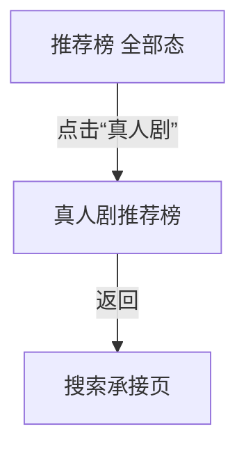

# 分析：红果 — 推荐榜真人剧 Tab

## 分析信息

| 项目 | 内容 |
|------|------|
| 分析日期 | 2026-07-24 |
| 对应采集 | [plan.md](./plan.md) |
| 采集产物 | [assets/](./assets/) |
| 分析维度 | 真人剧 Tab 切换方式、真人剧推荐榜条目结构、返回链路 |

## 交互流程

### 页面跳转关系

### 流程步骤分析

#### 步骤 1：进入推荐榜页面

- **触发**：从首页进入搜索页后点击“排行”，再切换到“推荐榜”。
- **响应**：进入《红果推荐榜》，默认选中“全部”内容类型。
- **转场**：整页进入排行承接页后在同页内切换子榜单。
- **截图引用**：`assets/2026-07-24-step-01-recommend-list.png`

#### 步骤 2：切换到“真人剧”Tab

- **触发**：点击顶部“真人剧”内容类型标签。
- **响应**：页面切换为《真人剧推荐榜》，顶部一级标签高亮变为“真人剧”，榜单右侧仍以“推荐”为主指标，但内容列表切换为真人演员出演的短剧，题材集中在爱情、成长、家庭与都市关系等更贴近真人剧消费场景的内容。
- **转场**：同页内内容类型切换。
- **截图引用**：`assets/2026-07-24-step-02-live-action-tab.png`

#### 步骤 3：返回上文

- **触发**：从真人剧推荐榜页面点击返回。
- **响应**：直接回到搜索承接页，而不是停留在推荐榜页面。
- **转场**：整页返回到搜索页。
- **截图引用**：`assets/2026-07-24-step-03-back-context.png`

## UI 布局详解

### 页面：推荐榜默认全部态

| 区域 | 组件 | 位置 | 规格（估算） |
|------|------|------|-------------|
| 顶部 | 推荐榜标题与说明 | 顶部固定 | 标题约 28-32sp |
| 一级标签 | 全部 / 真人剧 / 漫剧 / AI剧 / 演员 | 标题下方 | 字号约 16-18sp |
| 二级标签 | 推荐榜 / 热播榜 / 臻果榜 / 预约榜 / 分类 | 一级标签下方 | 胶囊标签高约 32-36dp |
| 列表区 | 推荐榜条目 | 主内容区 | 单条高约 116-148dp |

### 页面：真人剧推荐榜

| 区域 | 组件 | 位置 | 规格（估算） |
|------|------|------|-------------|
| 顶部 | 《真人剧推荐榜》标题与说明 | 顶部固定 | 标题约 28-32sp，说明文案约 14-16sp |
| 一级标签 | 全部 / 真人剧 / 漫剧 / AI剧 / 演员 | 标题下方 | “真人剧”高亮 |
| 二级标签 | 推荐榜 / 热播榜 / 新剧榜 / 热搜榜 / 分类 | 一级标签下方 | 胶囊标签高约 32-36dp |
| 列表区 | 排名号、海报、剧名、演员、推荐值、热度、点赞 | 主内容区 | 单条高约 116-148dp |

#### 组件细节

##### 真人剧推荐榜条目指标区

- **尺寸**：单条条目指标区高度约 40-56dp
- **间距**：主标题与指标区上下间距约 8-12dp
- **字号**：推荐值约 18sp，热度/点赞约 14-16sp
- **颜色**：右侧“推荐”值为橙色，热度与点赞为浅橙色胶囊底
- **圆角**：指标胶囊圆角约 8-10dp
- **图标**：右侧火焰 icon 对应推荐值

### 页面：返回后的搜索页

| 区域 | 组件 | 位置 | 规格（估算） |
|------|------|------|-------------|
| 顶部 | 搜索框与快捷入口 | 顶部固定 | 状态保留 |
| 中部 | 搜索历史与猜你想搜 | 中部 | 状态保留 |
| 下部 | 热搜榜模块 | 下部 | 模块仍在 |

## 业务逻辑分析

### 加载策略

| 场景 | 加载方式 | 耗时（估算） | 说明 |
|------|---------|-------------|------|
| 推荐榜切换真人剧 Tab | 同页切换 | ~2s | 不离开推荐榜框架，仅切换内容类型 |
| 真人剧推荐榜返回搜索 | 整页返回 | ~2s | 直接退出整个排行页上下文 |

### 内容策略

- 真人剧 Tab 在保留推荐榜排序逻辑的同时，把内容池限定为真人演员出演的短剧，因此更强调都市情感、家庭关系、成长逆袭等适合真人演绎的题材。 `[推断]`
- 条目中更频繁出现演员名、评分标签与“新剧”标识，说明真人剧池更重视演员识别度与现实感题材消费。 `[推断]`
- 返回直接回搜索页，说明内容类型切换与子榜单切换一样，都只是排行承接层内部状态。 `[推断]`

### 状态管理

| 状态场景 | UI 表现 | 用户可操作项 | 截图 |
|---------|--------|-------------|------|
| 真人剧推荐榜浏览态 | 《真人剧推荐榜》+ 真人剧内容池 + 推荐值指标 | 浏览榜单、切换其他类型/榜单、返回 | `assets/2026-07-24-step-02-live-action-tab.png` |
| 返回恢复态 | 搜索页上下文保留 | 继续搜索、重新进入排行体系 | `assets/2026-07-24-step-03-back-context.png` |

## 关键发现

1. **真人剧 Tab 仍属于推荐榜框架内切换**：只是把推荐榜内容池限定为真人演员短剧。
2. **榜单标题直接切换为“真人剧推荐榜”**：说明内容类型会参与榜单命名与运营表达。 `[推断]`
3. **真人剧内容更强调演员与情感/成长题材**：条目更集中于爱情、家庭、成长等真人剧高接受度题材。 `[推断]`
4. **返回直接退出到搜索页**：真人剧推荐榜不单独保留回到推荐榜全部态的中间层。

## 发现的交互入口

| 发现路径 | 说明 | 页面快照 |
|---------|------|---------|
| `homepage-feed/search/ranking/recommend-list/live-action-tab/hot-list/` | 真人剧内容池下的热播榜切换 | `assets/2026-07-24-step-02-live-action-tab.png` |
| `homepage-feed/search/ranking/recommend-list/live-action-tab/new-release-list/` | 真人剧内容池下的新剧榜切换 | `assets/2026-07-24-step-02-live-action-tab.png` |
| `homepage-feed/search/ranking/recommend-list/live-action-tab/hot-search-list/` | 真人剧内容池下的热搜榜切换 | `assets/2026-07-24-step-02-live-action-tab.png` |
