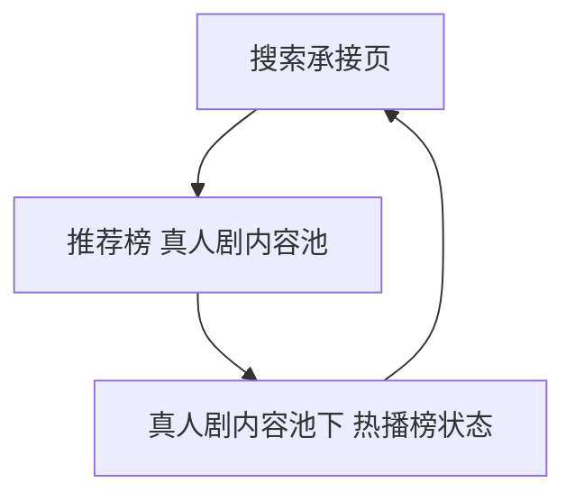

# 分析记录：红果 — 真人剧内容池下的热播榜切换

## 分析信息

| 项目 | 内容 |
|------|------|
| 分析日期 | 2026-07-24 |
| 目标竞品 | 红果 |
| 功能路径 | homepage-feed/search/ranking/recommend-list/live-action-tab/hot-list |
| 分析平台 | mobile |
| 采集来源 | `homepage-feed/search/ranking/recommend-list/live-action-tab/hot-list/.captures/2026-07-24-hot-list` |
| 相关文档 | `homepage-feed/search/ranking/recommend-list/live-action-tab/live-action-tab.md` |

## 交互流程

1. 用户先进入推荐榜的真人剧内容池。
2. 在真人剧内容池顶部二级标签中点击“热播榜”。
3. 页面标题切换为《红果热播榜》，列表主指标统一变为热度值。
4. 用户执行返回后，页面直接退出排行承接层并回到搜索页。

## 页面跳转关系

## UI 布局详解

### 1. 顶部结构

| 项目 | 观察 |
|------|------|
| 一级标签 | 全部 / 真人剧 / 漫剧 / AI剧 / 演员 |
| 一级状态 | “真人剧”仍保留在顶部，说明内容池上下文未丢失 |
| 二级标签 | 推荐榜 / 热播榜 / 臻果榜 / 预约榜 / 新剧榜 / 分类 |
| 二级状态 | “热播榜”高亮，取代原先的“推荐榜”状态 |

### 2. 标题与排序语义

| 项目 | 观察 |
|------|------|
| 页面标题 | 《红果热播榜》 |
| 说明文案 | 基于红果内观看/互动等综合热度排序 |
| 核心指标 | 列表右侧统一展示“xx万热度” |

### 3. 列表内容

| 维度 | 观察 |
|------|------|
| 题材覆盖 | 萌宝 / 家庭 / 玄幻 / 爱情 / 剧情 |
| 条目形态 | 排名号 + 海报 + 剧名 + 题材/演员 + 热度 + 收藏/点赞等辅助指标 |
| 榜单性质 | 更偏平台整体热度结果，而非个性化推荐结果 |

## 业务逻辑分析

### 状态切换逻辑

该路径不是独立页面，而是真人剧内容池中的二级榜单切换状态。一级“真人剧”负责限定内容形态，二级“热播榜”负责切换排序逻辑，因此两层标签是“内容池 + 排序方式”的叠加关系。

### 运营语义

从“推荐榜”切到“热播榜”后，页面立刻从个性化推荐语义切换为综合热度语义，说明平台允许用户在同一内容池中快速比较“系统推荐什么”和“平台整体最热什么”。这是一种降低探索成本的并排切换设计。 `[推断]`

### 返回关系

从该状态返回后，页面直接回到搜索承接页，而不是回到真人剧推荐榜，说明这个榜单状态没有单独的回退层级，仍归属整个排行承接层内部状态。

## 关键发现

- **hot-list 是真人剧内容池中的二级榜单切换状态，不是新页面。**
- **一级与二级标签同时生效**：一级限定真人剧内容形态，二级切换为热度排序。 `[推断]`
- **主指标从推荐值切为热度值**：用户能快速理解当前排序依据已变化。
- **返回直接退出排行承接层**：该状态没有单独回退层级。

## 发现的交互入口

| 路径 | 入口位置 | 说明 |
|------|---------|------|
| homepage-feed/search/ranking/recommend-list/ai-tab/hot-list/ | AI剧内容池中的“热播榜” | 与当前 hot-list 属于同构二级榜单切换，可复用本 case |
