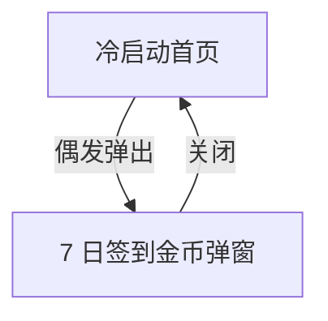

# 分析：红果 — 冷启动签到弹窗

## 分析信息

| 项目 | 内容 |
|------|------|
| 分析日期 | 2026-07-24 |
| 对应采集 | [plan.md](./plan.md) |
| 采集产物 | [assets/](./assets/) |
| 分析维度 | 冷启动奖励弹窗结构、关闭路径、与首页的叠加关系 |

## 交互流程

### 页面跳转关系

### 流程步骤分析

#### 步骤 1：冷启动命中签到弹窗

- **触发**：冷启动红果。
- **响应**：首页内容上方叠加橙色渐变奖励浮层，标题为“7天签到必得6万金币”。
- **转场**：叠加式弹窗，无页面切换。
- **截图引用**：`assets/2026-07-24-step-01-signin-popup.png`

#### 步骤 2：关闭弹窗后回到首页

- **触发**：返回或关闭浮层。
- **响应**：恢复到首页 Feed，菜单、搜索和互动列重新可操作。
- **转场**：弹窗消失，无二级页承接。
- **截图引用**：`assets/2026-07-24-step-02-home-after-popup.png`

## UI 布局详解

### 页面：签到弹窗

| 区域 | 组件 | 位置 | 规格（估算） |
|------|------|------|-------------|
| 顶部 | 标题与活动日期 | 卡片顶部 | 标题约 24-28sp，白字 |
| 中部 | 7 日奖励宫格 | 卡片中部 | 2 行多列卡片，单格约 88-104dp |
| 底部 | 立即领取按钮 | 卡片底部 | 按钮高约 48-52dp，浅底深字 |
| 外部底部 | 关闭按钮 | 卡片外底部居中 | 圆形关闭按钮，约 44-48dp |

## 业务逻辑分析

### 加载策略

| 场景 | 加载方式 | 耗时（估算） | 说明 |
|------|---------|-------------|------|
| 冷启动奖励 | 叠加弹窗 | 与首页同步 | 奖励浮层覆盖首页出现 |

### 内容策略

- 采用连续 7 天签到的金币奖励设计，突出长线留存激励。 `[推断]`
- 奖励按日期递增并强调“今日可领”，强化当天转化。 `[推断]`

### 状态管理

| 状态场景 | UI 表现 | 用户可操作项 | 截图 |
|---------|--------|-------------|------|
| 冷启动奖励浮层 | 覆盖首页视频和互动列 | 立即领取、关闭 | `assets/2026-07-24-step-01-signin-popup.png` |

## 关键发现

1. **签到弹窗是首页叠加层**：关闭后直接回首页，不存在额外中间奖励页。
2. **奖励机制强调连续签到**：通过 7 日宫格展示长期留存目标。 `[推断]`
3. **弹窗偶发出现**：不是每次冷启动都稳定触发。

## 发现的交互入口

| 发现路径 | 说明 | 页面快照 |
|---------|------|---------|
| `homepage-feed/` | 关闭弹窗后恢复首页 Feed | `assets/2026-07-24-step-02-home-after-popup.png` |
