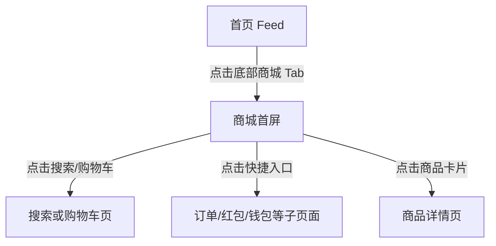

# 红果 — mall

## 基本信息

| 项目 | 内容 |
|------|------|
| 目标竞品 | 红果 |
| 竞品版本 | 7.2.4.32 |
| 功能模块 | mall |
| 分析平台 | mobile |
| 最后更新 | 2026-07-23 |
| 采集源 | [captures/](../../captures/) — 共 1 次采集 |

## 功能概览

商城页是红果在内容消费体系之外延展出的电商转化入口。页面兼具标准货架搜索能力、订单/钱包等交易服务，以及“短剧同款”“直播中”这类内容电商元素，体现了泛商品转化与内容种草的结合。 `[推断]`

## 交互流程

### 步骤 1：从首页重置起点

*图：重置后的首页起始状态 | 图源：[采集 2026-07-23](../../captures/2026-07-23-hongguo-tab-mall/capture.md)*

**触发**：冷启动红果。

**行为**：应用默认回到首页 Feed，商城需要通过底部 Tab 主动进入。

### 步骤 2：确认无遮挡层

*图：首页在无弹层状态下可切换商城 | 图源：[采集 2026-07-23](../../captures/2026-07-23-hongguo-tab-mall/capture.md)*

**触发**：执行预估关闭点击。

**行为**：未出现弹层，页面保持可操作。

### 步骤 3：切换到商城首屏

*图：商城一级页面首屏 | 图源：[采集 2026-07-23](../../captures/2026-07-23-hongguo-tab-mall/capture.md)*

**触发**：点击底部“商城”Tab。

**行为**：页面切换为浅色货架式电商首页，顶部为搜索与购物车，中部有订单、钱包、国家补贴等快捷服务，主体为双列商品流，并在底部浮出“登录可查看商品价格”的提示。

## UI 布局详解

### 商城首屏

| 区域 | 组件 | 规格（估算值） |
|------|------|--------------|
| 顶部 | 搜索框、搜索按钮、购物车 | 搜索框高约 42dp，按钮高约 40dp |
| 快捷服务区 | 订单 / 红包 / 钱包 / 短剧同款 / 国家补贴 | 白底圆角卡片，高约 100dp |
| Banner 区 | 活动横幅卡片 | 高约 64-72dp，多彩营销视觉 |
| 内容区 | 双列商品卡片 | 单卡约 164×276dp，圆角约 12dp |
| 底部浮层 | 登录可查看价格、立即登录 | 高约 48-52dp，米白底 |
| 底部导航 | 5 个一级 Tab | 商城高亮 |

*图：商城首屏整体布局 | 图源：[采集 2026-07-23](../../captures/2026-07-23-hongguo-tab-mall/capture.md)*

## 业务逻辑分析

### 加载策略

本章节不适用。本轮未覆盖商城首屏的完整加载时序、下拉刷新和分页加载行为。

### 内容策略

商城并非简单福利兑换页，而是完整电商首页：先给搜索与交易服务入口，再通过活动 banner 承接促销，主体通过双列商品流和直播标签刺激点击。商品内容既有泛低价商品，也有“短剧同款”入口，说明其试图承接内容场景下的种草转化 `[推断]`。

### 状态管理

首屏直接给出“登录可查看商品价格”的底部浮层，说明未登录状态下并不完全阻断浏览，但会在价格和交易关键环节设置登录门槛。 `[推断]`

### 其他业务维度

本章节不适用。

## 关键发现

- **商城是完整货架页**：搜索、购物车、订单、钱包等模块齐全，具备标准电商首页结构。 `[推断]`
- **登录被放在交易前置节点**：价格展示与登录绑定，说明平台优先争取账号绑定再促进下单。 `[推断]`
- **商品池偏强促销导向**：首屏充满低价、减价、直播中、达人推荐等高刺激信号。 `[推断]`
- **短剧同款入口说明内容电商联动明显**：内容消费与商品转化并行存在 `[推断]`。

## 与自身产品对比

> 本章节由产品团队在阅读本竞品文档后自行填写，不在 skill 自动产出范围内。

## 附录

### A. 采集源索引

| 日期 | 采集文档 | 覆盖内容 |
|------|---------|---------|
| 2026-07-23 | [一级页面-商城首屏](../../captures/2026-07-23-hongguo-tab-mall/capture.md) | 商城首屏结构、快捷服务区、商品流和登录价格提示 |

### B. 截图索引

| 文件名 | 采集日期 | 内容 |
|--------|---------|------|
| `assets/2026-07-23-step-01-launch-mall.png` | 2026-07-23 | 重置后的首页起始状态 |
| `assets/2026-07-23-step-02-dismiss-overlay.png` | 2026-07-23 | 切换前的可操作状态 |
| `assets/2026-07-23-step-03-mall.png` | 2026-07-23 | 商城首屏布局 |

### C. 录屏

本章节不适用。本次采集无录屏。

### D. 修订历史

| 日期 | 修订记录 | 变更摘要 |
|------|---------|---------|
| 2026-07-23 | [revisions/2026-07-23-hongguo-top-level-tabs.md](../../revisions/2026-07-23-hongguo-top-level-tabs.md) | 新建商城功能文档，补充一级页面首屏结构与发现 |

## 待深入

| 优先级 | 子功能 | 说明 | 状态 |
|--------|--------|------|------|
| P0 | 商品详情页 | 需要分析点击商品后的详情结构、SKU、购买链路 | 待采集 |
| P0 | 登录前后价格策略 | 需要确认登录后价格、券后价、下单路径是否变化 | 待采集 |
| P1 | 购物车与订单页 | 需要补充交易服务页的结构和状态 | 待采集 |
| P2 | 商城搜索与国家补贴 | 需要验证搜索承接结果和补贴入口实际流程 | 待采集 |

---

> 本文档基于模拟器操作采集 + 多模态分析生成。`[推断]` 标记的内容为主观判断，请结合实际验证。
> 原始采集实录见 `captures/` 目录。
