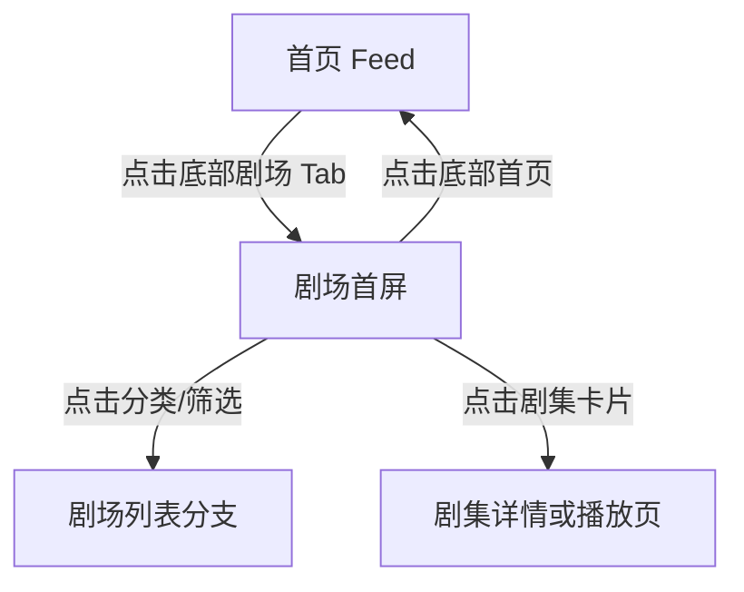

# 红果 — theater

## 基本信息

| 项目 | 内容 |
|------|------|
| 目标竞品 | 红果 |
| 竞品版本 | 7.2.4.32 |
| 功能模块 | theater |
| 分析平台 | mobile |
| 最后更新 | 2026-07-23 |
| 采集源 | [captures/](../../captures/) — 共 1 次采集 |

## 功能概览

剧场页是红果的主动找剧入口，用于承接用户从“被动刷内容”切换到“主动挑内容”的需求。页面通过搜索、分类、筛选、榜单和双列海报流，帮助用户快速定位想看的短剧。 `[推断]`

## 交互流程

### 步骤 1：从首页重置起点

*图：重置后的首页起始状态 | 图源：[采集 2026-07-23](../../captures/2026-07-23-hongguo-tab-theater/capture.md)*

**触发**：冷启动红果。

**行为**：应用先回到首页 Feed，说明剧场并非默认入口；采集过程中首页视频区域出现花屏/乱码，用户已说明可忽略。

### 步骤 2：确认底部导航可操作

*图：首页在无弹层状态下可继续切换 Tab | 图源：[采集 2026-07-23](../../captures/2026-07-23-hongguo-tab-theater/capture.md)*

**触发**：执行预估关闭点击。

**行为**：未出现额外弹层，底部导航保持可操作。

### 步骤 3：切换到剧场首屏

*图：剧场一级页面首屏 | 图源：[采集 2026-07-23](../../captures/2026-07-23-hongguo-tab-theater/capture.md)*

**触发**：点击底部“剧场”Tab。

**行为**：页面进入双列海报流，顶部出现搜索、截图识别短剧、一级分类和快捷筛选入口，“剧场”Tab 高亮。

## UI 布局详解

### 剧场首屏

| 区域 | 组件 | 规格（估算值） |
|------|------|--------------|
| 顶部 | 搜索框、“截图识别短剧”入口 | 搜索区高约 42-44dp，浅灰底，圆角约 14dp |
| 分类栏 | 找剧 / 真人剧 / 漫剧 / 电影 / 听书 / 小说 / 漫画 | 当前项加粗，字号约 16-20sp |
| 快捷入口 | 筛选 / 排行榜 / 新剧 / 预约 | 单卡高约 40-44dp，浅灰底 |
| 内容区 | 双列剧集海报卡片 | 单卡约 164×286dp，圆角约 12dp |
| 底部导航 | 5 个一级 Tab | 导航高约 72-76dp，剧场高亮 |

*图：剧场首屏整体布局 | 图源：[采集 2026-07-23](../../captures/2026-07-23-hongguo-tab-theater/capture.md)*

## 业务逻辑分析

### 加载策略

从首页切换到剧场后，首屏内容在约 1-2 秒内稳定，没有观察到骨架屏。更像是先快速渲染首屏海报卡片，再通过滚动加载后续内容 `[推断]`。

### 内容策略

剧场页是标准化内容发现页：搜索负责明确查询，一级分类负责按媒介或题材切流，筛选/排行榜/新剧/预约负责缩短找剧路径，双列海报流则承接批量对比和挑选行为。 `[推断]`

### 状态管理

本章节不适用。本轮未覆盖筛选空结果、网络异常、登录限制等状态。

### 其他业务维度

本章节不适用。

## 关键发现

- **剧场承担主动找剧职责**：与首页的沉浸式 Feed 不同，剧场页把检索和选择工具前置。 `[推断]`
- **分类层级非常密集**：搜索、一级分类和快捷入口连续排布，说明平台高度重视内容发现效率。 `[推断]`
- **双列海报利于比较决策**：单屏可同时浏览多部剧的封面、热度和标签，更适合主动筛选。 `[推断]`
- **截图识别短剧是差异化入口**：该功能明显面向站外找剧场景 `[推断]`。

## 与自身产品对比

> 本章节由产品团队在阅读本竞品文档后自行填写，不在 skill 自动产出范围内。

## 附录

### A. 采集源索引

| 日期 | 采集文档 | 覆盖内容 |
|------|---------|---------|
| 2026-07-23 | [一级页面-剧场首屏](../../captures/2026-07-23-hongguo-tab-theater/capture.md) | 从首页切换到剧场、剧场首屏信息架构、双列海报流 |

### B. 截图索引

| 文件名 | 采集日期 | 内容 |
|--------|---------|------|
| `assets/2026-07-23-step-01-launch-theater.png` | 2026-07-23 | 重置后的首页起始状态 |
| `assets/2026-07-23-step-02-dismiss-overlay.png` | 2026-07-23 | 底部导航可操作状态 |
| `assets/2026-07-23-step-03-theater.png` | 2026-07-23 | 剧场首屏布局 |

### C. 录屏

本章节不适用。本次采集无录屏。

### D. 修订历史

| 日期 | 修订记录 | 变更摘要 |
|------|---------|---------|
| 2026-07-23 | [revisions/2026-07-23-hongguo-top-level-tabs.md](../../revisions/2026-07-23-hongguo-top-level-tabs.md) | 新建剧场功能文档，补充一级页面首屏结构与发现 |

## 待深入

| 优先级 | 子功能 | 说明 | 状态 |
|--------|--------|------|------|
| P0 | 剧场筛选器 | 需要分析筛选项结构、交互方式和结果反馈 | 待采集 |
| P0 | 剧场卡片点击去向 | 需要确认卡片进入详情页还是直接播放页 | 待采集 |
| P1 | 排行榜/新剧/预约 | 需要拆分分析三类快捷入口的承接页面 | 待采集 |
| P2 | 剧场搜索与截图识别 | 需要验证搜索和识图找剧的完整链路 | 待采集 |

---

> 本文档基于模拟器操作采集 + 多模态分析生成。`[推断]` 标记的内容为主观判断，请结合实际验证。
> 原始采集实录见 `captures/` 目录。
