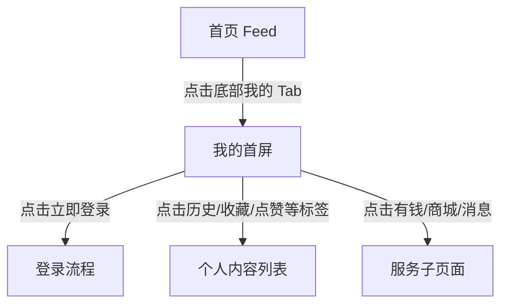

# 红果 — user-profile

## 基本信息

| 项目 | 内容 |
|------|------|
| 目标竞品 | 红果 |
| 竞品版本 | 7.2.4.32 |
| 功能模块 | user-profile |
| 分析平台 | mobile |
| 最后更新 | 2026-07-23 |
| 采集源 | [captures/](../../captures/) — 共 1 次采集 |

## 功能概览

“我的”页并非传统以资料信息为中心的个人中心，而更像用户内容资产与服务入口的聚合页。未登录状态下，页面一方面强力召回登录，另一方面直接展示历史观看剧集，鼓励用户继续回看与续播。 `[推断]`

## 交互流程

### 步骤 1：从首页重置起点

*图：重置后的首页起始状态 | 图源：[采集 2026-07-23](../../captures/2026-07-23-hongguo-tab-profile/capture.md)*

**触发**：冷启动红果。

**行为**：应用默认进入首页，个人中心需要通过底部导航主动进入。

### 步骤 2：确认无遮挡层

*图：首页在无弹层状态下可切换我的页 | 图源：[采集 2026-07-23](../../captures/2026-07-23-hongguo-tab-profile/capture.md)*

**触发**：执行预估关闭点击。

**行为**：首页未出现额外遮罩，底部导航保持可用。

### 步骤 3：切换到我的首屏

*图：我的一级页面首屏 | 图源：[采集 2026-07-23](../../captures/2026-07-23-hongguo-tab-profile/capture.md)*

**触发**：点击底部“我的”Tab。

**行为**：页面切换为个人中心，顶部展示欢迎语和立即登录按钮，中部提供有钱/商城/消息等服务卡片，下方默认展示历史观看剧集网格，右侧悬浮“登录赚钱”。

## UI 布局详解

### 我的首屏

| 区域 | 组件 | 规格（估算值） |
|------|------|--------------|
| 顶部头区 | 欢迎语、立即登录、夜间模式、菜单 | 高约 150-170dp，浅色背景 |
| 功能卡区 | 有钱 / 商城 / 消息等快捷卡片 | 单卡高约 64-72dp |
| 标签栏 | 历史 / 收藏 / 点赞 / 预约 / 动态 | 行高约 44-48dp，当前项加粗 |
| 过滤区 | 全部 / 已看完 / 未看完 / 筛选 / 编辑 | 胶囊按钮高约 34-36dp |
| 内容区 | 三列历史剧集网格 | 单卡宽约 108-112dp |
| 右侧浮层 | 登录赚钱 | 红包样式浮层约 72×86dp |
| 底部导航 | 5 个一级 Tab | 我的高亮 |

*图：我的页整体布局 | 图源：[采集 2026-07-23](../../captures/2026-07-23-hongguo-tab-profile/capture.md)*

## 业务逻辑分析

### 加载策略

本章节不适用。本轮未覆盖登录前后页面刷新、历史列表分页和滚动加载。

### 内容策略

“我的”页把历史、收藏、点赞、预约、动态等内容资产组织成标签体系，其中“历史”默认选中，说明平台优先引导用户回看已消费内容，而不是优先管理账号资料。 `[推断]`

### 状态管理

- **未登录状态**：顶部展示欢迎语和“立即登录”，右侧同时悬浮“登录赚钱”，说明账号绑定和收益体系有联动。 `[推断]`
- **历史内容存在状态**：页面默认直接展示历史观看剧集，并支持“全部 / 已看完 / 未看完”过滤。

### 其他业务维度

本章节不适用。

## 关键发现

- **我的页更像续播中心**：默认展示历史剧集网格，而非传统头像、昵称、资料编辑入口。 `[推断]`
- **登录召回非常强**：顶部按钮和右侧悬浮入口双重推动登录。 `[推断]`
- **内容行为资产被结构化沉淀**：历史、收藏、点赞、预约、动态构成可持续回访的内容资产体系 `[推断]`。
- **服务能力轻量整合在头部**：有钱、商城、消息等卡片说明个人中心也是统一服务入口。 `[推断]`

## 与自身产品对比

> 本章节由产品团队在阅读本竞品文档后自行填写，不在 skill 自动产出范围内。

## 附录

### A. 采集源索引

| 日期 | 采集文档 | 覆盖内容 |
|------|---------|---------|
| 2026-07-23 | [一级页面-我的首屏](../../captures/2026-07-23-hongguo-tab-profile/capture.md) | 我的页首屏、未登录召回、历史剧集网格和服务入口 |

### B. 截图索引

| 文件名 | 采集日期 | 内容 |
|--------|---------|------|
| `assets/2026-07-23-step-01-launch-profile.png` | 2026-07-23 | 重置后的首页起始状态 |
| `assets/2026-07-23-step-02-dismiss-overlay.png` | 2026-07-23 | 切换前的可操作状态 |
| `assets/2026-07-23-step-03-profile.png` | 2026-07-23 | 我的页首屏布局 |

### C. 录屏

本章节不适用。本次采集无录屏。

### D. 修订历史

| 日期 | 修订记录 | 变更摘要 |
|------|---------|---------|
| 2026-07-23 | [revisions/2026-07-23-hongguo-top-level-tabs.md](../../revisions/2026-07-23-hongguo-top-level-tabs.md) | 新建我的页功能文档，补充一级页面首屏结构与发现 |

## 待深入

| 优先级 | 子功能 | 说明 | 状态 |
|--------|--------|------|------|
| P0 | 登录流程 | 需要分析点击立即登录后的登录方式和绑定链路 | 待采集 |
| P1 | 收藏/点赞/预约/动态页 | 需要验证各标签页的数据结构与可操作项 | 待采集 |
| P1 | 历史剧集点击去向 | 需要确认续播逻辑和集数恢复行为 | 待采集 |
| P2 | 我的页异常状态 | 需要覆盖无历史、网络异常、登录后状态变化 | 待采集 |

---

> 本文档基于模拟器操作采集 + 多模态分析生成。`[推断]` 标记的内容为主观判断，请结合实际验证。
> 原始采集实录见 `captures/` 目录。
