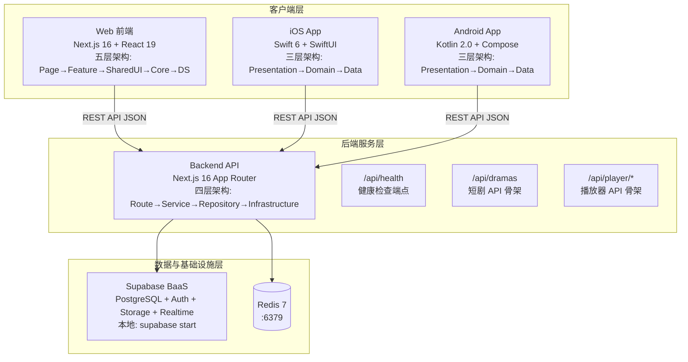

# 技术方案（共享部分）：项目初始化与架构设计

> 创建日期：2026-07-24
> 对应需求：spec.md

## 整体架构

本项目是面向大型软件开发的 monorepo 工程，采用分层解耦 + 模块化的架构设计。各端遵循统一的 Clean Architecture 思想，独立演进但共享一致的 API 契约和数据模型。



### 架构分层总览

```
┌──────────────────────────────────────────────────────────────┐
│                     各端架构分层对照                           │
├───────────┬──────────────┬──────────────┬───────────────────┤
│  Backend  │     Web      │     iOS      │     Android       │
├───────────┼──────────────┼──────────────┼───────────────────┤
│  Route    │  Page        │  Presentation│  Presentation     │
│  (路由层)  │  (页面组合)   │  (View+VM)   │  (Compose+VM)     │
├───────────┼──────────────┼──────────────┼───────────────────┤
│  Service  │  Feature     │  Domain      │  Domain           │
│  (业务逻辑) │  (业务模块)   │  (UseCase+   │  (UseCase+        │
│           │              │   Entity+    │   Model+          │
│           │              │   Repository │   Repository      │
│           │              │   Protocol)  │   Interface)      │
├───────────┼──────────────┼──────────────┼───────────────────┤
│Repository │  Core        │  Data        │  Data             │
│(数据访问)  │  (API Client  │  (Repository │  (Repository      │
│           │   + Config)   │   Impl+      │   Impl+           │
│           │              │   DataSource) │   DataSource)     │
├───────────┼──────────────┼──────────────┼───────────────────┤
│Infrastructure│Shared UI  │  Core        │  Core             │
│(DB/Redis) │  (通用组件)   │  (Network+   │  (Network+        │
+ Shared    + Design System│   Config)    │   DI+Config)      │
│(Schema/   │  (Tokens)    │              │                   │
│ Errors)   │              │              │                   │
└───────────┴──────────────┴──────────────┴───────────────────┘
```

---

## API 设计

### 涉及变更

| 类型 | 数量 | 说明 |
|------|------|------|
| 新增接口 | 7 | health 端点 + 6 个业务 API 骨架 |
| 修改接口 | 0 | — |
| 废弃接口 | 0 | — |

### 新增接口

#### `GET /api/health`

- **功能简介**：服务健康检查，返回服务状态、版本号、基础设施连接状态
- **Response (200)**：

```json
{
  "status": "ok",
  "version": "0.1.0",
  "services": {
    "database": "connected",
    "redis": "connected"
  }
}
```

| 字段 | 类型 | 说明 |
|------|------|------|
| `status` | string | 服务整体状态，`"ok"` \| `"degraded"` \| `"error"` |
| `version` | string | 应用版本号 |
| `services.database` | string | PostgreSQL 连接状态，`"connected"` \| `"disconnected"` |
| `services.redis` | string | Redis 连接状态，`"connected"` \| `"disconnected"` |

- **Zod Schema**：

```typescript
const HealthResponseSchema = z.object({
  status: z.enum(["ok", "degraded", "error"]),
  version: z.string(),
  services: z.object({
    database: z.enum(["connected", "disconnected"]),
    redis: z.enum(["connected", "disconnected"]),
  }),
});
```

#### `GET /api/dramas`

- **功能简介**：获取短剧列表（骨架，返回空数组 + 分页元数据）
- **Query Parameters**：

| 字段 | 类型 | 必填 | 默认值 | 说明 |
|------|------|------|--------|------|
| `page` | number | 否 | 1 | 页码 |
| `pageSize` | number | 否 | 20 | 每页数量 |

- **Response (200)**：

```json
{
  "data": [],
  "pagination": {
    "page": 1,
    "pageSize": 20,
    "total": 0,
    "totalPages": 0
  }
}
```

#### `POST /api/dramas`

- **功能简介**：创建短剧（骨架，返回 501 Not Implemented）
- **Response (501)**：

```json
{
  "error": {
    "code": "NOT_IMPLEMENTED",
    "message": "This endpoint is not yet implemented"
  }
}
```

#### `GET /api/dramas/[id]`

- **功能简介**：获取短剧详情（骨架，返回 501）
- **Path Parameters**：

| 字段 | 类型 | 必填 | 说明 |
|------|------|------|------|
| `id` | string | 是 | 短剧唯一标识 |

#### `GET /api/episodes/[id]`

- **功能简介**：获取剧集详情（骨架，返回 501）

- **Path Parameters**：

| 字段 | 类型 | 必填 | 说明 |
|------|------|------|------|
| `id` | string | 是 | 剧集唯一标识 |

#### `POST /api/player/start`

- **功能简介**：开始播放，记录播放开始事件（骨架，返回 501）

- **Request Body**：

| 字段 | 类型 | 必填 | 说明 |
|------|------|------|------|
| `episodeId` | string | 是 | 剧集 ID |
| `position` | number | 否 | 续播位置（秒） |

#### `POST /api/player/stop`

- **功能简介**：停止播放，上报播放进度（骨架，返回 501）

- **Request Body**：

| 字段 | 类型 | 必填 | 说明 |
|------|------|------|------|
| `episodeId` | string | 是 | 剧集 ID |
| `position` | number | 是 | 当前播放位置（秒） |
| `duration` | number | 是 | 视频总时长（秒） |

### 统一错误响应格式

所有 API 遵循统一的错误响应格式：

```json
{
  "error": {
    "code": "ERROR_CODE",
    "message": "Human-readable error description"
  }
}
```

| 字段 | 类型 | 说明 |
|------|------|------|
| `error.code` | string | 机器可读错误码 |
| `error.message` | string | 面向开发者的错误描述 |

### 标准错误码

| 错误码 | HTTP 状态码 | 说明 |
|--------|------------|------|
| `NOT_FOUND` | 404 | 资源不存在 |
| `VALIDATION_ERROR` | 400 | 请求参数校验失败 |
| `INTERNAL_ERROR` | 500 | 服务器内部错误 |
| `NOT_IMPLEMENTED` | 501 | 端点已定义但尚未实现 |

---

## 数据模型

### Schema 定义

#### Drama

```typescript
const DramaSchema = z.object({
  id: z.string(),
  title: z.string().min(1),
  description: z.string(),
  coverUrl: z.string().url(),
  category: z.string(),
  episodeCount: z.number().int().positive(),
  tags: z.array(z.string()).optional(),
  rating: z.number().min(0).max(10).optional(),
  createdAt: z.string().datetime(),
  updatedAt: z.string().datetime(),
});

type Drama = z.infer<typeof DramaSchema>;
```

#### Episode

```typescript
const EpisodeSchema = z.object({
  id: z.string(),
  dramaId: z.string(),
  title: z.string().min(1),
  episodeNumber: z.number().int().positive(),
  videoUrl: z.string().url(),
  duration: z.number().int().positive(),  // 秒
  thumbnailUrl: z.string().url(),
  createdAt: z.string().datetime(),
  updatedAt: z.string().datetime(),
});

type Episode = z.infer<typeof EpisodeSchema>;
```

#### User

```typescript
const UserSchema = z.object({
  id: z.string(),
  nickname: z.string().min(1).max(50),
  avatarUrl: z.string().url().optional(),
  createdAt: z.string().datetime(),
});

type User = z.infer<typeof UserSchema>;
```

### 数据关系

```
Drama ──1:N──▶ Episode
  │
  └──category: string（分类标签）
```

### Schema 跨端同步策略

| 端 | 对齐方式 |
|----|---------|
| Backend | **权威来源**，`backend/src/lib/schemas.ts` 定义所有 Zod Schema |
| Web | `web/src/lib/schemas.ts` 手动同步 Backend 的 Schema 结构，通过 TypeScript 类型检查保证一致性 |
| iOS | `Domain/Entities/` 中的 Swift struct 字段名和类型与 Backend Schema 一一对应；`Codable` JSON key 使用 `snake_case` 策略对齐 API 响应 |
| Android | `domain/model/` 中的 Kotlin data class 字段名和类型与 Backend Schema 一一对应；使用 `@SerializedName` 注解对齐 JSON key |

---

## 跨端共享逻辑

| 共享逻辑 | 说明 | 涉及端 | 初始化阶段 |
|---------|------|--------|-----------|
| **API 契约** | 所有客户端与 Backend 通过统一 REST API JSON 通信，响应格式一致 | Backend/Web/iOS/Android | ✅ 本次定义 API 骨架 |
| **数据模型 Schema** | Drama/Episode/User 实体在各端保持字段名和类型一致，Backend 为权威来源 | Backend/Web/iOS/Android | ✅ 本次定义 Schema |
| **错误处理格式** | 统一 `{"error":{"code":"...","message":"..."}}` 结构，标准错误码枚举跨端共享 | Backend/Web/iOS/Android | ✅ 本次定义 |
| **URL Scheme** | `djsdrama://` 在 iOS（URL Scheme）和 Android（Deep Links）统一声明 | iOS/Android | ✅ 本次声明 |
| **环境变量命名** | 跨端一致的命名约定：`APP_NAME`、`APP_VERSION`、`API_BASE_URL` | Backend/Web | ✅ 本次定义 |
| **缓存策略** | 通用 TTL 策略（后续业务 PRD 定义具体缓存 key 和过期时间） | Backend | 📅 后续 PRD |
| **认证机制** | JWT Token（Bearer Auth），后续 PRD 实现 | Backend/Web/iOS/Android | 📅 后续 PRD |
| **分页规范** | 统一 `{ page, pageSize, total, totalPages }` 分页响应结构 | Backend/Web/iOS/Android | ✅ 本次定义 |

---

## 安全考虑

- **认证与授权**：当前无用户体系，不涉及。API 骨架端点不做认证校验
- **数据校验**：
  - Backend 层：所有 API 输入通过 Zod Schema 校验，拒绝非法输入
  - 各端保持一致的数据校验规则（以 Backend Schema 为准）
- **敏感数据处理**：
  - 所有环境变量通过 `.env` 注入，不硬编码
  - `.env` 加入 `.gitignore`，`.env.example` 只含 key 不含真实值
  - 数据库密码、Redis 密码通过 Docker Compose secrets 或环境变量注入
- **CORS 配置**：开发阶段允许 `localhost:3000`（Web）和 `localhost:3001`（Backend）跨域；生产环境在部署配置中锁定允许的 origin
- **速率限制**：本地开发不配置；生产环境在后续 PRD 中按端点和用户维度设置限流

---

## 边界与错误处理（⚠️ 重点，最易遗漏）

### 错误处理架构

- **全局错误处理策略**：Backend 使用 Next.js App Router 的 `error.tsx` + middleware 统一捕获和格式化错误响应
- **错误响应格式**：统一使用 `{"error":{"code":"...","message":"..."}}` 结构
- **错误日志与监控**：开发阶段使用 `console.error` 输出到 stderr；生产环境接入日志系统（后续 PRD）

### API 错误码定义

| 业务错误码 | HTTP 状态码 | 说明 | 用户提示文案 |
|-----------|------------|------|-------------|
| `VALIDATION_ERROR` | 400 | 参数校验失败 | "请求参数有误，请检查后重试" |
| `NOT_FOUND` | 404 | 资源不存在 | "请求的资源不存在" |
| `INTERNAL_ERROR` | 500 | 服务内部错误 | "服务异常，请稍后重试" |
| `NOT_IMPLEMENTED` | 501 | 端点尚未实现 | "该功能正在开发中" |
| `SERVICE_UNAVAILABLE` | 503 | 依赖服务不可用（数据库/Redis 断开） | "服务暂时不可用，请稍后重试" |

### 边界场景处理

| 场景 | 触发条件 | API 行为 | 说明 |
|------|---------|---------|------|
| 空参数/缺参数 | 必填字段为空 | 返回 400 + `VALIDATION_ERROR` | Zod Schema 校验自动拦截 |
| 参数边界值 | 超长文本、特殊字符、SQL 注入片段 | 校验失败返回 400 | Zod 内置字符串长度限制和安全校验 |
| 数据不存在 | 查询不存在的资源 | 返回 404 + `NOT_FOUND` | 后续业务 PRD 实现 |
| 重复提交 | 短时间内相同请求（如 POST /api/player/start） | 幂等处理 / 返回现有记录 | 后续业务 PRD 实现 |
| 并发冲突 | 同一资源同时修改 | 乐观锁 / 返回 409 | 后续业务 PRD 实现 |
| 限流触发 | 超过频率限制 | 返回 429 + Retry-After header | 生产环境后续 PRD |
| 服务降级 | 数据库/Redis 不可用 | `/api/health` 返回 `status: "degraded"`，`services` 字段标记断开状态 | 优雅降级，不崩溃 |
| Docker 服务未启动 | 本地开发未 `docker compose up` | `/api/health` 返回 `services.database: "disconnected"` 但仍正常响应 | 后端服务不因基础设施不可用而崩溃 |

---

## 性能考虑

- **预期 QPS**：开发阶段 < 10 QPS（本地单用户），生产环境目标见后续 PRD
- **缓存策略**：
  - `/api/health` 响应不缓存（实时状态）
  - 本地开发阶段不引入缓存层；Redis 在后续业务 PRD 中启用 Session 缓存和内容缓存
- **数据库优化**：
  - 本地开发使用 Docker Compose PostgreSQL，无需索引优化
  - 连接池大小默认 10（`pg` pool 默认值），当前阶段足够
- **构建性能**：
  - Web/Backend：Next.js Turbopack（dev 模式，默认启用）提供快速 HMR
  - Android：Gradle 增量编译 + build cache
  - iOS：Xcode 增量构建

---

## 参考资料

### 已查阅的 spec 文档

| 文档 | 相关章节 | 关键信息 |
|------|---------|---------|
| `docs/specs/2026-07-24-project-init/spec.md` | Section 4（架构设计） | 各端分层结构、模块化策略 |
| `docs/specs/2026-07-24-project-init/spec.md` | Section 6（功能详述） | 8 个用户故事的功能详述 |

### 已查阅的 PRD 文档

| 文档 | 关键信息 |
|------|---------|
| `docs/product_manager/prd/2026-07-24-project-init/prd.md` | 技术栈选型、API 设计规范、Monorepo 管理策略 |
