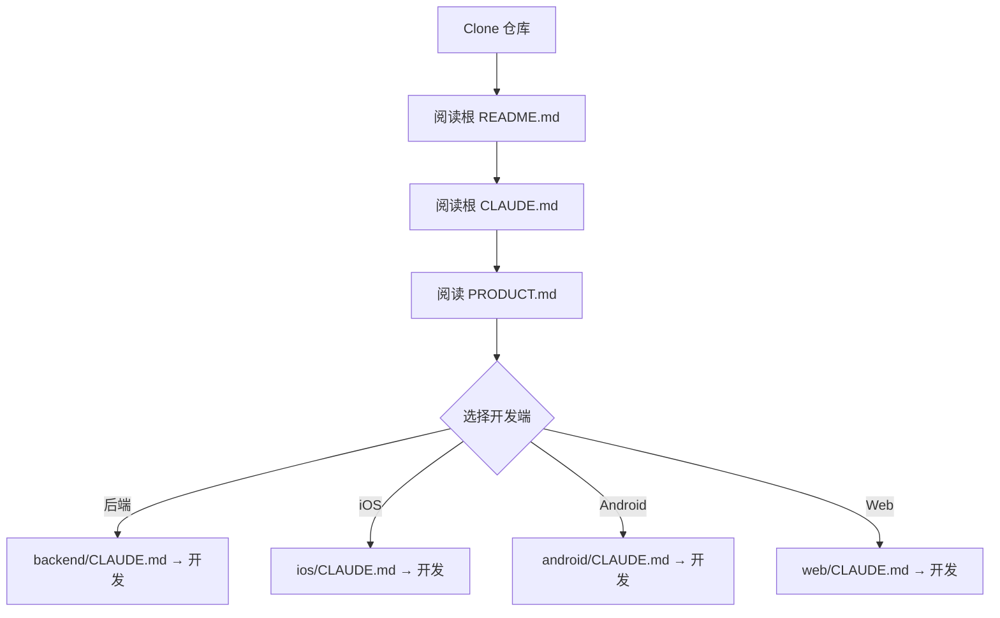
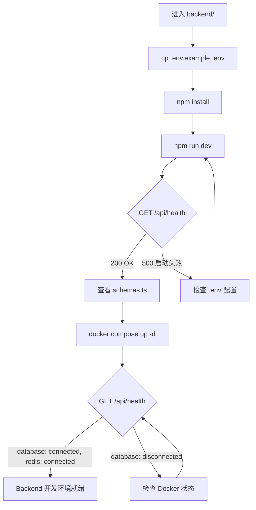
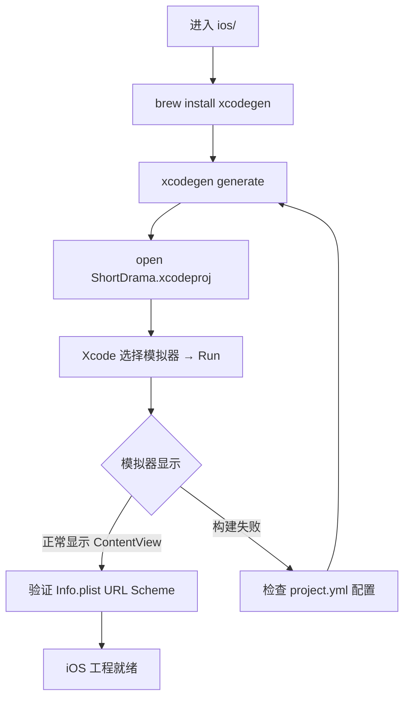
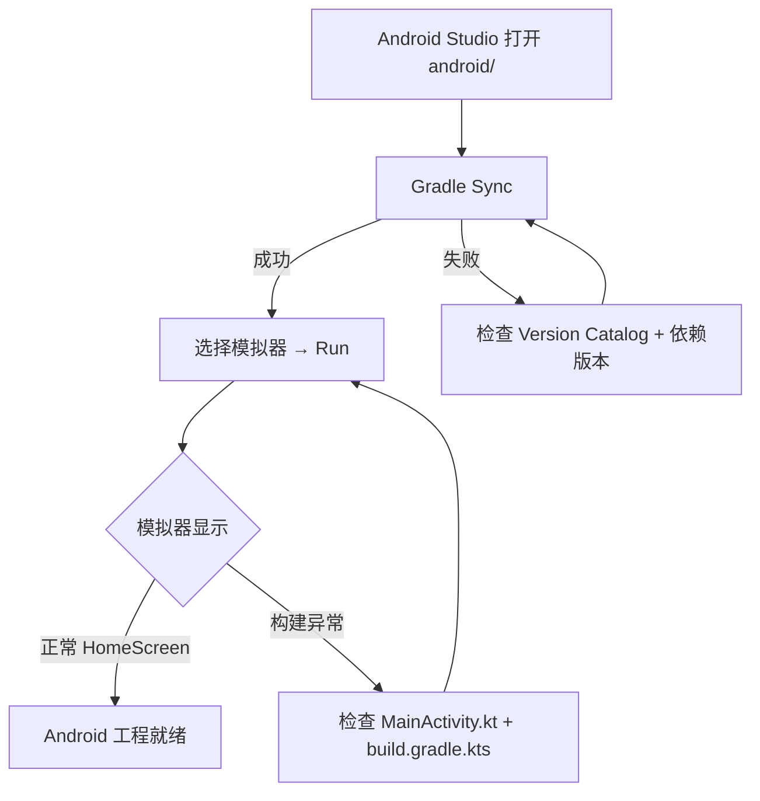
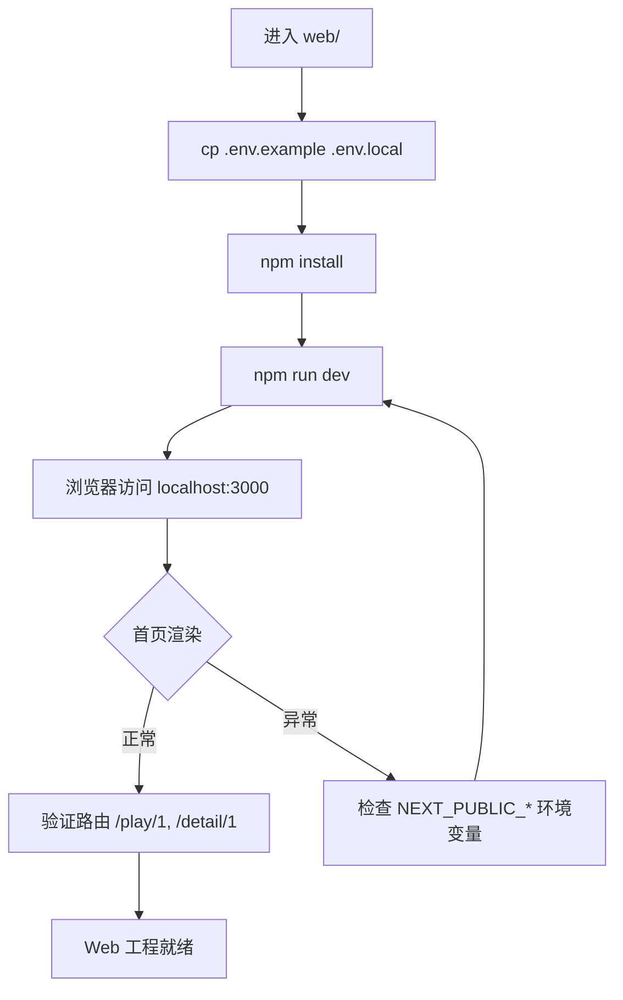
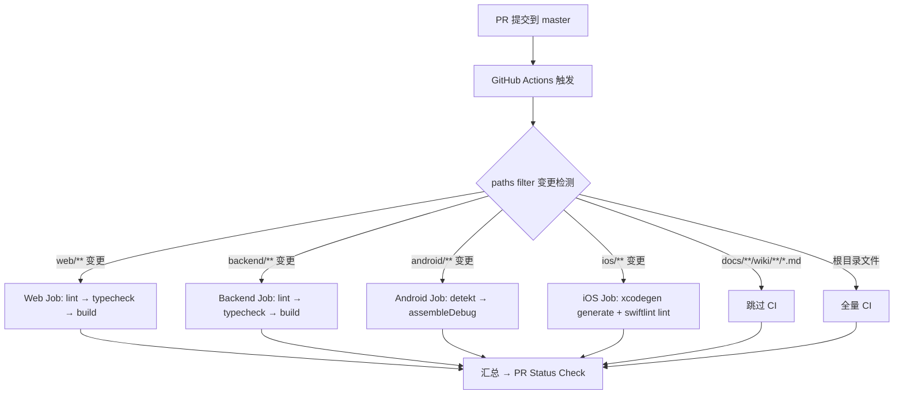
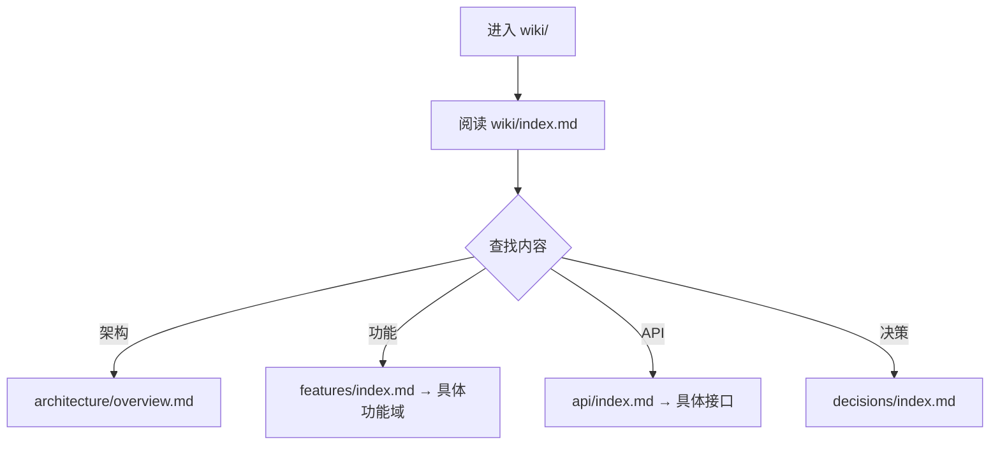
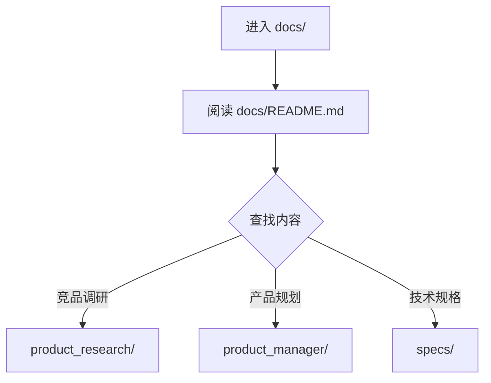

# 需求文档：项目初始化与架构设计

> 创建日期：2026-07-24
> 状态：草稿
> 作者：AI Agent + daniel

---

## 1. 需求背景

### 1.1 问题描述

- **现状**：项目仓库为空，无任何工程目录、技术栈选型或开发基础设施。这是一个从零开始的 fork 项目，目标是构建 ShortDrama 短剧内容平台。
- **痛点**：团队需要先搭建多端 monorepo 工程骨架，建立统一的开发规范、技术约束和协作基础。如果直接跳到业务功能开发，各端将各自为政，后期整合成本极高。
- **竞品参考**：红果短剧是成熟的竖屏短剧内容平台，提供首页信息流、剧集详情、播放器、搜索等完整功能。本项目 fork 其核心体验，但不 clone 其技术实现。

### 1.2 预期目标

- **目标**：建立可支持多端并行开发的 monorepo 工程骨架，包含 android/、ios/、web/、backend/ 四个子工程，以及 wiki/、docs/ 两个文档协作目录。
- **成功指标**（可度量）：
  - 各端工程可独立构建运行（Backend: `npm run dev` 启动；Web: `npm run dev` 启动；iOS: Xcode Run 成功；Android: `./gradlew assembleDebug` 成功）
  - CI 流水线可自动触发并通过
  - Docker Compose 一键启动本地开发基础设施（Redis + PostgreSQL）
  - 新加入的开发者按 README 指引可在 30 分钟内启动任意一端

### 1.3 范围定义

| 范围内 | 范围外（明确不做） | 原因 |
|--------|------------------|------|
| 各端工程初始化（Android/iOS/Web/Backend） | 业务功能代码（首页 Feed、播放器等） | 业务功能由后续 PRD 驱动 |
| 技术栈选型与版本锁定 | 性能优化、安全加固 | 属于后续迭代 |
| 统一 API 规范与基础路由骨架（含错误响应格式） | 完整的用户认证体系 | 属于后续 PRD |
| 基础数据模型定义（Drama/Episode Schema） | 推荐算法、AI 相关能力 | 属于远期规划 |
| CI/CD 流水线骨架（GitHub Actions） | 生产环境部署配置（CD） | 先聚焦开发环境 |
| Docker Compose 本地开发环境（Redis + PostgreSQL） | 数据迁移/备份方案 | 属于运维阶段 |
| 各端 CLAUDE.md 协作规范 | 国际化/多语言支持 | 属于后续 PRD |
| PRODUCT.md 产品信息定义 | 性能监控/APM 接入 | 属于运维阶段 |
| Wiki 知识库骨架（architecture/features/api/decisions） | 用户行为分析/埋点体系 | 属于后续 PRD |
| 文档目录结构初始化（docs/） | 内容推荐算法 | 属于远期规划 |

---

## 2. 术语表

| 术语 | 定义 | 来源 |
|------|------|------|
| ShortDrama | 本产品名称，竖屏短剧内容平台 | PRODUCT.md |
| 红果短剧 | 主要竞品，成熟的竖屏短剧平台 | PRODUCT.md |
| monorepo | 单一仓库管理多端项目的代码组织方式 | 本文档新定义 |
| App Shell | 各端应用的最小可运行骨架，展示应用名和版本号的占位页面 | 本文档新定义 |
| XcodeGen | 从 YAML 配置文件生成 Xcode 项目的工具，避免 .xcodeproj 冲突 | 本文档新定义 |
| Version Catalog | Gradle 的集中式依赖版本管理方式（libs.versions.toml） | 本文档新定义 |
| Zod | TypeScript 运行时类型校验库，从 Schema 推断 TypeScript 类型 | 本文档新定义 |

---

## 3. 涉及平台

| 平台 | 是否涉及 | 变更概要 |
|------|---------|---------|
| Backend | ✅ 涉及 | 新建 Next.js 16 + TypeScript 后端工程，含 API 骨架、数据模型 Zod Schema、Docker Compose 本地开发环境 |
| Web | ✅ 涉及 | 新建 Next.js 16 + React 19 前端工程，含路由骨架（`/`、`/play/[id]`、`/detail/[id]`）、全局样式 |
| iOS | ✅ 涉及 | 新建 Swift 6 + SwiftUI + XcodeGen 工程，含 URL Scheme 声明（`djsdrama://`）、SwiftLint 静态分析 |
| Android | ✅ 涉及 | 新建 Kotlin 2.0 + Jetpack Compose + Gradle (Kotlin DSL) 工程，含 Material3 主题、djsdrama:// Deep Links、Detekt 静态分析 |

---

## 4. 架构设计

> ⚠️ 本章节定义项目初始化的架构原则和各端分层结构。面向大型软件开发，强调分层解耦、模块化、可测试性和可扩展性。具体模块的实现细节留给 design 阶段。

### 4.1 架构总则

| 原则 | 说明 | 落地要求 |
|------|------|---------|
| **分层解耦** | 每端内部按职责分层，上层依赖下层，禁止反向依赖 | 目录结构天然体现分层 |
| **模块化** | 按业务域（feature）拆分模块，模块内部高内聚、模块间低耦合 | 各端 feature 目录独立，通过明确定义的接口通信 |
| **依赖倒置** | 高层模块不依赖低层实现，依赖抽象接口 | 数据层定义 Repository 接口，上层只依赖接口 |
| **单一数据源 (SSOT)** | 每种数据只有一个权威来源，避免数据不一致 | 状态管理集中在 state 层，API 返回为权威数据 |
| **可测试性** | 每层可独立单测，不依赖真实外部服务 | 接口注入 + mock 实现；核心逻辑不依赖 UI 框架 |
| **显式依赖** | 模块依赖关系显式声明，避免隐式耦合 | 通过构造函数/参数注入，禁止全局单例滥用 |

### 4.2 Backend 分层架构

Backend 采用 **四层架构**，从上到下依次为：

```
┌─────────────────────────────────────────────┐
│  Route 层 (API Routes)                       │
│  职责：HTTP 请求解析、参数校验、响应序列化      │
│  约束：不包含业务逻辑，只做路由和适配           │
│  src/app/api/**/route.ts                     │
├─────────────────────────────────────────────┤
│  Service 层 (Business Logic)                 │
│  职责：业务规则、流程编排、权限校验             │
│  约束：不依赖 HTTP 框架，可被 CLI/测试直接调用   │
│  src/services/**/*.service.ts                │
├─────────────────────────────────────────────┤
│  Repository 层 (Data Access)                 │
│  职责：数据持久化、查询封装、缓存策略           │
│  约束：定义接口（interface），上层只依赖接口    │
│  src/repositories/**/*.repository.ts         │
│  src/repositories/**/*.repository.interface.ts│
├─────────────────────────────────────────────┤
│  Infrastructure 层                           │
│  职责：数据库连接、Redis 客户端、外部 API 调用  │
│  约束：提供具体实现，注入到 Repository 层      │
│  src/infrastructure/database.ts              │
│  src/infrastructure/redis.ts                 │
│  src/infrastructure/supabase.ts              │
├─────────────────────────────────────────────┤
│  Shared 层 (跨层共享)                         │
│  职责：数据模型 Schema、工具函数、错误类型      │
│  src/lib/schemas.ts                          │
│  src/lib/errors.ts                           │
│  src/lib/types.ts                            │
└─────────────────────────────────────────────┘
```

**Backend 模块化策略**：

```
backend/src/
├── app/api/                  # Route 层 — 按资源组织
│   ├── health/route.ts
│   ├── dramas/route.ts
│   ├── dramas/[id]/route.ts
│   ├── episodes/[id]/route.ts
│   └── player/
│       ├── start/route.ts
│       └── stop/route.ts
├── services/                 # Service 层 — 按业务域组织
│   ├── drama/
│   │   ├── drama.service.ts
│   │   └── drama.service.test.ts
│   ├── episode/
│   │   ├── episode.service.ts
│   │   └── episode.service.test.ts
│   └── player/
│       ├── player.service.ts
│       └── player.service.test.ts
├── repositories/             # Repository 层 — 按实体组织
│   ├── drama/
│   │   ├── drama.repository.interface.ts   # 接口定义
│   │   ├── drama.repository.ts             # PostgreSQL 实现
│   │   └── drama.repository.mock.ts        # 测试 mock
│   └── episode/
│       ├── episode.repository.interface.ts
│       └── episode.repository.ts
├── infrastructure/           # 基础设施 — 按技术组件组织
│   ├── database.ts           # PostgreSQL 连接池
│   ├── redis.ts              # Redis 客户端
│   └── supabase.ts           # Supabase SDK 封装
└── lib/                      # 共享层
    ├── schemas.ts            # Zod Schema 定义
    ├── errors.ts             # 业务错误类型（DramaNotFoundError 等）
    ├── types.ts              # 共享 TypeScript 类型
    └── config.ts             # 环境变量配置
```

**关键约束**：

| 约束 | 说明 |
|------|------|
| Route 层禁止直接调用 Repository | 必须通过 Service 层 |
| Service 层不依赖 HTTP 框架 | 输入输出为纯数据，可被 `npm run script` 或测试直接调用 |
| Repository 接口先行 | 每个 Repository 先定义 interface，再写实现 |
| 测试与源码同目录 | `*.test.ts` 与源文件同目录，便于发现和维护 |
| 错误类型集中定义 | 业务错误继承 `AppError` 基类，统一错误码枚举 |

### 4.3 Web 前端分层架构

Web 前端采用 **五层架构**，遵循单向数据流：

```
┌─────────────────────────────────────────────┐
│  Page 层 (Routes)                            │
│  职责：路由入口、页面布局、SEO metadata        │
│  约束：不含业务逻辑，只做组合和布局             │
│  src/app/**/page.tsx                         │
├─────────────────────────────────────────────┤
│  Feature 层 (业务模块)                         │
│  职责：按业务域组织的功能模块，每个 feature 独立│
│  约束：feature 间不直接引用，通过共享层通信     │
│  src/features/**/                            │
│    ├── components/   # 模块专属 UI 组件       │
│    ├── hooks/        # 模块专属 hooks         │
│    └── api/          # 模块专属 API 调用      │
├─────────────────────────────────────────────┤
│  Shared UI 层 (通用组件)                      │
│  职责：跨 feature 复用的 UI 组件               │
│  约束：不含业务逻辑，纯展示+交互                │
│  src/components/ui/**                        │
├─────────────────────────────────────────────┤
│  Core 层 (基础设施)                            │
│  职责：API client、状态管理、路由工具          │
│  约束：不依赖任何 feature                      │
│  src/lib/api-client.ts                       │
│  src/lib/config.ts                           │
│  src/lib/schemas.ts                          │
├─────────────────────────────────────────────┤
│  Design System 层                            │
│  职责：设计 tokens、主题变量、基础样式          │
│  src/styles/globals.css                      │
│  src/styles/tokens.css                       │
└─────────────────────────────────────────────┘
```

**Web 模块化目录结构**：

```
web/src/
├── app/                          # Page 层 — 按路由组织
│   ├── layout.tsx                 # 根布局（Providers + 全局样式）
│   ├── page.tsx                   # 首页
│   ├── play/
│   │   └── [id]/page.tsx          # 播放页
│   └── detail/
│       └── [id]/page.tsx          # 详情页
├── features/                      # Feature 层 — 按业务域组织
│   ├── home/                      # 首页 feature
│   │   ├── components/
│   │   │   └── HomeScreen.tsx
│   │   └── index.ts               # feature 公共导出
│   ├── player/                    # 播放器 feature（骨架）
│   │   ├── components/
│   │   ├── hooks/
│   │   └── index.ts
│   └── drama-detail/              # 剧集详情 feature（骨架）
│       ├── components/
│       └── index.ts
├── components/                    # Shared UI 层
│   └── ui/                        # 通用 UI 组件
│       ├── Button.tsx
│       ├── Card.tsx
│       └── index.ts
├── lib/                           # Core 层
│   ├── api-client.ts              # fetch wrapper（base URL、错误处理、请求/响应拦截）
│   ├── config.ts                  # 环境变量
│   ├── schemas.ts                 # Zod Schema
│   └── types.ts                   # 共享类型
└── styles/                        # Design System 层
    ├── globals.css                 # 全局样式
    └── tokens.css                  # CSS 自定义属性（颜色、间距、字体）
```

**关键约束**：

| 约束 | 说明 |
|------|------|
| Feature 间禁止直接引用 | 不 import 其他 feature 的内部文件；公共类型通过 `lib/types.ts` 共享 |
| Page 只做组合 | Page 文件只 import feature 组件和 layout 组件，不写 useEffect/useState 业务逻辑 |
| API client 统一出口 | 所有 HTTP 请求通过 `lib/api-client.ts` 发出，统一处理 base URL、auth header、错误 |
| 组件先 interface 后实现 | 通用组件先定义 Props 类型（`components/ui/types.ts`），再写实现 |

### 4.4 iOS 分层架构

iOS 采用 **MVVM + Clean Architecture**，分为三层：

```
┌─────────────────────────────────────────────┐
│  Presentation 层 (View + ViewModel)          │
│  职责：UI 渲染、用户交互、状态绑定             │
│  约束：View 不持有业务逻辑，ViewModel 不依赖 UI│
│  Sources/Features/<Feature>/Views/            │
│  Sources/Features/<Feature>/ViewModels/       │
├─────────────────────────────────────────────┤
│  Domain 层 (UseCase + Entity + Repository)   │
│  职责：业务规则、实体定义、仓库接口（协议）     │
│  约束：不依赖任何框架（纯 Swift），不引用 UIKit│
│  Sources/Domain/UseCases/                    │
│  Sources/Domain/Entities/                    │
│  Sources/Domain/Repositories/ (Protocol only) │
├─────────────────────────────────────────────┤
│  Data 层 (Repository Impl + DataSource)      │
│  职责：网络请求、本地存储、DTO ↔ Entity 转换  │
│  约束：实现 Domain 层的 Repository 协议       │
│  Sources/Data/Repositories/                  │
│  Sources/Data/DataSources/                   │
│  Sources/Data/DTOs/                          │
├─────────────────────────────────────────────┤
│  Core 层 (跨层基础设施)                        │
│  职责：网络 client、配置、工具扩展             │
│  Sources/Core/Network/                       │
│  Sources/Core/Config/                        │
│  Sources/Core/Extensions/                    │
└─────────────────────────────────────────────┘
```

**iOS 模块化目录结构**：

```
ios/ShortDrama/Sources/
├── App/                             # 应用入口
│   ├── ShortDramaApp.swift          # @main App
│   └── AppDelegate.swift            # Deeplink 处理
├── Core/                            # Core 层
│   ├── Network/
│   │   └── APIClient.swift          # URLSession 封装 + 拦截器
│   ├── Config/
│   │   └── AppConfig.swift          # 版本号、bundleId 等
│   ├── Extensions/
│   │   └── View+Extensions.swift
│   └── DesignSystem/
│       └── DesignTokens.swift       # 颜色、间距、字体
├── Domain/                          # Domain 层（纯 Swift，无框架依赖）
│   ├── Entities/
│   │   ├── Drama.swift              # 业务实体 struct
│   │   └── Episode.swift
│   ├── UseCases/
│   │   └── FetchDramasUseCase.swift # 业务用例（骨架）
│   └── RepositoryProtocols/
│       ├── DramaRepositoryProtocol.swift
│       └── EpisodeRepositoryProtocol.swift
├── Data/                            # Data 层
│   ├── Repositories/
│   │   └── DramaRepository.swift    # 实现 DramaRepositoryProtocol
│   ├── DataSources/
│   │   └── DramaRemoteDataSource.swift
│   └── DTOs/
│       └── DramaDTO.swift           # API 响应模型 + Entity 转换
└── Features/                        # Presentation 层 — 按业务域组织
    ├── Home/
    │   ├── Views/
    │   │   └── HomeView.swift       # 首页占位 UI
    │   └── ViewModels/
    │       └── HomeViewModel.swift   # 首页 ViewModel（骨架）
    ├── Player/                      # 播放器 feature（骨架）
    │   ├── Views/
    │   │   └── PlayerView.swift
    │   └── ViewModels/
    │       └── PlayerViewModel.swift
    └── DramaDetail/                 # 剧集详情 feature（骨架）
        ├── Views/
        │   └── DramaDetailView.swift
        └── ViewModels/
            └── DramaDetailViewModel.swift
```

**关键约束**：

| 约束 | 说明 |
|------|------|
| Domain 层零依赖 | 不含 `import UIKit`/`import SwiftUI`，可独立编译和测试 |
| ViewModel 不持有 View | 通过 `@Published` 属性暴露状态，View 通过 `@StateObject`/`@ObservedObject` 订阅 |
| Repository 协议在 Domain 层定义 | Data 层仅实现协议，依赖方向：Data → Domain |
| 每个 Feature 独立 | Feature 间不直接引用，通过 Domain 层的 Entity 和 UseCase 通信 |
| DTO ↔ Entity 转换在 Data 层 | Data 层接收 DTO（API 响应），转换为 Domain Entity 后返回上层 |

### 4.5 Android 分层架构

Android 采用 **MVVM + Clean Architecture**，分为三层：

```
┌─────────────────────────────────────────────┐
│  Presentation 层 (UI + ViewModel)            │
│  职责：Compose UI、用户交互、UI 状态管理       │
│  约束：不包含业务逻辑，ViewModel 不依赖 Android│
│  app/src/.../feature/<name>/ui/              │
│  app/src/.../feature/<name>/viewmodel/       │
├─────────────────────────────────────────────┤
│  Domain 层 (UseCase + Model + Repository)    │
│  职责：业务规则、数据模型、仓库接口             │
│  约束：纯 Kotlin，不含 Android 框架依赖        │
│  app/src/.../domain/usecase/                 │
│  app/src/.../domain/model/                   │
│  app/src/.../domain/repository/ (interface)  │
├─────────────────────────────────────────────┤
│  Data 层 (Repository Impl + DataSource)      │
│  职责：网络请求、本地存储、DTO ↔ Model 转换   │
│  约束：实现 Domain 层的 Repository 接口       │
│  app/src/.../data/repository/                │
│  app/src/.../data/datasource/                │
│  app/src/.../data/dto/                       │
├─────────────────────────────────────────────┤
│  Core 层 (跨层基础设施)                        │
│  职责：网络 client、DI、配置、主题             │
│  app/src/.../core/network/                   │
│  app/src/.../core/di/                        │
│  app/src/.../core/config/                    │
│  app/src/.../core/theme/                     │
└─────────────────────────────────────────────┘
```

**Android 模块化目录结构**：

```
android/app/src/main/java/com/djs66256/short_drama/
├── ShortDramaApplication.kt         # Application 入口，初始化 DI
├── MainActivity.kt                  # 单 Activity，Deeplink 入口
├── core/                            # Core 层
│   ├── network/
│   │   └── ApiClient.kt             # OkHttp/Ktor 封装 + 拦截器
│   ├── di/
│   │   └── AppModule.kt             # Hilt/Koin DI 模块定义
│   ├── config/
│   │   └── AppConfig.kt             # 版本号、baseUrl 等
│   └── theme/
│       ├── Theme.kt                 # Material3 主题
│       ├── Color.kt                 # 颜色 tokens
│       └── Type.kt                  # 字体 tokens
├── domain/                          # Domain 层（纯 Kotlin，无 Android 依赖）
│   ├── model/
│   │   ├── Drama.kt                 # 业务实体 data class
│   │   └── Episode.kt
│   ├── usecase/
│   │   └── GetDramasUseCase.kt      # 业务用例（骨架）
│   └── repository/
│       ├── DramaRepository.kt       # Repository 接口
│       └── EpisodeRepository.kt
├── data/                            # Data 层
│   ├── repository/
│   │   └── DramaRepositoryImpl.kt   # 实现 Domain 层接口
│   ├── datasource/
│   │   └── DramaRemoteDataSource.kt
│   └── dto/
│       ├── DramaDto.kt              # API 响应模型 + Model 转换
│       └── EpisodeDto.kt
└── feature/                         # Presentation 层 — 按业务域组织
    ├── home/
    │   ├── ui/
    │   │   └── HomeScreen.kt        # 首页 Compose UI（占位）
    │   └── viewmodel/
    │       └── HomeViewModel.kt     # 首页 ViewModel（骨架）
    ├── player/                      # 播放器 feature（骨架）
    │   ├── ui/
    │   │   └── PlayerScreen.kt
    │   └── viewmodel/
    │       └── PlayerViewModel.kt
    └── dramadetail/                 # 剧集详情 feature（骨架）
        ├── ui/
        │   └── DramaDetailScreen.kt
        └── viewmodel/
            └── DramaDetailViewModel.kt
```

**关键约束**：

| 约束 | 说明 |
|------|------|
| Domain 层纯 Kotlin | 不含 `import android.*`，可 JVM 单测，不依赖模拟器 |
| ViewModel 使用 StateFlow | UI 状态通过 `StateFlow<UiState>` 暴露，不暴露 MutableStateFlow |
| Repository 接口在 Domain 层 | 依赖方向：Data → Domain（依赖倒置） |
| DI 框架选型 | Hilt（推荐，Google 官方支持）或 Koin（轻量），本次初始化仅搭建 DI 骨架 |
| 单 Activity 架构 | 整个应用使用一个 MainActivity，通过 Compose Navigation 管理路由 |
| Deeplink 路由在 MainActivity | 解析 `intent.data` → 映射到 Compose Navigation 路由 path |

### 4.6 跨端模块映射

多端功能模块的对应关系如下，确保同一业务域在各端使用一致的命名和概念：

| 业务域 (Domain) | Backend | Web | iOS | Android |
|----------------|---------|-----|-----|---------|
| 首页 (Home) | `services/home/` | `features/home/` | `Features/Home/` | `feature/home/` |
| 播放器 (Player) | `services/player/` | `features/player/` | `Features/Player/` | `feature/player/` |
| 剧集详情 (DramaDetail) | `services/drama/` | `features/drama-detail/` | `Features/DramaDetail/` | `feature/dramadetail/` |
| 搜索 (Search) | `services/search/` | `features/search/` | `Features/Search/` | `feature/search/` |
| 用户 (User) | `services/user/` | `features/user/` | `Features/User/` | `feature/user/` |

**共享类型 (Schema) 对齐策略**：

| 层面 | 策略 |
|------|------|
| 数据模型定义 | Backend Zod Schema 为唯一权威来源 |
| Web 端对齐 | `web/src/lib/schemas.ts` 手动同步 Backend Schema 结构 |
| iOS 端对齐 | `Domain/Entities/` 中的 Swift struct 字段与 Backend Schema 一致 |
| Android 端对齐 | `domain/model/` 中的 Kotlin data class 字段与 Backend Schema 一致 |
| 长期演进 | 后续 spec 阶段评估是否需要抽取共享 Schema package（如 `@shortdrama/schemas`） |

### 4.7 初始化阶段模块搭建策略

本次初始化不实现业务逻辑，但必须搭建好模块骨架，确保后续业务开发直接遵循分层架构：

| 阶段 | 内容 |
|------|------|
| **初始化（本次）** | 创建目录结构 + 定义接口/协议骨架 + 搭建 DI 框架 + 各层的"hello world"占位 |
| **首个业务 PRD** | 在已有骨架中填充具体 UseCase/Service/Repository 实现 |
| **后续迭代** | 新增 Feature 时，在各端按模板复制目录结构（`features/<new-feature>/`） |

---

## 5. 用户故事

| 编号 | 角色 | 需求 | 验收标准 | 涉及平台 | 优先级 |
|------|------|------|---------|---------|--------|
| US-01 | 全栈工程师 | 建立 monorepo 顶层结构 | 根目录 CLAUDE.md 定义全局规则+目录职责+跨端约束；PRODUCT.md 定义产品信息+技术标识；.gitignore 覆盖各端产物；README.md 含项目简介和目录导航 | 全部 | P0 |
| US-02 | 后端开发工程师 | 初始化 Backend 工程 | `npm run dev` 启动后端服务；`GET /api/health` 返回 `{"status":"ok","version":"0.1.0"}`；Docker Compose 启动 Redis + PostgreSQL；Zod Schema 定义 Drama/Episode 数据模型；backend/CLAUDE.md 定义后端开发规范 | Backend | P0 |
| US-03 | iOS 开发工程师 | 初始化 iOS 工程 | `xcodegen generate` 生成 .xcodeproj；Xcode Run 显示 ShortDrama 应用名+版本号；Info.plist 声明 djsdrama:// URL Scheme；SwiftLint 配置已集成；ios/CLAUDE.md 定义 iOS 开发规范 | iOS | P0 |
| US-04 | Android 开发工程师 | 初始化 Android 工程 | Gradle Sync 通过；`assembleDebug` 构建成功；模拟器显示 ShortDrama 应用名+版本号；AndroidManifest 声明 LAUNCHER Activity + djsdrama:// Deep Links；Detekt 配置已集成；android/CLAUDE.md 定义 Android 规范 | Android | P0 |
| US-05 | Web 前端开发工程师 | 初始化 Web 前端工程 | `npm run dev` 启动前端开发服务器；首页 `/` 展示应用名+版本号；路由骨架 `/play/[id]` 和 `/detail/[id]` 就位；web/CLAUDE.md 定义前端规范 | Web | P0 |
| US-06 | 全栈/DevOps | 建立 CI/CD 流水线 | GitHub Actions PR 触发自动 lint + typecheck + build；按变更路径选择性触发；不涉及代码的 PR 跳过构建 | 全部 | P0 |
| US-07 | 全栈工程师 | 建立 Wiki 知识库骨架 | wiki/ 目录结构就位；各子目录 index.md 索引导航可用；wiki/architecture/overview.md 含初始骨架 | — | P1 |
| US-08 | 全栈工程师 | 初始化文档目录结构 | docs/ 目录就位；product_research/product_manager/specs 职责边界清晰；各 README.md 说明用途和格式约定 | — | P1 |

---

## 6. 功能详述

### 6.1 US-01：Monorepo 顶层结构与跨端约束

#### 流程描述

1. 开发者 clone 仓库后，看到清晰的目录结构和导航文件
2. 开发者阅读根目录 CLAUDE.md，了解项目定位、目录职责、协作约定、开发约束
3. 开发者阅读 PRODUCT.md，获取产品名称（ShortDrama）、竞品信息（红果）、技术标识（appId、schema）
4. 各端开发者进入对应子目录，遵循各自 CLAUDE.md 中的端特定规范



#### 前置条件

- [ ] 无

#### 后置条件

- 以下目录/文件存在于仓库根目录：
  - `CLAUDE.md`（全局规则+目录职责+跨端约束）
  - `PRODUCT.md`（产品信息+技术标识）
  - `.gitignore`（忽略 node_modules、build 产物、.env 等）
  - `README.md`（项目简介+快速开始+目录导航）
- 以下子目录已创建：`android/`、`ios/`、`web/`、`backend/`、`wiki/`、`docs/`、`.github/`

#### 涉及的 UI/交互

不涉及 UI — 此为纯工程结构初始化。

#### 边界与异常

**错误处理：**

| 操作步骤 | 错误类型 | 触发条件 | 系统行为 | 用户感知 |
|---------|---------|---------|---------|---------|
| Clone 仓库 | — | — | — | 直接看到完整目录结构 |

**边界场景：**

| 场景 | 触发条件 | 预期行为 |
|------|---------|---------|
| 首次 clone 无 node_modules | 仓库不提交 node_modules | 各端 README 首步均为 `npm install` |
| 空目录提交 | git 不跟踪空目录 | 空目录中放置 .gitkeep 确保被跟踪 |

### 6.2 US-02：Backend 工程初始化

#### 流程描述

1. 开发者进入 `backend/` 目录
2. 执行 `cp .env.example .env && npm install && npm run dev`
3. 访问 `http://localhost:3001/api/health`（默认端口 3001，避免与 Web 冲突），得到 `{"status":"ok","version":"0.1.0"}`
4. 查看 `backend/src/` 目录结构，验证四层架构骨架就位：
   - `app/api/` — Route 层
   - `services/` — Service 层（含 `*.service.ts` + `*.service.test.ts`）
   - `repositories/` — Repository 层（含 `*.repository.interface.ts` + `*.repository.ts` + `*.repository.mock.ts`）
   - `infrastructure/` — Infrastructure 层（database.ts、redis.ts）
   - `lib/` — Shared 层（schemas.ts、errors.ts、types.ts、config.ts）
5. 执行 `docker compose up -d`，启动 Redis + PostgreSQL
6. 再次访问 `/api/health`，确认数据库和 Redis 连接状态为 healthy



#### 前置条件

- [ ] Node.js ≥ 20 已安装
- [ ] Docker Desktop 已安装（可选，用于本地基础设施）

#### 后置条件

- Backend 服务在 `http://localhost:3001` 运行
- Redis 在 `localhost:6379` 运行
- PostgreSQL 在 `localhost:54322` 运行
- API 骨架路由可访问
- 四层架构目录骨架就位（Route → Service → Repository → Infrastructure + Shared）
- 每层含代表性占位文件（含 interface 定义、mock 实现、单元测试骨架）

#### 涉及的 UI/交互

| 页面 / 区域 | 交互描述 | 涉及端 |
|------------|---------|--------|
| `/` 后端管理首页 | 展示服务名称(ShortDrama Backend)、版本(0.1.0)、运行环境、API 链接(/api/health) | Backend |
| `/api/health` | JSON 响应：`{"status":"ok","version":"0.1.0","services":{"database":"connected","redis":"connected"}}` | Backend |

#### 边界与异常

**错误处理：**

| 操作步骤 | 错误类型 | 触发条件 | 系统行为 | 用户感知 |
|---------|---------|---------|---------|---------|
| npm run dev | 端口被占用 | 3001 端口已被使用 | 服务启动失败 | 终端输出端口冲突错误 |
| GET /api/health | 服务未启动 | `npm run dev` 未执行 | 连接被拒绝 | 浏览器显示无法连接 |
| docker compose up | Docker 未安装 | docker 命令不存在 | 命令失败 | `command not found: docker` |
| docker compose up | 镜像拉取失败 | 网络问题 | 超时报错 | 终端输出 pull 失败日志 |
| GET /api/health | 数据库连接失败 | PostgreSQL 未启动 | health 返回 db 状态为 disconnected | JSON 中 `services.database: "disconnected"` |
| GET /api/health | Redis 连接失败 | Redis 容器未启动或异常退出 | health 返回 redis 状态为 disconnected | JSON 中 `services.redis: "disconnected"` |

**边界场景：**

| 场景 | 触发条件 | 预期行为 |
|------|---------|---------|
| 缺少 .env 文件 | 未执行 `cp .env.example .env` | 服务使用默认值或报错启动失败，README 说明必需步骤 |
| Docker 未安装 | 开发环境无 Docker | 服务仍可启动，health 中服务状态显示 disconnected，README 注明 Docker 为可选 |
| 端口冲突 | Web 和 Backend 同时开发 | Backend 默认使用 3001，Web 使用 3000，不冲突 |
| 首次 npm install 超时 | 网络到 npm registry 慢 | README 中建议配置 npm 镜像（如 npmmirror.com） |

### 6.3 US-03：iOS 工程初始化

#### 流程描述

1. 开发者进入 `ios/` 目录
2. 安装 XcodeGen：`brew install xcodegen`
3. 执行 `xcodegen generate`，从 `project.yml` 生成 `.xcodeproj`
4. 打开 `.xcodeproj`，在 Xcode 中选择模拟器，点击 Run
5. 模拟器显示 ShortDrama 应用：居中展示应用图标、名称 "ShortDrama"、版本号 "0.1.0"
6. 验证 `djsdrama://` URL Scheme 在 Info.plist 中已声明



#### 前置条件

- [ ] macOS + Xcode 27 已安装
- [ ] XcodeGen 已安装（`brew install xcodegen`）

#### 后置条件

- `.xcodeproj` 已生成
- 应用可在 iOS 18.0 模拟器上运行
- `djsdrama://` URL Scheme 已声明
- SwiftLint 配置已集成（`.swiftlint.yml`），构建阶段自动运行
- 三层架构 + Core 层目录骨架就位（Presentation → Domain → Data + Core）
- 各层含代表性占位文件（Domain 层含 Entity/RepositoryProtocol/UseCase 骨架）

#### 涉及的 UI/交互

| 页面 / 区域 | 交互描述 | 涉及端 |
|------------|---------|--------|
| ContentView | 垂直居中布局：上方应用图标(SF Symbol "play.rectangle.fill")、中间应用名 "ShortDrama"、下方版本号 "0.1.0" | iOS |

#### 边界与异常

**错误处理：**

| 操作步骤 | 错误类型 | 触发条件 | 系统行为 | 用户感知 |
|---------|---------|---------|---------|---------|
| xcodegen generate | 工具未安装 | 未执行 brew install | 命令失败 | `xcodegen: command not found` |
| Xcode Run | 签名失败 | Debug 证书问题 | 构建失败 | Xcode 报签名错误，README 说明 Debug 使用自动签名 |
| Xcode Run | 模拟器不可用 | 未安装 iOS 18.0 模拟器 | 无可用设备 | Xcode 提示下载模拟器 |

**边界场景：**

| 场景 | 触发条件 | 预期行为 |
|------|---------|---------|
| XcodeGen 未安装 | 首次使用 | `xcodegen: command not found`，README 提供 `brew install xcodegen` 指引 |
| 首次 Run 签名问题 | Debug 证书不存在 | Debug 模式使用自动签名（project.yml 中配置 `PROVISIONING_PROFILE_SPECIFIER: ""`），README 说明 Release 签名配置方式 |
| project.yml 格式错误 | 手动修改配置后语法错误 | `xcodegen generate` 报错并指出错误行号 |

### 6.4 US-04：Android 工程初始化

#### 流程描述

1. 开发者使用 Android Studio 打开 `android/` 目录
2. Android Studio 自动识别 Gradle 项目，执行 Sync
3. Gradle Sync 成功，无依赖解析错误
4. 选择模拟器/设备，点击 Run
5. 模拟器显示 ShortDrama 应用：居中展示应用名 "ShortDrama" + 版本号 "0.1.0"
6. 验证 AndroidManifest.xml 中 LAUNCHER Activity 声明、Material3 主题、djsdrama:// Deep Links intent-filter

#### Deep Links（djsdrama://）

Android 端在 AndroidManifest.xml 中声明 Deep Links，与 iOS 的 URL Scheme 保持一致：

- **Scheme**：`djsdrama`
- **Host**：`open`（通用唤起）、后续按业务模块扩展（如 `djsdrama://drama/123`）
- **路由处理**：MainActivity 中通过 `intent.data` 解析 URL path，当前阶段仅做 scheme 注册和基础路由解析框架（占位 `when` 分支），具体路由分发逻辑由后续业务 PRD 补充



#### 前置条件

- [ ] Android Studio (Latest Stable) 已安装
- [ ] JDK 21 已配置
- [ ] Android SDK 36 + 模拟器（API 26+）已安装

#### 后置条件

- APK 可构建并安装到模拟器/设备
- HomeScreen 展示应用名和版本号
- djsdrama:// Deep Links intent-filter 在 AndroidManifest.xml 中声明
- Detekt 静态分析配置就位（`.detekt/detekt.yml`）
- 三层架构 + Core 层目录骨架就位（Presentation → Domain → Data + Core）
- DI 框架（Hilt/Koin）基础配置就位

#### 涉及的 UI/交互

| 页面 / 区域 | 交互描述 | 涉及端 |
|------------|---------|--------|
| HomeScreen | Material3 居中布局：Column 垂直排列，Icon + 应用名 "ShortDrama" + 版本号 "0.1.0" | Android |

#### 边界与异常

**错误处理：**

| 操作步骤 | 错误类型 | 触发条件 | 系统行为 | 用户感知 |
|---------|---------|---------|---------|---------|
| Gradle Sync | 依赖解析失败 | 网络到 Maven Central 慢 | Sync 超时或失败 | Android Studio 报依赖解析错误 |
| assembleDebug | 编译错误 | Kotlin/Compose 版本不兼容 | 构建失败 | Gradle 输出编译错误日志 |
| Run | 模拟器未启动 | 没有运行中的模拟器 | Android Studio 自动启动模拟器 | 等待模拟器启动后安装 |

**边界场景：**

| 场景 | 触发条件 | 预期行为 |
|------|---------|---------|
| Gradle 依赖下载慢 | 国内网络访问 Maven Central 慢 | README 中提供阿里云 maven 镜像配置方案（`repositories { maven { url 'https://maven.aliyun.com/repository/public' } }`） |
| Release 签名缺失 | `release-keystore.properties` 不存在 | 构建脚本中判断文件不存在时跳过 release 签名配置 |
| JDK 版本不匹配 | 系统 JDK 版本 < 21 | Gradle Sync 失败，README 注明 JDK 21 要求 |
| 模拟器未安装 | 未创建 AVD | README 说明如何在 Android Studio 中创建模拟器 |

### 6.5 US-05：Web 前端工程初始化

#### 流程描述

1. 开发者进入 `web/` 目录
2. 执行 `cp .env.example .env.local && npm install && npm run dev`
3. 浏览器访问 `http://localhost:3000`，看到首页展示应用名 + 版本号 + 环境标识
4. 访问 `/play/123`，显示 "播放页 - 123"
5. 访问 `/detail/456`，显示 "详情页 - 456"



#### 前置条件

- [ ] Node.js ≥ 20 已安装

#### 后置条件

- Web 开发服务器在 `http://localhost:3000` 运行
- 三个路由可访问：`/`、`/play/[id]`、`/detail/[id]`
- 五层架构目录骨架就位（Page → Feature → Shared UI → Core → Design System）

#### 涉及的 UI/交互

| 页面 / 区域 | 交互描述 | 涉及端 |
|------------|---------|--------|
| `/` 首页 | 居中卡片布局：应用名 "ShortDrama" + 版本号 "0.1.0" + 环境标识（development/production）+ 路由导航链接 | Web |
| `/play/[id]` | 占位页面：标题 "播放页" + 路由参数 id + 返回首页链接 | Web |
| `/detail/[id]` | 占位页面：标题 "详情页" + 路由参数 id + 返回首页链接 | Web |

#### 边界与异常

**错误处理：**

| 操作步骤 | 错误类型 | 触发条件 | 系统行为 | 用户感知 |
|---------|---------|---------|---------|---------|
| npm install | 安装失败 | 网络超时 / npm registry 不可达 / lockfile 损坏 | 安装中断，终端报错 | 终端输出错误详情，README 建议配置 npm 镜像（如 npmmirror.com） |
| npm run dev | 端口被占用 | 3000 端口已被使用 | Next.js 自动尝试 3001，或报错 | 终端提示端口冲突 |
| 页面访问 | 404 | 访问未定义路由 | Next.js 默认 404 页面 | 显示 "Page Not Found" |
| npm run build | typecheck 失败 | TypeScript 类型错误 | 构建失败 | 终端输出类型错误详情 |

**边界场景：**

| 场景 | 触发条件 | 预期行为 |
|------|---------|---------|
| 未配置 .env.local | 直接 `npm run dev` 不复制 .env.example | 页面使用 `NEXT_PUBLIC_*` 默认值或显示 undefined |
| 路由参数特殊字符 | `/play/../` 或超长 id | Next.js 自动处理非法路由，返回 404 |
| 明暗主题 | 系统切换亮色/暗色模式 | globals.css 使用 `prefers-color-scheme` 自动适配 |

### 6.6 US-06：CI/CD 流水线

#### 流程描述

1. 开发者提交 PR 到 master 分支
2. GitHub Actions 根据变更路径触发对应 job
3. PR 页面显示所有 check 结果（✅ / ❌）



#### 前置条件

- [ ] 仓库托管在 GitHub
- [ ] 至少一个端已有可构建的工程

#### 后置条件

- `.github/workflows/ci.yml` 文件就位
- PR 提交自动触发 CI

#### 边界与异常

**错误处理：**

| 操作步骤 | 错误类型 | 触发条件 | 系统行为 | 用户感知 |
|---------|---------|---------|---------|---------|
| CI 触发 | 环境准备失败 | GitHub Actions 没有所需运行时 | Job 失败 | PR 页面显示 ❌，附错误日志 |
| CI 触发 | lint 失败 | 代码不符合 ESLint 规则 | Job 失败（fail-fast） | PR 页面显示 ❌ + lint 错误详情 |
| CI 触发 | build 失败 | TypeScript 编译错误 | Job 失败 | PR 页面显示 ❌ + 编译错误详情 |

**边界场景：**

| 场景 | 触发条件 | 预期行为 |
|------|---------|---------|
| 仅文档变更 | PR 只修改 docs/wiki/md 文件 | paths filter 跳过所有 job，显示 ✅ |
| 多端同时变更 | PR 同时修改 web/ + backend/ | 两个 Job 并行执行 |
| iOS Job 无 macOS runner | GitHub Actions 使用 ubuntu runner | iOS job 标记为 optional（`continue-on-error: true`），不阻塞合并 |
| Workflow 语法错误 | ci.yml YAML 格式不正确 | GitHub Actions 拒绝解析，PR 页面显示 "Invalid workflow file" 错误 |
| GitHub Actions 额度耗尽 | 免费 tier 月度时长用完 | Job 排队等待下一个计费周期，或 PR 页面显示额度耗尽提示 |

### 6.7 US-07：Wiki 知识库骨架

#### 流程描述

1. 开发者进入 `wiki/` 目录
2. 查看 `wiki/index.md` 了解全局结构
3. 根据需求进入对应子目录（architecture/、features/、api/、decisions/）



#### 前置条件

- [ ] wiki/ 目录已创建（US-01）

#### 后置条件

- wiki 目录结构完整
- 所有子目录 index.md 就位并包含索引导航

#### 边界与异常

**错误处理：**

| 操作步骤 | 错误类型 | 触发条件 | 系统行为 | 用户感知 |
|---------|---------|---------|---------|---------|
| 创建 wiki 文件 | 权限不足 | 仓库目录只读 | 文件创建失败 | 终端报权限拒绝 |

**边界场景：**

| 场景 | 触发条件 | 预期行为 |
|------|---------|---------|
| 空目录 | 功能域尚无文档 | index.md 中标注 "暂无文档，待后续补充" |
| 内部链接断裂 | 引用文档被删除或重命名 | LLM 更新 wiki 时联动检查内部链接有效性，发现断裂自动修复 |
| 索引文件与子目录不一致 | 新增子目录后忘记更新 index.md | wiki-inclusion 阶段自动同步 index.md 内容 |

### 6.8 US-08：文档目录结构初始化

#### 流程描述

1. 开发者进入 `docs/` 目录
2. 查看 `docs/README.md` 了解各子目录用途
3. 按需进入对应子目录



#### 前置条件

- [ ] docs/ 目录已创建（US-01）

#### 后置条件

- docs 目录结构完整
- 各 README.md 说明用途、文档格式、更新约定
- 职责边界清晰：product_research（竞品分析）vs product_manager（产品决策）vs specs（实现规格）定义明确

#### 边界与异常

**错误处理：**

| 操作步骤 | 错误类型 | 触发条件 | 系统行为 | 用户感知 |
|---------|---------|---------|---------|---------|
| 创建目录/文件 | 权限不足 | 仓库目录只读 | 创建失败 | 终端报权限拒绝 |
| 编辑 README.md | 并发冲突 | 多人同时编辑相同文件 | git merge 冲突 | merge 时提示冲突需手动解决 |

**边界场景：**

| 场景 | 触发条件 | 预期行为 |
|------|---------|---------|
| 子目录 README 缺失 | 某子目录尚未初始化 | docs/README.md 目录导航仍可展示，缺失项标注"待后续补充" |
| docs/ 目录已存在 | 二次初始化或部分初始化 | 幂等操作，不覆盖已有文档 |

---

## 7. 数据概览

| 数据实体 | 说明 | 关键字段 | 来源 |
|---------|------|---------|------|
| HealthStatus | 服务健康状态 | status, version, services | 系统生成 |
| Drama | 短剧元信息 | id, title, description, coverUrl, category, episodeCount, tags, rating | 后续业务 PRD |
| Episode | 剧集信息 | id, dramaId, title, episodeNumber, videoUrl, duration, thumbnailUrl | 后续业务 PRD |
| User | 用户信息 | id, nickname, avatarUrl, createdAt | 后续业务 PRD |

> ⚠️ 本次只定义 Schema 结构（Zod 类型校验），不创建数据库表、不接入 ORM。数据持久化留给后续业务 PRD。

### 数据关系

```
Drama ──1:N──▶ Episode
```

---

## 8. 现有功能影响

| 现有功能 | 影响类型 | 说明 | 是否需要迁移 |
|---------|---------|------|------------|
| — | 项目从零开始 | 无现有功能受影响 | 否 |

---

## 9. 非功能性需求

### 9.1 性能

| 指标 | 目标值 | 测量方式 |
|------|--------|---------|
| `/api/health` 响应时间 | < 50ms | 本地 `curl -w "@curl-format.txt"` |
| Web 首页首屏加载 | < 2s（dev 模式） | 浏览器 DevTools Network |
| Android Debug APK 大小 | < 10MB | `ls -lh app/build/outputs/apk/debug/` |
| iOS Debug 构建时间 | < 2min（Clean Build） | Xcode Build Report |

### 9.2 安全

| 关注点 | 要求 |
|--------|------|
| 认证与授权 | 当前无用户体系，不涉及 |
| 数据校验 | Health 响应用 Zod 校验；Drama/Episode Schema 定义校验结构 |
| 敏感数据 | 所有环境变量通过 `.env` 注入，`.env` 加入 `.gitignore`；`.env.example` 只含 key 不含真实值 |
| 防滥用 | 本地开发环境不涉及，后续生产环境在对应 PRD 中定义 |

### 9.3 兼容性

| 维度 | 要求 |
|------|------|
| 设备兼容 | Android: minSdk 26 / compileSdk 36；iOS: 最低 iOS 18.0；Web: 现代浏览器（Chrome/Firefox/Safari/Edge 最新两个大版本） |
| 数据兼容 | 不涉及 |
| 向后兼容 | 不涉及（首次初始化） |

---

## 10. 依赖

| 依赖项 | 类型 | 说明 | 状态 | 阻塞 |
|--------|------|------|------|------|
| Node.js ≥ 20 | 开发环境 | Web/Backend 运行时 | 📅 需在 README 中注明 | 否 |
| Docker Desktop | 开发环境（可选） | Backend 本地基础设施（Redis/PostgreSQL） | 📅 需在 README 中注明为可选 | 否 |
| Xcode 27 + XcodeGen | 开发工具 | iOS 构建 | 📅 需在 ios/README 中注明 | 否 |
| Android Studio + JDK 21 | 开发工具 | Android 构建 | 📅 需在 android/README 中注明 | 否 |
| GitHub Actions | CI/CD 平台 | 自动化流水线 | ✅ GitHub 仓库自带 | 否 |
| next@16 + react@19 + zod@4 | npm 依赖 | Web/Backend 框架和数据校验 | 📅 通过 package.json 锁定 | 否 |
| Jetpack Compose + Material3 | Gradle 依赖 | Android UI 框架 | 📅 通过 Version Catalog 锁定 | 否 |
| SwiftLint | 开发工具 | iOS 代码风格检查 | 📅 通过 .swiftlint.yml 配置 | 否 |
| Detekt | Gradle 插件 | Android 静态分析 | 📅 通过 .detekt/detekt.yml 配置 | 否 |

> ⚠️ **端口冲突注意**：Web 和 Backend 均基于 Next.js 16，默认端口均为 3000。同时本地开发时需错开：Backend 默认使用 3001（通过 `PORT` 环境变量），Web 保持 3000。各端 `.env.example` 中包含 `PORT` 配置。

---

## 11. 待澄清问题

| 编号 | 问题 | 可能的答案 | 阻塞 |
|------|------|-----------|------|
| Q-01 | Web 前端和 Backend Admin 是否部署在同一域名下？ | A: 同一域名反向代理 / B: 分开部署 | 否（可在 design 阶段确定） |
| Q-02 | iOS 最低版本是否确定 iOS 18.0？ | ✅ 已确认：iOS 18.0 | — |
| Q-03 | Android Deep Links (App Links) 是否在初始化阶段配置？ | ✅ 已确认：本次初始化一并配置 djsdrama:// scheme | — |
| Q-04 | 是否需要配置 SwiftLint（iOS）和 Detekt（Android）？ | ✅ 已确认：本次初始化配置 | — |

---

## 12. 参考资料

### PRD 文档

| 文档 | 关键信息 |
|------|---------|
| `docs/product_manager/prd/2026-07-24-project-init/prd.md` | 需求背景、用户故事、核心流程、技术决策 |
| `docs/product_manager/prd/2026-07-24-project-init/subtasks.md` | 14 个子任务拆分，2 Sprint，16.5 人日 |

### 已查阅的 wiki 文档

| 文档 | 相关章节 | 关键信息 |
|------|---------|---------|
| — | — | 项目从零开始，wiki 为本次初始化产物之一 |

### 已查阅的代码文件

| 文件 | 关键内容 |
|------|---------|
| — | 项目从零开始，代码为本次初始化产物 |

---

## 13. 变更历史

| 日期 | 变更内容 | 变更原因 |
|------|---------|---------|
| 2026-07-24 | 初始版本 | 从 PRD 转化为完整需求规格 |
| 2026-07-24 | spec-review 修复 | 统一 database 字段名、补充 US-07/US-08 边界与异常、补充 Redis/npm install/CI 异常场景、Android Deep Links 纳入范围、iOS/Android 新增 lint 工具配置 |
