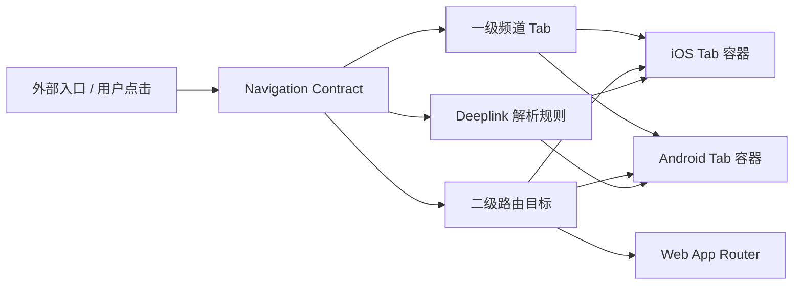

# 技术方案（共享部分）：PRD-01 底部导航与应用路由

> 创建日期：2026-07-25
> 对应需求：spec.md

## 整体架构

本需求不引入后端接口和数据库变更，核心目标是在现有多端应用壳之上建立统一的**导航契约（Navigation Contract）**，由共享设计约束各端对一级频道、二级路由、deeplink 兼容与状态保持的实现方式。



### 共享设计原则

| 原则 | 说明 |
|------|------|
| 公开命名统一 | 对外公开路径统一使用 `play`、`detail`，避免多端术语分叉 |
| 兼容优先 | Android 既有 `player` deep link 需兼容，不能直接破坏已有链接 |
| 一级/二级分层 | 底部 Tab 负责一级频道，播放页/详情页属于二级路由，不直接作为 Tab |
| 状态隔离 | 每个 Tab 独立维护自己的导航栈与页面状态，避免跨频道串栈 |
| 无后端依赖 | 本期仅做端侧导航骨架，不新增 RESTful API 或数据表 |
| 渐进扩展 | 频道占位页和子页面占位页都必须可被后续 PRD 平滑替换 |

## API 设计

### 涉及变更

| 类型 | 数量 | 说明 |
|------|------|------|
| 新增接口 | 0 | 本需求不新增后端接口 |
| 修改接口 | 0 | 不修改现有 `/api/health` 等接口 |
| 废弃接口 | 0 | 无 |

### 结论

- 本需求为**纯客户端导航与路由骨架设计**。
- 不新增 RESTful API，也不修改后端响应结构。
- `design-{platform}.md` 中不得臆造任何后端接口调用。
- 如平台内需要页面占位数据，必须来自本地常量/路由参数/现有配置，而非假设中的服务端返回。

## 数据模型

### 新增/变更数据表

| 表名 | 操作 | 说明 |
|------|------|------|
| — | 无 | 本需求不涉及数据库或服务端 schema 变更 |

### 导航契约模型定义

> 以下为跨端共享的抽象模型，用于统一术语与路由行为，不要求直接跨语言共享代码，但各端语义必须一致。

```typescript
const TabKeySchema = z.enum(['home', 'theater', 'mall', 'earn', 'profile']);

const RouteKindSchema = z.enum(['tab', 'play', 'detail']);

const PublicRouteNameSchema = z.enum(['home', 'play', 'detail', 'search', 'rankings', 'mall']);

const TabItemSchema = z.object({
  key: TabKeySchema,
  label: z.string(),
  iconToken: z.string(),
  publicPath: z.string(),
});

const RouteTargetSchema = z.object({
  kind: RouteKindSchema,
  tab: TabKeySchema,
  id: z.string().min(1).optional(),
  publicRouteName: PublicRouteNameSchema,
});

const DeeplinkAliasSchema = z.object({
  canonicalHost: z.string(),
  acceptedHosts: z.array(z.string()).min(1),
});

const TabNavigationStateSchema = z.object({
  selectedTab: TabKeySchema,
  stackDepth: z.number().int().min(0),
  preservesLocalState: z.boolean(),
});
```

### 共享常量约束

| 类型 | 值 | 说明 |
|------|----|------|
| Tab keys | `home` / `theater` / `mall` / `earn` / `profile` | 一级频道内部标识 |
| Tab labels | 首页 / 剧场 / 商城 / 赚钱 / 我的 | 用户可见文案 |
| 公开播放路由 | `play/:id` | 对外统一命名 |
| 公开详情路由 | `detail/:id` | 对外统一命名 |
| Android 兼容别名 | `player/:id` | 仅用于兼容既有 deep link / route pattern |
| deeplink scheme | `djsdrama://` | 现有产品 scheme，不变 |

### 数据关系

```text
[TabItem] 1:1 --> [TabNavigationState]
[RouteTarget] N:1 --> [TabItem]
[DeeplinkAlias] 1:N --> [RouteTarget]
```

### 模型约束说明

| 模型 | 关键约束 |
|------|---------|
| TabItem | 仅允许 5 个一级频道，顺序固定 |
| RouteTarget | `play`、`detail` 必须携带非空 `id`；`tab` 类型不允许携带 `id` |
| DeeplinkAlias | `play` 为 canonical host；Android 需额外接受 `player` |
| TabNavigationState | 每个 Tab 独立维护，切换 Tab 时不得污染其他 Tab 的栈 |

## 跨端共享逻辑

| 共享逻辑 | 说明 | 涉及端 |
|---------|------|--------|
| 底部 5 Tab 定义 | Tab 数量、顺序、标签、图标语义保持一致 | iOS / Android |
| 默认落地规则 | 冷启动默认进入 `home` Tab | iOS / Android |
| 二级路由归属 | `play/:id`、`detail/:id` 归属首页频道容器承载 | iOS / Android / Web |
| 公开路由命名 | 对外统一使用 `play`、`detail` | iOS / Android / Web |
| Android 兼容别名 | Android 额外接收 `player/:id`，但内部需要映射回 canonical `play` 语义 | Android |
| deeplink 兜底 | 非法或不支持 deeplink 回退首页，不得崩溃 | iOS / Android |
| 状态保持 | 切换 Tab 时保留独立导航栈和局部状态；资源不足时允许降级回根页面 | iOS / Android |
| 占位页策略 | 各频道与子页面都提供占位内容，供后续 PRD 渐进替换 | iOS / Android / Web |

### 共享状态机

```text
App Launch
  -> Home Tab Active
  -> User Selects Tab
      -> Target Tab Active
      -> Previous Tab State Preserved
  -> User Opens Subpage (play/detail)
      -> Push in Active Tab Stack
  -> User Switches Tab
      -> Current Stack Frozen
      -> Other Tab Activated
  -> User Returns to Previous Tab
      -> Restore Frozen Stack
```

### 路由映射契约

| 输入类型 | 输入样例 | Canonical 目标 | 处理要求 |
|---------|---------|----------------|---------|
| Tab 点击 | `home` | `tab:home` | 直接切换一级频道 |
| 端内导航 | `/play/123` | `play:123` | 压入当前频道导航栈 |
| 端内导航 | `/detail/456` | `detail:456` | 压入当前频道导航栈 |
| iOS deeplink | `djsdrama://play/123` | `play:123` | 直接命中 canonical host |
| Android deeplink（兼容） | `djsdrama://player/123` | `play:123` | 先映射为 canonical，再导航 |
| 详情 deeplink | `djsdrama://drama/456` | `detail:456` | 保持现有 host 兼容，映射到详情目标 |
| 非法 deeplink | `djsdrama://unknown` | `tab:home` | 回退首页 |

## 安全考虑

- **认证与授权**：本期不引入登录态校验；`profile` Tab 未登录时可展示占位页，不做鉴权跳转。
- **数据校验**：所有动态路由参数必须先做非空校验；空 `id` 不能直接进入正常子页面流程。
- **敏感数据处理**：本期不处理用户隐私和凭证。
- **输入约束**：deep link host、path segment、端内路由参数都属于外部输入，必须做白名单判断，不能直接信任。

## 边界与错误处理（⚠️ 重点，最易遗漏）

### 错误处理架构

- **全局错误处理策略**：导航层错误优先在端内被捕获并降级到首页或当前 Tab 根页面，不向用户暴露底层实现细节。
- **错误响应格式**：本需求不新增后端错误响应；端内统一使用“无跳转 / 回退首页 / 回退根页”的降级策略。
- **错误日志与监控**：记录非法 deeplink、未知 route name、空参数导航、状态恢复失败等导航级错误日志，便于后续排查。

### 导航错误码定义（端内语义）

> 非 REST API 错误码；用于 design-{platform}.md 映射端内交互策略。

| 业务错误码 | HTTP 状态码 | 说明 | 用户提示文案 |
|-----------|------------|------|-------------|
| `INVALID_ROUTE_PARAMS` | — | 路由参数为空或非法 | 页面参数无效 |
| `UNSUPPORTED_ROUTE` | — | 未注册的 route / deeplink host | 暂不支持该页面 |
| `NAVIGATION_STATE_LOST` | — | 状态恢复时原导航栈不可用 | 已返回首页 |
| `TAB_STATE_RESTORED_PARTIALLY` | — | 系统回收后仅恢复当前 Tab | 页面已重新加载 |
| `DEEPLINK_CONTAINER_NOT_READY` | — | 冷启动时容器尚未可导航 | 正在打开页面 |

### 边界场景处理

| 场景 | 触发条件 | API 行为 | 说明 |
|------|---------|---------|------|
| 空参数/缺参数 | `/play/`、`/detail/` 或空 deeplink segment | 阻止导航，回退首页或当前 Tab 根页面 | 不允许空 ID 正常落地 |
| 参数边界值 | 超长、特殊字符、不可解析 id | 视为非法参数，走 `INVALID_ROUTE_PARAMS` | 先校验再导航 |
| 数据不存在 | 占位页阶段无远端校验能力 | 仍允许显示占位页，但需标明 id 来自路由参数 | 后续 PRD 再引入真实校验 |
| 重复提交 | 快速连续点击同一入口 | 去重或以最后一次导航为准 | 避免多层重复 push |
| 并发冲突 | 多事件同时尝试切换 Tab / push 子页 | 串行化路由操作 | 避免栈污染 |
| 容器未就绪 | 冷启动即收到 deeplink | 缓存待处理目标，容器 ready 后再执行 | 失败时回首页 |
| 服务降级 | 系统回收部分页面状态 | 当前 Tab 优先恢复，其他 Tab 可回根页 | 属于系统级可接受降级 |

## 性能考虑

- **预期 QPS**：无后端流量新增。
- **缓存策略**：本期不引入额外数据缓存；仅保留导航状态缓存/恢复策略。
- **数据库优化**：无。
- **导航性能目标**：
  - Tab 切换的视觉反馈应在 200ms 内完成。
  - 端内 push/pop 不应引发整棵根视图重建。
  - 恢复历史 Tab 时优先复用既有容器，而不是重新创建所有页面实例。

## 参考资料

### 已查阅的 wiki 文档

| 文档 | 相关章节 | 关键信息 |
|------|---------|---------|
| `wiki/features/app-shell/index.md` | 入口与路由 / 已知限制 | iOS/Android 当前仍为单页骨架，未实现底部导航 |
| `wiki/features/deeplink/index.md` | Deeplink 格式 / 多端实现 | iOS 已实现 `open` / `play` / `drama`；Android 存在骨架与命名差异 |
| `wiki/architecture/overview.md` | 跨端涉及 / 技术栈总览 | 确认 Web、iOS、Android 当前技术栈与结构边界 |

### 已查阅的代码文件

| 文件 | 关键内容 |
|------|---------|
| `docs/specs/2026-07-25-prd-01-bottom-nav/spec.md` | 已确认公开命名统一为 `play`，Android 需兼容 `player` |
| `ios/ShortDrama/Sources/App/AppRoute.swift` | iOS 现有端内枚举为 `home`、`player(videoId:)`、`dramaDetail(dramaId:)` |
| `ios/ShortDrama/Sources/App/DeeplinkHandler.swift` | iOS 已按 `play` / `drama` host 解析 deeplink |
| `ios/ShortDrama/Sources/App/NavigationRouter.swift` | iOS 当前为单栈导航，需要演进为多 Tab 独立状态 |
| `android/app/src/main/java/com/djs66256/short_drama/navigation/NavGraph.kt` | Android 当前 route 与 deep link 使用 `player/{videoId}`、`dramaDetail/{dramaId}` |
| `android/app/src/main/java/com/djs66256/short_drama/MainActivity.kt` | Android 入口仍为单个 NavGraph，未接入底部导航 |
| `web/src/app/page.tsx` | Web 已有首页路由 |
| `web/src/app/play/[id]/page.tsx` | Web 已有 canonical `play` 路由 |
| `web/src/app/detail/[id]/page.tsx` | Web 已有 canonical `detail` 路由 |
