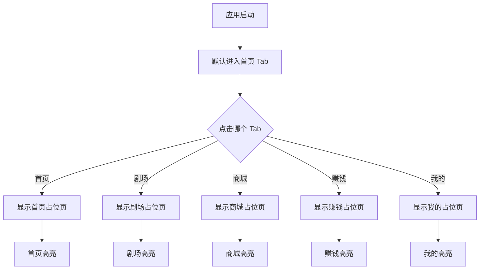
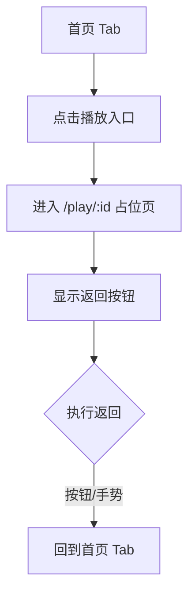
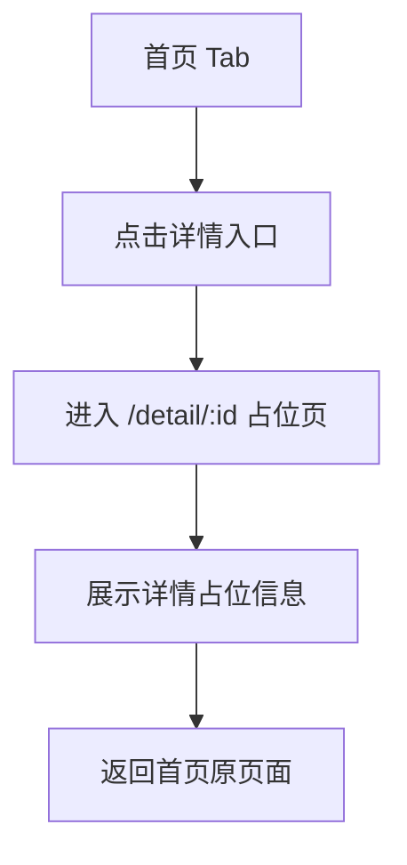
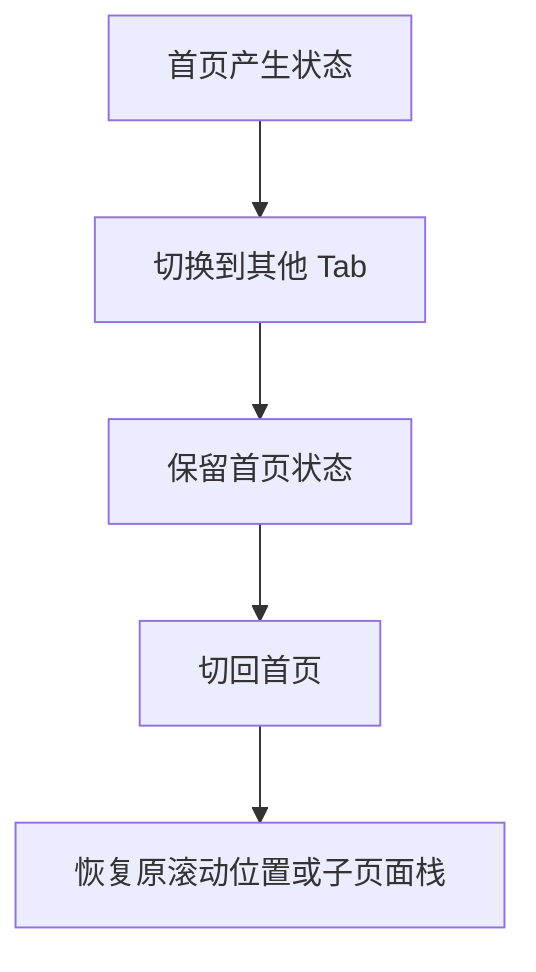
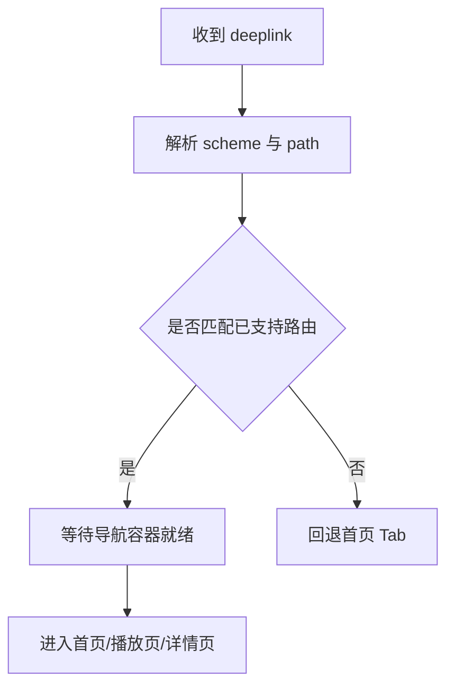

# 需求文档：PRD-01 底部导航与应用路由

> 创建日期：2026-07-25
> 状态：草稿
> 作者：AI Agent + daniel

---

## 1. 需求背景

### 1.1 问题描述

- **现状**：当前各端应用骨架已经初始化完成，但移动端仍以单入口占位页为主：iOS 由 `ShortDramaApp` 挂载单一 `NavigationStack` 和 `HomeView`，Android 由 `MainActivity` 挂载单个 `NavGraph` 与首页，占位页面只验证基础工程可运行；Web 已有 `/`、`/play/[id]`、`/detail/[id]` 基础路由，但尚未补齐与移动端频道结构一致的导航骨架。
- **痛点**：后续首页 Feed、播放器、剧场、商城、赚钱中心、我的等功能都需要稳定的频道入口与统一路由语义。如果底部导航和主路由骨架缺失，后续 PRD 将无法在统一容器中落地，也无法验证 Deeplink、页面返回、频道切换与状态保持等基础体验。
- **竞品参考**：红果使用 5 个底部主频道 Tab（首页 / 剧场 / 商城 / 赚钱 / 我的）承载核心流量入口；频道内可继续进入播放页、详情页等子页面，并保持返回路径清晰、频道切换稳定。

### 1.2 预期目标

- **目标**：建立跨 iOS / Android / Web 对齐的应用导航骨架，其中移动端完成 5 Tab 底部导航与子页面路由容器，Web 完成与频道规划一致的路由补齐，为 Sprint 1 后续 PRD 提供承载框架。
- **成功指标**（可度量）：
  - iOS 与 Android 启动后均默认落在「首页」Tab，底部固定展示 5 个 Tab，点击切换成功率 100%。
  - iOS 与 Android 可从首页跳转到播放页 `/play/:id` 与详情页 `/detail/:id` 占位页，并可返回原入口页面，连续 20 次返回无异常。
  - iOS 与 Android 切换 Tab 后保留各自导航栈与页面状态；在首页离开前的滚动位置或子页面栈返回后仍可恢复。
  - Web 路由 `/`、`/play/[id]`、`/detail/[id]`、`/search`、`/rankings`、`/mall` 均可访问且不返回 404。
  - 已有 Deeplink 语义与本次路由命名保持一致，不引入新的命名分叉。

### 1.3 范围定义

| 范围内 | 范围外（明确不做） | 原因 |
|--------|------------------|------|
| iOS/Android 5 Tab 底部导航骨架 | 各 Tab 内实际业务内容（Feed、剧场内容、商城商品等） | 由后续 PRD 分别实现 |
| iOS/Android 播放页与详情页占位路由注册 | 播放器能力、详情页业务信息渲染 | 由 PRD-03、后续详情相关 PRD 负责 |
| iOS/Android Tab 切换状态保持与返回行为定义 | 跨设备状态同步、云端恢复 | 不属于本期应用壳职责 |
| Web 路由对齐与频道占位页补齐 | Web 端底部 TabBar 视觉交互 | 当前 Web 只需路由承载，导航 UI 另行定义 |
| Deeplink 在新路由容器下的兼容要求 | Universal Links / App Links 完整建设 | 当前仅要求兼容既有 scheme 路径 |
| 导航命名规范（`/play/:id`、`/detail/:id` 等） | 新增搜索、排行、商城的完整业务交互 | 当前仅注册可访问占位路由 |

---

## 2. 术语表

| 术语 | 定义 | 来源 |
|------|------|------|
| Tab | 应用底部主频道导航项，对应首页、剧场、商城、赚钱、我的五个一级入口 | 本文档新定义（基于竞品与 PRD） |
| 主频道 | 由底部导航直接到达的一级页面容器 | 本文档新定义 |
| 子页面路由 | 从主频道继续进入的二级页面，如播放页、详情页 | wiki / 本文档新定义 |
| Deeplink | 通过 `djsdrama://` scheme 打开应用内指定页面的能力 | wiki/features/deeplink/index.md |
| 路由骨架 | 页面可被注册、跳转和返回的容器能力，不包含最终业务内容 | 本文档新定义 |
| 状态保持 | 用户切换 Tab 后，原 Tab 的导航栈、滚动位置和页面上下文尽量不被重置 | 本文档新定义 |

---

## 3. 涉及平台

| 平台 | 是否涉及 | 变更概要 |
|------|---------|---------|
| Backend | ❌ 不涉及 | 本需求为客户端导航与路由骨架，不新增后端接口 |
| Web | ✅ 涉及 | 补齐与移动端频道规划一致的路由骨架与占位页面 |
| iOS | ✅ 涉及 | 以 SwiftUI `TabView` + 独立导航栈实现底部导航、子页面路由与状态保持 |
| Android | ✅ 涉及 | 以 Compose `NavigationBar` + `NavHost` / 嵌套图实现底部导航、子页面路由与状态保持 |

---

## 4. 用户故事

| 编号 | 角色 | 需求 | 验收标准 | 涉及平台 | 优先级 |
|------|------|------|---------|---------|--------|
| US-01 | 所有用户 | 我希望在 5 个主频道之间快速切换 | 启动后默认进入首页；底部始终展示首页/剧场/商城/赚钱/我的 5 个 Tab；点击后页面切换与选中态正确 | iOS / Android | P0 |
| US-02 | 所有用户 | 我希望从首页进入播放页后能顺畅返回 | 从首页入口可进入 `/play/:id` 占位页；播放页可返回上一级；返回后仍位于首页 Tab | iOS / Android | P0 |
| US-03 | 所有用户 | 我希望从首页进入详情页后能顺畅返回 | 从首页入口可进入 `/detail/:id` 占位页；详情页可返回上一级；返回后上下文不丢失 | iOS / Android | P0 |
| US-04 | 所有用户 | 我希望切换频道后之前浏览的位置与页面上下文尽量保留 | 在首页滚动或进入子页面后切换到其他 Tab，再切回原 Tab 时，原有导航栈与页面状态仍保留 | iOS / Android | P1 |
| US-05 | Web 用户 | 我希望 Web 端具备与频道规划一致的可访问路由骨架 | `/`、`/play/[id]`、`/detail/[id]`、`/search`、`/rankings`、`/mall` 路由均可访问，页面能表达当前路由语义 | Web | P0 |
| US-06 | 外部入口用户 | 我希望现有 Deeplink 在新导航结构下仍能打开正确页面 | `djsdrama://open`、`djsdrama://play/{id}`、`djsdrama://drama/{id}` 在对应端保持兼容，不因底部导航改造失效 | iOS / Android | P0 |

---

## 5. 功能详述

### 5.1 US-01：5 Tab 底部导航切换

#### 流程描述

1. 用户冷启动应用。
2. 应用完成启动后默认展示「首页」Tab。
3. 底部导航栏固定展示 5 个主频道：首页、剧场、商城、赚钱、我的。
4. 用户点击任一 Tab，内容区切换到对应频道占位页面，并同步更新选中态。
5. 当前选中 Tab 的图标与文字高亮，未选中项保持弱化状态。
6. 用户可反复切换各频道，不出现白屏、闪烁或错误页面。



#### 前置条件

- [x] 应用可正常启动。
- [x] 底部 5 个主频道名称已确定为：首页 / 剧场 / 商城 / 赚钱 / 我的。
- [x] 每个主频道至少存在一个可渲染的占位页面。

#### 后置条件

- 当前选中的 Tab 成为唯一激活频道。
- 页面内容区与选中态同步更新。
- 未选中的频道状态被保留，除非系统因资源回收主动销毁。

#### 涉及的 UI/交互（如有）

| 页面 / 区域 | 交互描述 | 涉及端 |
|------------|---------|--------|
| 底部导航栏 | 固定展示 5 个 Tab，图标+标签组合，选中项高亮 | iOS / Android |
| 首页占位页 | 作为默认落地页，可承接后续 Feed 能力 | iOS / Android |
| 剧场 / 商城 / 赚钱 / 我的占位页 | 展示频道名称与后续建设提示 | iOS / Android |

#### 边界与异常

**错误处理：**

| 操作步骤 | 错误类型 | 触发条件 | 系统行为 | 用户感知 |
|---------|---------|---------|---------|---------|
| 渲染底部导航 | 本地状态初始化失败 | 默认 Tab 状态为空或非法 | 回退到首页 Tab 作为兜底值 | 应用仍进入首页，不出现空白容器 |
| 点击 Tab 切换 | 路由目标缺失 | 某频道占位页未注册 | 阻止切换并记录日志，保持当前频道 | 用户停留在原页面，不出现崩溃 |
| 快速连续点击多个 Tab | 连续交互冲突 | 300ms 内多次点击不同 Tab | 仅以最后一次选中结果为准 | 页面最终停在最后点击的频道 |
| 应用恢复时重建导航 | 系统回收导致状态丢失 | App 长时间后台后被系统杀死 | 重新初始化为首页 Tab | 用户重新进入首页，属于可接受降级 |

**边界场景：**

| 场景 | 触发条件 | 预期行为 |
|------|---------|---------|
| 首次启动后立即切换 Tab | 应用刚完成初始渲染 | 仍可正常切换，无明显卡顿 |
| 设备深色/浅色模式切换 | 系统主题变化 | 导航栏与选中态颜色仍保持可识别对比 |
| 横竖屏切换或窗口尺寸变化 | 设备旋转、分屏 | 导航栏结构不乱，当前选中频道保持 |
| 内存不足 | 系统释放后台页面 | 再次回到应用时允许回退到首页，不视为异常 |

### 5.2 US-02：首页进入播放页并返回

#### 流程描述

1. 用户位于首页 Tab。
2. 用户点击首页中的播放入口（当前阶段可为占位按钮、示例卡片或可测试入口）。
3. 应用将当前首页导航栈 push 到 `/play/:id` 对应的播放页占位页面。
4. 播放页展示视频标识与基础返回入口。
5. 用户点击返回按钮或系统返回手势。
6. 应用返回首页原上下文，仍处于首页 Tab。



#### 前置条件

- [x] 首页 Tab 可正常展示。
- [x] 播放页路由已注册。
- [x] 路由参数 `id` 可被安全传递给目标页。

#### 后置条件

- 播放页被压入当前 Tab 的导航栈。
- 返回后首页 Tab 仍为当前选中频道。
- 播放页本期仅展示占位信息，不承担真实播放能力。

#### 涉及的 UI/交互（如有）

| 页面 / 区域 | 交互描述 | 涉及端 |
|------------|---------|--------|
| 首页播放入口 | 提供进入播放页的明确点击触点 | iOS / Android |
| 播放页顶部返回区 | 支持点击返回或系统返回手势 | iOS / Android |
| 播放页内容区 | 显示 `id` 与“播放页占位”文案 | iOS / Android |

#### 边界与异常

**错误处理：**

| 操作步骤 | 错误类型 | 触发条件 | 系统行为 | 用户感知 |
|---------|---------|---------|---------|---------|
| 进入播放页 | 路由参数缺失 | 点击入口未携带有效 `id` | 阻止跳转，保留在首页，并记录错误 | 用户无页面跳转，可看到首页仍可继续操作 |
| 进入播放页 | 非法参数 | `id` 为空串、仅空白或包含不可解析格式 | 使用统一兜底文案或阻止跳转 | 用户不会看到崩溃页 |
| 返回首页 | 导航栈为空 | 页面已在根节点仍触发返回 | 忽略本次返回或保持在首页根节点 | 用户仍停留在首页 |
| Deeplink 直达播放页 | 目标页未注册 | 新导航容器未接入播放页目的地 | 回退首页并记录日志 | 用户被带回首页而非崩溃 |

**边界场景：**

| 场景 | 触发条件 | 预期行为 |
|------|---------|---------|
| 从首页重复进入同一播放页 | 连续点击相同入口 | 可根据端内导航策略去重或重复 push，但不得导致异常 |
| 播放页打开后切换到其他 Tab | 用户未返回直接切走 | 播放页栈保留在首页 Tab 内，切回首页仍在播放页上下文 |
| 系统返回手势与按钮并存 | iOS/Android 原生返回行为 | 两种方式都能返回首页，不产生双重 pop |
| App 后台恢复时停留在播放页 | 播放页处于前台后切后台 | 恢复后仍可见播放页或按系统规则回首页，不得崩溃 |

### 5.3 US-03：首页进入详情页并返回

#### 流程描述

1. 用户位于首页 Tab。
2. 用户点击详情入口（标题、封面或占位按钮）。
3. 应用 push 到 `/detail/:id` 对应的详情页占位页面。
4. 详情页展示剧集标识、页面标题与返回入口。
5. 用户返回后回到首页原上下文。



#### 前置条件

- [x] 首页存在可测试的详情入口。
- [x] 详情页路由已注册。
- [x] 路由参数 `id` 可传递到详情页。

#### 后置条件

- 详情页被压入首页所属 Tab 的导航栈。
- 返回后首页仍为当前 Tab。
- 后续详情业务能力可在当前占位页上继续扩展。

#### 涉及的 UI/交互（如有）

| 页面 / 区域 | 交互描述 | 涉及端 |
|------------|---------|--------|
| 首页详情入口 | 提供进入详情页的可点击区域 | iOS / Android |
| 详情页顶部返回区 | 支持返回到来源页面 | iOS / Android |
| 详情页内容区 | 展示 `id` 与“详情页占位”文案 | iOS / Android |

#### 边界与异常

**错误处理：**

| 操作步骤 | 错误类型 | 触发条件 | 系统行为 | 用户感知 |
|---------|---------|---------|---------|---------|
| 进入详情页 | 路由参数缺失 | 入口未传递 `id` | 阻止跳转并保留首页上下文 | 用户继续停留在首页 |
| 进入详情页 | 非法参数 | `id` 不符合预期格式 | 使用兜底占位态或阻止跳转 | 用户不会看到空白页或崩溃 |
| 返回详情来源 | 导航状态不一致 | 详情页被系统恢复但上级栈缺失 | 回到首页根节点 | 用户仍在首页 Tab 内 |
| Deeplink 直达详情页 | 路由容器未准备好 | 应用冷启动时先处理 deeplink 再渲染 Tab | 延迟到容器就绪后导航，失败则回首页 | 用户最终进入详情页或首页兜底 |

**边界场景：**

| 场景 | 触发条件 | 预期行为 |
|------|---------|---------|
| 详情页与播放页之间往返 | 后续详情页可能跳转播放页 | 当前阶段先保证详情页独立可进可退，不要求串联更多业务流程 |
| 多次进入不同详情页 | 首页点击不同占位内容 | 导航栈可连续压入多个详情页，返回顺序正确 |
| 详情页打开后切换 Tab | 用户切换到底部其他频道 | 详情页栈保留在首页 Tab 内，切回后仍可见 |
| 连续快速点击详情入口 | 用户重复点击 | 只保留最终一次有效跳转，不出现多层异常叠加 |

### 5.4 US-04：Tab 切换后的状态保持

#### 流程描述

1. 用户在首页 Tab 浏览内容并产生局部状态（如滚动位置、子页面导航栈）。
2. 用户切换到剧场、商城、赚钱或我的 Tab。
3. 应用保留首页原状态，不主动重建首页容器。
4. 用户再次切回首页。
5. 首页恢复至离开前的视图上下文；若当时位于子页面，则仍显示子页面。



#### 前置条件

- [x] 每个 Tab 有独立容器或等价的状态保存机制。
- [x] 移动端导航框架支持保存与恢复导航状态。

#### 后置条件

- 每个 Tab 的状态彼此独立。
- 用户切换 Tab 不会默认清空原导航栈。
- 系统资源不足时允许降级为重新初始化，但需行为可预测。

#### 涉及的 UI/交互（如有）

| 页面 / 区域 | 交互描述 | 涉及端 |
|------------|---------|--------|
| 首页列表区域 | 作为滚动位置保持的代表场景 | iOS / Android |
| 子页面导航栈 | 作为返回上下文保持的代表场景 | iOS / Android |
| 其他 Tab 占位页 | 用于验证多频道切换 | iOS / Android |

#### 边界与异常

**错误处理：**

| 操作步骤 | 错误类型 | 触发条件 | 系统行为 | 用户感知 |
|---------|---------|---------|---------|---------|
| 保存 Tab 状态 | 状态对象被销毁 | 切换 Tab 时容器重建 | 按兜底逻辑回到该 Tab 根页面 | 用户看到页面被重置，但应用可继续使用 |
| 恢复 Tab 状态 | 恢复数据失效 | 被恢复的路由参数已不存在 | 回退到该 Tab 根页面 | 用户回到频道首页，不出现异常栈 |
| 切换 Tab | 导航控制器冲突 | 共用单一栈导致返回关系串台 | 阻止跨 Tab 污染，保持当前 Tab 独立 | 用户不会从剧场返回到首页子页面之外的错误页面 |
| 后台恢复 | 系统资源回收 | App 恢复时部分 Tab 状态丢失 | 允许仅恢复当前 Tab，其余 Tab 重置根状态 | 用户感知为部分频道重新加载 |

**边界场景：**

| 场景 | 触发条件 | 预期行为 |
|------|---------|---------|
| 首页滚动后切换再返回 | 首页内容可滚动 | 返回后尽量保持原滚动位置 |
| 在首页子页面内切换 Tab | 当前位于播放页或详情页 | 切回首页 Tab 时仍在原子页面 |
| 多个 Tab 各自进入不同子页面 | 用户分别在多个频道内导航 | 各自栈互不污染，返回行为正确 |
| 系统强制杀进程后冷启动 | App 被彻底回收 | 允许重新进入首页根页面，文档中明确为系统级降级 |

### 5.5 US-05：Web 路由骨架对齐

#### 流程描述

1. 用户在 Web 端访问首页 `/`。
2. 用户可继续访问播放页 `/play/[id]` 与详情页 `/detail/[id]`。
3. 为对齐频道规划，系统新增 `/search`、`/rankings`、`/mall` 三个占位路由。
4. 每个页面均展示当前页面语义，便于后续功能接入。

```mermaid
flowchart TD
    A[访问 Web 路由] --> B{路由类型}
    B -->|/| C[首页]
    B -->|/play/[id]| D[播放页占位]
    B -->|/detail/[id]| E[详情页占位]
    B -->|/search| F[搜索页占位]
    B -->|/rankings| G[排行页占位]
    B -->|/mall| H[商城页占位]
```

#### 前置条件

- [x] Web 使用 Next.js App Router。
- [x] Web 已存在首页、播放页、详情页基础路由。
- [x] 新增页面可复用现有基础布局与样式体系。

#### 后置条件

- 所有目标路由均存在页面文件并可渲染。
- Web 端路由命名与移动端 PRD 术语保持一致。
- 当前阶段不要求 Web 具备底部导航视觉实现。

#### 涉及的 UI/交互（如有）

| 页面 / 区域 | 交互描述 | 涉及端 |
|------------|---------|--------|
| Web 首页 | 保留当前首页骨架 | Web |
| Web 播放页/详情页 | 展示当前 `id` 与占位说明 | Web |
| 搜索/排行/商城占位页 | 展示页面名称与后续建设提示 | Web |

#### 边界与异常

**错误处理：**

| 操作步骤 | 错误类型 | 触发条件 | 系统行为 | 用户感知 |
|---------|---------|---------|---------|---------|
| 访问路由 | 页面未注册 | 缺失对应 page 文件 | Next.js 返回 404 | 用户看到 not-found 页面，视为未达标 |
| 访问动态路由 | 参数缺失或非法 | `id` 为空、路由不完整 | 渲染兜底占位文案或走 not-found 策略 | 用户不会看到服务端崩溃 |
| 渲染页面元信息 | 标题配置不一致 | metadata 未更新 | 页面仍可访问，但 SEO 标题不准确 | 用户看到页面标题不统一 |
| 新增占位页 | 复用组件缺失 | 依赖的 UI 组件导出异常 | 页面构建失败，需在开发阶段暴露 | 用户上线前不会接收到坏页 |

**边界场景：**

| 场景 | 触发条件 | 预期行为 |
|------|---------|---------|
| 直接输入地址访问占位路由 | 用户手工输入 `/mall` 等 | 可直接打开对应占位页 |
| 浏览器刷新动态路由 | 用户刷新 `/play/123` | 页面正常重新渲染，不丢失参数 |
| Web 不做 TabBar | 与移动端承载方式不同 | 文档明确说明仅对齐路由，不对齐交互组件 |
| 后续新增频道入口 | 新功能逐步接入 | 保持当前命名规范，避免路由重命名 |

### 5.6 US-06：Deeplink 与路由命名兼容

#### 流程描述

1. 外部来源通过 `djsdrama://open`、`djsdrama://play/{id}` 或 `djsdrama://drama/{id}` 唤起应用。
2. 应用初始化导航容器。
3. 容器就绪后将 deeplink 解析为对应路由。
4. 若是首页 deeplink，则落在首页 Tab；若是播放页或详情页 deeplink，则进入首页 Tab 下的对应子页面或系统定义的目标承载容器。
5. 如果解析失败，则回退到首页 Tab，避免崩溃或空页。



#### 前置条件

- [x] 端内已声明 `djsdrama://` scheme。
- [x] Deeplink 解析逻辑与路由枚举存在统一映射。
- [x] 新导航容器可在应用启动后接收外部路由。

#### 后置条件

- 已支持的 deeplink 行为在新导航结构下保持兼容。
- 不支持或非法的 deeplink 不导致应用崩溃。
- 对外公开路由命名统一使用 `play`；Android 需兼容既有 `player` 命名，避免破坏已存在链接。
- 详情页对外统一使用 `detail`，端内可保留 `dramaDetail` 语义映射。

#### 涉及的 UI/交互（如有）

| 页面 / 区域 | 交互描述 | 涉及端 |
|------------|---------|--------|
| 外部 deeplink 入口 | 从浏览器、消息或系统调用进入应用 | iOS / Android |
| 首页 Tab | deeplink 兜底落地点 | iOS / Android |
| 播放页 / 详情页 | deeplink 命中后的目标页 | iOS / Android |

#### 边界与异常

**错误处理：**

| 操作步骤 | 错误类型 | 触发条件 | 系统行为 | 用户感知 |
|---------|---------|---------|---------|---------|
| 解析 deeplink | scheme 不匹配 | 非 `djsdrama://` 链接 | 忽略处理 | 用户留在当前应用状态 |
| 解析 deeplink | host/path 不支持 | 未注册的频道或非法 path | 回退首页 Tab 并记录日志 | 用户进入首页而非错误页 |
| 路由映射 | 命名不一致 | iOS/Android 对 `play` / `player` 使用不同命名 | 设计阶段统一映射或增加兼容别名 | 用户使用既有链接时仍能打开 |
| 冷启动处理 deeplink | 导航容器尚未就绪 | 应用初始化阶段立即收到 deeplink | 缓存待处理路由，待容器 ready 后执行 | 用户稍后进入目标页，不出现闪屏崩溃 |

**边界场景：**

| 场景 | 触发条件 | 预期行为 |
|------|---------|---------|
| 应用已在前台再次收到 deeplink | 重复打开外部链接 | 基于当前容器直接导航，不重建整个应用 |
| deeplink 打开后再切换 Tab | 用户从外部进入子页面后切到底部其他频道 | 原 deeplink 对应页面栈保留在所属 Tab 中 |
| Android 现有 deeplink 模式与 PRD 命名不一致 | 代码现状为 `player/{videoId}` | 在设计阶段明确兼容策略，不能直接破坏既有已声明链接 |
| 空参数 deeplink | `djsdrama://play/` | 回退首页或展示参数无效占位，不崩溃 |

---

## 6. 数据概览

| 数据实体 | 说明 | 关键字段 | 来源 |
|---------|------|---------|------|
| TabItem | 底部导航的频道定义 | key、label、icon、route | 系统内置配置 |
| RouteTarget | 可导航目标的抽象表示 | type、id、sourceTab | 系统生成 |
| TabNavigationState | 每个 Tab 的导航与界面状态快照 | selectedTab、stack、scrollPosition | 系统运行态 |
| DeeplinkPayload | 解析后的外部路由请求 | scheme、host、pathSegments、targetRoute | 外部链接解析 |

### 数据关系

```text
[TabItem] 1:1 --> [TabNavigationState]
[DeeplinkPayload] 1:1 --> [RouteTarget]
[RouteTarget] N:1 --> [TabItem]
```

- `TabItem` 定义一级频道。
- `RouteTarget` 描述播放页、详情页等二级目标，并指向所属频道容器。
- `TabNavigationState` 保存某个频道当前导航栈与页面局部状态。
- `DeeplinkPayload` 是外部输入，经解析后映射为 `RouteTarget`。

---

## 7. 现有功能影响

| 现有功能 | 影响类型 | 说明 | 是否需要迁移 |
|---------|---------|------|------------|
| iOS App Shell | 修改行为 | 从单一 `NavigationStack + HomeView` 演进为底部 5 Tab 容器与独立导航栈 | 否 |
| Android 导航骨架 | 修改行为 | 从单一 `NavGraph` 首页入口演进为底部导航 + 多频道容器 | 否 |
| Web 路由骨架 | 新增关联 | 保留现有首页/播放页/详情页，并新增搜索/排行/商城占位页 | 否 |
| Deeplink | 修改行为 | 需要在新容器下继续兼容现有链接解析与目标页落地 | 否 |

### 兼容性说明

- 本需求不涉及数据模型变更，不需要数据迁移。
- 对已存在的 deeplink 能力要求向后兼容；若路由命名需调整，只能通过兼容映射，不可直接破坏旧链接。
- Web 不强制同步移动端的底部交互组件，只同步路由语义。

---

## 8. 非功能性需求

### 8.1 性能

| 指标 | 目标值 | 测量方式 |
|------|--------|---------|
| 移动端首次展示底部导航 | 冷启动后 1 秒内可见主容器 | 本地真机/模拟器启动观察 |
| Tab 切换响应 | 点击后 200ms 内完成视觉反馈 | 手动交互验证 + 简单性能日志 |
| 页面返回响应 | 返回操作 200ms 内完成 | 手动交互验证 |
| Web 路由首屏渲染 | 占位路由打开不出现明显卡顿，开发环境 < 1 秒 | 本地开发环境访问观察 |

### 8.2 安全

| 关注点 | 要求 |
|--------|------|
| 认证与授权 | 本需求不引入登录校验；“我的”Tab 在未登录状态下仍可显示占位页 |
| 数据校验 | 所有动态路由参数必须做基础非空校验，避免空参数导致异常页面 |
| 敏感数据 | 本需求不处理用户敏感信息 |
| 防滥用 | deeplink 解析对非法路径做忽略或兜底，不执行未注册跳转 |

### 8.3 兼容性

| 维度 | 要求 |
|------|------|
| 设备兼容 | iOS 兼容项目当前最低版本 iOS 18.0；Android 兼容 minSdk 26；Web 兼容项目现有 Next.js 运行环境 |
| 数据兼容 | 不新增持久化数据结构，不影响旧数据 |
| 向后兼容 | 现有 `djsdrama://open`、`djsdrama://play/{id}`、`djsdrama://drama/{id}` 至少在行为上保持兼容 |

---

## 9. 依赖

| 依赖项 | 类型 | 说明 | 状态 | 阻塞 |
|--------|------|------|------|------|
| App Shell 骨架 | 内部能力 | 各端已有基础入口、主题和占位页 | ✅ 已就绪 | 否 |
| Deeplink 基础能力 | 内部能力 | iOS 已有解析器；Android 已声明 scheme 与初始导航骨架 | ✅ 已就绪 | 否 |
| Web App Router | 内部能力 | Next.js 文件系统路由已可新增页面 | ✅ 已就绪 | 否 |
| 产品频道定义 | 内部能力 | `PRODUCT.md` 与 PRD 已给出产品名称和频道规划背景 | ✅ 已就绪 | 否 |
| 后续业务 PRD | 内部能力 | 首页 Feed、播放器、剧场等后续能力将挂载到当前容器 | 📅 规划中 | 否 |

---

## 10. 待澄清问题

| 编号 | 问题 | 可能的答案 | 阻塞 |
|------|------|-----------|------|
| Q-01 | Web 端后续是否需要与移动端一致的 5 Tab 导航 UI，而非仅保留路由骨架？ | A: 本期仅做路由；B: 后续补充 Web 专属导航 UI | 否 |
| Q-02 | “我的”Tab 在未登录状态下本期是否仅展示占位页？ | A: 仅占位；B: 直接展示登录引导 | 否 |
| Q-03 | Android 现有代码使用 `player/{videoId}`，PRD/Deeplink 文档使用 `play/{id}`，后续以哪套公开命名为准？ | ✅ 已确认：统一为 `play`，并兼容既有 `player` 命名 | 否 |
| Q-04 | 详情页在公开命名上是否统一写作 `/detail/:id`，而端内枚举允许保留 `dramaDetail` 语义映射？ | A: 统一对外 detail；B: 对外也保留 dramaDetail | 否 |

---

## 11. 参考资料

### 已查阅的 wiki 文档

| 文档 | 相关章节 | 关键信息 |
|------|---------|---------|
| `wiki/index.md` | 功能索引 | 当前 wiki 以功能域、API、架构、决策组织 |
| `wiki/features/app-shell/index.md` | 入口与路由 / 多端实现 | 各端当前仍以应用壳和占位页面为主，iOS/Android 尚未实现底部导航 |
| `wiki/features/deeplink/index.md` | 入口与路由 / 核心逻辑 / 已知限制 | iOS 已实现 `djsdrama://open`、`play/{id}`、`drama/{id}`；Android 为骨架阶段 |
| `wiki/architecture/overview.md` | 整体架构 / 跨端涉及 | 确认多端技术栈、当前版本与 monorepo 结构 |

### 已查阅的代码文件

| 文件 | 关键内容 |
|------|---------|
| `docs/product_manager/prd/2026-07-25-bottom-nav/prd.md` | PRD 原始目标、范围、用户故事与子任务拆分 |
| `docs/product_manager/prd/2026-07-25-bottom-nav/subtasks.md` | iOS / Android / Web 子任务与完成标准 |
| `ios/CLAUDE.md` | iOS 约束：SwiftUI、NavigationStack、MVVM、测试要求 |
| `android/CLAUDE.md` | Android 约束：Compose、Navigation Compose、Hilt、测试策略 |
| `web/CLAUDE.md` | Web 约束：Next.js App Router、Page/Feature/Core 分层 |
| `ios/ShortDrama/Sources/App/ShortDramaApp.swift` | 当前 iOS 使用单一 `NavigationStack` + `HomeView`，并在 `.onOpenURL` 中处理 deeplink |
| `ios/ShortDrama/Sources/App/AppRoute.swift` | 当前 iOS 路由枚举包含 `home`、`player(videoId:)`、`dramaDetail(dramaId:)` |
| `ios/ShortDrama/Sources/App/NavigationRouter.swift` | 当前 iOS 为单一路由栈，尚未区分多 Tab |
| `ios/ShortDrama/Sources/App/DeeplinkHandler.swift` | iOS deeplink 解析 host 为 `open` / `play` / `drama` |
| `ios/ShortDrama/Sources/Features/Home/Views/HomeView.swift` | 当前首页为单页占位，暂无频道切换 |
| `ios/ShortDrama/Sources/Features/Player/Views/PlayerView.swift` | 播放页占位视图已存在 |
| `ios/ShortDrama/Sources/Features/DramaDetail/Views/DramaDetailView.swift` | 详情页占位视图已存在 |
| `android/app/src/main/java/com/djs66256/short_drama/MainActivity.kt` | 当前 Android 使用单一 `NavGraph`，未接入底部导航 |
| `android/app/src/main/java/com/djs66256/short_drama/navigation/NavGraph.kt` | 当前 Android 路由为 `home`、`player/{videoId}`、`dramaDetail/{dramaId}`，deeplink pattern 与文档存在命名差异 |
| `android/app/src/main/AndroidManifest.xml` | Android 已声明 `djsdrama` scheme intent-filter |
| `android/app/src/main/java/com/djs66256/short_drama/feature/home/ui/HomeScreen.kt` | Android 首页为单页占位 |
| `android/app/src/main/java/com/djs66256/short_drama/feature/player/ui/PlayerScreen.kt` | Android 播放页占位已存在 |
| `android/app/src/main/java/com/djs66256/short_drama/feature/dramadetail/ui/DramaDetailScreen.kt` | Android 详情页占位已存在 |
| `web/src/app/layout.tsx` | Web 根布局与 metadata |
| `web/src/app/page.tsx` | Web 首页已存在 |
| `web/src/app/play/[id]/page.tsx` | Web 播放页路由已存在 |
| `web/src/app/detail/[id]/page.tsx` | Web 详情页路由已存在 |
| `web/src/features/home/HomeScreen.tsx` | 首页提供到播放页、详情页示例入口 |
| `web/src/features/player/PlayerScreen.tsx` | 播放页占位实现 |
| `web/src/features/drama-detail/DramaDetailScreen.tsx` | 详情页占位实现 |
| `ios/project.yml` | iOS 最低版本为 18.0，且已配置 SwiftLint 预构建脚本 |

---

## 12. 变更历史

| 日期 | 变更内容 | 变更原因 |
|------|---------|---------|
| 2026-07-25 | 初始版本 | 基于 Sprint 1 PRD-01 建立底部导航与应用路由需求文档 |
