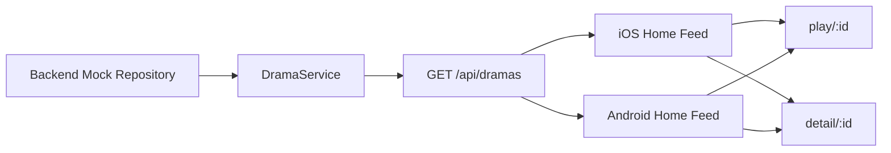

# 技术方案（共享部分）：PRD-02 首页信息流

> 创建日期：2026-07-25
> 对应需求：spec.md

## 整体架构

本需求在 PRD-01 已完成的应用壳和路由骨架之上，补齐首页信息流的**共享数据契约（Feed Contract）**、**首屏状态模型（Home Feed State Model）**和**跨端跳转语义（Route Mapping Contract）**。本期不扩展 Web Feed，也不将商城/赚钱纳入 Native 实现范围。



### 共享设计原则

| 原则 | 说明 |
|------|------|
| 契约先行 | 先统一 `/api/dramas` 的 canonical contract，再进入平台实现细节 |
| Native 优先 | 首页 Feed 仅在 iOS / Android Native 实现；Web 继续保持骨架 |
| 首页首屏优先 | MVP 只交付首页首屏第一页，不提前引入下拉刷新和自动翻页 |
| 列表优先于沉浸流 | 首版采用常规列表卡片，先验证内容浏览主链路 |
| 路由复用 | 首页播放入口继续复用 PRD-01 的 `play/:id`；详情入口复用 `detail/:id` |
| 平滑迁移 | Backend 保持既有 `/api/dramas` 外层结构，iOS / Android 向统一契约收敛 |

## API 设计

### 涉及变更

| 类型 | 数量 | 说明 |
|------|------|------|
| 新增接口 | 0 | 不新增新路由，沿用现有 `GET /api/dramas` |
| 修改接口 | 1 | 统一 `GET /api/dramas` 的字段集与多端消费契约 |
| 废弃接口 | 1 | iOS 侧不再继续依赖 `/api/v1/dramas` 包裹响应语义 |

### 修改接口

#### `GET /api/dramas`

- **变更说明**：将首页列表接口明确为唯一 canonical contract，供 Backend / iOS / Android 共同遵循。
- **变更前**：
  - Backend：`/api/dramas?page&pageSize`，返回 `{ data, pagination }`
  - Android：请求 `dramas?page&page_size`，期待 `{ data, pagination }`
  - iOS：请求 `/api/v1/dramas?page&page_size`，期待 `{ code, data: { items, pagination } }`
  - Backend 字段集与客户端字段集存在分叉（`total_episodes` vs `episode_count` / `episodeCount`，且缺少 `tags`）
- **变更后**：
  - 路径统一：`/api/dramas`
  - Query 统一：`page`, `pageSize`
  - Response 统一：`{ data, pagination }`
  - 首页卡片字段统一：`id`, `title`, `description`, `cover_url`, `category`, `episode_count`, `tags`, `rating`, `created_at`, `updated_at`
- **向后兼容性**：
  - 与 PRD-01 路由契约兼容
  - 不要求继续兼容 iOS 的 `/api/v1/dramas` 或 Android 的 `page_size`

- **Query Parameters**：

| 字段 | 类型 | 必填 | 默认值 | 说明 |
|------|------|------|--------|------|
| `page` | number | 否 | `1` | 页码，从 1 开始 |
| `pageSize` | number | 否 | `10` | 每页条数，MVP 首屏默认 10 |

- **Response**：

```json
{
  "data": [
    {
      "id": "550e8400-e29b-41d4-a716-446655440000",
      "title": "示例短剧",
      "description": "首页卡片描述",
      "cover_url": "https://example.com/cover.jpg",
      "category": "都市",
      "episode_count": 12,
      "tags": ["逆袭", "甜宠"],
      "rating": 8.6,
      "created_at": "2026-07-25T00:00:00Z",
      "updated_at": "2026-07-25T00:00:00Z"
    }
  ],
  "pagination": {
    "page": 1,
    "page_size": 10,
    "total": 20,
    "total_pages": 2
  }
}
```

| 字段 | 类型 | 说明 |
|------|------|------|
| `data` | `DramaCard[]` | 首页卡片列表 |
| `pagination.page` | number | 当前页码 |
| `pagination.page_size` | number | 实际页大小 |
| `pagination.total` | number | 总条数 |
| `pagination.total_pages` | number | 总页数 |

- **Error Codes**：

| HTTP 状态码 | 错误码 | 说明 |
|--------|--------|------|
| 200 | — | 成功 |
| 400 | `INVALID_PARAMS` | `page` / `pageSize` 参数非法 |
| 500 | `INTERNAL_ERROR` | Repository / Service 未预期异常 |
| 501 | `NOT_IMPLEMENTED` | 仅适用于 `GET /api/dramas/[id]` 等未实现链路，不适用于列表接口 |

## 数据模型

### 新增/变更数据表

| 表名 | 操作 | 说明 |
|------|------|------|
| — | 无 | 本需求不涉及数据库表结构变更；数据来自 Backend mock repository |

### Schema 定义

```typescript
const DramaCardSchema = z.object({
  id: z.string(),
  title: z.string().min(1),
  description: z.string().default(''),
  cover_url: z.string().url().nullable().default(null),
  category: z.string().default(''),
  episode_count: z.number().int().min(0),
  tags: z.array(z.string()).default([]),
  rating: z.number().min(0).max(10).nullable().default(null),
  created_at: z.string(),
  updated_at: z.string(),
});

const DramaListResponseSchema = z.object({
  data: z.array(DramaCardSchema),
  pagination: z.object({
    page: z.number().int().min(1),
    page_size: z.number().int().min(1),
    total: z.number().int().min(0),
    total_pages: z.number().int().min(0),
  }),
});
```

### 共享状态模型

```text
Idle
  -> Loading
      -> Success(items > 0)
      -> Empty(items = 0)
      -> Error(message)
Error
  -> Retry
      -> Loading
```

### 模型约束说明

| 模型 | 关键约束 |
|------|---------|
| `DramaCard` | 必须能独立支撑首页卡片渲染与播放/详情跳转 |
| `HomeFeedState` | 首版只覆盖 `loading / success / empty / error / retrying` |
| `Pagination` | 本期由 Backend 返回完整信息，但客户端仅消费第一页，不实现继续翻页交互 |
| `RouteTarget` | 播放入口使用 `drama.id -> play/:id`；详情入口使用 `drama.id -> detail/:id` |

## 跨端共享逻辑

| 共享逻辑 | 说明 | 涉及端 |
|---------|------|--------|
| 首页首屏加载 | 冷启动进入首页后自动请求第一页数据 | iOS / Android |
| 首页状态机 | 加载中、成功、空态、错误态、重试语义一致 | iOS / Android |
| 首页列表形态 | 首版统一为常规列表卡片，不做沉浸式大卡 | iOS / Android |
| 播放跳转映射 | 首页卡片主按钮统一将 `drama.id` 作为 `videoId` 打开 `play/:id` | iOS / Android |
| 详情跳转映射 | 首页卡片次级入口统一打开 `detail/:id` | iOS / Android |
| 首屏第一页范围 | 本期只请求第一页，不做下拉刷新和自动加载更多 | Backend / iOS / Android |
| 页面承载边界 | mall / earn 继续按 H5 容器接入，不纳入首页 Feed 交付 | Backend / iOS / Android |
| Web 范围边界 | Web 首页保持骨架，不实现 Feed UI 和列表状态机 | Web |

### 跨端数据流

```text
Backend Route (/api/dramas)
  -> returns DramaListResponse
  -> iOS/Android DataSource parse response
  -> Repository maps DTO to domain entity
  -> HomeViewModel emits HomeFeedState
  -> Home Screen renders list / empty / error
  -> User taps card -> router opens play/detail route
```

### 平台迁移分工

| 平台 | 当前现状 | 共享设计要求 |
|------|---------|-------------|
| Backend | Route 已存在，但 mock repository 为空，schema 字段不完全匹配首页卡片字段集 | 补齐 mock 数据，统一 schema 到 `episode_count` + `tags`，维持 `{ data, pagination }` |
| iOS | 当前 `HomeViewModel` 会请求数据，但只维护 `isLoading` / `errorMessage`，且 DataSource 仍使用 `/api/v1/dramas` 包裹响应 | 迁移到 `/api/dramas` + `{ data, pagination }`，扩展 ViewModel 为完整 Feed 状态模型 |
| Android | 当前首页 ViewModel 只展示 appName/appVersion，列表用例已存在但未接入首页；ApiService 仍使用 `page_size` | query 收敛到 `pageSize`，首页接入 `GetDramasUseCase`，建立完整 Feed UIState |

## 安全考虑

- **认证与授权**：首页 Feed 当前不要求登录可访问。
- **数据校验**：
  - Backend 使用 Zod 校验 `page` / `pageSize` 和响应字段。
  - 客户端对缺失封面、空描述、空标签、空列表做容错处理。
- **敏感数据处理**：首页卡片不包含用户隐私与账号敏感信息。
- **输入约束**：播放/详情跳转前必须校验 `drama.id` 非空；非法 id 不允许进入正常导航链路。

## 边界与错误处理（⚠️ 重点，最易遗漏）

### 错误处理架构

- **全局错误处理策略**：
  - Backend 继续通过 `withErrorHandler` 输出统一错误结构。
  - iOS / Android 首页对首屏请求失败统一落到错误态，不保留“应用名 + 示例按钮”旧占位路径作为假成功。
- **错误响应格式**：列表接口成功为 `{ data, pagination }`；失败由现有错误 middleware 输出 `{ error: { code, message } }`。
- **错误日志与监控**：记录参数校验失败、DTO 解析失败、空 id 跳转拦截、重复重试等关键日志。

### API 错误码定义

| 业务错误码 | HTTP 状态码 | 说明 | 用户提示文案 |
|-----------|------------|------|-------------|
| `INVALID_PARAMS` | 400 | `page` / `pageSize` 非法 | 请求参数无效 |
| `NOT_FOUND` | 404 | 资源不存在（未来详情接口） | 内容不存在 |
| `NOT_IMPLEMENTED` | 501 | `GET /api/dramas/[id]` 仍未实现 | 功能暂未开放 |
| `INTERNAL_ERROR` | 500 | 服务内部异常 | 加载失败，请重试 |

### 边界场景处理

| 场景 | 触发条件 | API / 系统行为 | 说明 |
|------|---------|---------------|------|
| 空列表 | Backend 返回 `data=[]` | 客户端进入 empty state | 不渲染伪卡片 |
| 单条数据 | 仅返回 1 条卡片 | 正常渲染完整卡片和双入口 | 验证最小成功态 |
| 缺少封面 | `cover_url = null` 或空值 | 客户端显示占位图/占位块 | 不因图片缺失失败 |
| 空描述 / 空标签 | `description=''` / `tags=[]` | 卡片降级展示，不破坏布局 | 文案区允许裁剪 |
| 参数非法 | `page < 1` 或 `pageSize > 100` | Backend 返回 400 + `INVALID_PARAMS` | 自动化测试覆盖 |
| 大页码 | `page > total_pages` | Backend 返回空数组和正确分页元信息 | 不报 500 |
| 重复重试 | 用户连续点击重试 | 客户端串行化请求或忽略重复提交 | 避免并发闪烁 |
| 空 id 跳转 | 卡片缺失 `id` | 阻止导航并记录错误 | 不进入异常路由 |

## 性能考虑

- **预期 QPS**：当前仅本地 / mock 数据验证，无真实生产流量目标。
- **缓存策略**：本期不引入离线缓存；首屏重新进入首页可重新请求第一页。
- **数据库优化**：无数据库变更。
- **客户端性能目标**：
  - 首页首屏在开发环境下 2 秒内可见首张卡片。
  - 首屏列表渲染不因图片缺失或空描述触发异常。
  - 首页状态切换（loading -> success/empty/error）不出现明显白屏闪烁。

## 设计结论

| 主题 | 结论 |
|------|------|
| 首页形态 | 常规列表卡片 |
| 首页分页 | 仅首屏第一页 |
| 搜索 / 榜单导流 | 本期不做 |
| 播放参数映射 | `drama.id` 直接复用为 `videoId` |
| Backend 契约 | `/api/dramas?page&pageSize` + `{ data, pagination }` |
| iOS 改造方向 | 从 `/api/v1/dramas` 包裹结构迁移到 canonical contract |
| Android 改造方向 | 从 `page_size` 迁移到 `pageSize` 并接入首页 ViewModel |
| Web 范围 | 不纳入本期 Feed 实现 |

## 参考资料

### 已查阅的 wiki 文档

| 文档 | 相关章节 | 关键信息 |
|------|---------|---------|
| `wiki/features/app-shell/index.md` | 入口与路由 / 已知限制 | PRD-01 已完成多端应用壳与首页默认落点 |
| `wiki/features/video-player/index.md` | 入口与路由 / 依赖关系 | 首页是播放页主入口之一，播放页当前仍为占位承载 |
| `wiki/features/deeplink/index.md` | 路由兼容 | 首页 Feed 不应破坏既有 `play` / `detail` 路由语义 |
| `wiki/architecture/overview.md` | 多端架构总览 | 确认 Backend / iOS / Android 当前的工程边界与技术栈 |

### 已查阅的代码文件

| 文件 | 关键内容 |
|------|---------|
| `docs/specs/2026-07-25-prd-02-homepage-feed/spec.md` | 已收敛 canonical contract、MVP 决策、分页与导流范围 |
| `backend/src/app/api/dramas/route.ts` | Backend 当前已提供 `/api/dramas?page&pageSize` 和 `{ data, pagination }` 外层结构 |
| `backend/src/lib/schemas.ts` | `DramaSchema` 当前仍使用 `total_episodes`，与首页卡片字段集存在差异 |
| `backend/src/repositories/mock/drama.mock.repository.ts` | 当前默认空数据，需要补齐首页 mock 列表数据 |
| `backend/src/services/drama/drama.service.ts` | Service 仅作委托，适合继续保持轻量 |
| `backend/src/app/api/__tests__/dramas.test.ts` | 当前仅验证空列表和默认分页，需扩展首页数据与分页测试 |
| `android/app/src/main/java/com/djs66256/short_drama/core/network/ApiService.kt` | Android 当前仍使用 `page_size` query |
| `android/app/src/main/java/com/djs66256/short_drama/data/datasource/DramaRemoteDataSource.kt` | Android 已具备列表数据链路封装 |
| `android/app/src/main/java/com/djs66256/short_drama/data/repository/DramaRepositoryImpl.kt` | Android 已具备 DTO -> Domain 映射链路 |
| `android/app/src/main/java/com/djs66256/short_drama/feature/home/viewmodel/HomeViewModel.kt` | Android 首页尚未接入剧集列表请求 |
| `ios/ShortDrama/Sources/Data/DataSources/DramaRemoteDataSource.swift` | iOS 当前仍使用 `/api/v1/dramas` 和包裹响应结构 |
| `ios/ShortDrama/Sources/Data/Repositories/DramaRepository.swift` | iOS Repository 已可承接 DataSource 迁移 |
| `ios/ShortDrama/Sources/Features/Home/ViewModels/HomeViewModel.swift` | iOS 已有加载骨架，但状态模型仍偏简化 |
| `ios/ShortDrama/Sources/Features/Home/Views/HomeView.swift` | iOS 首页 UI 仍为占位结构，需演进为列表 / 空态 / 错误态 |
| `PRODUCT.md` | mall / earn 为 H5，其余业务页默认 Native |
