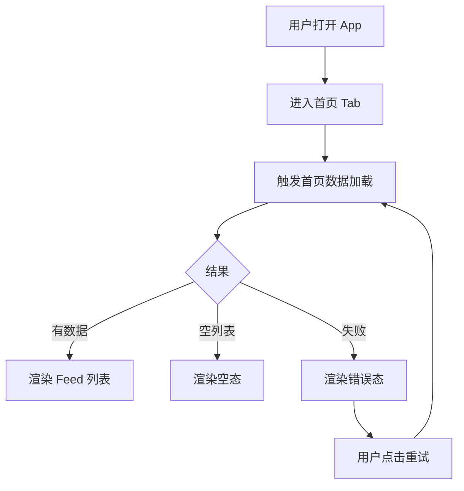
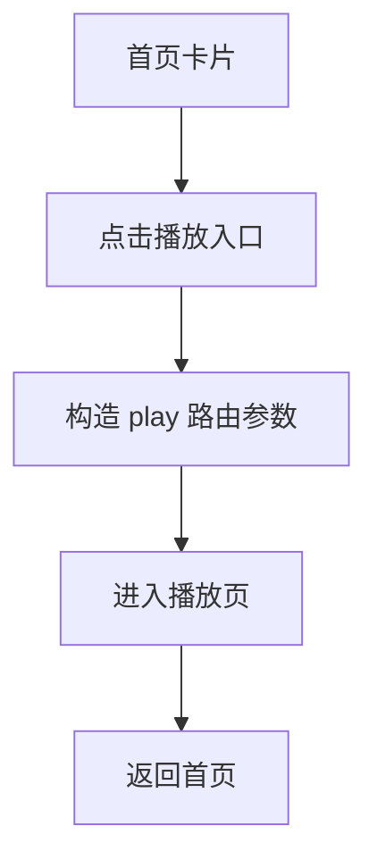
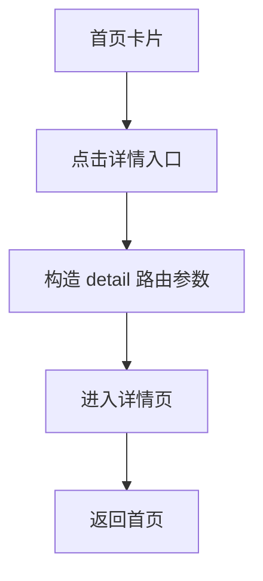
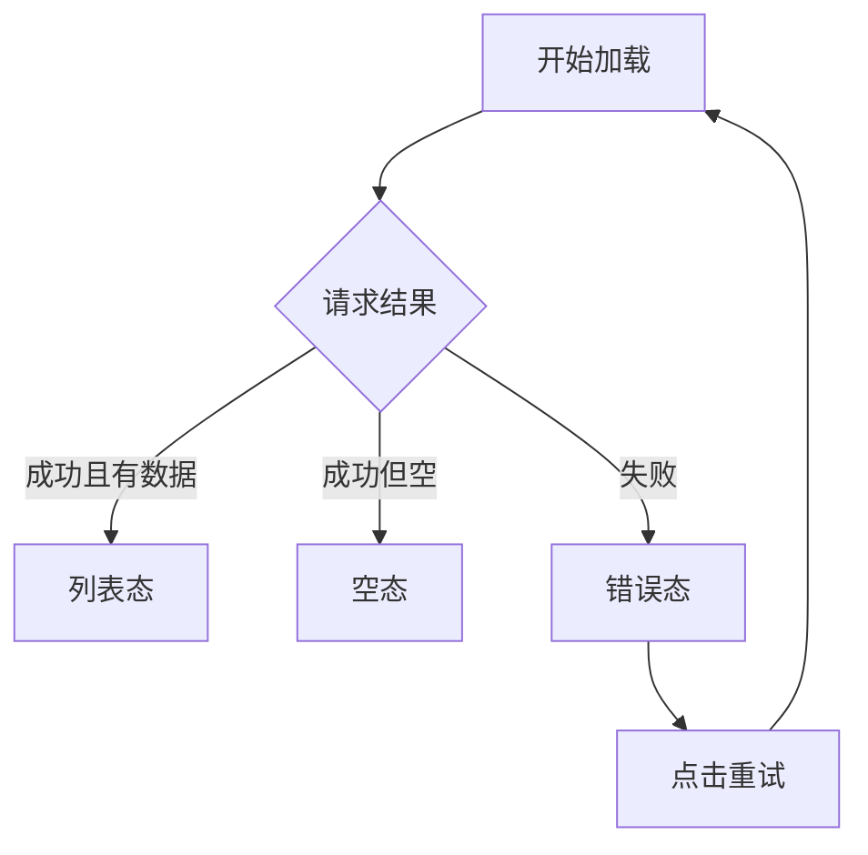
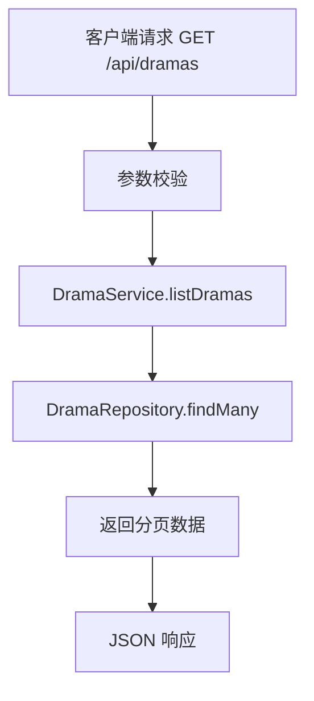
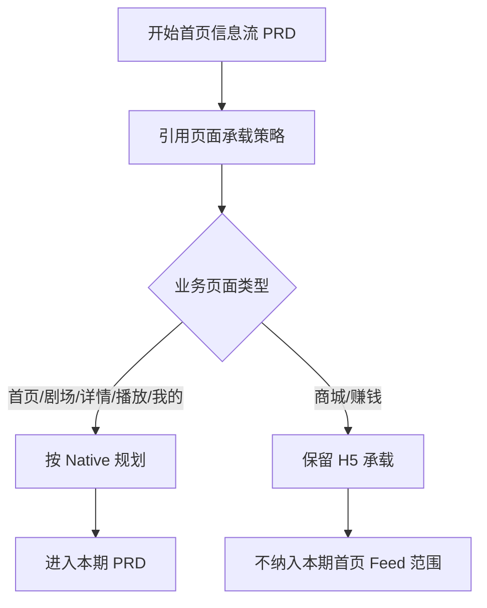

# 需求文档：PRD-02 首页信息流

> 创建日期：2026-07-25
> 状态：草稿
> 作者：AI Agent + daniel

---

## 1. 需求背景

### 1.1 问题描述

- **现状**：PRD-01 已完成跨端应用壳与路由骨架建设，移动端已具备首页 / 剧场 / 商城 / 赚钱 / 我的 5 个一级频道，以及播放页、详情页的子路由承载能力；但当前首页仍仅展示应用名、版本号和示例跳转按钮，没有真实内容消费入口。Backend 的 `GET /api/dramas` 已具备分页读取骨架，但默认返回空列表；iOS 虽已在 `HomeViewModel` 中发起 `FetchDramasUseCase`，Android 与 Web 首页仍停留在占位层。
- **痛点**：没有首页信息流，用户冷启动后无法进入短剧内容浏览主链路，应用无法承接推荐内容、完整观看转化、搜索发现导流，也无法验证后续详情页、播放器与 feed 卡片之间的主路径协同。
- **竞品参考**：红果首页默认进入竖屏短剧 Feed，首屏直接提供内容消费、评论围观、搜索承接与“观看完整短剧”转化入口；首页不是单纯菜单页，而是核心流量承接页（见 `docs/product_research/mobile/homepage-feed/homepage-feed.md`）。

### 1.2 预期目标

- **目标**：将首页从占位页演进为可消费的 Native 信息流首页，使用户在 iOS / Android 冷启动后直接进入内容列表浏览场景，并通过 Backend 的剧集接口提供首页所需的基础数据；Web 本期不实现首页 Feed，只维持既有骨架与路由承载。
- **成功指标**（可度量）：
  - iOS 与 Android 启动后默认进入首页 Feed，首屏在本地 mock / 开发数据下可稳定展示至少 1 条内容卡片。
  - iOS 与 Android 首页首屏加载完成时间在开发环境下 ≤ 2 秒（以首次可见卡片为准，不含冷启动安装时间）。
  - iOS 与 Android 首页支持至少 3 种可识别状态：加载中、空态、错误态；对应状态展示正确率 100%。
  - 首页每条卡片至少提供“进入播放页”和“进入详情页”两个明确动作，点击跳转成功率 100%。
  - Backend `GET /api/dramas` 返回满足首页展示所需的分页数据结构，分页参数校验与错误返回可通过自动化测试验证。

### 1.3 范围定义

| 范围内 | 范围外（明确不做） | 原因 |
|--------|------------------|------|
| iOS / Android Native 首页信息流首屏与常规列表卡片浏览 | 商城、赚钱频道业务页实现 | 已明确这两类页面由 H5 承载，不属于本期 Native 首页 Feed 范围 |
| Backend 首页剧集列表接口补齐 mock 数据与分页输出 | 推荐算法、个性化排序 | 当前先交付可消费的基础 Feed，不引入复杂推荐策略 |
| 首页卡片到播放页 / 详情页的主路径打通 | 评论抽屉、点赞、分享、收藏等互动能力 | 这些属于后续 PRD 的增强能力 |
| 首页加载中 / 空态 / 错误态 / 重试 | 搜索页完整能力、排行页完整能力 | 本期首页不提供搜索/榜单导流入口，仅保留内容卡片主路径 |
| iOS / Android ViewModel 与首屏第一页状态管理 | Web 首页改造成信息流 | 当前产品约束是除商城/赚钱的业务页优先按 Native 落地，Web 继续维持承载骨架 |
| 首页使用统一剧集卡片字段完成渲染与跳转 | 下拉刷新、自动加载更多、埋点、广告、商业化插槽 | 不属于首版信息流必需能力，本期分页仅作为接口契约与后续扩展预留 |

> 明确说明：根据最新产品事实，商城（mall）与赚钱（earn）频道使用 H5 页面承载，由 Native 容器接入；除此之外，首页、剧场、详情、播放、我的等业务页面默认按 Native 页面规划。本期 PRD-02 聚焦 Native 首页 Feed。

---

## 2. 术语表

| 术语 | 定义 | 来源 |
|------|------|------|
| 首页 Feed | 用户冷启动进入后默认看到的内容流首页，按列表或卡片形式展示短剧内容，并提供播放/详情转化入口 | 本文档新定义，参考 `docs/product_research/mobile/homepage-feed/homepage-feed.md` |
| Feed 卡片 | 首页中单条短剧内容的展示单元，至少包含封面、标题、基础描述和入口动作 | 本文档新定义 |
| 完整观看入口 | 用户从首页卡片进入播放页的主转化动作，承接完整剧集消费 | 参考竞品调研，本期在自身产品中映射为“打开播放页”动作 |
| 空态 | 首页请求成功但无可展示内容时的界面状态 | 本文档新定义 |
| 错误态 | 首页加载失败或数据非法时的降级展示状态 | 本文档新定义 |
| Native 页面 | 由 iOS / Android 客户端本地实现和渲染的业务页面 | 来源于 `PRODUCT.md` 页面承载策略 |
| H5 页面 | 通过 Web 页面承载、由 Native 容器接入的业务页面 | 来源于 `PRODUCT.md` 页面承载策略 |

---

## 3. 涉及平台

| 平台 | 是否涉及 | 变更概要 |
|------|---------|---------|
| Backend | ✅ 涉及 | 补齐 `GET /api/dramas` 首页所需 mock 数据与分页/校验能力，为 Native Feed 提供数据来源 |
| Web | ❌ 不涉及 | Web 继续保留现有首页骨架，不在本期实现 Feed 首页 |
| iOS | ✅ 涉及 | 将首页从占位页演进为 Native Feed 列表，补齐加载/空态/错误态与跳转动作 |
| Android | ✅ 涉及 | 将首页从占位页演进为 Native Feed 列表，补齐加载/空态/错误态与跳转动作 |

---

## 4. 用户故事

| 编号 | 角色 | 需求 | 验收标准 | 涉及平台 | 优先级 |
|------|------|------|---------|---------|--------|
| US-01 | 冷启动用户 | 我希望打开 App 后直接看到可浏览的短剧内容，而不是纯占位页 | iOS / Android 冷启动默认进入首页；首屏可见至少 1 条 Feed 卡片或明确空态；不再只显示应用名和示例按钮 | iOS / Android | P0 |
| US-02 | 内容浏览用户 | 我希望在首页卡片上快速判断内容并进入播放页 | 每条卡片至少展示标题、封面、分类/标签中的一种辅助信息；点击“播放”后进入 `/play/:id` 对应页面 | iOS / Android | P0 |
| US-03 | 内容浏览用户 | 我希望从首页卡片进入详情页查看更多剧集信息 | 首页卡片提供详情入口；点击后进入 `/detail/:id` 对应页面 | iOS / Android | P0 |
| US-04 | 弱网或异常用户 | 我希望首页在加载失败或无内容时给出明确反馈 | 首页至少覆盖 loading / empty / error 三种状态，并提供用户可理解的提示与重试能力 | iOS / Android | P0 |
| US-05 | 后端/客户端开发者 | 我希望首页数据结构稳定可复用，便于后续剧场、搜索、详情等功能接入 | `GET /api/dramas` 使用统一 canonical contract：路径 `/api/dramas`、query 为 `page` + `pageSize`、响应为 `{ data, pagination }`；字段能支撑首页基础卡片渲染；参数校验、空数据和错误路径有自动化测试 | Backend | P0 |
| US-06 | 产品与研发 | 我希望首页能力与页面承载策略一致，不误把 H5 页面纳入 Native 首页实现范围 | 本期 spec/design/plan 中明确：商城与赚钱为 H5 承载；首页 Feed 仅在 Native 端实现，不扩展到 Web Feed 或商城/赚钱业务页面 | Backend / iOS / Android | P1 |

---

## 5. 功能详述

### 5.1 US-01：冷启动进入 Native 首页 Feed

#### 流程描述

1. 用户冷启动打开 App。
2. 系统进入首页 Tab，并自动触发首页数据加载。
3. 首页在数据返回前展示 loading 状态。
4. 如果接口返回有数据，则展示 Feed 卡片列表；如果返回空列表，则展示空态；如果请求失败，则展示错误态与重试入口。



#### 前置条件

- [x] PRD-01 的首页导航容器已存在
- [x] iOS / Android 首页可作为默认落点
- [x] Backend 提供 `GET /api/dramas` 基础接口骨架

#### 后置条件

- 首页进入可观察的 loading / success / empty / error 之一
- 成功态下用户可继续进入播放页或详情页
- 失败态下用户可执行重试

#### 涉及的 UI/交互（如有）

| 页面 / 区域 | 交互描述 | 涉及端 |
|------------|---------|--------|
| 首页首屏 | 首次进入自动加载 Feed | iOS / Android |
| 首页列表区 | 展示多条短剧卡片，可滚动浏览 | iOS / Android |
| 空态区 | 提示当前暂无内容，可返回首页后重试或等待刷新 | iOS / Android |
| 错误态区 | 提示加载失败，并提供重试按钮 | iOS / Android |

#### 边界与异常

**错误处理：**

| 操作步骤 | 错误类型 | 触发条件 | 系统行为 | 用户感知 |
|---------|---------|---------|---------|---------|
| 首页初始化加载 | 网络异常 | 断网 / 超时 | 保留错误态并记录错误消息 | 显示“加载失败，请重试” |
| 首页初始化加载 | 服务端错误 | 500 / 502 / 503 | 进入错误态，不展示旧空白占位 | 显示错误提示 + 重试按钮 |
| 首页初始化加载 | 数据校验失败 | 返回字段缺失或结构不合法 | 拦截非法数据并进入错误态 | 用户看到统一错误态 |
| 首页初始化加载 | 操作超时 | 请求超过约定阈值 | 结束 loading，切换到错误态 | 用户可点击重试 |
| 首页初始化加载 | 空数据 | 接口返回 0 条 | 切换到空态 | 用户看到“暂无内容”提示 |

**边界场景：**

| 场景 | 触发条件 | 预期行为 |
|------|---------|---------|
| 空列表 | `data=[]` | 展示空态，不渲染伪列表 |
| 首屏仅 1 条数据 | 返回 1 条剧集 | 仍能完整展示卡片与跳转入口 |
| 超长标题 | 标题长度显著超出一行 | UI 截断或换行，不破坏卡片布局 |
| 缺少封面 | `cover_url` 为空 | 展示占位图或纯色占位区，不崩溃 |
| App 后台恢复 | 加载中时切后台再回来 | 保持已知状态，必要时允许重试 |
| 多次重复重试 | 用户连续点击重试按钮 | 避免重复并发请求或只保留最后一次有效请求 |

### 5.2 US-02：从首页卡片进入播放页

> MVP 默认决策：首页 Feed 先采用**常规列表卡片**形态；播放入口在播放器尚未引入独立 episode 选择前，统一**复用 `drama.id` 作为 `videoId` 占位参数**，沿用 PRD-01 既有 `play/:id` 路由契约。

#### 流程描述

1. 用户在首页浏览某条短剧卡片。
2. 用户点击卡片上的主动作按钮（如“观看”/“播放”）。
3. 系统直接使用当前卡片的 `drama.id` 作为播放页所需 `videoId`，并跳转到播放页。
4. 用户可按既有 PRD-01 路由逻辑返回首页。



#### 前置条件

- [x] 首页已有可点击卡片
- [x] 播放页路由 `play/:id` 已由 PRD-01 提供承载

#### 后置条件

- 用户进入播放页占位页
- 返回后仍位于首页 Tab

#### 涉及的 UI/交互（如有）

| 页面 / 区域 | 交互描述 | 涉及端 |
|------------|---------|--------|
| 首页卡片主按钮 | 进入播放页 | iOS / Android |
| 首页卡片整体 | 可作为次级点击区或仅主按钮有效，具体由 design 阶段定义 | iOS / Android |

#### 边界与异常

**错误处理：**

| 操作步骤 | 错误类型 | 触发条件 | 系统行为 | 用户感知 |
|---------|---------|---------|---------|---------|
| 点击播放入口 | 数据校验失败 | 当前卡片缺少可用 `id` | 阻止跳转并记录错误 | Toast 或无感拦截 + 错误态回退 |
| 点击播放入口 | 状态不一致 | 卡片数据已失效 / 被清空 | 不进入错误路由 | 用户停留在首页 |

**边界场景：**

| 场景 | 触发条件 | 预期行为 |
|------|---------|---------|
| 快速连续点击 | 连续点击主按钮 | 只进入一次播放页 |
| 返回首页后再次点击 | 用户返回后再次打开其他卡片 | 新卡片能正常跳转 |

### 5.3 US-03：从首页卡片进入详情页

#### 流程描述

1. 用户在首页某条卡片上点击详情入口。
2. 系统使用当前剧集标识构造 `/detail/:id` 路由。
3. 用户进入详情页占位页，并可返回首页。



#### 前置条件

- [x] 首页已成功渲染可交互卡片
- [x] 详情页路由 `detail/:id` 已由 PRD-01 提供承载

#### 后置条件

- 用户进入详情页占位页
- 返回后首页列表状态保持在可接受范围内

#### 涉及的 UI/交互（如有）

| 页面 / 区域 | 交互描述 | 涉及端 |
|------------|---------|--------|
| 首页卡片次级按钮 | 进入详情页 | iOS / Android |

#### 边界与异常

**错误处理：**

| 操作步骤 | 错误类型 | 触发条件 | 系统行为 | 用户感知 |
|---------|---------|---------|---------|---------|
| 点击详情入口 | 数据校验失败 | 缺少 `dramaId` | 阻止跳转 | 用户停留首页并收到提示 |
| 点击详情入口 | 并发冲突 | 卡片数据正在刷新 | 忽略重复点击或等待刷新完成 | 用户不进入异常页 |

**边界场景：**

| 场景 | 触发条件 | 预期行为 |
|------|---------|---------|
| 列表刷新后旧卡片点击 | 数据源已刷新 | 跳转使用最新稳定 id，或阻止无效点击 |
| 从详情返回 | 已进入详情再返回 | 首页仍展示原 Feed，不回到应用名占位页 |

### 5.4 US-04：首页异常与空态处理

#### 流程描述

1. 首页加载时统一进入 loading。
2. 请求成功但无数据时进入空态。
3. 请求失败时进入错误态，并提供重试。
4. 用户点击重试后重新执行加载流程。



#### 前置条件

- [x] 首页使用统一状态模型
- [x] 客户端可感知请求成功/失败/空数据

#### 后置条件

- 用户始终能理解首页当前处于何种状态
- 错误态可触发重试

#### 涉及的 UI/交互（如有）

| 页面 / 区域 | 交互描述 | 涉及端 |
|------------|---------|--------|
| Loading 区 | 显示骨架屏、loading spinner 或占位卡片 | iOS / Android |
| Empty 区 | 提示暂无内容，可配轻量插图或说明 | iOS / Android |
| Error 区 | 显示错误说明与重试按钮 | iOS / Android |

#### 边界与异常

**错误处理：**

| 操作步骤 | 错误类型 | 触发条件 | 系统行为 | 用户感知 |
|---------|---------|---------|---------|---------|
| 点击重试 | 网络异常 | 仍然断网 | 继续停留错误态 | 用户再次看到错误提示 |
| 点击重试 | 服务端错误 | 后端仍失败 | 不进入空态假成功 | 用户看到错误提示 |
| 点击重试 | 并发冲突 | 上一次请求未结束 | 按钮短暂禁用或忽略重复请求 | 避免闪烁 |

**边界场景：**

| 场景 | 触发条件 | 预期行为 |
|------|---------|---------|
| 空态后重试 | 后端后来有数据 | 可成功切回列表态 |
| 错误态后恢复网络 | 再次重试 | 正常进入列表态 |
| 首次加载很快返回 | loading 一闪而过 | 仍不出现布局抖动或白屏 |

### 5.5 US-05：Backend 提供首页基础剧集列表接口

#### 流程描述

1. 客户端请求 `GET /api/dramas?page=<n>&pageSize=<m>`。
2. Route 层按 canonical contract 校验分页参数，并仅要求首页首屏第一页消费该接口。
3. Service 层读取 Repository 数据。
4. Repository 返回首页可用的剧集列表和分页信息。
5. Route 层以统一结构 `{ data, pagination }` 返回给客户端。



#### 前置条件

- [x] Backend 已存在 `DramaService`、`DramaMockRepository` 和 `DramaSchema`
- [x] Route 层已具备分页参数校验骨架

#### 后置条件

- 接口在开发/测试环境返回首页首屏所需 mock 数据
- 参数错误或未实现路径有明确错误语义

#### 涉及的 UI/交互（如有）

| 页面 / 区域 | 交互描述 | 涉及端 |
|------------|---------|--------|
| 无 | Backend API，不直接涉及 UI | Backend |

#### 边界与异常

**错误处理：**

| 操作步骤 | 错误类型 | 触发条件 | 系统行为 | 用户感知 |
|---------|---------|---------|---------|---------|
| 请求列表接口 | 数据校验失败 | `page < 1` 或 `pageSize > 100` | Route 拒绝非法参数 | 客户端收到 4xx 错误 |
| 请求列表接口 | 服务端错误 | Repository 抛出异常 | 统一交给 `withErrorHandler` | 客户端收到标准错误结构 |
| 请求详情链路占位 | 未实现 | `GET /api/dramas/[id]` 仍未实现 | 返回 501 | 客户端或测试收到 `NOT_IMPLEMENTED` |

**边界场景：**

| 场景 | 触发条件 | 预期行为 |
|------|---------|---------|
| pageSize 较小 | `pageSize=1` | 正确分页返回 1 条 |
| 请求最后一页 | 已接近数据尾部 | 返回剩余数据，不越界 |
| 无数据仓库 | 仓库为空 | 返回 `data=[]` 与正确分页元信息 |
| 大页码 | `page` 大于总页数 | 返回空数组，不报错 |

### 5.6 US-06：首页 PRD 与页面承载策略保持一致

#### 流程描述

1. 产品与研发进入首页 Feed PRD 评审。
2. 文档明确商城与赚钱为 H5 页面，不纳入本期 Native 首页 Feed 的实现范围。
3. 各端 design/plan/coding 只围绕 Backend + iOS + Android 推进。



#### 前置条件

- [x] `PRODUCT.md` 已记录页面承载策略
- [x] `docs/product_manager/*` 已同步这一事实

#### 后置条件

- 后续 design / plan 不会把商城、赚钱错误纳入 Native 首页 Feed 需求
- Web 不会被错误扩展为首页 Feed 交付端

#### 涉及的 UI/交互（如有）

| 页面 / 区域 | 交互描述 | 涉及端 |
|------------|---------|--------|
| 文档约束 | 范围说明与端范围约束 | Backend / iOS / Android |

#### 边界与异常

**错误处理：**

| 操作步骤 | 错误类型 | 触发条件 | 系统行为 | 用户感知 |
|---------|---------|---------|---------|---------|
| 需求扩展评审 | 范围误判 | 把商城/赚钱纳入 Native 首页 | 在评审中直接驳回并修正文档 | 避免开发误投 |
| 端范围判断 | 平台误判 | 把 Web 也作为首页 Feed 主交付端 | 在 spec/design 阶段标记“不适用” | 保持实现边界清晰 |

**边界场景：**

| 场景 | 触发条件 | 预期行为 |
|------|---------|---------|
| 后续新增 H5 首页活动入口 | 首页卡片需跳转 H5 | 作为后续 PRD 评估，不在本期内直接扩展 |
| 商城/赚钱入口继续保留底部 Tab | 用户切换到对应频道 | Native 容器仍承载入口，但业务页面本体不属于本期实现 |

---

## 6. 数据概览

### 6.1 Canonical API Contract

本期首页 Feed 在 design / coding / QA 阶段统一以下 contract，避免各端继续各自演化：

| 项目 | Canonical 定义 | 说明 |
|------|----------------|------|
| Method | `GET` | 只读列表查询 |
| Path | `/api/dramas` | 不新增 `/api/v1/dramas` 变体 |
| Query | `page`, `pageSize` | 首版统一 camelCase；不再新增 `page_size` |
| Response | `{ data, pagination }` | 不使用 `{ code, data: { items, pagination } }` 包裹 |
| Pagination | `page`, `page_size`, `total`, `total_pages` | 返回体 pagination 沿用 Backend 现有 snake_case 结构 |

接口示例：

```json
{
  "data": [
    {
      "id": "550e8400-e29b-41d4-a716-446655440000",
      "title": "示例短剧",
      "description": "首页卡片描述",
      "cover_url": "https://example.com/cover.jpg",
      "category": "都市",
      "episode_count": 12,
      "tags": ["逆袭", "甜宠"],
      "rating": 8.6,
      "created_at": "2026-07-25T00:00:00Z",
      "updated_at": "2026-07-25T00:00:00Z"
    }
  ],
  "pagination": {
    "page": 1,
    "page_size": 10,
    "total": 1,
    "total_pages": 1
  }
}
```

### 6.2 首页卡片最小字段集

| 数据实体 | 说明 | 关键字段 | 来源 |
|---------|------|---------|------|
| Drama | 首页 Feed 的基础剧集卡片实体 | `id`、`title`、`description`、`cover_url`、`category`、`episode_count`、`tags`、`rating`、`created_at`、`updated_at` | Backend mock / 客户端 DTO 映射 |
| DramaListResponse | 首页列表接口返回结构 | `data[]`、`pagination.page`、`pagination.page_size`、`pagination.total`、`pagination.total_pages` | Backend API |
| HomeFeedUiState | 首页视图状态 | `loading`、`items`、`error`、`empty`、`retrying` 等 | iOS / Android ViewModel |

### 6.3 多端迁移策略

| 平台 | 当前现状 | 本期收口策略 |
|------|---------|-------------|
| Backend | 已使用 `/api/dramas` + `page/pageSize` + `{ data, pagination }`，但 `DramaSchema` 字段仍是 `total_episodes`，且缺少 `tags` | 保持 `/api/dramas` 与响应外层结构不变；将首页卡片字段统一到 `episode_count` + `tags` |
| Android | 已请求 `dramas?page&page_size`，期待 `{ data, pagination }` 与 `episode_count` | Android query 参数迁移到 `pageSize`，字段命名继续消费 `episode_count` |
| iOS | 当前请求 `/api/v1/dramas?page&page_size`，期待 `{ code, data: { items, pagination } }` | iOS 迁移到 `/api/dramas` + `page/pageSize` + `{ data, pagination }`，不保留额外包裹 |

### 6.4 数据关系

```text
[DramaListResponse]
    ├──1:N──▶ [Drama]
    │             ├──▶ [播放页路由参数 videoId]
    │             └──▶ [详情页路由参数 dramaId]
    └──1:1──▶ [Pagination]
```

---

## 7. 现有功能影响

| 现有功能 | 影响类型 | 说明 | 是否需要迁移 |
|---------|---------|------|------------|
| PRD-01 首页占位页 | 修改行为 | 首页将从应用名占位页演进为真实 Feed 首屏 | 否 |
| 播放页占位路由 | 新增关联 | 首页卡片将成为主要入口之一 | 否 |
| 详情页占位路由 | 新增关联 | 首页卡片将成为主要入口之一 | 否 |
| `GET /api/dramas` | 修改行为 | 从空列表骨架演进为返回首页首屏所需 mock 数据 | 否 |
| Web 首页骨架 | 无影响 | 继续保持承载骨架，不在本期演进为 Feed | 否 |
| 商城/赚钱频道 | 无影响 | 仍按 H5 承载策略处理 | 否 |

### 兼容性说明

- 不涉及数据库迁移或线上数据迁移。
- 本期不再将首页列表契约描述为“轻微差异”；当前已确认存在**路径、query 参数、响应包裹、字段命名**四层不一致，必须在 design 前统一到 Section 6 定义的 canonical contract。
- Backend 以 `/api/dramas` + `page/pageSize` + `{ data, pagination }` 作为唯一公开契约；Android 与 iOS 均向该契约收敛。
- 首页卡片字段统一使用 `cover_url`、`episode_count`、`tags` 等 API 字段；客户端内部可映射为 `coverUrl`、`episodeCount` 等平台命名，但不再反向推动新增接口变体。
- 向后兼容范围仅覆盖 PRD-01 已确定的 `play` / `detail` 路由契约；本期不额外承诺兼容 `/api/v1/dramas` 或 `page_size` 查询参数。

---

## 8. 非功能性需求

### 8.1 性能

| 指标 | 目标值 | 测量方式 |
|------|--------|---------|
| 首页首屏可见内容时间 | ≤ 2 秒（开发环境 mock 数据） | 手工验证 + 自动化状态测试 |
| 首页首次请求响应时间（P95） | ≤ 500 ms（本地 mock） | Backend 自动化测试 / 本地日志 |
| 首页滚动帧率 | ≥ 55 fps | 模拟器/预览手工观察 |
| 首屏最少内容数 | ≥ 1 条（成功态） | mock 数据断言 |
| MVP 翻页范围 | 仅首页首屏第一页 | spec/design/QA 统一验收口径 |

### 8.2 安全

| 关注点 | 要求 |
|--------|------|
| 认证与授权 | 首页 Feed 当前不要求登录可访问 |
| 数据校验 | Backend 参数使用 Zod 校验；客户端对关键字段做容错处理 |
| 敏感数据 | 首页卡片不包含用户隐私或敏感信息 |
| 防滥用 | 本期不做登录或反刷策略，后续如接真实推荐服务再补充 |

### 8.3 兼容性

| 维度 | 要求 |
|------|------|
| 设备兼容 | 兼容当前仓库已支持的 iOS / Android 最低开发目标版本 |
| 数据兼容 | 客户端应能处理缺失封面、空描述、空列表等兼容情况 |
| 首页交互兼容 | 本期仅定义首页首屏第一页；不要求下拉刷新、自动加载更多、分页错误态等交互 |
| 向后兼容 | 不改变 PRD-01 已确定的 `play` / `detail` 路由契约 |

---

## 9. 依赖

| 依赖项 | 类型 | 说明 | 状态 | 阻塞 |
|--------|------|------|------|------|
| PRD-01 应用壳与路由骨架 | 内部能力 | 首页 Feed 依赖既有首页 Tab 与播放/详情子路由 | ✅ 已就绪 | 否 |
| `GET /api/dramas` 接口骨架 | 内部能力 | 已存在 route/service/repository 骨架，但需补 mock 数据并统一字段到 canonical contract | 🚧 待开发 | 是 |
| iOS Drama 数据链路 | 内部能力 | 已具备 `FetchDramasUseCase` 与 `HomeViewModel.loadDramas()`，但需从 `/api/v1/dramas` + 包裹响应迁移到 canonical contract | 🚧 待开发 | 是 |
| Android Drama 数据链路 | 内部能力 | 已具备 DTO / repository / use case，但 query 参数需从 `page_size` 迁移到 `pageSize`，首页尚未接入 | 🚧 待开发 | 是 |
| 页面承载策略 | 产品约束 | 商城/赚钱为 H5，其它业务页默认 Native | ✅ 已就绪 | 否 |
| 竞品首页调研 | 参考资料 | 已有首页 Feed、搜索承接页研究结果；本期仅参考首页内容流，不实现搜索承接入口 | ✅ 已就绪 | 否 |

---

## 10. 待澄清问题

| 编号 | 问题 | 当前决策 / 处理方式 | 阻塞 |
|------|------|-------------------|------|
| Q-01 | 首页 Feed 的视觉形态是竖屏沉浸式单列卡片，还是常规列表卡片？ | **已定：MVP 先做常规列表卡片**，沉浸式形态留待后续 PRD 评估 | 否 |
| Q-02 | 首页是否要在本期引入搜索入口或仅保留内容卡片主路径？ | **已定：首版仅做内容卡片与播放/详情入口**，不补搜索/榜单导流入口 | 否 |
| Q-03 | Backend mock 数据量要固定多少条，是否需要分页翻页演示？ | **已定：准备 10~20 条 mock 数据并覆盖多页分页测试**，但客户端本期只消费第一页 | 否 |
| Q-04 | 首页卡片的“播放入口”是否直接使用 drama id 作为 `videoId` 占位参数？ | **已定：播放器占位阶段统一复用 `drama.id` 作为 `videoId`**，后续如引入 featured episode 再独立建模 | 否 |
| Q-05 | Web 首页是否在后续同一需求中跟进为 Feed？ | **已定：不跟进，本期维持骨架；未来如需演进，另立独立 PRD** | 否 |

---

## 11. 参考资料

### 已查阅的 wiki 文档

| 文档 | 相关章节 | 关键信息 |
|------|---------|---------|
| `wiki/index.md` | 索引 | 确认需从 wiki 与架构文档先了解当前状态 |
| `wiki/features/app-shell/index.md` | 入口与路由 / 核心逻辑 / 已知限制 | PRD-01 后首页仍是占位页，移动端已有首页 Tab 与播放/详情路由承载 |
| `wiki/architecture/overview.md` | 整体架构 / 当前导航承载结构 / 设计决策 | 确认当前系统以 5 Tab 导航壳为基础，Backend 尚未新增首页业务接口 |
| `wiki/features/video-player/index.md` | 入口与路由 / 依赖关系 | 确认首页已经是播放页主入口之一，播放页仍为占位实现 |
| `wiki/features/deeplink/index.md` | 依赖关系 / 已知限制 | 确认首页 Feed 需求不应破坏既有 deeplink 与路由契约 |

### 已查阅的代码文件

| 文件 | 关键内容 |
|------|---------|
| `PRODUCT.md` | 记录“商城和赚钱走 H5，其它业务页面默认 Native”的页面承载策略 |
| `docs/product_manager/backlog.md` | 确认 B-001 为首页信息流，属于下一迭代优先项 |
| `docs/product_manager/roadmap.md` | 确认首页 Feed 处于 Phase 1 核心播放体验阶段 |
| `docs/product_manager/progress.md` | 确认首页信息流当前仍处于规划中 |
| `docs/product_research/mobile/homepage-feed/homepage-feed.md` | 提供竞品首页信息流结构、入口与布局参考 |
| `docs/product_research/mobile/homepage-feed/search/search.md` | 提供竞品搜索承接页与首页导流关系参考 |
| `android/app/src/main/java/com/djs66256/short_drama/feature/home/ui/HomeScreen.kt` | Android 首页当前为应用名 + 两个示例按钮，占位实现 |
| `android/app/src/main/java/com/djs66256/short_drama/feature/home/viewmodel/HomeViewModel.kt` | Android 首页目前只读取 AppConfig，尚未请求剧集数据 |
| `android/app/src/main/java/com/djs66256/short_drama/domain/usecase/GetDramasUseCase.kt` | Android 已有可复用的剧集列表用例 |
| `android/app/src/main/java/com/djs66256/short_drama/domain/model/Drama.kt` | Android 端已定义 Drama 领域实体 |
| `android/app/src/main/java/com/djs66256/short_drama/data/dto/DramaDto.kt` | Android DTO 与 Backend schema 存在字段映射差异 |
| `android/app/src/test/java/com/djs66256/short_drama/feature/home/viewmodel/HomeViewModelTest.kt` | Android 首页测试当前只覆盖应用名/版本加载 |
| `ios/ShortDrama/Sources/Features/Home/Views/HomeView.swift` | iOS 首页当前已触发加载，但 UI 仍为占位页 |
| `ios/ShortDrama/Sources/Features/Home/ViewModels/HomeViewModel.swift` | iOS 已有首页加载 use case 与错误处理骨架 |
| `ios/ShortDrama/Sources/Domain/UseCases/FetchDramasUseCase.swift` | iOS 已有可复用的剧集拉取用例 |
| `ios/ShortDrama/Sources/Domain/Entities/Drama.swift` | iOS 端已定义 Drama 实体 |
| `ios/ShortDrama/Sources/Data/DTOs/DramaDTO.swift` | iOS DTO 到 Entity 的映射已存在 |
| `ios/ShortDrama/Tests/ViewModelTests/HomeViewModelTests.swift` | iOS 已覆盖空数据、失败、loading 等状态测试 |
| `web/src/features/home/HomeScreen.tsx` | Web 首页仍为骨架，不在本期演进为 Feed |
| `backend/src/app/api/dramas/route.ts` | Backend 列表接口已有分页校验和 Route 骨架 |
| `backend/src/app/api/dramas/[id]/route.ts` | 详情接口仍为 501，占位状态 |
| `backend/src/app/api/__tests__/dramas.test.ts` | Backend 当前测试只验证空列表和 POST 未实现 |
| `backend/src/services/drama/drama.service.ts` | Service 层当前只是简单委托 repository |
| `backend/src/repositories/mock/drama.mock.repository.ts` | Mock repository 当前默认为空数据，需要补首页可用内容 |
| `backend/src/lib/schemas.ts` | Backend 已定义 `DramaSchema` 与分页返回结构 |

---

## 12. 变更历史

| 日期 | 变更内容 | 变更原因 |
|------|---------|---------|
| 2026-07-25 | 初始版本 | 基于 PRD-01 已落地导航骨架、产品承载策略与首页竞品调研，启动首页信息流需求定义 |
