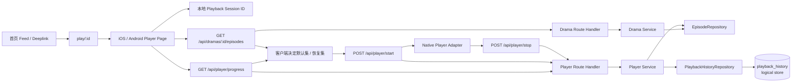

# 技术方案（共享部分）：PRD-03 完整观看播放器

> 创建日期：2026-07-26
> 对应需求：spec.md

## 整体架构

本需求在 PRD-01 已完成的移动端应用壳与 `play/:id` 路由承载能力、以及 PRD-02 已完成的首页 Feed 播放入口之上，补齐播放器首版闭环所需的**共享 API 契约**、**跨端状态机**、**匿名续播身份语义**与**播放页沉浸式承载规则**。

本期仅交付 iOS / Android Native 播放器与 Backend 首版播放器接口；Web 播放器继续保持占位态，`mall` / `earn` 继续按 H5 承载，不纳入本次播放器实现范围。



### 共享设计原则

| 原则 | 说明 |
|------|------|
| 路由兼容优先 | 对外继续使用 canonical `play/:id`；Android 继续兼容 legacy `player/:id`，但内部统一按 `dramaId` 解释 |
| Native 优先 | 播放器首版只在 iOS / Android Native 落地；Web 播放器与 H5 频道不纳入本期 |
| 启播查询前置 | 首版固定走 `progress -> episodes -> start`，由客户端决定默认集 / 恢复集 |
| 客户端选集 | `POST /api/player/start` 不负责决定恢复 episode，只接收已确定的 `episode_id` |
| 匿名续播闭环 | 通过本地持久化 UUID + `X-Playback-Session-Id` header 打通未登录续播 |
| 沉浸式承载 | 播放页进入后应隐藏移动端底部导航 / Tab Bar，避免破坏沉浸观看 |
| 原生控制优先 | 首版复用系统播放器原生播放 / 暂停 / 进度显示能力，页面 overlay 只承载返回、倍速、互动与选集，不扩展自定义手势控制 |
| 依赖克制 | shared 层只定义播放器抽象与契约，不在本阶段强绑定新的第三方播放器依赖 |

## API 设计

### 涉及变更

| 类型 | 数量 | 说明 |
|------|------|------|
| 新增接口 | 2 | `GET /api/dramas/:id/episodes`、`GET /api/player/progress` |
| 修改接口 | 2 | `POST /api/player/start`、`POST /api/player/stop` 从 501 占位演进为首版可用能力 |
| 废弃接口 | 0 | 无 |

### 新增接口

#### `GET /api/dramas/:id/episodes`

- **功能简介**：返回指定短剧的剧集列表与播放器首版渲染所需的通用信息，不承担个性化续播归属。
- **Path Parameters**：

| 字段 | 类型 | 必填 | 说明 |
|------|------|------|------|
| `id` | string | 是 | `dramaId`，短剧主标识 |

- **Query Parameters**：

| 字段 | 类型 | 必填 | 默认值 | 说明 |
|------|------|------|--------|------|
| — | — | — | — | 首版无 query 参数 |

- **Request Headers**：

| 字段 | 类型 | 必填 | 说明 |
|------|------|------|------|
| `X-Playback-Session-Id` | string | 否 | 首版不要求；该接口不读取个性化续播状态 |

- **Response**：

```json
{
  "code": 0,
  "data": {
    "drama_id": "550e8400-e29b-41d4-a716-446655440000",
    "series_status": "completed",
    "items": [
      {
        "id": "660e8400-e29b-41d4-a716-446655440001",
        "drama_id": "550e8400-e29b-41d4-a716-446655440000",
        "title": "第 1 集",
        "episode_number": 1,
        "duration": 180,
        "video_url": "https://example.com/video-1.mp4",
        "thumbnail_url": "https://example.com/thumb-1.jpg",
        "description": "第一集简介",
        "created_at": "2026-07-26T00:00:00Z",
        "updated_at": "2026-07-26T00:00:00Z"
      }
    ]
  },
  "message": "ok"
}
```

| 字段 | 类型 | 说明 |
|------|------|------|
| `code` | number | 状态码，`0` 表示成功 |
| `data.drama_id` | string | 当前短剧 ID |
| `data.series_status` | string | `completed` / `ongoing`，供底部选集栏展示文案使用 |
| `data.items` | `Episode[]` | 按 `episode_number` 正序排列的剧集列表 |
| `message` | string | 状态描述 |

- **Error Codes**：

| HTTP 状态码 | 错误码 | 说明 |
|--------|--------|------|
| 200 | — | 成功 |
| 400 | `INVALID_PARAMS` | `dramaId` 非法 |
| 404 | `DRAMA_NOT_FOUND` | 短剧不存在 |
| 500 | `INTERNAL_ERROR` | 服务内部错误 |

#### `GET /api/player/progress`

- **功能简介**：查询当前匿名播放身份在某部短剧下最近一次观看记录，用于播放器 bootstrap。
- **Path Parameters**：无
- **Query Parameters**：

| 字段 | 类型 | 必填 | 默认值 | 说明 |
|------|------|------|--------|------|
| `dramaId` | string | 是 | — | 当前进入播放器的短剧 ID |

- **Request Headers**：

| 字段 | 类型 | 必填 | 说明 |
|------|------|------|------|
| `X-Playback-Session-Id` | string | 是 | 客户端首次启动生成并持久化的匿名续播标识 |

- **Response**：

```json
{
  "code": 0,
  "data": {
    "drama_id": "550e8400-e29b-41d4-a716-446655440000",
    "has_history": true,
    "episode_id": "660e8400-e29b-41d4-a716-446655440003",
    "start_time": 330,
    "updated_at": "2026-07-26T00:00:00Z"
  },
  "message": "ok"
}
```

- **无历史记录时返回**：

```json
{
  "code": 0,
  "data": {
    "drama_id": "550e8400-e29b-41d4-a716-446655440000",
    "has_history": false,
    "episode_id": null,
    "start_time": 0,
    "updated_at": null
  },
  "message": "ok"
}
```

| 字段 | 类型 | 说明 |
|------|------|------|
| `data.has_history` | boolean | 是否存在有效续播记录 |
| `data.episode_id` | string \| null | 最近一次观看的剧集 ID；无记录时为 `null` |
| `data.start_time` | number | 恢复秒数；无记录时固定为 `0` |
| `data.updated_at` | string \| null | 最近一次续播记录更新时间 |

- **Error Codes**：

| HTTP 状态码 | 错误码 | 说明 |
|--------|--------|------|
| 200 | — | 成功 |
| 400 | `INVALID_PARAMS` | `dramaId` 非法 |
| 400 | `INVALID_PLAYBACK_SESSION` | `X-Playback-Session-Id` 缺失或不是合法 UUID |
| 404 | `DRAMA_NOT_FOUND` | 短剧不存在 |
| 500 | `INTERNAL_ERROR` | 服务内部错误 |

### 修改接口

#### `POST /api/player/start`

- **变更说明**：从 501 占位接口改为“已知 `episode_id` 后开始播放”的确认接口，不承担恢复集判定职责。
- **变更前**：
  - Route 仅抛出 `Errors.notImplemented(...)`
  - 无请求体解析、无参数校验、无 Service / Repository 调用
- **变更后**：
  - 解析 `PlayerStartRequestSchema`
  - 校验 `drama_id`、`episode_id` 与 `X-Playback-Session-Id`
  - 校验 `episode_id` 属于 `drama_id` 且当前可播放
  - 返回本次起播确认结果，不直接替代 `GET /api/player/progress`
- **向后兼容性**：兼容既有 `drama_id + episode_id + progress` 请求体形态；不兼容“由 start 接口决定恢复哪一集”的旧设想

- **Request Headers**：

| 字段 | 类型 | 必填 | 说明 |
|------|------|------|------|
| `X-Playback-Session-Id` | string | 是 | 匿名续播标识 |

- **Request Body**：

```json
{
  "drama_id": "550e8400-e29b-41d4-a716-446655440000",
  "episode_id": "660e8400-e29b-41d4-a716-446655440003",
  "progress": 330
}
```

| 字段 | 类型 | 必填 | 说明 |
|------|------|------|------|
| `drama_id` | string | 是 | 当前短剧 ID |
| `episode_id` | string | 是 | 已经由客户端确定的目标剧集 |
| `progress` | number | 是 | 本次起播位置，默认集为 `0`，恢复集为 `start_time` |

- **Response**：

```json
{
  "code": 0,
  "data": {
    "drama_id": "550e8400-e29b-41d4-a716-446655440000",
    "episode_id": "660e8400-e29b-41d4-a716-446655440003",
    "accepted_progress": 330,
    "playback_session_id": "770e8400-e29b-41d4-a716-446655440000",
    "started_at": "2026-07-26T00:00:00Z"
  },
  "message": "ok"
}
```

- **Error Codes**：

| HTTP 状态码 | 错误码 | 说明 |
|--------|--------|------|
| 200 | — | 成功 |
| 400 | `INVALID_PARAMS` | 请求体非法 |
| 400 | `INVALID_PLAYBACK_SESSION` | header 缺失或非法 |
| 404 | `DRAMA_NOT_FOUND` | 短剧不存在 |
| 404 | `EPISODE_NOT_FOUND` | 剧集不存在或不属于该短剧 |
| 409 | `EPISODE_NOT_PLAYABLE` | 剧集当前无可播放资源 |
| 500 | `INTERNAL_ERROR` | 服务内部错误 |

#### `POST /api/player/stop`

- **变更说明**：从 501 占位接口改为续播写入接口；在退出、切集、切后台等场景上报并保存最近一次进度。
- **变更前**：
  - Route 仅抛出 `Errors.notImplemented(...)`
  - 无请求体解析、无持久化行为
- **变更后**：
  - 解析 `PlayerStopRequestSchema`
  - 校验 `X-Playback-Session-Id`
  - 对 `progress` 做非负与不超过 `duration` 的约束处理
  - 以 `(playback_session_id, drama_id)` 为维度 upsert 最近一次观看记录
- **向后兼容性**：兼容既有请求体字段形态；新增 header 约束

- **Request Headers**：

| 字段 | 类型 | 必填 | 说明 |
|------|------|------|------|
| `X-Playback-Session-Id` | string | 是 | 匿名续播标识 |

- **Request Body**：

```json
{
  "drama_id": "550e8400-e29b-41d4-a716-446655440000",
  "episode_id": "660e8400-e29b-41d4-a716-446655440003",
  "progress": 330,
  "duration": 480
}
```

| 字段 | 类型 | 必填 | 说明 |
|------|------|------|------|
| `drama_id` | string | 是 | 当前短剧 ID |
| `episode_id` | string | 是 | 当前播放剧集 |
| `progress` | number | 是 | 当前观看进度（秒） |
| `duration` | number | 是 | 当前剧集总时长（秒） |

- **Response**：

```json
{
  "code": 0,
  "data": {
    "drama_id": "550e8400-e29b-41d4-a716-446655440000",
    "episode_id": "660e8400-e29b-41d4-a716-446655440003",
    "saved_progress": 330,
    "duration": 480,
    "updated_at": "2026-07-26T00:00:00Z"
  },
  "message": "ok"
}
```

- **Error Codes**：

| HTTP 状态码 | 错误码 | 说明 |
|--------|--------|------|
| 200 | — | 成功 |
| 400 | `INVALID_PARAMS` | 请求体非法 |
| 400 | `INVALID_PLAYBACK_SESSION` | header 缺失或非法 |
| 404 | `DRAMA_NOT_FOUND` | 短剧不存在 |
| 404 | `EPISODE_NOT_FOUND` | 剧集不存在或不属于该短剧 |
| 500 | `INTERNAL_ERROR` | 服务内部错误 |

## 数据模型

### 新增/变更数据表

| 表名 | 操作 | 说明 |
|------|------|------|
| `playback_history` | 新建（logical model） | 记录匿名播放身份在某部短剧下最近一次观看的 `episode_id + progress` |
| `episodes` | 复用 | 使用现有 `EpisodeSchema`，补齐查询与种子数据，不新增共享字段 |

> 说明：当前仓库 Backend 仍以 mock / repository 抽象为主，shared design 先定义逻辑表结构与 repository 契约；实现阶段可先使用内存 / mock 持久化承载测试与开发验证，后续再映射到真实数据库。

### Schema 定义

```typescript
const PlaybackSessionIdHeaderSchema = z.string().uuid();

const PlayerProgressQuerySchema = z.object({
  dramaId: z.string().uuid(),
});

const PlaybackHistorySchema = z.object({
  playback_session_id: z.string().uuid(),
  drama_id: z.string().uuid(),
  episode_id: z.string().uuid(),
  progress: z.number().min(0),
  duration: z.number().min(1).optional().nullable(),
  updated_at: z.string(),
});

const EpisodeListResponseSchema = z.object({
  code: z.literal(0),
  data: z.object({
    drama_id: z.string().uuid(),
    series_status: z.enum(['completed', 'ongoing']).default('completed'),
    items: z.array(EpisodeSchema),
  }),
  message: z.string(),
});

const PlayerProgressResponseSchema = z.object({
  code: z.literal(0),
  data: z.object({
    drama_id: z.string().uuid(),
    has_history: z.boolean(),
    episode_id: z.string().uuid().nullable(),
    start_time: z.number().min(0),
    updated_at: z.string().nullable(),
  }),
  message: z.string(),
});

const PlayerStartResponseSchema = z.object({
  code: z.literal(0),
  data: z.object({
    drama_id: z.string().uuid(),
    episode_id: z.string().uuid(),
    accepted_progress: z.number().min(0),
    playback_session_id: z.string().uuid(),
    started_at: z.string(),
  }),
  message: z.string(),
});

const PlayerStopResponseSchema = z.object({
  code: z.literal(0),
  data: z.object({
    drama_id: z.string().uuid(),
    episode_id: z.string().uuid(),
    saved_progress: z.number().min(0),
    duration: z.number().min(1),
    updated_at: z.string(),
  }),
  message: z.string(),
});
```

### 逻辑模型约束

| 模型 | 关键约束 |
|------|---------|
| `PlaybackHistory` | 以 `(playback_session_id, drama_id)` 作为最近一次续播记录的逻辑唯一键 |
| `PlayerProgressResponse` | 无历史时返回 `has_history=false`，不以 404 表示“没有进度” |
| `EpisodeListResponse` | `items` 必须按 `episode_number` 正序返回 |
| `PlayerStartRequest` | 仅接收已知 `episode_id`，不再承担 bootstrap 决策 |
| `PlayerStopRequest` | `saved_progress` 需要被 clamp 到 `[0, duration]` |
| `series_status` | 首版只需要 `completed / ongoing` 两种枚举，供底部选集栏展示 |

## 跨端共享逻辑

| 共享逻辑 | 说明 | 涉及端 |
|---------|------|--------|
| 播放入口语义 | `play/:id` 对外保持不变；iOS / Android 内部统一将当前 `videoId` 解释为 `dramaId` | iOS / Android |
| Legacy 兼容 | Android 继续兼容 `player/:id` 与 `djsdrama://player/{id}`，落地后统一映射到同一播放器主流程 | Android |
| Bootstrap 顺序 | 固定 `GET /api/player/progress` → `GET /api/dramas/:id/episodes` → 解析目标集 → `POST /api/player/start` → 初始化播放器 | Backend / iOS / Android |
| 默认集选择 | `has_history=false` 或恢复集不可播放时，客户端选择第一条可播放 Episode 作为默认播放集 | iOS / Android |
| 恢复集选择 | `has_history=true` 且恢复集仍可播放时，优先恢复该 Episode 并从 `start_time` seek | iOS / Android |
| 切集规则 | 切到新集前先按需上报当前进度，再对新集调用 `POST /api/player/start(progress=0)`；不额外查历史恢复点 | Backend / iOS / Android |
| 匿名会话标识 | 客户端首次启动生成 UUID，保存在本地安全存储；进入播放器时若缺失则补生成 | iOS / Android |
| Header 透传范围 | `GET /api/player/progress`、`POST /api/player/start`、`POST /api/player/stop` 必须带 `X-Playback-Session-Id`；`GET /api/dramas/:id/episodes` 不带 | Backend / iOS / Android |
| 沉浸式布局 | 播放页进入后隐藏底部导航 / Tab Bar，仅保留播放器顶部栏与播放器内部 UI | iOS / Android |
| 原生播放控制 | 首版必须支持播放 / 暂停 / 进度显示，但优先复用系统原生播放器控件，不要求本期自定义播放控制条 | iOS / Android |
| 倍速策略 | 倍速为页面会话级状态，切集后默认沿用当前倍速，离开播放页后不要求持久化 | iOS / Android |
| 互动栏策略 | 点赞 / 收藏仅要求本地切换反馈；评论 / 分享为入口态，不绑定后端真实持久化 | iOS / Android |
| 页面承载边界 | `mall` / `earn` 继续 H5，不复用播放器 shared contract；Web 播放器本期保持占位页 | Web / iOS / Android |

### 共享状态机

```text
Idle
  -> Bootstrapping
      -> NoResource(all episodes unplayable / no episode)
      -> Error(api/schema/player init failed)
      -> Ready(target episode resolved)
Ready
  -> Starting(start acknowledged)
      -> Playing
Playing
  -> Paused(user pause / background)
  -> SwitchingEpisode
  -> Error(playback failure)
Paused
  -> Playing
  -> SwitchingEpisode
  -> Exiting
SwitchingEpisode
  -> Starting
  -> NoResource
  -> Error
Playing / Paused
  -> Exiting
Exiting
  -> Stopped(progress saved or best-effort skipped)
```

### 跨端数据流

```text
1. Home Feed / Deeplink 提供 dramaId
2. Player Page 读取 route param，并确保本地存在 playbackSessionId
3. 请求 GET /api/player/progress?dramaId=...
4. 请求 GET /api/dramas/:id/episodes
5. 客户端解析恢复集 / 默认集
6. 客户端请求 POST /api/player/start(drama_id, episode_id, progress)
7. Native Player Adapter 加载 video_url，并在需要时 seek 到 progress
8. 用户切集 / 返回 / 切后台时，客户端 best-effort 调用 POST /api/player/stop
9. 下次进入同一 drama 时，重复第 3 步完成续播
```

### 沉浸式导航结论

| 平台 | 当前现状 | Shared 设计要求 |
|------|---------|----------------|
| Android | 播放页当前仍挂在 home graph 的全局 `Scaffold(bottomBar=...)` 内 | Player route 命中时隐藏 `NavigationBar`，返回后恢复 |
| iOS | 播放页当前作为 home Tab 的 `NavigationStack` 子路由，`TabView` 默认会持续可见 | PlayerView 进入后隐藏 Tab Bar，返回 Home 时恢复 |

## 安全考虑

- **认证与授权**：
  - 首版播放器默认不要求登录即可观看；匿名续播通过 `X-Playback-Session-Id` 识别“同一设备/同一安装”的本地观看上下文。
  - `X-Playback-Session-Id` 仅用于续播归属，不等价于用户身份，不授予额外访问权限。
- **数据校验**：
  - `dramaId`、`episode_id`、`X-Playback-Session-Id` 统一按 UUID 校验。
  - `POST /api/player/start`、`POST /api/player/stop` 必须校验 episode 属于指定 drama。
  - `progress` 必须为非负数；`stop.progress` 超过 `duration` 时在服务端 clamp 到 `duration`。
- **敏感数据处理**：
  - 本地只保存匿名 UUID，不保存账号令牌或播放明文隐私数据。
  - Backend 返回续播信息时仅按当前 `playback_session_id + drama_id` 命中，不暴露其他匿名身份的观看记录。
- **输入约束**：
  - 对 `video_url`、`thumbnail_url` 等资源字段做合法 URL 校验；不合法时按无资源处理，不直接交给播放器内核。

## 边界与错误处理（⚠️ 重点，最易遗漏）

### 错误处理架构

- **全局错误处理策略**：
  - Backend 继续通过现有错误中间件统一处理参数与业务异常。
  - 客户端将 bootstrap 错误、播放内核错误与无资源状态分开建模，避免把所有失败都降级成同一种“加载失败”。
- **错误响应格式**：播放器成功响应统一使用 `{ code, data, message }`；失败场景沿用现有错误处理中间件输出的标准错误对象。
- **错误日志与监控**：记录非法 header、非法 episode 归属、恢复集不存在、播放器初始化失败、停止上报失败等关键日志。

### API 错误码定义

| 业务错误码 | HTTP 状态码 | 说明 | 用户提示文案 |
|-----------|------------|------|-------------|
| `INVALID_PARAMS` | 400 | 路径 / query / body 参数非法 | 请求参数无效 |
| `INVALID_PLAYBACK_SESSION` | 400 | `X-Playback-Session-Id` 缺失或非法 | 播放身份无效，请重试 |
| `DRAMA_NOT_FOUND` | 404 | 短剧不存在 | 内容不存在 |
| `EPISODE_NOT_FOUND` | 404 | 剧集不存在或不属于该短剧 | 剧集不存在 |
| `EPISODE_NOT_PLAYABLE` | 409 | 剧集当前无可播放资源 | 当前剧集暂无资源 |
| `INTERNAL_ERROR` | 500 | 服务内部异常 | 加载失败，请重试 |

### 边界场景处理

| 场景 | 触发条件 | API / 系统行为 | 说明 |
|------|---------|---------------|------|
| 无历史记录 | 首次进入某短剧 | `GET /api/player/progress` 返回 `has_history=false` | 不返回 404，客户端直接走默认集 |
| 短剧不存在 | `dramaId` 未命中 | `GET /api/dramas/:id/episodes` 或 `GET /api/player/progress` 返回 `404 DRAMA_NOT_FOUND` | 属于错误态，不进入 no-resource |
| 短剧存在但无剧集 | `GET /api/dramas/:id/episodes` 命中空列表 | 返回 `200 + items=[]`，客户端进入 no-resource | 与“内容不存在”分开建模 |
| 恢复集不存在 | 历史里的 `episode_id` 已被删除 | 客户端忽略恢复记录，回退到第一条可播放 Episode | 需要记录 warning 日志 |
| 恢复集无资源 | `episode_id` 仍存在但 `video_url` 不可用 | 回退到默认集；若所有集都不可用则进入 no-resource | 避免卡死在不可播放集 |
| 全部剧集无资源 | 所有 Episode 都无有效 `video_url` | 页面进入 no-resource，选集面板全部置灰 | 不初始化播放器 |
| 切集过快 | 用户连续快速点击多个集数 | 客户端仅保留最后一次有效切集请求，取消前序未完成任务 | 避免并发 start/stop 打架 |
| `stop` 上报失败 | 退出 / 切后台时网络失败 | 视为 best-effort，不阻塞页面退出；记录日志并允许下次继续进入 | 首版不做本地离线补偿队列 |
| 背景恢复 | 播放中切后台后回到前台 | 页面恢复到 `Paused` 或 `Playing` 的可理解状态；必要时重新应用当前倍速与 seek | 不重新走整套 bootstrap |
| 旧 Android deeplink | 命中 `player/:id` | 导航层先统一映射到 `play/:id` 语义，再进入同一播放器流程 | 对外兼容，不在业务层分叉 |
| 底部导航残留 | 全局容器默认显示 tab bar / nav bar | Player route 显式隐藏底部导航 | 避免沉浸体验破坏 |

## 性能考虑

- **预期 QPS**：当前以本地开发 / mock 数据验证为主，无真实生产流量目标；播放器接口按单用户单次进入 2 个读接口 + 若干事件接口估算。
- **缓存策略**：
  - 客户端在单次播放页面生命周期内缓存当前 `Episode[]` 与当前倍速。
  - 首版不引入跨页面持久化缓存与离线续播同步。
- **数据库优化**：
  - `playback_history` 的逻辑查询主键应围绕 `(playback_session_id, drama_id)`。
  - `GET /api/dramas/:id/episodes` 只需按 `drama_id` 查询并按 `episode_number` 排序。
- **客户端性能目标**：
  - 进入播放器后，页面先显示确定性的 loading skeleton，不出现空白页。
  - 选集切换只替换当前播放器上下文，不重新构建整个页面壳。
  - 播放页隐藏底部导航后，布局重排不能造成明显闪烁。

## 共享状态映射

| Shared 状态 | iOS 状态 | Android 状态 | 说明 |
|------------|---------|-------------|------|
| `Idle` | `.idle` | `Idle` | 页面已创建但尚未触发 bootstrap |
| `Bootstrapping` | `.bootstrapping` | `Bootstrapping` | 正在执行 `progress -> episodes -> start` |
| `Ready` | `.ready` | `Ready` | 已确定目标集，播放器容器可渲染 |
| `Starting` | `.ready`（调用 start 到播放器真正开始前的短暂阶段） | `Ready`（同上） | 平台实现可折叠到 ready，不要求单独暴露 UI 态 |
| `Playing` | `.playing` | `Playing` | 当前媒体正在播放 |
| `Paused` | `.paused` | `Paused` | 用户暂停或切后台后的可恢复状态 |
| `SwitchingEpisode` | `.switchingEpisode` | `SwitchingEpisode` | 切集中的短暂过渡态 |
| `NoResource` | `.noResource` | `NoResource` | 无剧集或无任何可播放资源 |
| `Error` | `.error(message)` | `Error` | 接口失败、资源失败或播放器初始化失败 |
| `Exiting` | 不单独建模 | 不单独建模 | 作为 stop 上报的内部过程，不要求单独页面态 |
| `Stopped` | 不单独建模 | 不单独建模 | 表示退出完成后的终止态，由路由返回承接 |

## 设计结论

| 主题 | 结论 |
|------|------|
| 播放主路由 | 对外继续使用 `play/:id`，Android 兼容 `player/:id` |
| 路由参数语义 | 现有 `videoId` 命名仅做兼容承载，业务语义统一解释为 `dramaId` |
| 启播链路 | 固定 `progress -> episodes -> start` |
| 默认集选择 | 客户端选择第一条可播放 Episode |
| 恢复策略 | 优先恢复 `episode_id + start_time`，失效时回退默认集 |
| 续播身份 | 使用本地 UUID + `X-Playback-Session-Id` header |
| 进度保存 | 首版以退出 / 切集 / 切后台 best-effort 上报为主 |
| 沉浸式布局 | 播放页隐藏底部导航 / Tab Bar |
| Web 范围 | Web 播放器继续占位，不纳入本期 |
| H5 边界 | `mall` / `earn` 保持 H5，不复用本期播放器设计 |
| 三方依赖策略 | shared 层只定义播放器能力抽象；具体依赖选择放到平台方案中收口 |

## 参考资料

### 已查阅的 wiki 文档

| 文档 | 相关章节 | 关键信息 |
|------|---------|---------|
| `wiki/architecture/overview.md` | 整体架构 / 设计决策 / 已知限制 | 当前仓库是多端 harness；首页 Feed 已落地；播放器 API 仍为 501 |
| `wiki/features/app-shell/index.md` | 入口与路由 / Android / iOS 容器 | Android 为全局 `Scaffold`，iOS 为 `TabView + NavigationStack`，需要明确播放页隐藏底部导航 |
| `wiki/features/video-player/index.md` | 入口与路由 / 核心逻辑 | 当前播放页仍是展示 `videoId` 的占位页；首页 Feed 已是主入口 |
| `wiki/features/data-models/index.md` | Episode / Player 请求模型 | 当前已有 `EpisodeSchema`、`PlayerStartRequestSchema`、`PlayerStopRequestSchema` |
| `wiki/api/player.md` | API 文档现状 | `/api/player/start` 与 `/api/player/stop` 仍为 501 占位 |
| `PRODUCT.md` | 页面承载策略 | `mall` / `earn` 为 H5，其余业务页面按 Native 落地 |

### 已查阅的代码文件

| 文件 | 关键内容 |
|------|---------|
| `docs/specs/2026-07-26-prd-03-full-player/spec.md` | 收口了完整观看播放器的用户故事、progress→episodes→start 链路、匿名续播 header 契约 |
| `docs/product_manager/prd/2026-07-25-full-player/prd.md` | PRD 对齐了切集从 `0` 秒开始、断点续播与 API 依赖 |
| `docs/product_manager/prd/2026-07-25-full-player/subtasks.md` | 拆分了 Backend / iOS / Android 的 Sprint 与子任务边界 |
| `backend/src/lib/schemas.ts` | 当前已有 `EpisodeSchema`、`PlayerStartRequestSchema`、`PlayerStopRequestSchema` |
| `backend/src/app/api/player/start/route.ts` | 当前 `POST /api/player/start` 仍为 501 占位 |
| `backend/src/app/api/player/stop/route.ts` | 当前 `POST /api/player/stop` 仍为 501 占位 |
| `backend/src/app/api/dramas/route.ts` | 已有 `GET /api/dramas` route 结构，可复用 route / service 模式 |
| `backend/src/repositories/interfaces/episode.repository.interface.ts` | 已存在 `findByDramaId` / `findById` 抽象，可复用为剧集查询入口 |
| `backend/src/repositories/mock/episode.mock.repository.ts` | 已存在 Episode mock repository，可承接首版种子数据 |
| `ios/ShortDrama/Sources/Features/Player/Views/PlayerView.swift` | iOS 播放页仍是展示 `videoId` 的占位实现 |
| `ios/ShortDrama/Sources/Features/Player/ViewModels/PlayerViewModel.swift` | iOS 当前仅持有 `videoId` 初始化参数 |
| `ios/ShortDrama/Sources/App/TabNavigationHostView.swift` | iOS 播放页挂在 home Tab 的 `NavigationStack` 中 |
| `android/app/src/main/java/com/djs66256/short_drama/feature/player/ui/PlayerScreen.kt` | Android 播放页仍是展示 `Video ID` 的占位实现 |
| `android/app/src/main/java/com/djs66256/short_drama/feature/player/viewmodel/PlayerViewModel.kt` | Android 当前从 `SavedStateHandle` 读取 `videoId` / `id` |
| `android/app/src/main/java/com/djs66256/short_drama/navigation/NavGraph.kt` | Android 播放页当前处于全局 `Scaffold` 的 `NavigationBar` 容器中 |
