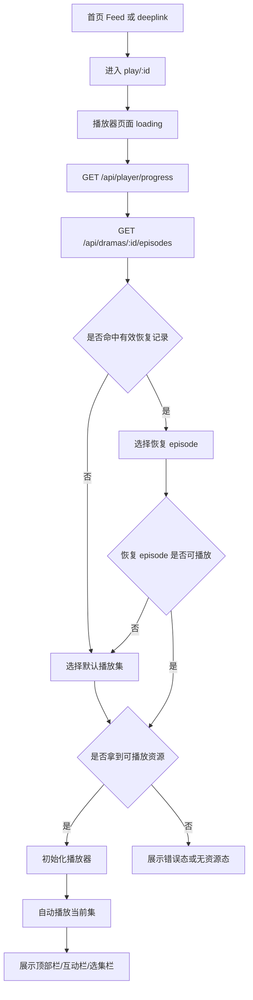
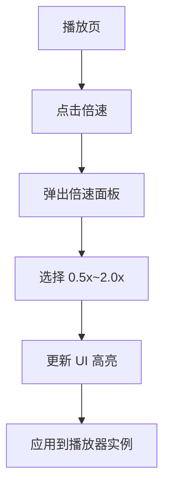
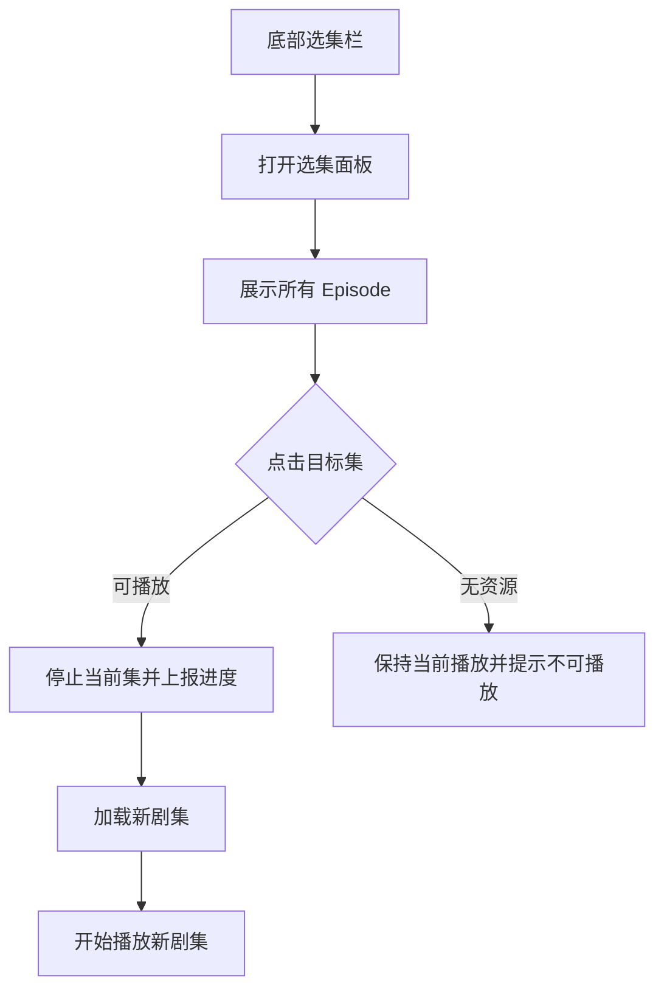
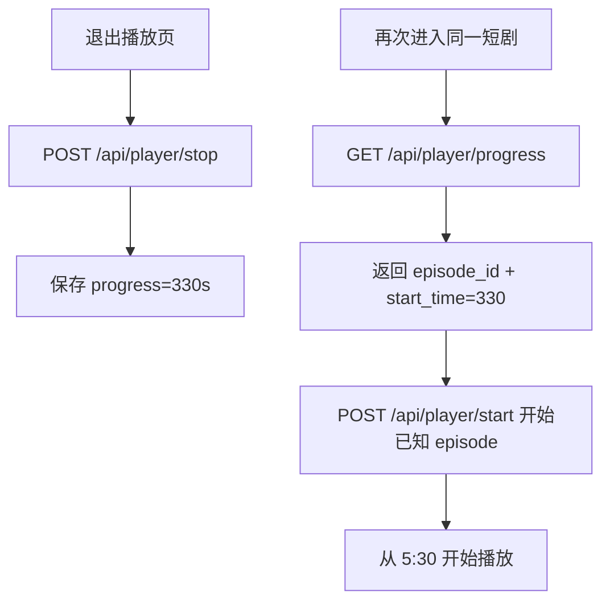
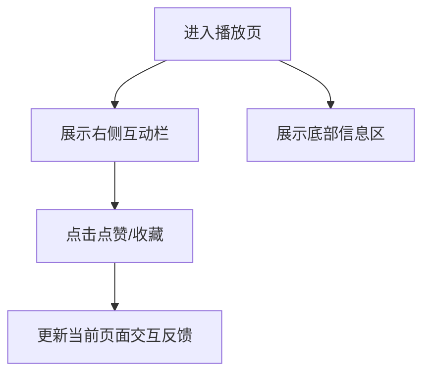
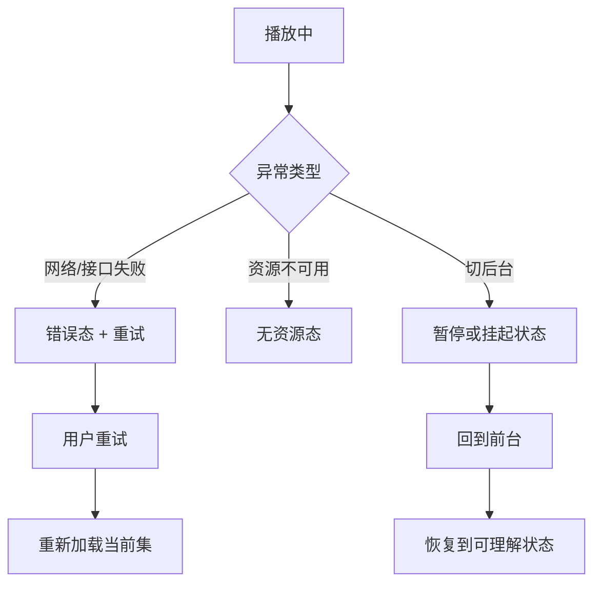

# 需求文档：PRD-03 完整观看播放器

> 创建日期：2026-07-26
> 状态：草稿
> 作者：AI Agent + daniel

---

## 1. 需求背景

### 1.1 问题描述

- **现状**：PRD-01 已完成跨端应用壳与播放页路由承载，PRD-02 已让首页 Feed 卡片可以进入播放页；但当前 iOS / Android 播放页仍只是展示 `videoId` 的占位页面，Backend 的 `POST /api/player/start` 与 `POST /api/player/stop` 仍统一返回 501，用户还无法在产品内完成真实的“完整观看短剧”体验。现有 Episode 数据模型虽然已存在，但尚未形成播放页消费链路。
- **痛点**：用户从首页点击“观看”后不能真正播放视频、不能切换剧集、不能调整倍速，也没有断点续播与错误恢复能力，导致首页推荐流无法转化为完整追剧链路，播放器这一核心场景仍未落地。
- **竞品参考**：红果完整观看页会在竖屏播放器上下文中提供返回、当前集数、倍速、更多操作、底部选集栏和右侧互动区，用户从首页推荐进入后可直接进入多集连续消费场景（见 `docs/product_research/mobile/homepage-feed/full-watch/full-watch.md`、`episode-selector.md`、`playback-options.md`）。

### 1.2 预期目标

- **目标**：将当前占位型播放页演进为可用的 Native 完整观看播放器，使用户可从首页 Feed 进入播放页后完成视频播放、倍速切换、剧集切换，并具备首版断点续播与错误恢复能力；Backend 同步提供播放器首版所需的剧集列表与播放进度接口能力。
- **成功指标**（可度量）：
  - iOS / Android 从首页点击播放入口后，播放器页面在开发环境与 mock / 占位视频资源下可在 3 秒内进入首个可播放状态。
  - 倍速切换支持 7 档：`0.5x / 0.75x / 1.0x / 1.25x / 1.5x / 1.75x / 2.0x`，切换后 300ms 内完成 UI 反馈，1 秒内生效到播放器实例。
  - 选集面板能展示当前剧集的全部可播放 Episode，点击新剧集后 3 秒内进入新剧集可播放状态。
  - 断点续播在同一 `drama` 维度下恢复最近一次观看的 `episode_id + start_time`，恢复误差不超过 2 秒。
  - Backend 新增 / 扩展的播放器相关接口拥有自动化测试，覆盖正常路径、空数据、非法参数与未找到资源等核心边界。

### 1.3 范围定义

| 范围内 | 范围外（明确不做） | 原因 |
|--------|------------------|------|
| iOS / Android 真实播放器页面替换当前占位页 | Web 播放器实现 | Web 播放器由后续独立 PRD 规划，本期只交付 Native 播放器 |
| 播放 / 暂停 / 进度显示 / 倍速控制 | 手势控制（双击快进、亮度/音量滑动） | 首版先完成核心观看主路径，避免过早扩展复杂交互 |
| 选集栏与选集面板，支持当前集高亮和切集 | 投屏、下载、字幕、画质切换 | 依赖更多播放器与资源能力，非 Sprint 1 核心闭环 |
| Backend `GET /api/dramas/:id/episodes` 或等价剧集列表能力 | 评论系统、分享落地页、收藏体系后端持久化 | 评论/分享/收藏属于后续 PRD 与用户体系能力 |
| `POST /api/player/start` / `POST /api/player/stop` 从 501 占位演进为首版可用接口 | 多设备同步续播、跨账号历史 | 需要更完整的用户与云端历史体系，不是首版阻塞能力 |
| 首版断点续播（同一设备 / 同一用户上下文） | 推荐算法、播放器商业化插槽 | 不属于本期核心播放体验 |
| 右侧互动栏与底部信息区的首版视觉承载 | 商城 / 赚钱频道联动改造 | `mall` / `earn` 继续为 H5 承载，与本期播放器主路径无关 |
| 视频加载失败、无资源、超时、切后台恢复等首版错误处理 | DRM、版权水印、广告前贴片 | 需要额外平台与基础设施支持 |

> 本期重点是把“首页 Feed → 播放页 → 继续看 / 切集 / 倍速 / 返回”的核心闭环打通；互动栏首版只要求具备 UI 承载与轻量交互反馈，不要求完整业务闭环与服务端持久化。

---

## 2. 术语表

| 术语 | 定义 | 来源 |
|------|------|------|
| 完整观看播放器 | 用户从首页卡片进入后，用于承载完整剧集连续消费的播放器页面 | 本文档新定义，参考竞品完整观看页 |
| 播放会话 | 用户进入某部短剧某一集并开始播放的一次观看上下文 | 本文档新定义 |
| 剧集列表 | 某部短剧下可播放的 Episode 集合，至少包含集数、标题、视频地址、资源可用状态 | 来源于 `wiki/features/data-models/index.md` 中 Episode 模型并结合本文档扩展 |
| 断点续播 | 用户离开播放页后，再次进入同一集时从上次进度附近继续播放 | 来源于产品 PRD 与本文档新定义 |
| 播放目标 ID | 当前对外路由仍复用 `play/:id` 语义；在本期实现中，该 ID 作为进入播放器时的短剧主标识使用，内部再解析首集或当前集 | 基于现有路由现实的本文档定义 |
| Native 播放器 | 由 iOS / Android 客户端本地播放器框架渲染的播放页面 | 来源于 `PRODUCT.md` 页面承载策略 |
| H5 页面 | 由 Web 页面承载、通过 Native 容器接入的页面 | 来源于 `PRODUCT.md` 页面承载策略 |

---

## 3. 涉及平台

| 平台 | 是否涉及 | 变更概要 |
|------|---------|---------|
| Backend | ✅ 涉及 | 将播放器相关接口从 501 占位演进为首版可用能力，补齐剧集列表、播放开始、播放停止 / 进度保存能力 |
| Web | ❌ 不涉及 | Web 播放器后续独立规划，本期不改造 Web 播放页占位实现 |
| iOS | ✅ 涉及 | 将 `PlayerView` 从占位页演进为真实播放器页面，补齐倍速、选集、互动栏、错误态与续播 |
| Android | ✅ 涉及 | 将 `PlayerScreen` 从占位页演进为真实播放器页面，补齐倍速、选集、互动栏、错误态与续播 |

---

## 4. 用户故事

| 编号 | 角色 | 需求 | 验收标准 | 涉及平台 | 优先级 |
|------|------|------|---------|---------|--------|
| US-01 | 内容消费用户 | 我希望从首页点击“观看”后能真正播放视频，而不是只看到参数占位页 | 从首页或 deeplink 进入播放页后，页面能加载并播放当前剧集；可看到当前集信息、播放器区域和返回入口 | Backend / iOS / Android | P0 |
| US-02 | 内容消费用户 | 我希望在播放过程中切换倍速，以更快或更慢观看短剧 | 播放页提供 7 档倍速；切换后有明确高亮反馈并作用于当前视频播放 | iOS / Android | P0 |
| US-03 | 连续追剧用户 | 我希望在播放页内切换到其他剧集，连续追更 | 底部选集栏固定可见；点击后打开选集面板；当前集高亮；选择新集后开始播放新集 | Backend / iOS / Android | P0 |
| US-04 | 回访用户 | 我希望退出后再次进入同一部短剧时可以从上次观看位置继续播放 | `GET /api/player/progress?dramaId=...` 返回最近一次观看的 `episode_id + start_time`；播放器在已知恢复 episode 后调用 `POST /api/player/start` 并自动 seek 到对应位置；误差不超过 2 秒 | Backend / iOS / Android | P1 |
| US-05 | 观看中用户 | 我希望在播放器中看到与短剧消费相关的辅助信息和互动入口，而不离开播放场景 | 播放页提供右侧互动栏和底部信息区；点赞/收藏至少有本地切换反馈；评论/分享保留入口态或占位态 | iOS / Android | P1 |
| US-06 | 异常场景用户 | 我希望视频资源异常、网络失败或切后台恢复时得到明确反馈 | 播放页对无资源、加载失败、接口超时、切后台恢复等场景给出明确状态与重试路径，不出现白屏或不可恢复的假死状态 | Backend / iOS / Android | P1 |
| US-07 | 开发与测试人员 | 我希望播放器相关 API 与页面状态具备清晰契约，便于后续详情页、剧场与 QA 复用 | Backend 契约、播放器状态机、Episode 数据来源和异常语义在 spec/design 中明确；自动化测试可覆盖主路径和核心边界 | Backend / iOS / Android | P1 |

---

## 5. 功能详述

### 5.1 US-01：进入完整观看播放器并开始播放

#### 流程描述

1. 用户从首页 Feed 卡片点击“观看”，或通过 deeplink 打开 `play/:id`。
2. 应用进入播放器页面，先展示页面级 loading 态。
3. 客户端将当前路由承载的播放目标 ID 解释为 `drama.id`，并确保本地已持有稳定的匿名续播标识：
   - 客户端首次启动时生成 UUID 作为匿名续播标识；
   - 该标识持久化到本地安全存储；
   - 首版**仅** `GET /api/player/progress`、`POST /api/player/start`、`POST /api/player/stop` 三个接口必须通过 `X-Playback-Session-Id` header 透传该标识；
   - 首版 `GET /api/dramas/:id/episodes` 不消费个性化状态，因此不要求携带 `X-Playback-Session-Id` header。
4. 客户端随后先调用**首版启播查询**获取播放器初始化所需数据。首版 canonical 启播查询固定为 `GET /api/player/progress?dramaId=...`，其职责包括：
   - 返回最近一次观看信息（若存在），至少包括恢复 `episode_id` 与 `start_time`，或能推导出两者的等价字段；
   - 标识当前短剧是否存在可恢复记录；
   - 使用 `X-Playback-Session-Id` header 将当前未登录用户的续播记录归属到同一匿名会话。
5. 客户端再通过 canonical `GET /api/dramas/:id/episodes` 获取当前短剧的剧集列表与播放地址信息；首版该接口只返回通用剧集与播放资源数据，不承担续播身份归属。
6. 首版契约固定如下：
   - **首次进入某部短剧**：若启播查询不存在有效恢复记录，则直接取按 `episode_number` 正序排序后的第一条可播放 Episode 作为默认播放集；
   - **恢复进入某部短剧**：若启播查询返回有效 `episode_id + start_time`，则优先恢复该集与对应进度；若恢复 episode 不再可播放，则回退到默认播放集；
   - **`POST /api/player/start`** 仅在客户端已经明确当前 `episode_id` 后调用，因此继续复用现有 `PlayerStartRequestSchema` 的 `drama_id + episode_id + progress` 形态；首版不再承担“决定恢复哪一集”的 bootstrap 职责；
   - **`POST /api/player/start` 与 `POST /api/player/stop`** 同样必须携带 `X-Playback-Session-Id` header，确保未登录场景下续播记录写入和读取命中同一匿名身份。
7. 当首集 / 当前集存在可播放资源时，播放器进入可播放态并自动开始播放。
8. 页面展示顶部栏（返回 / 当前集 / 倍速 / 更多）、播放器区域、右侧互动栏、底部信息区、底部选集栏。
9. 用户可暂停 / 继续播放，也可返回首页。



#### 前置条件

- [x] PRD-01 已提供 `play/:id` 路由承载能力。
- [x] PRD-02 已提供首页 Feed 卡片到播放页的主入口。
- [ ] Backend 提供播放器启动所需的剧集列表与起播信息接口。
- [ ] iOS / Android 已接入可用的 Native 播放器框架。

#### 后置条件

- 当前播放页处于以下状态之一：loading / playable / empty-resource / error。
- 成功态下播放器可进行暂停 / 继续播放。
- 页面退出时可上报当前进度。

#### 涉及的 UI/交互（如有）

| 页面 / 区域 | 交互描述 | 涉及端 |
|------------|---------|--------|
| 顶部栏 | 返回、当前集数、倍速、更多按钮 | iOS / Android |
| 播放器区域 | 视频播放、暂停 / 继续、进度展示 | iOS / Android |
| 底部选集栏 | 固定展示“选集 · 状态 · 全 N 集” | iOS / Android |
| 播放页 loading / error / no-resource | 页面级状态承载与重试按钮 | iOS / Android |

#### 边界与异常

**错误处理：**

| 操作步骤 | 错误类型 | 触发条件 | 系统行为 | 用户感知 |
|---------|---------|---------|---------|---------|
| 进入播放页 | 网络异常 | 请求剧集列表 / 启播信息超时或断网 | 停止 loading，进入错误态 | 显示“加载失败，请重试” |
| 进入播放页 | 服务端错误 | 500 / 502 / 503 | 进入错误态，不初始化播放器 | 错误提示 + 重试按钮 |
| 进入播放页 | 资源未找到 | `dramaId` 不存在或无剧集 | 展示空资源态 | “暂无可播放内容” |
| 初始化播放器 | 数据校验失败 | 返回字段不合法 / 缺少关键字段 | 进入错误态并记录日志 | 用户看到统一错误态 |
| 初始化播放器 | 视频资源不可用 | `video_url` 为空或资源失效 | 当前集标记“暂无资源”，不自动播放 | 明确提示不可播放 |
| 播放过程中 | 播放内核异常 | 解码失败 / 资源 404 | 当前播放中断，展示重试入口 | “播放失败，请重试” |

**边界场景：**

| 场景 | 触发条件 | 预期行为 |
|------|---------|---------|
| 路由参数为空 | 通过异常 deeplink 进入空 id | 阻止进入有效播放器，回退或展示错误页 |
| 只有 1 集 | 剧集列表长度为 1 | 仍展示选集栏，但面板中只有当前集 |
| 首集无资源 | 第 1 集 `video_url` 为空 | 自动选择第一条可播放剧集；若都无资源则展示无资源态 |
| 快速重复进入 | 用户连续多次点击播放入口 | 仅保留一次有效导航，不重复创建多个播放器实例 |
| 返回首页后再进入 | 从播放器返回首页再重新打开 | 能重新进入播放器且状态不污染上一次实例 |
| App 切后台再回来 | 播放中进入后台后恢复前台 | 播放器恢复到可理解状态；必要时暂停并等待用户继续 |

### 5.2 US-02：倍速控制

#### 流程描述

1. 用户在播放页顶部点击“倍速”。
2. 页面弹出倍速面板或底部弹层，展示 7 档倍速选项。
3. 当前倍速项有明确高亮。
4. 用户选择新的倍速后，面板关闭，播放器立即应用该倍速。
5. 返回播放页后，当前倍速状态保留到本次播放会话结束。



#### 前置条件

- [ ] 当前集已进入可播放态。
- [ ] 播放器框架支持动态设置倍速。

#### 后置条件

- 当前会话中的倍速状态已更新。
- UI 与播放器实际倍速保持一致。

#### 涉及的 UI/交互（如有）

| 页面 / 区域 | 交互描述 | 涉及端 |
|------------|---------|--------|
| 顶部倍速按钮 | 打开倍速选择面板 | iOS / Android |
| 倍速面板 | 展示 7 档倍速，当前值高亮 | iOS / Android |

#### 边界与异常

**错误处理：**

| 操作步骤 | 错误类型 | 触发条件 | 系统行为 | 用户感知 |
|---------|---------|---------|---------|---------|
| 选择倍速 | 状态不一致 | 播放器未初始化完成 | 不应用新倍速，维持当前值 | 轻提示或禁用态 |
| 选择倍速 | 播放内核异常 | 设置倍速失败 | 回退到上一个可用倍速 | 轻提示“切换失败” |

**边界场景：**

| 场景 | 触发条件 | 预期行为 |
|------|---------|---------|
| 重复点击当前倍速 | 选择已高亮的当前值 | 不重复触发额外变更 |
| 切集后倍速保留 | 用户已经设置过 1.5x 后切集 | 默认沿用当前会话倍速，除非产品后续另行定义 |
| 后台恢复 | 切后台后恢复 | UI 显示的倍速与播放器实际值保持一致 |

### 5.3 US-03：选集栏与选集面板

#### 流程描述

1. 页面底部固定显示选集栏，包含状态文案与总集数。
2. 用户点击选集栏，打开选集面板。
3. 面板展示该短剧的全部 Episode，按 `episode_number` 正序排列。
4. 当前播放集高亮，不可播放集标记为“暂无资源”。
5. 用户点击其他可播放剧集后：
   - 停止当前播放；
   - 上报当前进度；
   - 加载新剧集；
   - 调用 `POST /api/player/start` 开始新剧集；
   - 首版固定从该集第 0 秒开始播放，不在切集场景额外查询历史恢复点。



#### 前置条件

- [ ] Backend 已提供剧集列表数据。
- [ ] 客户端已持有当前短剧的 Episode 列表。

#### 后置条件

- 当前集状态与高亮正确更新。
- 选集面板关闭，播放器进入新剧集播放态或保持原状态。

#### 涉及的 UI/交互（如有）

| 页面 / 区域 | 交互描述 | 涉及端 |
|------------|---------|--------|
| 底部选集栏 | 固定展示“选集 / 完结状态 / 全 N 集” | iOS / Android |
| 选集面板 | 半屏弹层，列表展示全部 Episode | iOS / Android |
| Episode Item | 展示集数、标题、当前态、资源可用态 | iOS / Android |

#### 边界与异常

**错误处理：**

| 操作步骤 | 错误类型 | 触发条件 | 系统行为 | 用户感知 |
|---------|---------|---------|---------|---------|
| 打开选集面板 | 数据为空 | 剧集列表获取失败或为空 | 面板展示空态或保持不可打开 | 提示“暂无剧集” |
| 切换剧集 | 服务端错误 | 新剧集起播信息获取失败 | 保留当前播放集，不切换 | 提示“切换失败，请重试” |
| 切换剧集 | 资源不可用 | 目标集无 `video_url` | 阻止切换 | 该集项显示“暂无资源” |
| 切换剧集 | 并发冲突 | 用户快速连续点击多个剧集 | 只处理最后一次有效点击 | UI 不出现错乱高亮 |

**边界场景：**

| 场景 | 触发条件 | 预期行为 |
|------|---------|---------|
| 超长剧集列表 | 剧集数 > 100 | 面板支持滚动定位，性能稳定 |
| 当前集位于较后位置 | 打开面板时当前集不在首屏 | 自动滚动到当前集附近 |
| 单集标题超长 | 标题超过单行 | 文案截断，不挤压交互控件 |
| 完结状态未知 | 未返回明确状态 | 允许展示默认状态文案，如“更新中”或隐藏该标签，具体由设计阶段确定 |

### 5.4 US-04：断点续播

#### 流程描述

1. 用户开始播放某一集。
2. 页面定期或在退出 / 切集时记录当前播放进度。
3. 用户退出播放页或切到其他页面时，客户端调用 `POST /api/player/stop` 上报当前 `episode_id` 的观看进度，并携带 `X-Playback-Session-Id` header。
4. 用户再次进入同一部短剧时，客户端先调用 `GET /api/player/progress?dramaId=...` 获取最近一次观看的 `episode_id + start_time`。
5. 客户端在已知恢复 `episode_id` 后，再调用 `POST /api/player/start` 开始该集播放，并从 `start_time` 对应位置续播。
6. 播放器在资源可用后自动 seek 到恢复位置并继续播放。



#### 前置条件

- [ ] `start/stop` 接口已可用。
- [ ] 客户端能在退出或切集时获取当前进度。

#### 后置条件

- 当前集的最近一次有效进度被保存。
- 再次进入时播放器从恢复点附近继续播放。

#### 涉及的 UI/交互（如有）

| 页面 / 区域 | 交互描述 | 涉及端 |
|------------|---------|--------|
| 页面生命周期 | 退出、返回、切集触发进度保存 | iOS / Android |
| 播放器区域 | 恢复到上次位置后继续播放 | iOS / Android |

#### 边界与异常

**错误处理：**

| 操作步骤 | 错误类型 | 触发条件 | 系统行为 | 用户感知 |
|---------|---------|---------|---------|---------|
| 保存进度 | 网络异常 | stop 请求失败 | 本地允许静默失败或重试一次，不阻塞退出 | 用户通常无感 |
| 恢复进度 | 服务端错误 | `GET /api/player/progress` 未返回恢复点 | 降级到默认播放集并从 0 秒开始播放 | 无需阻塞进入 |
| 恢复进度 | 数据异常 | `start_time` < 0 或大于 duration | 归一化为 0 或最大可用值 | 用户仍可播放 |

**边界场景：**

| 场景 | 触发条件 | 预期行为 |
|------|---------|---------|
| 进度接近片尾 | 用户已看完 95%+ | 可按产品默认回到开头或停在尾部附近，具体由设计阶段明确 |
| 切集场景 | 从第 1 集切到第 2 集 | 第 1 集进度先保存，再进入第 2 集；第 2 集固定从 0 秒开始，不额外查询历史恢复点 |
| 同一短剧不同集 | 再次进入同剧 | 以当前 drama 最近一次观看的 `episode_id + start_time` 作为恢复依据 |
| App 崩溃退出 | 未触发正常 stop | 允许丢失少量最近进度，不要求崩溃级完全恢复 |

### 5.5 US-05：互动栏与底部信息区

#### 流程描述

1. 用户进入播放器页面后，右侧可见互动栏，底部可见当前短剧 / 剧集信息区。
2. 用户可以点击点赞 / 收藏入口获得首版交互反馈。
3. 评论 / 分享保留可见入口态，但不要求在本期打通完整业务流程。
4. 底部信息区展示短剧标题、标签、当前集相关信息。



#### 前置条件

- [ ] 播放页已进入可展示内容的状态。
- [ ] 页面已持有当前短剧 / 当前集基础元数据。

#### 后置条件

- 右侧互动栏可见且不会遮挡核心播放操作。
- 底部信息区展示与当前内容一致的文案。

#### 涉及的 UI/交互（如有）

| 页面 / 区域 | 交互描述 | 涉及端 |
|------------|---------|--------|
| 右侧互动栏 | 点赞、收藏、评论、分享入口垂直排列 | iOS / Android |
| 底部信息区 | 展示标题、标签、辅助信息 | iOS / Android |

#### 边界与异常

**错误处理：**

| 操作步骤 | 错误类型 | 触发条件 | 系统行为 | 用户感知 |
|---------|---------|---------|---------|---------|
| 点击点赞/收藏 | 状态不一致 | 页面尚未拿到内容信息 | 禁止操作或延迟处理 | 轻提示 / 按钮禁用 |
| 评论/分享入口 | 功能未实现 | 当前版本仅保留入口态 | 可展示“即将开放”或不触发跳转 | 明确可理解 |

**边界场景：**

| 场景 | 触发条件 | 预期行为 |
|------|---------|---------|
| 文案过长 | 标题或标签过长 | 限行、截断，不遮挡播放器 |
| 竖屏小屏设备 | 有刘海 / 小屏尺寸 | 互动栏与信息区仍可见，不遮挡系统手势区 |
| 本地切换后返回 | 点赞 / 收藏切换后返回首页 | 本期不要求跨页或持久化一致，仅保证页面内反馈正确 |

### 5.6 US-06：异常恢复与生命周期处理

#### 流程描述

1. 播放过程中若发生资源失败、网络超时或页面切后台，播放器进入对应状态。
2. 页面给出明确的 UI 提示和恢复动作：重试、返回、保持暂停等。
3. 用户恢复网络或返回前台后，可以继续尝试播放或重试当前集。



#### 前置条件

- [ ] 页面状态机已覆盖 loading / playable / switching / error / no-resource / paused-background 等必要状态。

#### 后置条件

- 播放器不会进入无提示的白屏或不可恢复假死状态。
- 用户始终有明确的下一步动作。

#### 涉及的 UI/交互（如有）

| 页面 / 区域 | 交互描述 | 涉及端 |
|------------|---------|--------|
| 页面错误态 | 显示错误文案与重试按钮 | iOS / Android |
| 无资源态 | 当前集不可播放提示与切换其他集入口 | iOS / Android |
| 前后台切换 | 恢复前台后更新播放态 | iOS / Android |

#### 边界与异常

**错误处理：**

| 操作步骤 | 错误类型 | 触发条件 | 系统行为 | 用户感知 |
|---------|---------|---------|---------|---------|
| 请求播放数据 | 操作超时 | 超过 N 秒未返回 | 结束 loading，进入错误态 | 可点击重试 |
| 恢复前台 | 状态不同步 | UI 认为在播但内核已停止 | 重新同步状态或回到暂停态 | 播放器状态可理解 |
| 重试 | 重复提交 | 用户连续点击重试 | 只保留一次有效请求 | 不出现重复弹层 |

**边界场景：**

| 场景 | 触发条件 | 预期行为 |
|------|---------|---------|
| 切后台超过较长时间 | 从后台回到前台时资源已失效 | 提示重新加载当前集 |
| 网络切换 | Wi‑Fi 与蜂窝网络切换 | 允许当前请求失败后手动重试 |
| 存储不足 | 播放器缓存或系统资源不足 | 不崩溃，提示播放失败并允许重试 |

---

## 6. 数据概览

| 数据实体 | 说明 | 关键字段 | 来源 |
|---------|------|---------|------|
| Drama | 播放页所属短剧的基础信息 | `id`、`title`、`tags`、`episode_count` | `backend/src/lib/schemas.ts` / 首页入口传入 |
| Episode | 某部短剧下的可播放剧集 | `id`、`drama_id`、`title`、`episode_number`、`duration`、`video_url` | `backend/src/lib/schemas.ts` |
| PlayerProgressQuery | 首版启播查询请求 | `dramaId`（canonical query 参数）+ `X-Playback-Session-Id`（required header）；用于查询最近观看的 `episode_id + start_time` | 本文档新定义 |
| PlayerStartRequest | 开始播放请求体 | `drama_id`、`episode_id`、`progress`，并携带 `X-Playback-Session-Id` header | `backend/src/lib/schemas.ts` + 本文档补充 header 契约 |
| PlayerStopRequest | 结束播放 / 上报进度请求体 | `drama_id`、`episode_id`、`progress`、`duration`，并携带 `X-Playback-Session-Id` header | `backend/src/lib/schemas.ts` + 本文档补充 header 契约 |
| PlaybackSession | 客户端当前播放会话状态 | 当前 drama、当前 episode、倍速、播放状态、恢复进度 | 本文档新定义 |
| InteractionState | 页面内互动栏状态 | `liked`、`favorited`、`commentCount`、`shareEnabled` | 本文档新定义 |

### 数据关系

```text
Drama ──1:N──▶ Episode
Drama + Episode ──1:1──▶ PlaybackSession(当前会话)
PlaybackSession ──1:1──▶ 最近一次 Progress 记录
```

---

## 7. 现有功能影响

| 现有功能 | 影响类型 | 说明 | 是否需要迁移 |
|---------|---------|------|------------|
| 播放页占位实现 | 修改行为 | iOS / Android 当前仅展示 `videoId` 的占位页，需要被真实播放器页面替换 | 是 |
| Backend `/api/player/start` | 修改行为 | 从 501 占位接口演进为可用启动接口 | 是 |
| Backend `/api/player/stop` | 修改行为 | 从 501 占位接口演进为进度保存接口 | 是 |
| 首页 Feed 播放入口 | 新增关联 | 首页卡片进入播放器后需要承载真实播放流程，而非仅展示参数 | 否 |
| 数据模型 Episode | 新增关联 | 之前未被首页 / 播放页主路径消费，本期将成为播放器核心数据输入 | 否 |
| 详情页 / 剧场页 / Web 播放页 | 无影响 | 本期不改造这些页面能力，只为后续复用播放器契约打基础 | 否 |

### 兼容性说明

- 对外公共路由语义继续保持 `play/:id`，避免与 PRD-01 / PRD-02 已上线的入口契约发生破坏性变更。
- 当前 Android / iOS 内部对该参数仍命名为 `videoId`，本期允许沿用现有承载方式，但设计阶段需明确其在播放器内被解释为“短剧播放目标 ID”。
- 旧版本客户端若仍命中未实现的 Backend 501 占位接口，将保持旧行为；新版本播放器能力应在兼容范围内渐进接入。
- 商城与赚钱继续保持 H5 承载，本期播放器能力不扩散到这些频道页面。

---

## 8. 非功能性需求

### 8.1 性能

| 指标 | 目标值 | 测量方式 |
|------|--------|---------|
| 播放页首个可播放状态 | 开发环境 ≤ 3 秒 | 从点击首页卡片到播放器进入可播放态计时 |
| 切集反馈时间 | UI 反馈 ≤ 300ms | 点击新剧集到高亮 / loading 变化 |
| 切集进入可播放态 | ≤ 3 秒 | 点击剧集到新集开始可播放 |
| 倍速切换生效 | ≤ 1 秒 | 点击倍速到播放器实际值变更 |
| 断点恢复误差 | ≤ 2 秒 | 恢复点与上次保存进度对比 |

### 8.2 安全

| 关注点 | 要求 |
|--------|------|
| 认证与授权 | 首版播放器默认不要求登录即可观看；续播记录默认通过匿名 device/session 标识归属，不以登录态为前置条件。客户端首次启动生成 UUID，本地持久化后通过 `X-Playback-Session-Id` header 传递给 `GET /api/player/progress`、`POST /api/player/start`、`POST /api/player/stop`；如后续引入账户级续播，需在 design 阶段补充鉴权方案 |
| 数据校验 | 客户端与服务端都要校验 `drama_id`、`episode_id`、`progress`、`duration` 等关键参数 |
| 敏感数据 | 本期不处理支付、手机号等敏感数据；播放进度视为普通业务数据 |
| 防滥用 | 首版不引入复杂限流策略，但接口需保留基础参数校验与错误处理能力 |

### 8.3 兼容性

| 维度 | 要求 |
|------|------|
| 设备兼容 | 延续当前 Android / iOS 工程既有最低系统支持范围，不因播放器引入额外破坏性门槛 |
| 数据兼容 | 现有 Drama / Episode Schema 不应因播放器接入而破坏 PRD-02 首页 Feed 已落地契约 |
| 向后兼容 | `play/:id` 路由对外语义保持不变；如内部参数命名重构，应在客户端内部适配而非破坏入口 |

---

## 9. 依赖

| 依赖项 | 类型 | 说明 | 状态 | 阻塞 |
|--------|------|------|------|------|
| PRD-01 路由骨架 | 内部能力 | 已提供 `play/:id` 的导航承载 | ✅ 已就绪 | 否 |
| PRD-02 首页 Feed | 内部能力 | 已提供首页卡片到播放页的真实入口 | ✅ 已就绪 | 否 |
| Episode 数据模型 | 内部能力 | Backend 已定义 EpisodeSchema，但未形成播放器主链路接口 | 🚧 待开发 | 是 |
| Player start/stop 接口实现 | 内部能力 | 当前 route 存在但返回 501，需要改造为可用接口 | 🚧 待开发 | 是 |
| Native 播放器框架接入 | 内部能力 / 平台能力 | 需在 iOS / Android 设计阶段明确采用原生实现或新增依赖；若新增三方依赖需先征得同意 | 🚧 待开发 | 是 |
| 占位或真实视频资源 | 外部服务 / 内容资源 | 需要可用于开发与测试的视频地址 | 📅 规划中 | 是 |
| QA 设备 / 模拟器能力 | 测试资源 | 当前会话尚缺移动端黑盒设备能力 | 📅 规划中 | 否 |

---

## 10. 待澄清问题

| 编号 | 问题 | 可能的答案 | 阻塞 |
|------|------|-----------|------|
| Q-01 | iOS / Android 首版播放器采用系统原生能力还是引入三方播放器库？ | A: 纯原生实现（优先） / B: 引入平台推荐库 | 否（设计阶段决策；若新增依赖需先征得同意） |
| Q-02 | 进入 `play/:id` 时，当前承载参数是否继续沿用现有 `videoId` 命名但语义解释为 `dramaId`？ | A: 内部兼容沿用 / B: 新增适配层统一为 `dramaId` | 否 |
| Q-03 | 首版互动栏的点赞 / 收藏是否需要后端持久化？ | A: 首版仅页面内反馈 / B: 接入真实持久化 | 否（默认采用 A） |
| Q-04 | 当恢复进度已接近片尾时，是否从头播放还是继续停在尾部附近？ | A: 回到开头 / B: 维持片尾附近 / C: 弹窗询问 | 否 |
| Q-05 | 选集栏中的“已完结 / 更新中”状态是否由后端返回还是首版先用固定文案 / 占位文案？ | A: 后端返回 / B: 首版默认文案 | 否 |

---

## 11. 参考资料

### 已查阅的 wiki 文档

| 文档 | 相关章节 | 关键信息 |
|------|---------|---------|
| `wiki/index.md` | 功能索引 | 确认项目当前功能文档组织方式 |
| `wiki/features/video-player/index.md` | 功能概述、入口与路由、已知限制 | 确认播放器当前仍为占位实现，首页已接入真实播放入口 |
| `wiki/features/app-shell/index.md` | 入口与路由、核心逻辑 | 确认 PRD-01 / PRD-02 后首页和播放页承载现状 |
| `wiki/features/data-models/index.md` | Episode / Player 请求模型 | 确认 Episode、PlayerStartRequest、PlayerStopRequest 当前模型 |
| `wiki/api/player.md` | start / stop 接口现状 | 确认 Backend 播放器接口当前仍为 501 占位 |
| `wiki/architecture/overview.md` | 系统总览、跨端调用链 | 确认播放器目前仍是首页主路径上的占位节点 |

### 已查阅的代码文件

| 文件 | 关键内容 |
|------|---------|
| `PRODUCT.md` | 确认商城 / 赚钱为 H5，其他业务页面默认按 Native 规划 |
| `backend/src/app/api/player/start/route.ts` | 当前 `POST /api/player/start` 仅返回 501 |
| `backend/src/app/api/player/stop/route.ts` | 当前 `POST /api/player/stop` 仅返回 501 |
| `backend/src/lib/schemas.ts` | 已存在 EpisodeSchema、PlayerStartRequestSchema、PlayerStopRequestSchema |
| `android/app/src/main/java/com/djs66256/short_drama/feature/player/ui/PlayerScreen.kt` | Android 播放页仍是展示 `videoId` 的占位实现 |
| `android/app/src/main/java/com/djs66256/short_drama/feature/player/viewmodel/PlayerViewModel.kt` | Android 当前从路由读取 `videoId` / `id` |
| `android/app/src/main/java/com/djs66256/short_drama/navigation/AppDestination.kt` | Android 对外路由仍是 `play/{videoId}` |
| `ios/ShortDrama/Sources/Features/Player/Views/PlayerView.swift` | iOS 播放页仍是展示 `videoId` 的占位实现 |
| `ios/ShortDrama/Sources/Features/Player/ViewModels/PlayerViewModel.swift` | iOS 当前播放页只持有 `videoId` 参数 |
| `ios/ShortDrama/Sources/App/AppRoute.swift` | iOS 对外公开播放器路由名为 `play` |
| `docs/product_manager/prd/2026-07-25-full-player/prd.md` | 产品 PRD 提供完整观看播放器目标、故事与边界 |
| `docs/product_manager/prd/2026-07-25-full-player/subtasks.md` | 提供 Backend / iOS / Android 子任务拆分与迭代规划 |
| `docs/product_research/mobile/homepage-feed/full-watch/full-watch.md` | 竞品完整观看页布局与入口承接 |
| `docs/product_research/mobile/homepage-feed/full-watch/episode-selector/episode-selector.md` | 竞品底部选集栏与状态文案 |
| `docs/product_research/mobile/homepage-feed/full-watch/playback-options/playback-options.md` | 竞品顶部倍速 / 更多入口布局 |

---

## 12. 变更历史

| 日期 | 变更内容 | 变更原因 |
|------|---------|---------|
| 2026-07-26 | 初始版本 | PRD-03 spec-writing |
