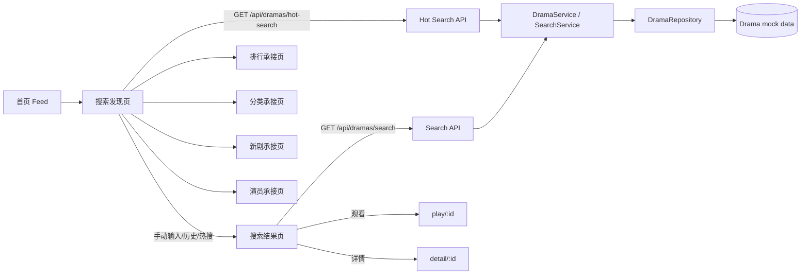

# 技术方案（共享部分）：PRD-04 搜索发现

> 创建日期：2026-07-26
> 对应需求：spec.md

## 整体架构



### 分层说明

- **入口层**：iOS / Android 首页新增搜索入口，进入 Native 搜索发现页。
- **页面层**：搜索发现页承载搜索框、快捷入口、历史、热搜；搜索结果页承载结果列表与重搜。
- **导航层**：统一新增 search / ranking / classification / new-releases / actors 相关 Native route 与 deeplink，不复用 Web 占位页。
- **服务层**：Backend 在现有 `DramaService` / repository 分层之上扩展搜索与热搜能力，不新增数据库或异步任务。
- **数据层**：搜索结果继续复用现有 `DramaSchema` / `DramaListResponseSchema`；热搜定义新增轻量 schema；本地历史由端侧持久化。

## API 设计

### 涉及变更

| 类型 | 数量 | 说明 |
|------|------|------|
| 新增接口 | 2 | `GET /api/dramas/search`、`GET /api/dramas/hot-search` |
| 修改接口 | 0 | 不修改现有 `/api/dramas`、播放器相关接口 |
| 废弃接口 | 0 | 无 |

### 设计原则

- 搜索结果接口的**成功响应**保持与现有 `GET /api/dramas` 一致，继续使用 `DramaListResponse`：`{ data, pagination }`。
- 热搜接口的**成功响应**采用轻量列表结构：`{ data: HotSearchItem[] }`。
- 错误响应继续复用现有 `withErrorHandler` 输出风格：`{ error: { code, message } }`，避免本期仅为搜索接口引入新的包装层。
- 查询参数使用 Zod 校验；首版最小错误码集为 `VALIDATION_ERROR`、`INTERNAL_ERROR`。
- 不引入登录态、用户账号、云端历史或额外 header。

### 新增接口

#### `GET /api/dramas/search`

- **功能简介**：按关键词搜索短剧，匹配维度为 `title + category`，返回分页后的 Drama 列表。
- **Path Parameters**：无。
- **Query Parameters**：

| 字段 | 类型 | 必填 | 默认值 | 说明 |
|------|------|------|--------|------|
| `q` | string | 是 | — | 搜索关键词；trim 后非空；最大 50 字符 |
| `page` | number | 否 | `1` | 分页页码，最小 1 |
| `pageSize` | number | 否 | `10` | 每页条数，最小 1，最大 100 |

- **Request Body**：无。

- **Success Response**：

```json
{
  "data": [
    {
      "id": "550e8400-e29b-41d4-a716-446655440001",
      "title": "逆袭归来后我成了豪门团宠",
      "description": "落魄千金重回豪门，在误会与守护中逆风翻盘。",
      "cover_url": "https://example.com/dramas/001.jpg",
      "category": "都市",
      "episode_count": 68,
      "tags": ["逆袭", "豪门"],
      "rating": 8.9,
      "created_at": "2026-07-25T00:00:00Z",
      "updated_at": "2026-07-25T00:00:00Z"
    }
  ],
  "pagination": {
    "page": 1,
    "page_size": 10,
    "total": 1,
    "total_pages": 1
  }
}
```

- **错误码**：

| HTTP 状态码 | 错误码 | 说明 |
|------------|--------|------|
| 200 | — | 成功；当页无数据也返回 `data=[]` |
| 400 | `VALIDATION_ERROR` | `q/page/pageSize` 校验失败 |
| 500 | `INTERNAL_ERROR` | 服务内部异常 |

- **补充约束**：
  - 搜索前先对 `q` 做 `trim()`；只要请求成功返回，无论是否命中结果，端侧都可写入历史。
  - 搜索匹配采用**大小写不敏感包含匹配**：`title` 或 `category` 任一命中即可。
  - 分页行为与现有 `/api/dramas` 对齐：大页码返回 `200 + data=[]`，不报错。
  - 结果排序首版沿用 repository 的现有顺序，不新增独立排序能力。

#### `GET /api/dramas/hot-search`

- **功能简介**：返回搜索发现页使用的热搜词列表。
- **Path Parameters**：无。
- **Query Parameters**：无。
- **Request Body**：无。

- **Success Response**：

```json
{
  "data": [
    {
      "rank": 1,
      "keyword": "逆袭",
      "score": 9821
    },
    {
      "rank": 2,
      "keyword": "豪门",
      "score": 9540
    }
  ]
}
```

- **错误码**：

| HTTP 状态码 | 错误码 | 说明 |
|------------|--------|------|
| 200 | — | 成功 |
| 500 | `INTERNAL_ERROR` | 服务内部异常 |

- **补充约束**：
  - 首版不分页，最多返回 10 条。
  - `score` 仅作为排序后的热度数值，展示单位留给产品侧非阻塞确认。
  - 数据来源允许是静态种子数据或 mock 数据，不要求真实日志聚合。

## 数据模型

### 新增/变更数据表

| 表名 | 操作 | 说明 |
|------|------|------|
| 无 | 无 | 首版继续使用 mock repository 与端侧本地存储，不新增后端表结构 |

### Schema 定义

```typescript
import { z } from 'zod';

export const SearchDramaQuerySchema = z.object({
  q: z.string().trim().min(1).max(50),
  page: z.coerce.number().int().min(1).default(1),
  pageSize: z.coerce.number().int().min(1).max(100).default(10),
});

export const HotSearchItemSchema = z.object({
  rank: z.number().int().min(1),
  keyword: z.string().trim().min(1).max(50),
  score: z.number().int().min(0),
});

export const HotSearchListResponseSchema = z.object({
  data: z.array(HotSearchItemSchema).max(10),
});

export const SearchHistoryItemSchema = z.object({
  keyword: z.string().trim().min(1).max(50),
  updated_at: z.string(),
});
```

### 模型约束

- **`DramaSchema`**：不新增 actor、新剧标记等字段；搜索结果严格复用现有 schema。
- **`SearchHistoryItem`**：仅存在于客户端本地，不进入后端契约。
- **`HotSearchItem`**：为新增只读模型，服务于搜索发现页展示。

## 跨端共享逻辑

| 共享逻辑 | 说明 | 涉及端 |
|---------|------|--------|
| 首页搜索入口 | 入口固定放在首页右上角，进入 Native 搜索发现页 | iOS / Android |
| 页面结构 | 搜索发现页固定包含：顶部返回 + 搜索框、快捷入口、历史、热搜 | iOS / Android |
| 结果页结构 | 顶部保留可编辑搜索框，下方呈现 loading / content / empty / error 四态 | iOS / Android |
| 搜索历史写入时机 | **仅当搜索请求成功返回后**写历史；包含空结果，不包含失败 | iOS / Android |
| 搜索历史规则 | trim 后去重、按最近使用时间倒序、最多 10 条、支持一键清空 | iOS / Android |
| 触发来源收敛 | 手动输入、点击历史词、点击热搜词三条链路最终都走同一搜索执行器 | iOS / Android |
| 结果页交互语义 | 复用首页卡片动作，只保留“观看 / 详情”，不新增整卡点击语义 | iOS / Android |
| 快捷入口承接 | `ranking`、`classification` 为后续 PRD 的承接页；`new-releases`、`actors` 首版固定为 Native 占位承接页 | iOS / Android |
| deeplink 语义 | `djsdrama://search`、`djsdrama://search/result/{query}`、`djsdrama://ranking`、`djsdrama://classification`、`djsdrama://new-releases`、`djsdrama://actors` | iOS / Android |
| 搜索 API 匹配规则 | `title + category`，大小写不敏感包含匹配 | Backend / iOS / Android |
| 失败降级 | 热搜失败不影响手动搜索；搜索失败进入错误态并支持重试 | Backend / iOS / Android |

### 跨端状态机

```text
SearchHomeState:
- idle/loading
- content(history, hotSearch, quickEntries)
- partialError(hotSearchFailed)

SearchResultState:
- loading(query)
- content(query, items, pagination)
- empty(query)
- error(query, message)
```

### 导航约束

| 语义 | Android | iOS | 说明 |
|------|---------|-----|------|
| 搜索发现页 | `search` | `.searchHome` | 首页右上角入口默认落点 |
| 搜索结果页 | `search/result?query={query}` | `.searchResult(query:)` | 支持从搜索页、历史、热搜进入 |
| 排行承接页 | `ranking` | `.rankingHome` | PRD-05 未落地前可为 Native 占位页 |
| 分类承接页 | `classification` | `.classificationHome` | PRD-06 未落地前可为 Native 占位页 |
| 新剧承接页 | `new-releases` | `.newReleases` | 首版固定 Native 占位页 |
| 演员承接页 | `actors` | `.actorHub` | 首版固定 Native 占位页 |

## 安全考虑

- **认证与授权**：首版无需登录；搜索相关接口均为匿名可访问接口。
- **数据校验**：`q/page/pageSize` 必须通过 Zod 校验；端侧也需在发请求前做本地输入约束。
- **敏感数据处理**：搜索历史仅保存在本地设备；后端不持久化用户级搜索词。
- **输入安全**：特殊字符、emoji、全角空格、注入片段都按普通字符串处理，不拼接 SQL，不参与危险执行。
- **依赖约束**：本期不新增第三方依赖；Android / iOS 沿用现有网络与存储基础设施。

## 边界与错误处理（⚠️ 重点，最易遗漏）

### 错误处理架构

- **全局错误处理策略**：Backend 继续复用 `withErrorHandler`；移动端继续使用页面状态机承接 loading / empty / error。
- **错误响应格式**：
  - 成功：`GET /api/dramas/search -> DramaListResponse`；`GET /api/dramas/hot-search -> { data: HotSearchItem[] }`
  - 失败：`{ error: { code, message } }`
- **错误日志与监控**：首版以现有日志能力为主；route handler、ViewModel、deeplink parser 记录最小必要日志，不引入新监控平台。

### API 错误码定义

| 业务错误码 | HTTP 状态码 | 说明 | 用户提示文案 |
|-----------|------------|------|-------------|
| `VALIDATION_ERROR` | 400 | 查询参数校验失败 | 输入内容无效，请检查后重试 |
| `INTERNAL_ERROR` | 500 | 服务内部错误 | 搜索失败，请稍后重试 |

### 边界场景处理

| 场景 | 触发条件 | API 行为 | 说明 |
|------|---------|---------|------|
| 空参数/缺参数 | `q` 为空或仅空格 | 返回 400 `VALIDATION_ERROR` | 客户端应优先阻止请求 |
| 参数边界值 | `q` 超过 50 字符，或 `page/pageSize` 非法 | 返回 400 `VALIDATION_ERROR` | 与现有 query 校验方式一致 |
| 大页码 | `page` 超过总页数 | 返回 200 + `data=[]` | 与 `GET /api/dramas` 对齐 |
| 特殊字符 | emoji、零宽字符、注入片段 | 按普通字符串处理 | 不应崩溃或 500 |
| 热搜加载失败 | `/api/dramas/hot-search` 异常 | 返回 500 `INTERNAL_ERROR` | 端侧展示区块错误态，不阻塞搜索 |
| 搜索失败 | `/api/dramas/search` 异常 | 返回 500 `INTERNAL_ERROR` | 端侧展示错误态且**不写历史** |
| 重复点击搜索 | 同关键词短时间重复发起 | 由客户端合并或忽略重复请求 | 首版不要求后端幂等键 |
| 子功能未开发完成 | ranking/classification/new-releases/actors 尚未真实实现 | 进入受控 Native 占位承接页 | 不回退到 Web 页面 |

## 性能考虑

- **预期 QPS**：首版基于 mock 数据与本地开发环境，QPS 压力较低，以功能正确性优先。
- **缓存策略**：
  - 端侧本地缓存仅覆盖搜索历史；
  - 热搜首版可由后端内存常量或 mock repository 提供，无需额外缓存中间件。
- **数据库优化**：本期无数据库变更；未来切换真实数据源时，可围绕 `title` / `category` 检索建立索引。
- **UI 性能**：结果列表复用现有首页卡片组件与列表容器，避免新增重型渲染逻辑。

## 参考资料

### 已查阅的 wiki 文档

| 文档 | 相关章节 | 关键信息 |
|------|---------|---------|
| `wiki/features/homepage-feed/index.md` | 功能概述 / 入口与路由 / 多端实现 | 首页 Feed 已在 iOS / Android Native 落地，可复用卡片、列表和状态机 |
| `wiki/api/dramas.md` | `GET /api/dramas` | 现有 Drama canonical schema 与分页响应结构 |
| `wiki/architecture/overview.md` | 概述 / 架构设计 / 跨端涉及 | 现有系统仍以 Native 首页 + 播放器为主；Web 搜索不在本期范围 |

### 已查阅的代码文件

| 文件 | 关键内容 |
|------|---------|
| `backend/src/app/api/dramas/route.ts` | 现有 `/api/dramas` query 校验与 `DramaService` 接线方式 |
| `backend/src/lib/schemas.ts` | `DramaSchema`、`DramaListResponseSchema` 以及现有 schema 风格 |
| `backend/src/lib/errors.ts` | 现有错误码枚举与错误响应格式 |
| `backend/src/middleware/error-handler.ts` | 当前 route handler 的 Zod / AppError 处理策略 |
| `backend/src/services/drama/drama.service.ts` | 现有 Drama service 分层入口 |
| `backend/src/repositories/mock/drama.mock.repository.ts` | 现有 Drama mock 数据与分页逻辑，可作为搜索与热搜的基础数据源 |
| `android/app/src/main/java/com/djs66256/short_drama/navigation/AppDestination.kt` | Android 当前仅有 `home/play/player/detail` 路由，需要扩展 search 系列 route |
| `android/app/src/main/java/com/djs66256/short_drama/navigation/DeeplinkRouteParser.kt` | Android 当前 deeplink 仅支持 `open/play/player/drama` |
| `ios/ShortDrama/Sources/App/AppRoute.swift` | iOS 当前仅有 `home/player/dramaDetail` 路由语义 |
| `ios/ShortDrama/Sources/App/DeeplinkHandler.swift` | iOS 当前 deeplink 仅支持 `open/play/drama` |
| `docs/specs/2026-07-26-prd-04-search-discovery/spec.md` | 已确认的搜索发现需求、路由约束、交互和自动化验收范围 |
