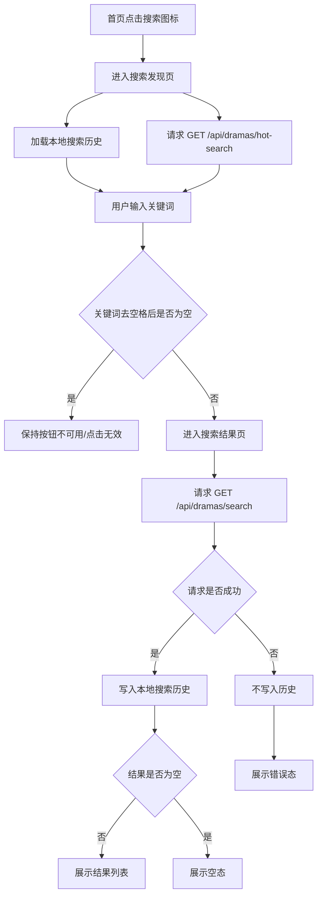
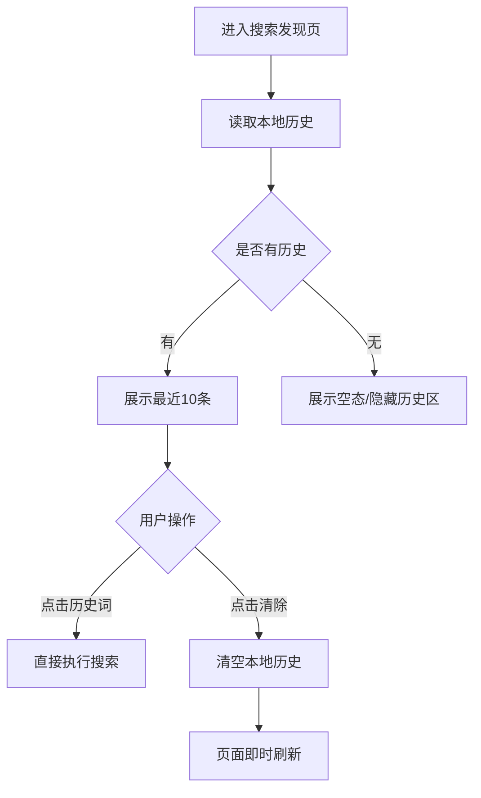
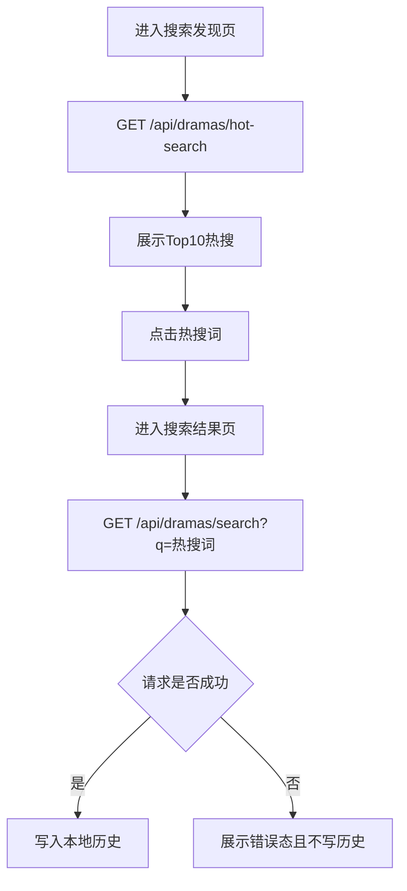
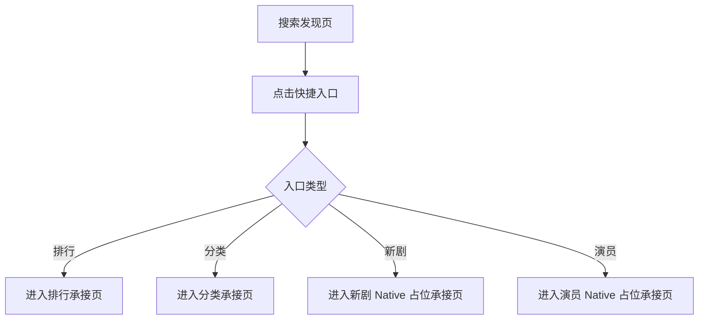
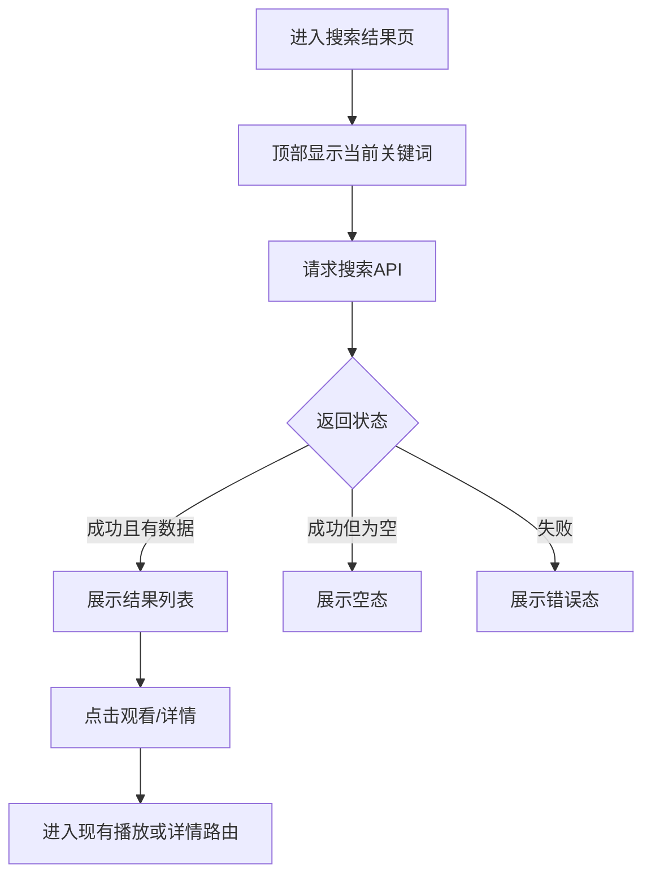

# 需求文档：PRD-04 搜索发现

> 创建日期：2026-07-26
> 状态：草稿
> 作者：AI Agent + daniel

---

## 1. 需求背景

### 1.1 问题描述

- **现状**：PRD-01 已完成移动端 5 Tab 应用壳，PRD-02 已让首页 Feed 成为 Native 内容首屏，PRD-03 已打通首页到播放器的观看主链路；但当前内容发现仍主要依赖首页被动推荐。Android / iOS 首页都没有搜索入口，也没有搜索页、搜索结果页、热搜榜、快捷入口或分类 / 排行跳转能力。Backend 当前仅提供 `GET /api/dramas` 首页列表接口，尚未提供关键词搜索或热搜 API；Web 仅存在 `/search` 与 `/rankings` 占位页，不属于本期 Native 交付范围。
- **痛点**：用户想主动找一部已知短剧、按题材发现内容，或通过热度与快捷入口继续探索时，当前产品无法提供有效路径，只能反复刷新首页 Feed，被动消费推荐结果。这会限制内容发现效率，也会阻断 Sprint 2 后续排行（PRD-05）与分类（PRD-06）的入口承接。
- **竞品参考**：红果搜索页不是单一输入框，而是首页搜索图标进入的二级发现页，聚合了搜索框、快捷入口、搜索历史和热搜榜，既支持主动搜索，也支持“逛内容”的探索式发现（见 `docs/product_research/mobile/homepage-feed/search/search.md`）。

### 1.2 预期目标

- **目标**：为 iOS / Android 建立首版 Native 搜索发现页和搜索结果页，支持关键词搜索、搜索历史、热搜榜，以及通往排行 / 分类 / 新剧 / 演员等子功能的快捷入口；Backend 同步提供搜索 API 与热搜 API，为 Sprint 2 内容发现能力打基础。
- **成功指标**（可度量）：
  - iOS / Android 用户可从首页右上角搜索入口进入搜索发现页，页面首屏在开发环境下 2 秒内完成基础内容渲染（搜索框、快捷入口、搜索历史 / 热搜至少其一可见）。
  - 输入合法关键词后，客户端在 3 秒内完成 `GET /api/dramas/search` 请求并进入搜索结果页，结果列表可复用当前首页卡片信息结构展示。
  - 搜索词为空时，搜索按钮保持不可用或触发无效，不会发起后端请求。
  - 搜索历史在移动端本地最多保留最近 10 条，新增搜索后即时刷新；点击“清除”后 UI 在 300ms 内更新为空状态。
  - Backend 搜索 API 与热搜 API 具备自动化测试，覆盖正常路径、空结果、非法参数与分页边界。

### 1.3 范围定义

| 范围内 | 范围外（明确不做） | 原因 |
|--------|------------------|------|
| iOS / Android 搜索发现页（搜索框、快捷入口、搜索历史、热搜榜） | Web 搜索页真实实现 | 当前页面承载策略要求除 mall / earn 外，业务页优先按 Native 实现；Web 仍保持占位 |
| iOS / Android 搜索结果页（顶部可编辑搜索框 + 结果列表） | Web 排行 / 搜索页占位改造 | 不属于本期 Native 搜索交付 |
| Backend `GET /api/dramas/search` | 语音搜索 | 超出首版关键词搜索范围 |
| Backend `GET /api/dramas/hot-search` | 搜索联想 / 自动补全 | 需要额外输入联想策略，首版不阻塞 |
| 移动端本地搜索历史（最近 10 条 + 清除） | 云端同步搜索历史 | 当前无账户体系依赖，不做跨设备同步 |
| 搜索页快捷入口跳转到排行 / 分类 / 新剧 / 演员承接页 | 场景识别功能 | 竞品复杂能力，远期评估 |
| 搜索结果列表复用现有 Drama 卡片字段集 | 演员独立搜索页 | 首版“演员”仅进入 Native 承接页，不单独实现完整演员搜索 |
| 热搜榜 Top 10（首版允许静态 / 伪实时种子数据） | 基于真实搜索日志动态计算热搜 | 真实搜索统计链路尚未建设 |

> 本期重点是建立“首页搜索入口 → 搜索发现页 → 搜索结果页”主链路，并为 PRD-05 排行、PRD-06 分类提供统一入口承接；不追求一次性补齐所有内容发现子能力。

---

## 2. 术语表

| 术语 | 定义 | 来源 |
|------|------|------|
| 搜索发现页 | 从首页搜索图标进入的二级发现页，承载搜索框、快捷入口、搜索历史和热搜榜 | 本文档新定义，参考竞品搜索承接页 |
| 搜索结果页 | 执行关键词搜索后承载结果列表的页面，顶部仍保留可编辑搜索框 | 本文档新定义 |
| 快捷入口 | 搜索发现页内用于跳转排行 / 新剧 / 分类 / 演员等子功能的图标入口组；首版全部为 Native 页面承接，不复用 Web 占位页 | 本文档新定义，参考产品 PRD |
| 热搜榜 | 面向所有用户展示的热门搜索词列表，首版返回 Top 10 关键词和热度值 | 本文档新定义 |
| 搜索历史 | 记录在本地设备上的最近搜索词列表，首版仅移动端本地持久化 | 本文档新定义 |
| Drama | 当前产品内短剧内容实体，已有 canonical 字段包含 `id/title/description/cover_url/category/episode_count/tags/rating/created_at/updated_at` | `wiki/api/dramas.md`、`backend/src/lib/schemas.ts` |
| Native 页面 | 由 iOS / Android 客户端本地 UI 实现的页面 | `PRODUCT.md` 页面承载策略 |
| H5 页面 | 通过 Web 页面承载、由 Native 容器接入的页面 | `PRODUCT.md` 页面承载策略 |

---

## 3. 涉及平台

| 平台 | 是否涉及 | 变更概要 |
|------|---------|---------|
| Backend | ✅ 涉及 | 新增关键词搜索 API 与热搜 API，复用现有 Drama 列表契约与 mock / repository 分层 |
| Web | ❌ 不涉及 | 现有 `/search` 与 `/rankings` 继续保持占位，本期不扩展 Web 真实搜索体验 |
| iOS | ✅ 涉及 | 首页新增搜索入口；新增搜索发现页、搜索结果页、本地历史存储与快捷入口跳转 |
| Android | ✅ 涉及 | 首页新增搜索入口；新增搜索发现页、搜索结果页、本地历史存储与快捷入口跳转 |

---

## 4. 用户故事

| 编号 | 角色 | 需求 | 验收标准 | 涉及平台 | 优先级 |
|------|------|------|---------|---------|--------|
| US-01 | 主动搜索用户 | 我希望从首页进入搜索页并输入关键词找到目标短剧 | 从首页右上角点击搜索图标可进入搜索发现页；输入非空关键词并点击搜索后跳转搜索结果页，展示匹配 Drama 列表 | Backend / iOS / Android | P0 |
| US-02 | 回访搜索用户 | 我希望看到最近搜索历史，并能点击历史词重新搜索或一键清空 | 搜索发现页展示最近 10 条本地历史；点击历史词直接触发搜索；点击“清除”后历史立即清空 | iOS / Android | P0 |
| US-03 | 探索型用户 | 我希望在不知道搜什么时浏览热搜榜，点击热门词快速进入结果页 | 搜索发现页展示 Top 10 热搜词及热度值；点击任一热搜词后进入对应搜索结果页 | Backend / iOS / Android | P1 |
| US-04 | 探索型用户 | 我希望通过快捷入口进入排行 / 新剧 / 分类 / 演员等发现子能力 | 搜索发现页展示 4 个快捷入口；点击后进入对应 Native 承接页面，其中排行 / 分类应与 Sprint 2 后续 PRD 对齐，新剧 / 演员首版进入 Native 占位承接页 | iOS / Android | P0 |
| US-05 | 搜索结果用户 | 我希望在结果页继续修改关键词、查看空态并进入播放页 | 搜索结果页顶部保留搜索框，支持修改后重新搜索；无结果时展示空态；结果列表复用现有首页卡片交互语义，保留“观看 / 详情”两个动作并继续进入 `play/:id` / `.player(videoId:)` 或既有详情路由 | Backend / iOS / Android | P0 |
| US-06 | 异常场景用户 | 我希望在网络失败、参数非法、无结果或快速重复操作时得到明确反馈 | 搜索页与结果页覆盖 loading / empty / error / retry 状态；重复点击搜索不会触发并发请求风暴；非法输入不发请求 | Backend / iOS / Android | P1 |
| US-07 | 后续发现能力开发者 | 我希望搜索页作为排行 / 分类等子功能的稳定入口容器 | 快捷入口、路由命名、返回路径和数据契约在 spec 中明确，可供 PRD-05 / PRD-06 继续复用 | iOS / Android / Backend | P1 |

---

## 5. 功能详述

### 5.1 US-01：从首页进入搜索发现页并执行关键词搜索

#### 流程描述

1. 用户在首页点击右上角搜索图标。
2. 应用进入搜索发现页，顶部展示返回按钮、搜索输入框和搜索按钮。
3. 搜索发现页首屏同时加载本地搜索历史与后端热搜榜；若本地无历史，则历史区域隐藏或显示空提示，但热搜榜仍可见。
4. 用户输入关键词后，搜索按钮进入可点击状态。
5. 用户点击搜索按钮或键盘搜索动作后：
   - 客户端先做本地校验（去除首尾空格后的关键词非空，长度不超过 50 个字符）；
   - 校验通过后跳转到搜索结果页，并请求 `GET /api/dramas/search?q=...&page=1&pageSize=10`。
6. Backend 按首版规则执行标题 + `category` 匹配，返回与现有 `GET /api/dramas` 一致的 `DramaListResponse` 结构（`data + pagination`），分页边界行为保持一致：大页码返回 `200 + data=[]`。
7. 当搜索请求成功返回后（包含有结果与空结果两种情况），客户端再将清洗后的关键词写入本地搜索历史；失败请求不写入历史。
8. 搜索结果页展示结果列表；结果卡片复用现有首页卡片交互语义，保留“观看 / 详情”两个动作进入既有内容主链路。



#### 前置条件

- [x] PRD-01 已提供移动端首页 Tab 与导航基础能力。
- [x] PRD-02 已提供首页 Feed 页面与 Drama 卡片组件可复用。
- [ ] Backend 已提供 `GET /api/dramas/search` 与 `GET /api/dramas/hot-search`。
- [ ] iOS / Android 首页已新增搜索入口 UI。

#### 后置条件

- 用户已进入搜索发现页或搜索结果页。
- 当搜索请求成功时，当前关键词会被加入本地搜索历史。
- 搜索结果页处于以下状态之一：loading / content / empty / error。

#### 涉及的 UI/交互（如有）

| 页面 / 区域 | 交互描述 | 涉及端 |
|------------|---------|--------|
| 首页右上角搜索入口 | 点击后进入搜索发现页 | iOS / Android |
| 搜索发现页顶部栏 | 返回、搜索输入框、搜索按钮 | iOS / Android |
| 搜索结果页顶部栏 | 返回、可编辑搜索框、搜索按钮 | iOS / Android |
| 搜索结果列表 | 复用 Drama 卡片字段集展示封面、标题、简介、标签、集数等摘要 | iOS / Android |

#### 边界与异常

**错误处理：**

| 操作步骤 | 错误类型 | 触发条件 | 系统行为 | 用户感知 |
|---------|---------|---------|---------|---------|
| 进入搜索发现页 | 网络异常 | 热搜请求超时 / 断网 | 热搜区域进入错误态，其他区域仍可使用 | 局部提示“热搜加载失败，可下拉重试/点击重试”或等价轻提示 |
| 执行搜索 | 网络异常 | 搜索请求超时 / 断网 | 结果页进入错误态，保留当前关键词与重试动作 | 显示“搜索失败，请重试” |
| 执行搜索 | 服务端错误 | 500 / 502 / 503 | 结果页错误态，不清空当前输入 | 统一错误页或内联错误提示 |
| 执行搜索 | 数据校验失败 | q 为空、超长、分页非法 | 客户端阻止无效请求；服务端返回 400 | 用户看到输入校验提示或按钮不可用 |
| 执行搜索 | 操作超时 | 请求超过目标超时阈值 | 停止 loading，展示重试入口 | “搜索超时，请重试” |
| 点击结果卡片 | 状态不一致 | 返回结果项 `id` 为空或非法 | 阻止导航 | 轻提示或无效点击 |

**边界场景：**

| 场景 | 触发条件 | 预期行为 |
|------|---------|---------|
| 搜索词为空 | 输入为空或仅空格 | 搜索按钮不可点击 / 点击无效，不发请求 |
| 搜索词超长 | 超过约定长度上限（建议 50 个字符） | 客户端限制输入或提示超长，服务端仍做兜底校验 |
| 特殊字符 | emoji、零宽字符、SQL 注入片段、全角空格 | 作为普通文本处理或清洗，不应导致崩溃、500 或异常路由 |
| 快速重复点击 | 用户连续多次点击搜索 | 只保留一次有效请求，避免并发重复搜索 |
| App 切后台再回来 | 搜索请求过程中切后台 | 返回前台后保持可理解状态；请求完成则更新结果，否则允许重试 |
| 热搜加载失败但搜索可用 | `/hot-search` 失败 | 不影响用户手动搜索 |
| 搜索结果为空 | 无匹配 Drama | 展示明确空态，不显示旧结果 |

### 5.2 US-02：本地搜索历史查看、复用与清除

#### 流程描述

1. 用户进入搜索发现页。
2. 页面读取本地持久化的最近搜索历史，按最近使用时间倒序展示，最多 10 条。
3. 用户点击某条历史词后，直接以该词进入搜索结果页。
4. 用户点击“清除”按钮后，本地搜索历史被全部删除，页面即时刷新为空状态。
5. 每次新的成功搜索（包含空结果但不包含请求失败）完成后：
   - 若关键词已存在于历史中，则提升到最前；
   - 若为新关键词，则插入首位；
   - 总数超过 10 条时移除最旧一条。



#### 前置条件

- [ ] 移动端具备本地持久化能力（iOS `UserDefaults` 或等价实现；Android DataStore / SharedPreferences 或等价实现）。
- [ ] 搜索发现页已实现历史区域 UI。

#### 后置条件

- 本地历史集合符合“去重、倒序、最多 10 条”规则。
- 清除操作后当前设备上不再保留旧历史词。

#### 涉及的 UI/交互（如有）

| 页面 / 区域 | 交互描述 | 涉及端 |
|------------|---------|--------|
| 搜索历史区 | 以标签/胶囊形式展示最近搜索词 | iOS / Android |
| 历史清除按钮 | 清空全部历史 | iOS / Android |

#### 边界与异常

**错误处理：**

| 操作步骤 | 错误类型 | 触发条件 | 系统行为 | 用户感知 |
|---------|---------|---------|---------|---------|
| 读取历史 | 存储异常 | 本地读取失败 / 数据损坏 | 降级为空历史，不阻塞搜索页使用 | 可无感，必要时记录日志 |
| 写入历史 | 存储不足 | 本地空间不足或写入失败 | 不阻塞本次搜索结果展示 | 可不提示或轻提示“历史未保存” |
| 清除历史 | 状态不一致 | 本地已有损坏数据 | 兜底覆盖为空集合 | UI 仍刷新为空 |

**边界场景：**

| 场景 | 触发条件 | 预期行为 |
|------|---------|---------|
| 重复词 | 用户多次搜索同一关键词 | 仅保留一条，更新到最前 |
| 大小写 / 空白差异 | `逆袭` 与 ` 逆袭 ` | 统一按清洗后的关键词去重 |
| 历史条目超过上限 | 第 11 条写入 | 自动删除最旧条目 |
| 首次安装无历史 | 本地为空 | 不展示脏数据或占位错乱 |

### 5.3 US-03：热搜榜浏览与点击搜索

#### 流程描述

1. 用户进入搜索发现页。
2. 页面请求 `GET /api/dramas/hot-search`。
3. Backend 返回 Top 10 热搜词列表，首版每项至少包含：排名、关键词、热度值。
4. 页面按榜单样式展示热搜项。
5. 用户点击任意热搜词后：
   - 进入搜索结果页；
   - 发起同关键词搜索请求；
   - 若请求成功返回（包含空结果），再将该词写入本地搜索历史。



#### 前置条件

- [ ] Backend 已提供热搜 API。
- [ ] 搜索发现页已具备热搜榜区块。

#### 后置条件

- 用户可通过热搜词进入对应结果页。
- 被点击的热搜词进入本地历史。

#### 涉及的 UI/交互（如有）

| 页面 / 区域 | 交互描述 | 涉及端 |
|------------|---------|--------|
| 热搜榜 | 展示序号、关键词、热度值；点击整行触发搜索 | iOS / Android |

#### 边界与异常

**错误处理：**

| 操作步骤 | 错误类型 | 触发条件 | 系统行为 | 用户感知 |
|---------|---------|---------|---------|---------|
| 加载热搜 | 网络异常 | 断网 / 超时 | 热搜区进入错误态，可重试 | 轻提示或区块错误提示 |
| 加载热搜 | 服务端错误 | 500 / 502 / 503 | 不影响搜索框、历史、快捷入口使用 | 用户只看到热搜区失败 |
| 点击热搜 | 状态不一致 | 返回空关键词 | 忽略该项点击并记录日志 | 不应崩溃 |

**边界场景：**

| 场景 | 触发条件 | 预期行为 |
|------|---------|---------|
| 热搜不足 10 条 | Backend 返回少于 10 条 | 按实际条数展示，不补伪项 |
| 热搜词重复 | 返回重复关键词 | 客户端按返回顺序展示；服务端应尽量去重 |
| 热度值缺失 | 热度为空 | 允许降级只显示关键词，避免整榜不可用 |

### 5.4 US-04：快捷入口承接排行 / 新剧 / 分类 / 演员

#### 流程描述

1. 搜索发现页在搜索框下方展示 4 个快捷入口：排行 / 新剧 / 分类 / 演员。
2. 首版 canonical route / 页面承接约束固定如下，均为 Native 页面，不复用 Web `/search` 或 `/rankings` 占位页：
   - **搜索发现页**：Android `search`；iOS `.searchHome`；deeplink 公共语义 `djsdrama://search`。
   - **搜索结果页**：Android `search/result?query={query}`；iOS `.searchResult(query:)`；deeplink 公共语义 `djsdrama://search/result/{query}`。
   - **排行承接页**：Android `ranking`；iOS `.rankingHome`；deeplink 公共语义 `djsdrama://ranking`。
   - **分类承接页**：Android `classification`；iOS `.classificationHome`；deeplink 公共语义 `djsdrama://classification`。
   - **新剧承接页**：Android `new-releases`；iOS `.newReleases`；deeplink 公共语义 `djsdrama://new-releases`；首版为 Native 占位承接页。
   - **演员承接页**：Android `actors`；iOS `.actorHub`；deeplink 公共语义 `djsdrama://actors`；首版为 Native 占位承接页。
3. 用户点击不同快捷入口后按以下首版策略处理：
   - **排行**：进入 PRD-05 对应排行页；在 PRD-05 未落地前，可先进入 `ranking` Native 承接页。
   - **分类**：进入 PRD-06 对应分类页；在 PRD-06 未落地前，可先进入 `classification` Native 承接页。
   - **新剧**：首版固定进入 `new-releases` Native 占位承接页，不新增独立后端能力。
   - **演员**：首版固定进入 `actors` Native 占位承接页，不要求独立演员搜索 API。
4. 所有快捷入口都应具备返回到搜索发现页的路径。



#### 前置条件

- [ ] 移动端已增加搜索相关路由与页面注册。
- [ ] 排行 / 分类的路由命名与入口契约已在本期明确。

#### 后置条件

- 搜索页成为 Sprint 2 发现子能力的统一入口容器。
- 所有快捷入口均能正常进入对应承接页面并返回。

#### 涉及的 UI/交互（如有）

| 页面 / 区域 | 交互描述 | 涉及端 |
|------------|---------|--------|
| 快捷入口行 | 4 个图标 + 文案入口，支持点击跳转 | iOS / Android |

#### 边界与异常

**错误处理：**

| 操作步骤 | 错误类型 | 触发条件 | 系统行为 | 用户感知 |
|---------|---------|---------|---------|---------|
| 点击快捷入口 | 路由未注册 | 对应 Native 承接页尚未接入 | 必须进入受控 Native 占位承接页而不是回退到 Web 页面或直接崩溃 | 用户看到“功能建设中”或等价占位文案 |
| 点击快捷入口 | 参数缺失 | 预设参数构造失败 | 阻止导航，记录日志 | 轻提示或无动作 |

**边界场景：**

| 场景 | 触发条件 | 预期行为 |
|------|---------|---------|
| 子功能未开发完成 | PRD-05 / PRD-06 尚未编码 | 搜索页入口仍可保留，跳转到稳定占位页 |
| 快捷入口文案过长 | 多语言或后续文案调整 | 保持单行或安全换行，不挤压搜索页布局 |

### 5.5 US-05：搜索结果页展示、重搜与播放跳转

#### 流程描述

1. 用户通过手动输入、历史词或热搜词进入搜索结果页。
2. 搜索结果页顶部保留搜索框，初始填充当前关键词。
3. 页面发起 `GET /api/dramas/search?q=...&page=1&pageSize=10`。
4. 返回结果后按列表形式展示 Drama 卡片，字段尽量复用首页 Feed 卡片信息结构。
5. 用户可在结果页修改关键词并再次搜索。
6. 用户点击结果卡片上的“观看”按钮后进入播放页，点击“详情”按钮后进入详情页占位或既有详情承接路由；首版不额外引入整卡点击新语义，以保持与当前首页 Feed 卡片一致。



#### 前置条件

- [ ] 搜索 API 已可用。
- [ ] 移动端已复用或抽取首页 Drama 卡片组件。

#### 后置条件

- 结果页顶部输入框与当前列表结果保持一致。
- 用户可从结果页进入既有内容消费链路。

#### 涉及的 UI/交互（如有）

| 页面 / 区域 | 交互描述 | 涉及端 |
|------------|---------|--------|
| 结果页搜索框 | 修改关键词并重新搜索 | iOS / Android |
| 结果列表 | 复用 Drama 卡片视觉和动作 | iOS / Android |
| 空态 / 错态 | 无结果、失败时提供回退或重试 | iOS / Android |

#### 边界与异常

**错误处理：**

| 操作步骤 | 错误类型 | 触发条件 | 系统行为 | 用户感知 |
|---------|---------|---------|---------|---------|
| 重搜 | 网络异常 | 断网 / 超时 | 保留旧关键词，进入 loading 后再显示错误态 | 用户可手动重试 |
| 渲染结果 | 数据校验失败 | 单项字段不合法 | 该项降级或整体错误态，避免崩溃 | 用户看到统一失败或部分降级 |
| 点击结果项 | 路由异常 | 结果项 `id` 非法 | 阻止导航 | 轻提示或无动作 |

**边界场景：**

| 场景 | 触发条件 | 预期行为 |
|------|---------|---------|
| 无结果 | 搜索关键词无匹配项 | 展示“未找到相关短剧”空态 |
| 大结果集 | 匹配项很多 | 首版使用分页接口，客户端先消费第一页 |
| 返回搜索发现页 | 用户点击返回 | 保留或合理恢复上一个搜索发现页的本地历史与热搜状态 |

### 5.6 US-06：异常处理与请求约束

#### 流程描述

1. 用户进入搜索相关页面或执行搜索操作。
2. 系统统一维护页面级状态：loading / content / empty / error。
3. 对重复请求、空输入、无网络、局部加载失败等场景做防抖与降级。
4. 失败态都需要提供明确重试路径，而不是让用户必须重新进入页面。

#### 前置条件

- [ ] 各端 ViewModel / 状态机支持请求中标记与重试行为。
- [ ] Backend 对 query 参数做 Zod 校验并返回稳定错误码。

#### 后置条件

- 搜索页和结果页在异常下不会出现白屏、假死或重复请求风暴。

#### 涉及的 UI/交互（如有）

| 页面 / 区域 | 交互描述 | 涉及端 |
|------------|---------|--------|
| 搜索页 / 结果页状态区 | loading / empty / error / retry 状态承载 | iOS / Android |

#### 边界与异常

**错误处理：**

| 操作步骤 | 错误类型 | 触发条件 | 系统行为 | 用户感知 |
|---------|---------|---------|---------|---------|
| 任意请求 | 服务端错误 | 500 / 502 / 503 | 显示统一错误态或区块错误态 | 用户可点击重试 |
| 任意请求 | 数据校验失败 | q/page/pageSize 非法 | 400 返回稳定错误码 | 用户看到友好错误，不暴露内部实现细节 |
| 任意请求 | 并发冲突 | 用户连续修改关键词并快速发起多次搜索 | 仅保留最后一次有效结果或忽略重复相同请求 | 避免列表抖动 |

**边界场景：**

| 场景 | 触发条件 | 预期行为 |
|------|---------|---------|
| 网络切换 | Wi‑Fi ↔ 蜂窝切换 | 页面保持可重试，已失败请求不致崩溃 |
| App 后台恢复 | 请求中切后台 | 返回前台后维持可理解状态，可自动完成或手动重试 |
| 本地存储不足 | 写历史失败 | 不阻塞搜索结果本身 |

---

## 6. 数据概览

| 数据实体 | 说明 | 关键字段 | 来源 |
|---------|------|---------|------|
| SearchQuery | 用户输入或点击热搜 / 历史得到的搜索关键词 | `q`, `normalized_q` | 用户输入 / 本地处理 |
| SearchHistoryItem | 本地搜索历史项 | `keyword`, `updated_at` | 客户端本地存储 |
| HotSearchItem | 热搜榜项 | `rank`, `keyword`, `score` | Backend API |
| Drama | 搜索结果承载的短剧实体 | `id`, `title`, `description`, `cover_url`, `category`, `episode_count`, `tags`, `rating` | 现有 canonical schema |
| SearchApiContract | 搜索接口契约 | `GET /api/dramas/search?q&page&pageSize -> DramaListResponse` | 本文档定义，复用现有列表响应结构 |
| HotSearchApiContract | 热搜接口契约 | `GET /api/dramas/hot-search -> { data: HotSearchItem[] }` | 本文档定义 |
| SearchResultPageState | 搜索结果页状态 | `query`, `items`, `isLoading`, `error`, `pagination` | 客户端状态机 |
| QuickEntry | 搜索页快捷入口配置 | `type`, `title`, `icon`, `route` | 客户端常量 / 本文档定义 |

### 数据关系

```text
[SearchQuery] ──1:N──▶ [Drama]
     │
     ├──1:N──▶ [SearchHistoryItem]
     └──1:N──▶ [HotSearchItem]
```

### 数据补充说明

- 搜索结果首版继续复用现有 `DramaSchema`，避免为 PRD-04 单独引入新卡片字段集。
- 首版搜索匹配维度按产品 PRD 的待澄清结论收口为：**标题 + category**。
- `GET /api/dramas/search` 请求参数固定为：`q`（必填，trim 后非空，最大 50 字符）、`page`（可选，默认 1）、`pageSize`（可选，默认 10，最大 100）。
- `GET /api/dramas/search` 响应固定复用现有 `DramaListResponse`：`{ data: Drama[], pagination: { page, page_size, total, total_pages } }`。
- `GET /api/dramas/search` 错误码首版至少覆盖：`VALIDATION_ERROR`（参数非法）、`INTERNAL_ERROR`（服务内部错误）；大页码行为与现有 `/api/dramas` 一致，返回 `200 + data=[]`。
- `GET /api/dramas/hot-search` 响应固定为：`{ data: HotSearchItem[] }`；首版不分页，最多返回 10 条；错误码至少覆盖 `INTERNAL_ERROR`。
- 热搜榜首版允许使用静态种子数据或伪实时数据，不要求依赖真实搜索日志统计链路。

---

## 7. 现有功能影响

| 现有功能 | 影响类型 | 说明 | 是否需要迁移 |
|---------|---------|------|------------|
| 首页 Feed | 新增关联 | 首页需要新增右上角搜索入口，并能进入 `search` Native 页面 | 否 |
| Backend `GET /api/dramas` | 无直接修改 / 可复用 | 搜索结果列表复用同一 Drama canonical 字段集，但不应影响首页列表接口行为 | 否 |
| 播放器主链路 | 新增关联 | 搜索结果卡片点击“观看”后继续进入现有 `play/:id` / `.player(videoId:)` | 否 |
| 排行（PRD-05） | 新增关联 | 搜索页快捷入口需要提供排行承接入口 | 否 |
| 分类（PRD-06） | 新增关联 | 搜索页快捷入口需要提供分类承接入口 | 否 |
| Web 占位路由 | 无影响 | `/search` 与 `/rankings` 继续保持占位，不作为本期交付目标 | 否 |

### 兼容性说明

- 本期不修改现有 `play` canonical route，也不改变 Android `player` alias 的既有兼容策略。
- 搜索结果列表使用既有 Drama ID 与卡片动作，不需要数据迁移。
- Backend 新增搜索 API 与热搜 API 时，不应破坏现有 `/api/dramas`、播放器接口和移动端首页 Feed 既有契约。

---

## 8. 非功能性需求

### 8.1 性能

| 指标 | 目标值 | 测量方式 |
|------|--------|---------|
| 搜索发现页首屏基础渲染 | < 2 秒 | 本地开发环境下从点击首页搜索入口到首屏可见的手工计时 / UI 自动化观测 |
| 搜索 API 响应时间（P95） | < 500 ms（mock / 本地环境） | 后端接口测试与本地日志观测 |
| 搜索结果页首屏可见 | < 3 秒 | 从点击搜索到结果页稳定显示 loading/结果的端侧测量 |
| 结果列表滚动性能 | ≥ 55 fps | 模拟器 / 真机观察与平台自带性能工具 |

### 8.2 安全

| 关注点 | 要求 |
|--------|------|
| 认证与授权 | 首版搜索发现不要求登录；搜索历史仅保存在本地设备 |
| 数据校验 | 客户端和服务端均需校验 `q/page/pageSize`；服务端使用 Zod 兜底 |
| 敏感数据 | 搜索词可能属于用户行为数据，但首版仅本地存储，不上云同步 |
| 防滥用 | 热搜与搜索接口需具备基本分页和输入长度限制；如后续接公网需补限流策略 |

### 8.3 兼容性

| 维度 | 要求 |
|------|------|
| 设备兼容 | 延续当前 iOS / Android 工程已支持的最低系统版本，不额外提高门槛 |
| 数据兼容 | 继续使用现有 Drama canonical schema；新增接口应保持字段命名与现有列表接口风格一致 |
| 向后兼容 | 新增搜索 API 不影响旧客户端；首页未接入搜索入口的旧版本仍可正常使用首页 Feed 与播放器 |
| 路由兼容 | 搜索相关 route 为新增能力，不应改变既有 `play` canonical route、Android `player` alias、`detail` 语义；新增 deeplink 仅扩展不破坏现有解析 |

### 8.4 最小自动化验收要求

| 平台 | 最小自动化覆盖 |
|------|---------------|
| Backend | 为 `GET /api/dramas/search` 增加 route/service 级自动化测试，至少覆盖：正常搜索命中、空结果、`q` 为空或超长触发 `VALIDATION_ERROR`、`page/pageSize` 非法、分页边界（大页码返回 `200 + data=[]`）；为 `GET /api/dramas/hot-search` 覆盖正常返回与内部错误降级 |
| iOS | 至少覆盖：搜索页 ViewModel 的历史读取/写入/清空规则、搜索成功后写历史/失败不写历史、热搜点击触发搜索、快捷入口导航配置、结果页重搜与 loading/empty/error 状态切换 |
| Android | 至少覆盖：搜索页 ViewModel 的历史读取/写入/清空规则、搜索成功后写历史/失败不写历史、热搜点击触发搜索、快捷入口 route/deeplink 配置、结果页重搜与 loading/empty/error 状态切换 |

> 若当前阶段无法补齐端到端 UI 自动化，至少应保证上述 ViewModel / route / route handler 级自动化覆盖先落地，并在后续 QA 黑盒阶段补充设备验证。

---

## 9. 依赖

| 依赖项 | 类型 | 说明 | 状态 | 阻塞 |
|--------|------|------|------|------|
| `GET /api/dramas/search` | 内部能力 | 关键词搜索 API，复用现有 `DramaListResponse` 契约 | 🚧 待开发 | 是 |
| `GET /api/dramas/hot-search` | 内部能力 | 热搜榜 API，返回 `{ data: HotSearchItem[] }` | 🚧 待开发 | 是 |
| 首页搜索入口 | 内部能力 | iOS / Android 首页右上角搜索图标 | 🚧 待开发 | 是 |
| 排行页承接能力（PRD-05） | 内部能力 | 快捷入口“排行”的真实目标页；本期可先用稳定承接页过渡 | 📅 规划中 | 否 |
| 分类页承接能力（PRD-06） | 内部能力 | 快捷入口“分类”的真实目标页；本期可先用稳定承接页过渡 | 📅 规划中 | 否 |
| 新剧 / 演员承接页 | 内部能力 | 快捷入口的首版 Native 占位承接页 | 🚧 待开发 | 否 |
| 本地存储能力 | 内部能力 | iOS / Android 搜索历史持久化 | ✅ 已有基础能力 | 是 |
| Drama canonical schema | 内部能力 | 搜索结果列表复用现有 Drama 字段集 | ✅ 已有 | 是 |

---

## 10. 待澄清问题

| 编号 | 问题 | 可能的答案 | 阻塞 |
|------|------|-----------|------|
| Q-01 | 热搜热度值首版是否需要明确单位（如“万热度”）还是只展示数值即可？ | A: 仅数值（默认）；B: 带展示格式 | 否 |

> 已收口默认值：`新剧` / `演员` 首版均进入 Native 占位承接页；搜索关键词最大长度固定为 50。当前仅保留热度值展示格式作为非阻塞待确认项。

---

## 11. 参考资料

### 已查阅的 wiki 文档

| 文档 | 相关章节 | 关键信息 |
|------|---------|---------|
| `wiki/index.md` | 功能索引 | 确认 wiki 结构与现有功能域 |
| `wiki/features/index.md` | 功能域索引 | 当前仅有 app-shell、homepage-feed、播放器等功能域，无搜索发现现成文档 |
| `wiki/features/homepage-feed/index.md` | 功能概述 / 入口与路由 / 核心逻辑 / 多端实现 | 首页 Feed 已在 iOS / Android Native 落地，可复用卡片与状态机，但当前没有搜索入口 |
| `wiki/api/dramas.md` | `GET /api/dramas` | Drama canonical schema、分页行为与现有后端列表能力 |
| `wiki/architecture/overview.md` | 概述 / 设计决策 / 跨端涉及 | 当前系统总览中尚无搜索发现主链路；确认 Web 仍为壳、mall / earn 为 H5 边界 |

### 已查阅的代码文件

| 文件 | 关键内容 |
|------|---------|
| `backend/src/app/api/dramas/route.ts` | 当前仅有首页列表接口，route 内直接使用 `DramaMockRepository()`，无搜索 API |
| `backend/src/lib/schemas.ts` | `DramaSchema` 与 `DramaListResponseSchema` 已可复用为搜索结果契约 |
| `android/app/src/main/java/com/djs66256/short_drama/navigation/AppDestination.kt` | 当前仅定义 `home/play/player/detail` 等路由，无 search / ranking / classification |
| `android/app/src/main/java/com/djs66256/short_drama/navigation/DeeplinkRouteParser.kt` | 当前 deeplink 仅支持 `open/play/player/drama`，无 search / ranking / classification |
| `android/app/src/main/java/com/djs66256/short_drama/feature/home/ui/HomeScreen.kt` | 首页 Feed `LazyColumn`、`HomeDramaCard` 可复用为搜索结果列表基础 |
| `ios/ShortDrama/Sources/App/AppRoute.swift` | 当前仅有 `home/player/dramaDetail`，无 search / ranking 路由 |
| `ios/ShortDrama/Sources/App/DeeplinkHandler.swift` | 当前 deeplink 仅支持 `open/play/drama`，无 search / ranking / classification |
| `ios/ShortDrama/Sources/Features/Home/Views/HomeView.swift` | `HomeFeedListView` 与 `HomeDramaCardView` 可复用为搜索结果页列表基础 |
| `web/src/app/search/page.tsx` | Web 搜索页仍是占位实现，本期不纳入交付 |
| `docs/product_research/mobile/homepage-feed/search/search.md` | 竞品搜索承接页布局与发现逻辑参考 |
| `docs/product_manager/prd/2026-07-25-search/prd.md` | 产品侧对搜索发现范围、用户故事、边界的原始输入 |
| `docs/product_manager/prd/2026-07-25-search/subtasks.md` | Backend / iOS / Android 子任务拆分与依赖 |
| `docs/product_manager/prd/2026-07-25-ranking/prd.md` | 确认“排行”是搜索页快捷入口的后续目标能力 |
| `docs/product_manager/prd/2026-07-25-classification/prd.md` | 确认“分类”是搜索页快捷入口的后续目标能力 |

---

## 12. 变更历史

| 日期 | 变更内容 | 变更原因 |
|------|---------|---------|
| 2026-07-26 | 补充搜索相关 Native route / deeplink、接口契约、历史写入时机与快捷入口默认值 | 收敛首轮 spec-review 问题 |
| 2026-07-26 | 初始版本 | 从新的 feature-workflow 启动 PRD-04 搜索发现 spec-writing |
