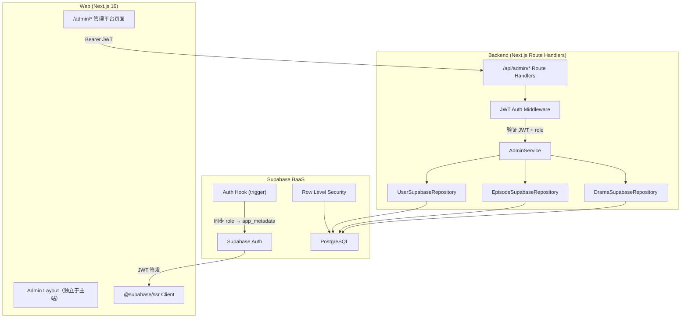

# 技术方案（共享部分）：管理平台（Admin Panel）

> 创建日期：2026-07-27
> 对应需求：spec.md

## 整体架构



**架构说明**：

- **Web 端**：管理平台作为 Next.js App Router 的 `/admin/*` 子路由，使用独立 layout（不含主站导航/页脚），通过 `@supabase/ssr` 管理 session
- **Backend 端**：新增 `/api/admin/*` 路由前缀，通过 JWT middleware 验证身份和角色
- **数据层**：管理 API 使用 Supabase repository（`backend/src/repositories/supabase/`），与现有 mock repository 并存
- **权限层**：双重保障 — API 层 JWT role 校验 + 数据库层 RLS 策略

## API 设计

### 涉及变更

| 类型 | 数量 | 说明 |
|------|------|------|
| 新增接口 | 14 | 全部为 `/api/admin/*` 前缀的新接口 |
| 修改接口 | 0 | 现有用户端 API 不受影响 |
| 废弃接口 | 0 | — |

### 认证方式

所有 `/api/admin/*` 接口需携带 `Authorization: Bearer <JWT>` header。JWT 由 Supabase Auth 签发，包含 `app_metadata.role`（admin / editor / viewer）。

### 新增接口

#### 1. `POST /api/admin/auth/login`

- **功能简介**：管理员登录，使用 Supabase Auth 邮箱+密码认证
- **Request Body**：

```json
{
  "email": "admin@example.com",
  "password": "securepassword"
}
```

| 字段 | 类型 | 必填 | 说明 |
|------|------|------|------|
| email | string | 是 | 管理员邮箱 |
| password | string | 是 | 密码（8-72 字符） |

- **Response**：

```json
{
  "code": 0,
  "data": {
    "token": "eyJhbGciOi...",
    "user": {
      "id": "uuid",
      "email": "admin@example.com",
      "role": "admin"
    }
  },
  "message": "ok"
}
```

- **Error Codes**：

| 状态码 | 错误码 | 说明 |
|--------|--------|------|
| 401 | `INVALID_CREDENTIALS` | 邮箱或密码错误 |
| 400 | `INVALID_PARAMS` | 参数校验失败 |

#### 2. `POST /api/admin/auth/logout`

- **功能简介**：管理员登出
- **Response**：`{ "code": 0, "data": null, "message": "ok" }`

#### 3. `GET /api/admin/stats`

- **功能简介**：获取仪表盘统计数据
- **Response**：

```json
{
  "code": 0,
  "data": {
    "total_dramas": 42,
    "total_episodes": 256,
    "total_users": 15
  },
  "message": "ok"
}
```

- **权限**：任意角色（admin / editor / viewer）

#### 4. `GET /api/admin/dramas`

- **功能简介**：获取短剧列表（分页）
- **Query Parameters**：

| 字段 | 类型 | 必填 | 默认值 | 说明 |
|------|------|------|--------|------|
| page | number | 否 | 1 | 页码 |
| pageSize | number | 否 | 20 | 每页条数（1-100） |

- **Response**：

```json
{
  "code": 0,
  "data": {
    "data": [{ "id": "uuid", "title": "...", "cover_url": "...", "category": "...", "episode_count": 24, "rating": 8.5, "tags": ["tag1"], "created_at": "...", "updated_at": "..." }],
    "pagination": { "page": 1, "page_size": 20, "total": 42, "total_pages": 3 }
  },
  "message": "ok"
}
```

- **权限**：任意角色

#### 5. `POST /api/admin/dramas`

- **功能简介**：新建短剧
- **Request Body**：

| 字段 | 类型 | 必填 | 说明 |
|------|------|------|------|
| title | string | 是 | 标题（1-200 字符） |
| description | string | 否 | 描述（默认 ""） |
| cover_url | string \| null | 否 | 封面图 URL |
| category | string | 否 | 分类（默认 ""） |
| episode_count | number | 否 | 集数（默认 0） |
| tags | string[] | 否 | 标签列表（默认 []） |
| rating | number \| null | 否 | 评分（0-10） |

- **Response**：`{ "code": 0, "data": { /* Drama 对象 */ }, "message": "ok" }`
- **权限**：admin / editor

#### 6. `GET /api/admin/dramas/:id`

- **功能简介**：获取短剧详情
- **权限**：任意角色

#### 7. `PUT /api/admin/dramas/:id`

- **功能简介**：编辑短剧
- **Request Body**：同 POST（所有字段可选，只更新传入的字段）
- **权限**：admin / editor

#### 8. `DELETE /api/admin/dramas/:id`

- **功能简介**：删除短剧（级联删除关联剧集）
- **Response**：`{ "code": 0, "data": { "deleted": true }, "message": "ok" }`
- **权限**：admin / editor

#### 9. `GET /api/admin/dramas/:id/episodes`

- **功能简介**：获取某短剧的剧集列表
- **Response**：`{ "code": 0, "data": { "drama_id": "uuid", "items": [/* Episode[] */] }, "message": "ok" }`
- **权限**：任意角色

#### 10. `POST /api/admin/dramas/:id/episodes`

- **功能简介**：新建剧集
- **Request Body**：

| 字段 | 类型 | 必填 | 说明 |
|------|------|------|------|
| title | string | 是 | 剧集标题 |
| episode_number | number | 是 | 剧集号（≥1） |
| duration | number \| null | 否 | 时长（秒） |
| video_url | string \| null | 否 | 视频 URL |
| thumbnail_url | string \| null | 否 | 缩略图 URL |
| description | string \| null | 否 | 描述 |

- **权限**：admin / editor

#### 11. `PUT /api/admin/episodes/:id`

- **功能简介**：编辑剧集
- **权限**：admin / editor

#### 12. `DELETE /api/admin/episodes/:id`

- **功能简介**：删除剧集
- **权限**：admin / editor

#### 13. `GET /api/admin/users`

- **功能简介**：获取用户列表（分页）
- **Query Parameters**：同 dramas 列表
- **Response**：`{ "code": 0, "data": { "data": [/* UserProfile[] */], "pagination": {...} }, "message": "ok" }`
- **权限**：admin only

#### 14. `PUT /api/admin/users/:id/role`

- **功能简介**：修改用户角色
- **Request Body**：

```json
{
  "role": "editor"
}
```

| 字段 | 类型 | 必填 | 说明 |
|------|------|------|------|
| role | enum | 是 | "admin" / "editor" / "viewer" |

- **权限**：admin only
- **约束**：不可修改自己的角色

### 统一响应格式

所有 API 响应统一使用：

```json
{
  "code": 0,
  "data": {},
  "message": "ok"
}
```

| 字段 | 类型 | 说明 |
|------|------|------|
| `code` | number | 业务状态码，0 表示成功 |
| `data` | object \| null | 响应数据 |
| `message` | string | 状态描述 |

## 数据模型

### 新增/变更数据表

| 表名 | 操作 | 说明 |
|------|------|------|
| `profiles` | 修改（新增列） | 新增 `role` 列（enum: admin/editor/viewer，默认 viewer） |
| `dramas` | 修改（重命名列） | `total_episodes` → `episode_count`，对齐 Zod Schema |
| `dramas` | 新增 RLS | 启用 RLS 策略 |
| `episodes` | 新增 RLS | 启用 RLS 策略 |
| `profiles` | 新增 RLS | 启用 RLS 策略 |

### Migration 计划

**Migration 1**：profiles 表添加 role 列

```sql
CREATE TYPE user_role AS ENUM ('admin', 'editor', 'viewer');
ALTER TABLE profiles ADD COLUMN role user_role NOT NULL DEFAULT 'viewer';
```

**Migration 2**：dramas 表重命名列

```sql
ALTER TABLE dramas RENAME COLUMN total_episodes TO episode_count;
```

**Migration 3**：Auth Hook — 同步 role 到 JWT

```sql
CREATE OR REPLACE FUNCTION public.handle_auth_user_created()
RETURNS trigger AS $$
BEGIN
  INSERT INTO public.profiles (id, email, role)
  VALUES (NEW.id, NEW.email, 'viewer');
  RETURN NEW;
END;
$$ LANGUAGE plpgsql SECURITY DEFINER;

CREATE OR REPLACE FUNCTION public.sync_role_to_app_metadata()
RETURNS trigger AS $$
BEGIN
  UPDATE auth.users
  SET raw_app_meta_data = 
    COALESCE(raw_app_meta_data, '{}'::jsonb) || jsonb_build_object('role', NEW.role)
  WHERE id = NEW.id;
  RETURN NEW;
END;
$$ LANGUAGE plpgsql SECURITY DEFINER;

CREATE TRIGGER on_profile_role_updated
  AFTER UPDATE OF role ON public.profiles
  FOR EACH ROW
  EXECUTE FUNCTION public.sync_role_to_app_metadata();
```

**Migration 4**：RLS 策略

```sql
-- dramas 表 RLS
ALTER TABLE dramas ENABLE ROW LEVEL SECURITY;
CREATE POLICY "admin_editor_can_write_dramas" ON dramas
  FOR INSERT/UPDATE/DELETE TO authenticated
  USING (auth.jwt()->'app_metadata'->>'role' IN ('admin', 'editor'));
CREATE POLICY "all_roles_can_read_dramas" ON dramas
  FOR SELECT TO authenticated USING (true);

-- episodes 表 RLS
ALTER TABLE episodes ENABLE ROW LEVEL SECURITY;
CREATE POLICY "admin_editor_can_write_episodes" ON episodes
  FOR INSERT/UPDATE/DELETE TO authenticated
  USING (auth.jwt()->'app_metadata'->>'role' IN ('admin', 'editor'));
CREATE POLICY "all_roles_can_read_episodes" ON episodes
  FOR SELECT TO authenticated USING (true);

-- profiles 表 RLS
ALTER TABLE profiles ENABLE ROW LEVEL SECURITY;
CREATE POLICY "admin_can_read_profiles" ON profiles
  FOR SELECT TO authenticated
  USING (auth.jwt()->'app_metadata'->>'role' = 'admin');
CREATE POLICY "admin_can_update_roles" ON profiles
  FOR UPDATE TO authenticated
  USING (auth.jwt()->'app_metadata'->>'role' = 'admin');
```

### Schema 定义（新增 Zod）

```typescript
// backend/src/lib/schemas.ts 新增

export const AdminLoginRequestSchema = z.object({
  email: z.string().email(),
  password: z.string().min(8).max(72),
});

export const AdminStatsResponseSchema = z.object({
  total_dramas: z.number().int().min(0),
  total_episodes: z.number().int().min(0),
  total_users: z.number().int().min(0),
});

export const AdminDramaCreateSchema = z.object({
  title: z.string().min(1).max(200),
  description: z.string().default(''),
  cover_url: z.string().url().nullable().default(null),
  category: z.string().default(''),
  episode_count: z.number().int().min(0).default(0),
  tags: z.array(z.string()).default([]),
  rating: z.number().min(0).max(10).nullable().default(null),
});

export const AdminDramaUpdateSchema = AdminDramaCreateSchema.partial();

export const AdminEpisodeCreateSchema = z.object({
  title: z.string().min(1).max(200),
  episode_number: z.number().int().min(1),
  duration: z.number().int().min(0).optional().nullable(),
  video_url: z.string().url().optional().nullable(),
  thumbnail_url: z.string().url().optional().nullable(),
  description: z.string().optional().nullable(),
});

export const AdminEpisodeUpdateSchema = AdminEpisodeCreateSchema.partial();

export const AdminRoleUpdateSchema = z.object({
  role: z.enum(['admin', 'editor', 'viewer']),
});

export const AdminUserListResponseSchema = z.object({
  data: z.array(UserProfileSchema.extend({
    role: z.enum(['admin', 'editor', 'viewer']),
  })),
  pagination: PaginationSchema,
});
```

## 跨端共享逻辑

| 共享逻辑 | 说明 | 涉及端 |
|---------|------|--------|
| JWT 认证流程 | 登录 → 获取 JWT → 存储 session → 每次请求携带 Bearer token | Backend / Web |
| 角色权限矩阵 | admin 全权限、editor 内容管理、viewer 只读 | Backend / Web |
| 分页契约 | 统一使用 `page` + `pageSize` query params，响应使用 `PaginationSchema` | Backend / Web |
| 错误码体系 | 统一业务错误码（INVALID_PARAMS、UNAUTHORIZED、FORBIDDEN、NOT_FOUND、CONFLICT、INTERNAL_ERROR） | Backend / Web |
| 响应格式 | 统一 `{ code, data, message }` 结构 | Backend / Web |
| 级联删除 | 删除 Drama 时级联删除其所有 Episode | Backend |
| Role 同步 | profiles.role → Auth Hook → auth.users.raw_app_meta_data.role → JWT app_metadata.role | Backend |

## 安全考虑

- **认证与授权**：所有管理 API 通过 JWT middleware 验证身份；按 role 控制操作权限（admin / editor / viewer）
- **数据校验**：客户端（React 表单校验）+ 服务端（Zod schema）双重校验
- **敏感数据处理**：密码由 Supabase Auth 托管，不自行存储；JWT 通过 HTTPS 传输；不记录用户敏感数据到日志
- **XSS 防护**：前端使用 React 默认转义（不使用 `dangerouslySetInnerHTML`）；后端 Zod 校验对字符串字段限制长度
- **SQL 注入防护**：Supabase 参数化查询天然防 SQL 注入
- **RLS**：数据库层启用 RLS，按角色限制行级操作（admin/editor 可写，所有角色可读）
- **防暴力破解**：登录接口由 Supabase Auth 内置的 rate limiting 保护
- **自修改保护**：admin 不可修改自己的角色

## 边界与错误处理

### 错误处理架构

- **全局错误处理策略**：Backend 使用现有 `error-handler.ts` middleware 统一捕获异常，按错误类型映射 HTTP 状态码
- **错误响应格式**：统一使用 `{ code, data, message }` 结构
- **错误日志**：API 异常记录服务端日志（错误类型、时间戳、请求路径），不记录用户敏感数据

### API 错误码定义

| 业务错误码 | HTTP 状态码 | 说明 | 用户提示文案 |
|-----------|------------|------|-------------|
| `INVALID_PARAMS` | 400 | 参数校验失败 | 具体字段校验错误信息 |
| `INVALID_CREDENTIALS` | 401 | 邮箱或密码错误 | 「邮箱或密码错误」 |
| `UNAUTHORIZED` | 401 | 未登录或 Token 过期 | 「请先登录」 |
| `FORBIDDEN` | 403 | 权限不足 | 「无权访问」 |
| `NOT_FOUND` | 404 | 资源不存在 | 「资源不存在或已被删除」 |
| `CONFLICT` | 409 | 资源冲突（如剧集号重复） | 「剧集号已存在」 |
| `CANNOT_MODIFY_SELF` | 400 | 尝试修改自己的角色 | 「不可修改自己的角色」 |
| `INTERNAL_ERROR` | 500 | 服务内部错误 | 「服务异常，请稍后重试」 |

### 边界场景处理

| 场景 | 触发条件 | API 行为 | 说明 |
|------|---------|---------|------|
| 空参数/缺参数 | 必填字段为空 | 返回 400 + 字段级错误 | Zod 校验提供具体字段名和错误原因 |
| 参数边界值 | 超长文本、特殊字符 | 校验失败返回 400 | title 最大 200 字符 |
| 数据不存在 | 查询不存在的 drama/episode/user | 返回 404 | 统一提示「资源不存在」 |
| 重复提交 | 快速连续点击 | 前端按钮 disabled + loading | 后端幂等（POST 新建天然幂等） |
| 级联删除 | 删除有子剧集的短剧 | 事务中先删剧集再删短剧 | 任一失败则回滚 |
| 剧集号冲突 | 同一短剧下相同 episode_number | 返回 409 | 「剧集号已存在」 |
| 修改自己角色 | admin 修改自己的 role | 返回 400 | 「不可修改自己的角色」 |
| JWT role 缺失 | Auth Hook 未触发 | 视为 viewer（最低权限） | 记录日志告警 |
| JWT role 未知 | role 值不在枚举中 | 视为 viewer | 记录日志告警 |
| JWT 签名无效 | Token 被篡改 | Supabase 自动拒绝，返回 401 | — |
| 服务降级 | Supabase 不可用 | 返回 503 | 「服务暂时不可用，请稍后重试」 |

## 性能考虑

- **预期 QPS**：管理平台为内部工具，预期 QPS < 10，无高并发压力
- **缓存策略**：首版不做缓存，每次请求实时查询 Supabase
- **数据库优化**：
  - dramas 表按 `created_at` 降序排列（列表默认排序）
  - episodes 表按 `drama_id` + `episode_number` 建立复合索引
  - 分页查询使用 Supabase `range()` 方法
- **前端优化**：
  - 管理平台页面使用 Next.js 静态生成（除数据页面外）
  - 列表页使用客户端分页，减少单次数据量

## 参考资料

### 已查阅的 wiki 文档

| 文档 | 相关章节 | 关键信息 |
|------|---------|---------|
| `wiki/features/data-models/index.md` | 全文 | Drama、Episode、UserProfile Schema 定义 |
| `wiki/architecture/overview.md` | 全文 | 技术栈总览，各端承载结构 |
| `wiki/decisions/2026-07-24-supabase-baas.md` | 全文 | Supabase 双客户端实例，migration 方式 |

### 已查阅的代码文件

| 文件 | 关键内容 |
|------|---------|
| `backend/src/lib/schemas.ts` | DramaSchema、EpisodeSchema、PaginationSchema 定义 |
| `backend/src/infrastructure/supabase.ts` | Supabase 双客户端（anon + service_role） |
| `backend/src/middleware/auth.ts` | 当前骨架 token 验证（需升级为 JWT 验证） |
| `backend/src/repositories/supabase/drama.supabase.repository.ts` | 现有 Supabase Drama repository 实现 |
| `backend/src/repositories/supabase/episode.supabase.repository.ts` | 现有 Supabase Episode repository 实现 |